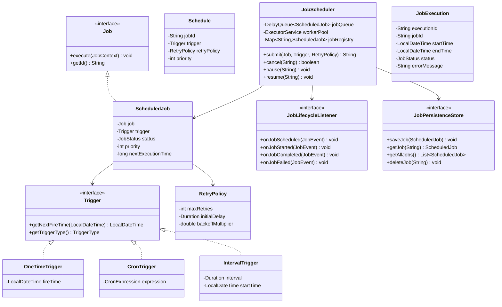

# Job Scheduler / Cron Library - Low-Level Design

## 1. Problem Statement

Design a job scheduling library (similar to Quartz Scheduler) that supports one-time, interval-based, and cron-based job scheduling with priority-based execution, retry policies, and lifecycle event notifications.

## 2. UML Class Diagram



## 3. Design Patterns

| Pattern | Usage |
|---------|-------|
| **Strategy** | Trigger interface — different scheduling strategies (Cron, Interval, OneTime) |
| **Observer** | JobLifecycleListener — notified on job state transitions |
| **Command** | Job interface encapsulates execution logic as a command object |
| **Factory** | TriggerFactory creates appropriate trigger from configuration |
| **Priority Queue** | Min-heap on next execution time for efficient scheduling |

## 4. SOLID Principles

- **SRP**: Job handles execution; Scheduler handles orchestration; Trigger handles timing
- **OCP**: New trigger types added without modifying scheduler
- **LSP**: All Trigger implementations substitutable
- **ISP**: Separate Job, Trigger, Listener, PersistenceStore interfaces
- **DIP**: Scheduler depends on abstractions (Job, Trigger, Store interfaces)

## 5. Complete Java Implementation

### Enums

```java
public enum JobStatus {
    SCHEDULED, RUNNING, COMPLETED, FAILED, CANCELLED, PAUSED
}

public enum TriggerType {
    ONE_TIME, CRON, INTERVAL
}
```

### Core Interfaces

```java
public interface Job {
    String getId();
    void execute(JobContext context) throws Exception;
}

public interface Trigger {
    LocalDateTime getNextFireTime(LocalDateTime afterTime);
    TriggerType getTriggerType();
}

public interface JobLifecycleListener {
    void onJobScheduled(JobEvent event);
    void onJobStarted(JobEvent event);
    void onJobCompleted(JobEvent event);
    void onJobFailed(JobEvent event);
}

public interface JobPersistenceStore {
    void saveJob(ScheduledJob job);
    ScheduledJob getJob(String jobId);
    List<ScheduledJob> getAllJobs();
    void deleteJob(String jobId);
    void updateStatus(String jobId, JobStatus status);
}
```

### Models

```java
public class JobContext {
    private final String jobId;
    private final Map<String, Object> parameters;
    private final int retryCount;

    public JobContext(String jobId, Map<String, Object> parameters, int retryCount) {
        this.jobId = jobId;
        this.parameters = parameters;
        this.retryCount = retryCount;
    }
    // getters
}

public class JobEvent {
    private final String jobId;
    private final JobStatus status;
    private final LocalDateTime timestamp;
    private final String message;

    public JobEvent(String jobId, JobStatus status, LocalDateTime timestamp, String message) {
        this.jobId = jobId;
        this.status = status;
        this.timestamp = timestamp;
        this.message = message;
    }
}

public class JobExecution {
    private final String executionId;
    private final String jobId;
    private LocalDateTime startTime;
    private LocalDateTime endTime;
    private JobStatus status;
    private String errorMessage;
    private int attemptNumber;

    public JobExecution(String jobId) {
        this.executionId = UUID.randomUUID().toString();
        this.jobId = jobId;
        this.startTime = LocalDateTime.now();
        this.status = JobStatus.RUNNING;
    }

    public void markCompleted() {
        this.endTime = LocalDateTime.now();
        this.status = JobStatus.COMPLETED;
    }

    public void markFailed(String error) {
        this.endTime = LocalDateTime.now();
        this.status = JobStatus.FAILED;
        this.errorMessage = error;
    }
}

public class RetryPolicy {
    private final int maxRetries;
    private final Duration initialDelay;
    private final double backoffMultiplier;

    public RetryPolicy(int maxRetries, Duration initialDelay, double backoffMultiplier) {
        this.maxRetries = maxRetries;
        this.initialDelay = initialDelay;
        this.backoffMultiplier = backoffMultiplier;
    }

    public Duration getDelayForAttempt(int attempt) {
        long delayMs = (long) (initialDelay.toMillis() * Math.pow(backoffMultiplier, attempt));
        return Duration.ofMillis(Math.min(delayMs, 300_000)); // cap at 5 min
    }

    public boolean shouldRetry(int currentAttempt) {
        return currentAttempt < maxRetries;
    }
}
```

### Trigger Implementations

```java
public class OneTimeTrigger implements Trigger {
    private final LocalDateTime fireTime;

    public OneTimeTrigger(LocalDateTime fireTime) {
        this.fireTime = fireTime;
    }

    @Override
    public LocalDateTime getNextFireTime(LocalDateTime afterTime) {
        return afterTime.isBefore(fireTime) ? fireTime : null; // null = no more fires
    }

    @Override
    public TriggerType getTriggerType() { return TriggerType.ONE_TIME; }
}

public class IntervalTrigger implements Trigger {
    private final Duration interval;
    private final LocalDateTime startTime;
    private final LocalDateTime endTime; // nullable

    public IntervalTrigger(Duration interval, LocalDateTime startTime, LocalDateTime endTime) {
        this.interval = interval;
        this.startTime = startTime;
        this.endTime = endTime;
    }

    @Override
    public LocalDateTime getNextFireTime(LocalDateTime afterTime) {
        LocalDateTime next = afterTime.isBefore(startTime) ? startTime : afterTime.plus(interval);
        if (endTime != null && next.isAfter(endTime)) return null;
        return next;
    }

    @Override
    public TriggerType getTriggerType() { return TriggerType.INTERVAL; }
}

public class CronTrigger implements Trigger {
    private final CronExpression cronExpression;

    public CronTrigger(String expression) {
        this.cronExpression = new CronExpression(expression);
    }

    @Override
    public LocalDateTime getNextFireTime(LocalDateTime afterTime) {
        return cronExpression.nextFireTime(afterTime);
    }

    @Override
    public TriggerType getTriggerType() { return TriggerType.CRON; }
}
```

### Simplified Cron Expression Parser

```java
public class CronExpression {
    // Format: "minute hour dayOfMonth month dayOfWeek"
    private final int[] minutes;   // 0-59
    private final int[] hours;     // 0-23
    private final int[] daysOfMonth; // 1-31
    private final int[] months;    // 1-12
    private final int[] daysOfWeek;  // 0-6 (Sun=0)

    public CronExpression(String expression) {
        String[] parts = expression.trim().split("\\s+");
        if (parts.length != 5) throw new IllegalArgumentException("Invalid cron: " + expression);
        this.minutes = parseField(parts[0], 0, 59);
        this.hours = parseField(parts[1], 0, 23);
        this.daysOfMonth = parseField(parts[2], 1, 31);
        this.months = parseField(parts[3], 1, 12);
        this.daysOfWeek = parseField(parts[4], 0, 6);
    }

    private int[] parseField(String field, int min, int max) {
        if ("*".equals(field)) {
            return IntStream.rangeClosed(min, max).toArray();
        }
        if (field.contains("/")) {
            String[] parts = field.split("/");
            int start = "*".equals(parts[0]) ? min : Integer.parseInt(parts[0]);
            int step = Integer.parseInt(parts[1]);
            return IntStream.iterate(start, i -> i <= max, i -> i + step).toArray();
        }
        if (field.contains(",")) {
            return Arrays.stream(field.split(",")).mapToInt(Integer::parseInt).toArray();
        }
        if (field.contains("-")) {
            String[] range = field.split("-");
            return IntStream.rangeClosed(Integer.parseInt(range[0]), Integer.parseInt(range[1])).toArray();
        }
        return new int[]{Integer.parseInt(field)};
    }

    public LocalDateTime nextFireTime(LocalDateTime after) {
        LocalDateTime candidate = after.plusMinutes(1).withSecond(0).withNano(0);
        for (int i = 0; i < 366 * 24 * 60; i++) { // search up to 1 year
            if (matches(candidate)) return candidate;
            candidate = candidate.plusMinutes(1);
        }
        return null;
    }

    private boolean matches(LocalDateTime dt) {
        return contains(minutes, dt.getMinute())
            && contains(hours, dt.getHour())
            && contains(daysOfMonth, dt.getDayOfMonth())
            && contains(months, dt.getMonthValue())
            && contains(daysOfWeek, dt.getDayOfWeek().getValue() % 7);
    }

    private boolean contains(int[] arr, int val) {
        for (int v : arr) if (v == val) return true;
        return false;
    }
}
```

### ScheduledJob (DelayQueue element)

```java
public class ScheduledJob implements Delayed {
    private final String id;
    private final Job job;
    private final Trigger trigger;
    private final RetryPolicy retryPolicy;
    private final int priority;
    private volatile JobStatus status;
    private volatile long nextExecutionTimeMs;
    private int retryCount;

    public ScheduledJob(Job job, Trigger trigger, RetryPolicy retryPolicy, int priority) {
        this.id = UUID.randomUUID().toString();
        this.job = job;
        this.trigger = trigger;
        this.retryPolicy = retryPolicy;
        this.priority = priority;
        this.status = JobStatus.SCHEDULED;
        computeNextExecution(LocalDateTime.now());
    }

    public void computeNextExecution(LocalDateTime after) {
        LocalDateTime next = trigger.getNextFireTime(after);
        if (next == null) {
            this.nextExecutionTimeMs = Long.MAX_VALUE;
            this.status = JobStatus.COMPLETED;
        } else {
            this.nextExecutionTimeMs = next.atZone(ZoneId.systemDefault()).toInstant().toEpochMilli();
        }
    }

    @Override
    public long getDelay(TimeUnit unit) {
        return unit.convert(nextExecutionTimeMs - System.currentTimeMillis(), TimeUnit.MILLISECONDS);
    }

    @Override
    public int compareTo(Delayed other) {
        ScheduledJob o = (ScheduledJob) other;
        int cmp = Long.compare(this.nextExecutionTimeMs, o.nextExecutionTimeMs);
        return cmp != 0 ? cmp : Integer.compare(o.priority, this.priority); // higher priority first on tie
    }

    // getters, setters for status, retryCount
}
```

### JobScheduler (Thread-Safe)

```java
public class JobScheduler {
    private final DelayQueue<ScheduledJob> jobQueue = new DelayQueue<>();
    private final ConcurrentHashMap<String, ScheduledJob> jobRegistry = new ConcurrentHashMap<>();
    private final ExecutorService workerPool;
    private final List<JobLifecycleListener> listeners = new CopyOnWriteArrayList<>();
    private final JobPersistenceStore persistenceStore;
    private volatile boolean running = false;
    private Thread schedulerThread;

    public JobScheduler(int poolSize, JobPersistenceStore store) {
        this.workerPool = Executors.newFixedThreadPool(poolSize);
        this.persistenceStore = store;
    }

    public void start() {
        running = true;
        schedulerThread = new Thread(this::schedulerLoop, "job-scheduler-main");
        schedulerThread.setDaemon(true);
        schedulerThread.start();
    }

    public void shutdown() {
        running = false;
        schedulerThread.interrupt();
        workerPool.shutdown();
    }

    public String submit(Job job, Trigger trigger, RetryPolicy retryPolicy, int priority) {
        ScheduledJob scheduledJob = new ScheduledJob(job, trigger, retryPolicy, priority);
        jobRegistry.put(scheduledJob.getId(), scheduledJob);
        jobQueue.offer(scheduledJob);
        if (persistenceStore != null) persistenceStore.saveJob(scheduledJob);
        notifyListeners(new JobEvent(scheduledJob.getId(), JobStatus.SCHEDULED, LocalDateTime.now(), "Job scheduled"));
        return scheduledJob.getId();
    }

    public boolean cancel(String jobId) {
        ScheduledJob job = jobRegistry.get(jobId);
        if (job == null) return false;
        job.setStatus(JobStatus.CANCELLED);
        jobQueue.remove(job);
        jobRegistry.remove(jobId);
        if (persistenceStore != null) persistenceStore.deleteJob(jobId);
        return true;
    }

    public void pause(String jobId) {
        ScheduledJob job = jobRegistry.get(jobId);
        if (job != null) {
            job.setStatus(JobStatus.PAUSED);
            jobQueue.remove(job);
        }
    }

    public void resume(String jobId) {
        ScheduledJob job = jobRegistry.get(jobId);
        if (job != null && job.getStatus() == JobStatus.PAUSED) {
            job.setStatus(JobStatus.SCHEDULED);
            job.computeNextExecution(LocalDateTime.now());
            jobQueue.offer(job);
        }
    }

    private void schedulerLoop() {
        while (running) {
            try {
                ScheduledJob job = jobQueue.take(); // blocks until job is ready
                if (job.getStatus() == JobStatus.CANCELLED || job.getStatus() == JobStatus.PAUSED) continue;
                job.setStatus(JobStatus.RUNNING);
                workerPool.submit(() -> executeJob(job));
            } catch (InterruptedException e) {
                Thread.currentThread().interrupt();
                break;
            }
        }
    }

    private void executeJob(ScheduledJob scheduledJob) {
        JobExecution execution = new JobExecution(scheduledJob.getId());
        notifyListeners(new JobEvent(scheduledJob.getId(), JobStatus.RUNNING, LocalDateTime.now(), "Job started"));
        try {
            JobContext ctx = new JobContext(scheduledJob.getId(), Map.of(), scheduledJob.getRetryCount());
            scheduledJob.getJob().execute(ctx);
            execution.markCompleted();
            notifyListeners(new JobEvent(scheduledJob.getId(), JobStatus.COMPLETED, LocalDateTime.now(), "Job completed"));

            // Reschedule for recurring triggers
            reschedule(scheduledJob);
        } catch (Exception e) {
            execution.markFailed(e.getMessage());
            handleFailure(scheduledJob, e);
        }
    }

    private void handleFailure(ScheduledJob job, Exception e) {
        RetryPolicy policy = job.getRetryPolicy();
        if (policy != null && policy.shouldRetry(job.getRetryCount())) {
            job.incrementRetryCount();
            Duration delay = policy.getDelayForAttempt(job.getRetryCount());
            long retryTime = System.currentTimeMillis() + delay.toMillis();
            job.setNextExecutionTimeMs(retryTime);
            job.setStatus(JobStatus.SCHEDULED);
            jobQueue.offer(job);
            notifyListeners(new JobEvent(job.getId(), JobStatus.SCHEDULED, LocalDateTime.now(),
                "Retry #" + job.getRetryCount() + " after " + delay.toSeconds() + "s"));
        } else {
            job.setStatus(JobStatus.FAILED);
            notifyListeners(new JobEvent(job.getId(), JobStatus.FAILED, LocalDateTime.now(), e.getMessage()));
        }
    }

    private void reschedule(ScheduledJob job) {
        if (job.getTrigger().getTriggerType() == TriggerType.ONE_TIME) return;
        job.setRetryCount(0);
        job.computeNextExecution(LocalDateTime.now());
        if (job.getStatus() != JobStatus.COMPLETED) { // completed means no more fire times
            job.setStatus(JobStatus.SCHEDULED);
            jobQueue.offer(job);
        }
    }

    public void addListener(JobLifecycleListener listener) { listeners.add(listener); }

    private void notifyListeners(JobEvent event) {
        for (JobLifecycleListener l : listeners) {
            switch (event.getStatus()) {
                case SCHEDULED -> l.onJobScheduled(event);
                case RUNNING -> l.onJobStarted(event);
                case COMPLETED -> l.onJobCompleted(event);
                case FAILED -> l.onJobFailed(event);
            }
        }
    }
}
```

### TriggerFactory

```java
public class TriggerFactory {
    public static Trigger createOneTime(LocalDateTime at) {
        return new OneTimeTrigger(at);
    }

    public static Trigger createInterval(Duration interval) {
        return new IntervalTrigger(interval, LocalDateTime.now(), null);
    }

    public static Trigger createCron(String expression) {
        return new CronTrigger(expression);
    }
}
```

### Usage Example

```java
public class EmailReportJob implements Job {
    private final String id = "email-report-" + UUID.randomUUID();

    @Override
    public String getId() { return id; }

    @Override
    public void execute(JobContext context) throws Exception {
        System.out.println("Sending email report... attempt: " + context.getRetryCount());
        // actual email logic
    }
}

// Setup
JobScheduler scheduler = new JobScheduler(4, new InMemoryJobStore());
scheduler.addListener(new LoggingJobListener());
scheduler.start();

// Schedule a cron job: every day at 9 AM
scheduler.submit(
    new EmailReportJob(),
    TriggerFactory.createCron("0 9 * * *"),
    new RetryPolicy(3, Duration.ofSeconds(10), 2.0),
    5 // priority
);

// Schedule one-time job
scheduler.submit(
    new DataCleanupJob(),
    TriggerFactory.createOneTime(LocalDateTime.now().plusHours(1)),
    null, 1
);
```

## 6. Key Interview Points

| Topic | Detail |
|-------|--------|
| **Why DelayQueue?** | Built-in thread-safe priority queue with blocking take(); elements become available only when delay expires |
| **Thread Safety** | ConcurrentHashMap for registry, CopyOnWriteArrayList for listeners, volatile status flags |
| **Retry Strategy** | Exponential backoff prevents thundering herd; capped delay avoids infinite waits |
| **Cron Parsing** | Simplified but covers *, ranges, steps, lists — mention Quartz for production |
| **Persistence** | Interface allows plugging in-memory, JDBC, Redis stores without changing scheduler |
| **Scaling** | Single scheduler thread + worker pool separates scheduling from execution concerns |
| **Missed Fires** | On restart, load from persistence store, check if fire time passed, apply misfire policy |
| **Priority Handling** | On equal fire times, higher priority jobs execute first (compareTo logic) |
| **Graceful Shutdown** | Stop accepting new jobs, drain in-flight jobs, persist pending state |
| **vs Quartz** | Production systems use Quartz/Airflow; this shows core scheduling mechanics |
