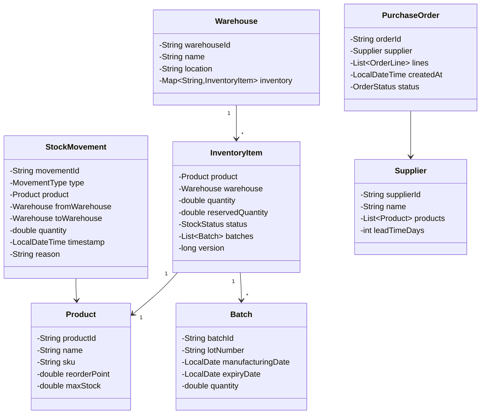

# Inventory Management System - Low-Level Design

## 1. Problem Statement
Design an inventory management system supporting multi-warehouse stock tracking, automated reordering, stock reservations with optimistic locking, batch/lot tracking, FIFO/LIFO picking strategies, and complete audit trails.

## 2. UML Class Diagram


## 3. Design Patterns
- **Observer**: Low stock alerts notify subscribers when quantity drops below reorder point
- **Strategy**: Reorder strategies (FixedQuantity, EOQ) and picking strategies (FIFO, LIFO)
- **State**: StockStatus transitions (IN_STOCK → LOW_STOCK → OUT_OF_STOCK)
- **Factory**: Creates appropriate reorder/picking strategy instances

## 4. SOLID Principles
- **SRP**: Separate classes for stock operations, alerts, reordering, auditing
- **OCP**: New strategies added without modifying existing code
- **LSP**: All reorder/picking strategies interchangeable
- **ISP**: Narrow interfaces (StockObserver, ReorderStrategy, PickingStrategy)
- **DIP**: InventoryService depends on abstractions, not concrete strategies

## 5. Java Implementation

```java
// === Enums ===
public enum StockStatus { IN_STOCK, LOW_STOCK, OUT_OF_STOCK }
public enum MovementType { INBOUND, OUTBOUND, TRANSFER, ADJUSTMENT }
public enum OrderStatus { PENDING, APPROVED, SHIPPED, RECEIVED, CANCELLED }

// === Models ===
public class Product {
    private String productId, name, sku;
    private double reorderPoint, maxStock;
    public Product(String id, String name, String sku, double reorderPoint, double maxStock) {
        this.productId = id; this.name = name; this.sku = sku;
        this.reorderPoint = reorderPoint; this.maxStock = maxStock;
    }
    // getters
    public String getProductId() { return productId; }
    public String getName() { return name; }
    public double getReorderPoint() { return reorderPoint; }
    public double getMaxStock() { return maxStock; }
}

public class Batch {
    private String batchId, lotNumber;
    private LocalDate manufacturingDate, expiryDate;
    private double quantity;
    public Batch(String batchId, String lotNumber, LocalDate mfg, LocalDate exp, double qty) {
        this.batchId = batchId; this.lotNumber = lotNumber;
        this.manufacturingDate = mfg; this.expiryDate = exp; this.quantity = qty;
    }
    public String getBatchId() { return batchId; }
    public LocalDate getManufacturingDate() { return manufacturingDate; }
    public LocalDate getExpiryDate() { return expiryDate; }
    public double getQuantity() { return quantity; }
    public void setQuantity(double q) { this.quantity = q; }
}

public class InventoryItem {
    private Product product;
    private Warehouse warehouse;
    private double quantity;
    private double reservedQuantity;
    private StockStatus status;
    private List<Batch> batches = new ArrayList<>();
    private long version; // optimistic locking

    public InventoryItem(Product product, Warehouse warehouse) {
        this.product = product; this.warehouse = warehouse;
        this.quantity = 0; this.reservedQuantity = 0;
        this.status = StockStatus.OUT_OF_STOCK; this.version = 0;
    }

    public double getAvailableQuantity() { return quantity - reservedQuantity; }

    public synchronized boolean reserve(double qty) {
        if (getAvailableQuantity() >= qty) {
            reservedQuantity += qty;
            return true;
        }
        return false;
    }

    public synchronized void release(double qty) {
        reservedQuantity = Math.max(0, reservedQuantity - qty);
    }

    public void updateStatus() {
        if (quantity <= 0) status = StockStatus.OUT_OF_STOCK;
        else if (quantity <= product.getReorderPoint()) status = StockStatus.LOW_STOCK;
        else status = StockStatus.IN_STOCK;
    }

    public long getVersion() { return version; }
    public void incrementVersion() { version++; }
    // getters/setters
    public Product getProduct() { return product; }
    public double getQuantity() { return quantity; }
    public void setQuantity(double q) { this.quantity = q; updateStatus(); }
    public StockStatus getStatus() { return status; }
    public List<Batch> getBatches() { return batches; }
    public Warehouse getWarehouse() { return warehouse; }
}

public class Warehouse {
    private String warehouseId, name, location;
    private Map<String, InventoryItem> inventory = new ConcurrentHashMap<>();

    public Warehouse(String id, String name, String location) {
        this.warehouseId = id; this.name = name; this.location = location;
    }
    public String getWarehouseId() { return warehouseId; }
    public String getName() { return name; }
    public InventoryItem getItem(String productId) { return inventory.get(productId); }
    public void putItem(String productId, InventoryItem item) { inventory.put(productId, item); }
    public Map<String, InventoryItem> getInventory() { return inventory; }
}

public class StockMovement {
    private String movementId;
    private MovementType type;
    private Product product;
    private Warehouse fromWarehouse, toWarehouse;
    private double quantity;
    private String batchId;
    private LocalDateTime timestamp;
    private String reason, performedBy;

    public StockMovement(MovementType type, Product product, Warehouse from,
                         Warehouse to, double qty, String batchId, String reason) {
        this.movementId = UUID.randomUUID().toString();
        this.type = type; this.product = product; this.fromWarehouse = from;
        this.toWarehouse = to; this.quantity = qty; this.batchId = batchId;
        this.reason = reason; this.timestamp = LocalDateTime.now();
    }
    // getters for audit
    public String getMovementId() { return movementId; }
    public MovementType getType() { return type; }
    public LocalDateTime getTimestamp() { return timestamp; }
    public String toString() {
        return String.format("[%s] %s: %s qty=%.1f reason=%s", timestamp, type, product.getName(), quantity, reason);
    }
}

public class Supplier {
    private String supplierId, name;
    private List<Product> products;
    private int leadTimeDays;
    public Supplier(String id, String name, int leadDays) {
        this.supplierId = id; this.name = name; this.leadTimeDays = leadDays;
        this.products = new ArrayList<>();
    }
    public String getSupplierId() { return supplierId; }
    public int getLeadTimeDays() { return leadTimeDays; }
}

public class PurchaseOrder {
    private String orderId;
    private Supplier supplier;
    private Map<Product, Double> lines = new HashMap<>();
    private LocalDateTime createdAt;
    private OrderStatus status;

    public PurchaseOrder(Supplier supplier) {
        this.orderId = UUID.randomUUID().toString();
        this.supplier = supplier; this.createdAt = LocalDateTime.now();
        this.status = OrderStatus.PENDING;
    }
    public void addLine(Product p, double qty) { lines.put(p, qty); }
    public String getOrderId() { return orderId; }
    public OrderStatus getStatus() { return status; }
    public void setStatus(OrderStatus s) { this.status = s; }
}

// === Observer Pattern: Low Stock Alerts ===
public interface StockObserver {
    void onLowStock(Product product, Warehouse warehouse, double currentQty);
    void onOutOfStock(Product product, Warehouse warehouse);
}

public class EmailAlertObserver implements StockObserver {
    public void onLowStock(Product p, Warehouse w, double qty) {
        System.out.println("EMAIL ALERT: Low stock for " + p.getName() + " at " + w.getName() + " (qty=" + qty + ")");
    }
    public void onOutOfStock(Product p, Warehouse w) {
        System.out.println("EMAIL ALERT: OUT OF STOCK " + p.getName() + " at " + w.getName());
    }
}

public class AutoReorderObserver implements StockObserver {
    private ReorderStrategy strategy;
    public AutoReorderObserver(ReorderStrategy strategy) { this.strategy = strategy; }
    public void onLowStock(Product p, Warehouse w, double qty) {
        double orderQty = strategy.calculateOrderQuantity(p, qty);
        System.out.println("AUTO REORDER: " + p.getName() + " qty=" + orderQty);
    }
    public void onOutOfStock(Product p, Warehouse w) { onLowStock(p, w, 0); }
}

// === Strategy Pattern: Reorder Strategies ===
public interface ReorderStrategy {
    double calculateOrderQuantity(Product product, double currentStock);
}

public class FixedQuantityStrategy implements ReorderStrategy {
    private double fixedQty;
    public FixedQuantityStrategy(double qty) { this.fixedQty = qty; }
    public double calculateOrderQuantity(Product product, double currentStock) {
        return fixedQty;
    }
}

public class EOQStrategy implements ReorderStrategy {
    private double annualDemand, orderingCost, holdingCostPerUnit;
    public EOQStrategy(double demand, double orderCost, double holdCost) {
        this.annualDemand = demand; this.orderingCost = orderCost;
        this.holdingCostPerUnit = holdCost;
    }
    public double calculateOrderQuantity(Product product, double currentStock) {
        // EOQ = sqrt((2 * D * S) / H)
        return Math.sqrt((2 * annualDemand * orderingCost) / holdingCostPerUnit);
    }
}

// === Strategy Pattern: Picking Strategies (FIFO/LIFO) ===
public interface PickingStrategy {
    List<Batch> pickBatches(List<Batch> available, double requiredQty);
}

public class FIFOPickingStrategy implements PickingStrategy {
    public List<Batch> pickBatches(List<Batch> available, double requiredQty) {
        available.sort(Comparator.comparing(Batch::getManufacturingDate));
        return pick(available, requiredQty);
    }
    private List<Batch> pick(List<Batch> sorted, double qty) {
        List<Batch> picked = new ArrayList<>();
        double remaining = qty;
        for (Batch b : sorted) {
            if (remaining <= 0) break;
            double take = Math.min(b.getQuantity(), remaining);
            picked.add(b);
            remaining -= take;
        }
        return picked;
    }
}

public class LIFOPickingStrategy implements PickingStrategy {
    public List<Batch> pickBatches(List<Batch> available, double requiredQty) {
        available.sort(Comparator.comparing(Batch::getManufacturingDate).reversed());
        List<Batch> picked = new ArrayList<>();
        double remaining = requiredQty;
        for (Batch b : available) {
            if (remaining <= 0) break;
            double take = Math.min(b.getQuantity(), remaining);
            picked.add(b);
            remaining -= take;
        }
        return picked;
    }
}

// === Core Service ===
public class InventoryService {
    private Map<String, Warehouse> warehouses = new ConcurrentHashMap<>();
    private List<StockObserver> observers = new CopyOnWriteArrayList<>();
    private List<StockMovement> auditTrail = Collections.synchronizedList(new ArrayList<>());
    private PickingStrategy pickingStrategy;

    public InventoryService(PickingStrategy pickingStrategy) {
        this.pickingStrategy = pickingStrategy;
    }

    public void addObserver(StockObserver o) { observers.add(o); }
    public void registerWarehouse(Warehouse w) { warehouses.put(w.getWarehouseId(), w); }

    // === Stock Operations ===
    public synchronized void addStock(String warehouseId, Product product, double qty, Batch batch, String reason) {
        Warehouse wh = warehouses.get(warehouseId);
        InventoryItem item = wh.getItem(product.getProductId());
        if (item == null) {
            item = new InventoryItem(product, wh);
            wh.putItem(product.getProductId(), item);
        }
        long prevVersion = item.getVersion();
        item.setQuantity(item.getQuantity() + qty);
        if (batch != null) item.getBatches().add(batch);
        item.incrementVersion();

        auditTrail.add(new StockMovement(MovementType.INBOUND, product, null, wh, qty,
                batch != null ? batch.getBatchId() : null, reason));
    }

    public synchronized boolean removeStock(String warehouseId, Product product, double qty, String reason) {
        Warehouse wh = warehouses.get(warehouseId);
        InventoryItem item = wh.getItem(product.getProductId());
        if (item == null || item.getAvailableQuantity() < qty) return false;

        // Use picking strategy for batch selection
        List<Batch> picked = pickingStrategy.pickBatches(item.getBatches(), qty);
        double remaining = qty;
        for (Batch b : picked) {
            double take = Math.min(b.getQuantity(), remaining);
            b.setQuantity(b.getQuantity() - take);
            remaining -= take;
        }
        item.getBatches().removeIf(b -> b.getQuantity() <= 0);

        item.setQuantity(item.getQuantity() - qty);
        item.incrementVersion();
        notifyIfLow(item);

        auditTrail.add(new StockMovement(MovementType.OUTBOUND, product, wh, null, qty, null, reason));
        return true;
    }

    public synchronized boolean transfer(String fromWhId, String toWhId, Product product, double qty, String reason) {
        Warehouse from = warehouses.get(fromWhId);
        Warehouse to = warehouses.get(toWhId);
        InventoryItem fromItem = from.getItem(product.getProductId());
        if (fromItem == null || fromItem.getAvailableQuantity() < qty) return false;

        fromItem.setQuantity(fromItem.getQuantity() - qty);
        fromItem.incrementVersion();
        notifyIfLow(fromItem);

        InventoryItem toItem = to.getItem(product.getProductId());
        if (toItem == null) { toItem = new InventoryItem(product, to); to.putItem(product.getProductId(), toItem); }
        toItem.setQuantity(toItem.getQuantity() + qty);
        toItem.incrementVersion();

        auditTrail.add(new StockMovement(MovementType.TRANSFER, product, from, to, qty, null, reason));
        return true;
    }

    // Optimistic locking reservation
    public boolean reserveStock(String warehouseId, Product product, double qty, long expectedVersion) {
        Warehouse wh = warehouses.get(warehouseId);
        InventoryItem item = wh.getItem(product.getProductId());
        if (item == null) return false;
        synchronized (item) {
            if (item.getVersion() != expectedVersion) {
                throw new OptimisticLockException("Version mismatch: expected=" + expectedVersion + " actual=" + item.getVersion());
            }
            boolean reserved = item.reserve(qty);
            if (reserved) item.incrementVersion();
            return reserved;
        }
    }

    public void releaseStock(String warehouseId, Product product, double qty) {
        Warehouse wh = warehouses.get(warehouseId);
        InventoryItem item = wh.getItem(product.getProductId());
        if (item != null) { item.release(qty); item.incrementVersion(); }
    }

    private void notifyIfLow(InventoryItem item) {
        if (item.getStatus() == StockStatus.LOW_STOCK) {
            observers.forEach(o -> o.onLowStock(item.getProduct(), item.getWarehouse(), item.getQuantity()));
        } else if (item.getStatus() == StockStatus.OUT_OF_STOCK) {
            observers.forEach(o -> o.onOutOfStock(item.getProduct(), item.getWarehouse()));
        }
    }

    public List<StockMovement> getAuditTrail() { return Collections.unmodifiableList(auditTrail); }
    public List<StockMovement> getAuditTrailForProduct(String productId) {
        return auditTrail.stream()
            .filter(m -> m.toString().contains(productId))
            .collect(Collectors.toList());
    }
}

public class OptimisticLockException extends RuntimeException {
    public OptimisticLockException(String msg) { super(msg); }
}

// === Factory for Strategies ===
public class StrategyFactory {
    public static ReorderStrategy createReorderStrategy(String type, Map<String, Double> params) {
        switch (type) {
            case "FIXED": return new FixedQuantityStrategy(params.get("quantity"));
            case "EOQ": return new EOQStrategy(params.get("demand"), params.get("orderCost"), params.get("holdCost"));
            default: throw new IllegalArgumentException("Unknown strategy: " + type);
        }
    }
    public static PickingStrategy createPickingStrategy(String type) {
        switch (type) {
            case "FIFO": return new FIFOPickingStrategy();
            case "LIFO": return new LIFOPickingStrategy();
            default: return new FIFOPickingStrategy();
        }
    }
}

// === Demo ===
public class InventoryDemo {
    public static void main(String[] args) {
        PickingStrategy picking = StrategyFactory.createPickingStrategy("FIFO");
        InventoryService service = new InventoryService(picking);

        // Setup observers
        service.addObserver(new EmailAlertObserver());
        service.addObserver(new AutoReorderObserver(new EOQStrategy(1000, 50, 2)));

        // Setup warehouses
        Warehouse wh1 = new Warehouse("WH1", "Main Warehouse", "NYC");
        Warehouse wh2 = new Warehouse("WH2", "Secondary", "LA");
        service.registerWarehouse(wh1);
        service.registerWarehouse(wh2);

        // Setup product
        Product laptop = new Product("P1", "Laptop", "SKU-001", 10, 100);

        // Add stock with batch
        Batch batch1 = new Batch("B1", "LOT-2024-001", LocalDate.of(2024,1,1), LocalDate.of(2026,1,1), 50);
        service.addStock("WH1", laptop, 50, batch1, "Initial stock");

        // Reserve with optimistic locking
        InventoryItem item = wh1.getItem("P1");
        service.reserveStock("WH1", laptop, 5, item.getVersion());

        // Transfer between warehouses
        service.transfer("WH1", "WH2", laptop, 20, "Rebalancing");

        // Remove stock (triggers FIFO picking)
        service.removeStock("WH1", laptop, 15, "Order fulfillment");

        // Print audit trail
        System.out.println("\n=== Audit Trail ===");
        service.getAuditTrail().forEach(m -> System.out.println(m));
    }
}
```

## 6. Key Interview Points

| Topic | Key Insight |
|-------|-------------|
| **Optimistic Locking** | Version field prevents concurrent over-reservation; retry on conflict |
| **FIFO/LIFO** | Strategy pattern allows runtime switching of picking algorithms |
| **Observer** | Decouples alerting/reordering from core stock operations |
| **Batch Tracking** | Enables recall management, expiry tracking, regulatory compliance |
| **Audit Trail** | Immutable StockMovement records for every operation |
| **Thread Safety** | synchronized blocks + ConcurrentHashMap for multi-threaded access |
| **EOQ Formula** | sqrt(2DS/H) - balances ordering vs holding costs |
| **Multi-warehouse** | Transfer as atomic debit+credit with single audit record |
| **Reservation** | Separates physical qty from available qty; release on timeout/cancel |
| **Scalability** | Partition by warehouse; event sourcing for movements; CQRS for reads |
