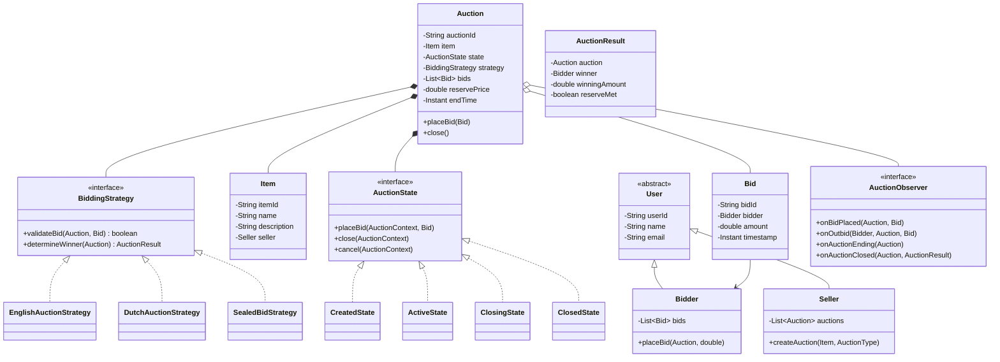

# Online Auction System - Low-Level Design

## 1. Problem Statement
Design an online auction system supporting multiple auction types (English, Dutch, Sealed-Bid) with real-time bidding, anti-sniping protection, reserve prices, and concurrent bid handling.

## 2. UML Class Diagram


## 3. Design Patterns
| Pattern | Usage |
|---------|-------|
| **Strategy** | Different bidding/winning logic per auction type |
| **State** | Auction lifecycle (Created→Active→Closing→Closed) |
| **Observer** | Notifications for bids, outbids, auction endings |
| **Factory** | Create appropriate strategy based on AuctionType |

## 4. SOLID Principles
- **SRP**: Auction manages lifecycle; Strategy handles bid logic; Observer handles notifications
- **OCP**: New auction types added via new Strategy implementations
- **LSP**: All strategies interchangeable through BiddingStrategy interface
- **ISP**: AuctionObserver can be split if needed (BidObserver, AuctionLifecycleObserver)
- **DIP**: Auction depends on abstractions (BiddingStrategy, AuctionState interfaces)

## 5. Complete Java Implementation

```java
// ==================== ENUMS ====================
public enum AuctionStatus { CREATED, ACTIVE, CLOSING, CLOSED, CANCELLED }
public enum AuctionType { ENGLISH, DUTCH, SEALED_BID }

// ==================== MODELS ====================
public abstract class User {
    private final String userId;
    private final String name;
    private final String email;

    public User(String userId, String name, String email) {
        this.userId = userId; this.name = name; this.email = email;
    }
    // getters
    public String getUserId() { return userId; }
    public String getName() { return name; }
    public String getEmail() { return email; }
}

public class Seller extends User {
    private final List<Auction> auctions = new ArrayList<>();
    public Seller(String id, String name, String email) { super(id, name, email); }
    public Auction createAuction(Item item, AuctionType type, double reservePrice,
                                  double startPrice, Instant endTime) {
        BiddingStrategy strategy = BiddingStrategyFactory.create(type);
        Auction auction = new Auction(UUID.randomUUID().toString(), item, strategy,
                                       reservePrice, startPrice, endTime);
        auctions.add(auction);
        return auction;
    }
}

public class Bidder extends User {
    private final List<Bid> bids = new CopyOnWriteArrayList<>();
    public Bidder(String id, String name, String email) { super(id, name, email); }
    public void addBid(Bid bid) { bids.add(bid); }
    public List<Bid> getBids() { return Collections.unmodifiableList(bids); }
}

public class Item {
    private final String itemId;
    private final String name;
    private final String description;
    private final Seller seller;

    public Item(String itemId, String name, String description, Seller seller) {
        this.itemId = itemId; this.name = name;
        this.description = description; this.seller = seller;
    }
    // getters omitted for brevity
}

public class Bid {
    private final String bidId;
    private final Bidder bidder;
    private final double amount;
    private final Instant timestamp;

    public Bid(Bidder bidder, double amount) {
        this.bidId = UUID.randomUUID().toString();
        this.bidder = bidder; this.amount = amount;
        this.timestamp = Instant.now();
    }
    public String getBidId() { return bidId; }
    public Bidder getBidder() { return bidder; }
    public double getAmount() { return amount; }
    public Instant getTimestamp() { return timestamp; }
}

public class AuctionResult {
    private final Auction auction;
    private final Bidder winner;
    private final double winningAmount;
    private final boolean reserveMet;

    public AuctionResult(Auction auction, Bidder winner, double winningAmount, boolean reserveMet) {
        this.auction = auction; this.winner = winner;
        this.winningAmount = winningAmount; this.reserveMet = reserveMet;
    }
    public boolean isSuccessful() { return winner != null && reserveMet; }
    // getters
    public Bidder getWinner() { return winner; }
    public double getWinningAmount() { return winningAmount; }
    public boolean isReserveMet() { return reserveMet; }
}

// ==================== OBSERVER ====================
public interface AuctionObserver {
    void onBidPlaced(Auction auction, Bid bid);
    void onOutbid(Bidder bidder, Auction auction, Bid newBid);
    void onAuctionEnding(Auction auction);
    void onAuctionClosed(Auction auction, AuctionResult result);
}

public class NotificationService implements AuctionObserver {
    @Override
    public void onBidPlaced(Auction auction, Bid bid) {
        System.out.printf("New bid of $%.2f on %s by %s%n",
            bid.getAmount(), auction.getAuctionId(), bid.getBidder().getName());
    }
    @Override
    public void onOutbid(Bidder bidder, Auction auction, Bid newBid) {
        System.out.printf("ALERT: %s, you've been outbid on %s! New bid: $%.2f%n",
            bidder.getName(), auction.getAuctionId(), newBid.getAmount());
    }
    @Override
    public void onAuctionEnding(Auction auction) {
        System.out.printf("Auction %s ending soon!%n", auction.getAuctionId());
    }
    @Override
    public void onAuctionClosed(Auction auction, AuctionResult result) {
        if (result.isSuccessful()) {
            System.out.printf("Auction %s won by %s for $%.2f%n",
                auction.getAuctionId(), result.getWinner().getName(), result.getWinningAmount());
        } else {
            System.out.printf("Auction %s closed without a winner (reserve not met)%n",
                auction.getAuctionId());
        }
    }
}

// ==================== STRATEGY PATTERN ====================
public interface BiddingStrategy {
    boolean validateBid(Auction auction, Bid bid);
    AuctionResult determineWinner(Auction auction);
    double getMinimumNextBid(Auction auction);
}

public class EnglishAuctionStrategy implements BiddingStrategy {
    private static final double MIN_INCREMENT = 1.0;

    @Override
    public boolean validateBid(Auction auction, Bid bid) {
        double currentHighest = auction.getHighestBid()
            .map(Bid::getAmount).orElse(auction.getStartPrice());
        return bid.getAmount() >= currentHighest + MIN_INCREMENT;
    }

    @Override
    public AuctionResult determineWinner(Auction auction) {
        Optional<Bid> highest = auction.getHighestBid();
        if (highest.isEmpty()) return new AuctionResult(auction, null, 0, false);
        boolean reserveMet = highest.get().getAmount() >= auction.getReservePrice();
        return new AuctionResult(auction, highest.get().getBidder(),
            highest.get().getAmount(), reserveMet);
    }

    @Override
    public double getMinimumNextBid(Auction auction) {
        return auction.getHighestBid().map(b -> b.getAmount() + MIN_INCREMENT)
            .orElse(auction.getStartPrice());
    }
}

public class DutchAuctionStrategy implements BiddingStrategy {
    // Dutch: price starts high, decreases. First bid wins at current price.
    @Override
    public boolean validateBid(Auction auction, Bid bid) {
        return auction.getBids().isEmpty() && bid.getAmount() >= auction.getCurrentPrice();
    }

    @Override
    public AuctionResult determineWinner(Auction auction) {
        Optional<Bid> first = auction.getBids().stream().findFirst();
        if (first.isEmpty()) return new AuctionResult(auction, null, 0, false);
        return new AuctionResult(auction, first.get().getBidder(),
            first.get().getAmount(), true);
    }

    @Override
    public double getMinimumNextBid(Auction auction) {
        return auction.getCurrentPrice();
    }
}

public class SealedBidStrategy implements BiddingStrategy {
    // Each bidder submits one sealed bid; highest wins.
    @Override
    public boolean validateBid(Auction auction, Bid bid) {
        boolean alreadyBid = auction.getBids().stream()
            .anyMatch(b -> b.getBidder().getUserId().equals(bid.getBidder().getUserId()));
        return !alreadyBid && bid.getAmount() > 0;
    }

    @Override
    public AuctionResult determineWinner(Auction auction) {
        Optional<Bid> highest = auction.getBids().stream()
            .max(Comparator.comparingDouble(Bid::getAmount));
        if (highest.isEmpty()) return new AuctionResult(auction, null, 0, false);
        boolean reserveMet = highest.get().getAmount() >= auction.getReservePrice();
        return new AuctionResult(auction, highest.get().getBidder(),
            highest.get().getAmount(), reserveMet);
    }

    @Override
    public double getMinimumNextBid(Auction auction) { return 0.01; }
}

// ==================== FACTORY ====================
public class BiddingStrategyFactory {
    public static BiddingStrategy create(AuctionType type) {
        return switch (type) {
            case ENGLISH -> new EnglishAuctionStrategy();
            case DUTCH -> new DutchAuctionStrategy();
            case SEALED_BID -> new SealedBidStrategy();
        };
    }
}

// ==================== STATE PATTERN ====================
public interface AuctionState {
    void placeBid(Auction auction, Bid bid);
    void close(Auction auction);
    void cancel(Auction auction);
    AuctionStatus getStatus();
}

public class CreatedState implements AuctionState {
    @Override
    public void placeBid(Auction auction, Bid bid) {
        throw new IllegalStateException("Auction not yet active");
    }
    @Override
    public void close(Auction auction) {
        throw new IllegalStateException("Cannot close auction that hasn't started");
    }
    @Override
    public void cancel(Auction auction) {
        auction.setState(new CancelledState());
    }
    @Override
    public AuctionStatus getStatus() { return AuctionStatus.CREATED; }
}

public class ActiveState implements AuctionState {
    private static final Duration ANTI_SNIPE_WINDOW = Duration.ofMinutes(2);
    private static final Duration ANTI_SNIPE_EXTENSION = Duration.ofMinutes(5);

    @Override
    public void placeBid(Auction auction, Bid bid) {
        if (!auction.getStrategy().validateBid(auction, bid)) {
            throw new IllegalArgumentException("Invalid bid");
        }
        Optional<Bid> previousHighest = auction.getHighestBid();
        auction.addBidInternal(bid);
        bid.getBidder().addBid(bid);

        // Anti-sniping: extend if bid placed in last 2 minutes
        Duration timeLeft = Duration.between(Instant.now(), auction.getEndTime());
        if (timeLeft.compareTo(ANTI_SNIPE_WINDOW) < 0) {
            auction.extendEndTime(ANTI_SNIPE_EXTENSION);
            System.out.println("Anti-snipe: auction extended by 5 minutes");
        }

        auction.notifyBidPlaced(bid);
        previousHighest.ifPresent(prev ->
            auction.notifyOutbid(prev.getBidder(), bid));

        // Dutch auction: first valid bid wins immediately
        if (auction.getStrategy() instanceof DutchAuctionStrategy) {
            auction.setState(new ClosingState());
            auction.close();
        }
    }

    @Override
    public void close(Auction auction) {
        auction.setState(new ClosingState());
        auction.close();
    }
    @Override
    public void cancel(Auction auction) { auction.setState(new CancelledState()); }
    @Override
    public AuctionStatus getStatus() { return AuctionStatus.ACTIVE; }
}

public class ClosingState implements AuctionState {
    @Override
    public void placeBid(Auction auction, Bid bid) {
        throw new IllegalStateException("Auction is closing, no more bids");
    }
    @Override
    public void close(Auction auction) {
        AuctionResult result = auction.getStrategy().determineWinner(auction);
        auction.setResult(result);
        auction.setState(new ClosedState());
        auction.notifyAuctionClosed(result);
    }
    @Override
    public void cancel(Auction auction) { auction.setState(new CancelledState()); }
    @Override
    public AuctionStatus getStatus() { return AuctionStatus.CLOSING; }
}

public class ClosedState implements AuctionState {
    @Override
    public void placeBid(Auction a, Bid b) { throw new IllegalStateException("Auction closed"); }
    @Override
    public void close(Auction a) { throw new IllegalStateException("Already closed"); }
    @Override
    public void cancel(Auction a) { throw new IllegalStateException("Cannot cancel closed auction"); }
    @Override
    public AuctionStatus getStatus() { return AuctionStatus.CLOSED; }
}

public class CancelledState implements AuctionState {
    @Override
    public void placeBid(Auction a, Bid b) { throw new IllegalStateException("Auction cancelled"); }
    @Override
    public void close(Auction a) { throw new IllegalStateException("Auction cancelled"); }
    @Override
    public void cancel(Auction a) { throw new IllegalStateException("Already cancelled"); }
    @Override
    public AuctionStatus getStatus() { return AuctionStatus.CANCELLED; }
}

// ==================== AUCTION (CORE) ====================
public class Auction {
    private final String auctionId;
    private final Item item;
    private final BiddingStrategy strategy;
    private final double reservePrice;
    private final double startPrice;
    private volatile Instant endTime;
    private final List<Bid> bids = new CopyOnWriteArrayList<>();
    private final List<AuctionObserver> observers = new CopyOnWriteArrayList<>();
    private volatile AuctionState state;
    private AuctionResult result;
    private final ReentrantLock bidLock = new ReentrantLock();
    private double currentPrice; // for Dutch auctions

    public Auction(String auctionId, Item item, BiddingStrategy strategy,
                   double reservePrice, double startPrice, Instant endTime) {
        this.auctionId = auctionId; this.item = item;
        this.strategy = strategy; this.reservePrice = reservePrice;
        this.startPrice = startPrice; this.currentPrice = startPrice;
        this.endTime = endTime; this.state = new CreatedState();
    }

    // Thread-safe bid placement
    public void placeBid(Bid bid) {
        bidLock.lock();
        try {
            state.placeBid(this, bid);
        } finally {
            bidLock.unlock();
        }
    }

    public void start() {
        if (state.getStatus() != AuctionStatus.CREATED)
            throw new IllegalStateException("Can only start from CREATED state");
        state = new ActiveState();
    }

    public void close() { state.close(this); }
    public void cancel() { state.cancel(this); }

    void addBidInternal(Bid bid) { bids.add(bid); }
    void setState(AuctionState state) { this.state = state; }
    void setResult(AuctionResult result) { this.result = result; }
    void extendEndTime(Duration extension) { this.endTime = endTime.plus(extension); }

    public Optional<Bid> getHighestBid() {
        return bids.stream().max(Comparator.comparingDouble(Bid::getAmount));
    }

    // Observer management
    public void addObserver(AuctionObserver observer) { observers.add(observer); }
    public void removeObserver(AuctionObserver observer) { observers.remove(observer); }

    void notifyBidPlaced(Bid bid) {
        observers.forEach(o -> o.onBidPlaced(this, bid));
    }
    void notifyOutbid(Bidder bidder, Bid newBid) {
        observers.forEach(o -> o.onOutbid(bidder, this, newBid));
    }
    void notifyAuctionClosed(AuctionResult result) {
        observers.forEach(o -> o.onAuctionClosed(this, result));
    }

    // Getters
    public String getAuctionId() { return auctionId; }
    public BiddingStrategy getStrategy() { return strategy; }
    public double getReservePrice() { return reservePrice; }
    public double getStartPrice() { return startPrice; }
    public double getCurrentPrice() { return currentPrice; }
    public Instant getEndTime() { return endTime; }
    public List<Bid> getBids() { return Collections.unmodifiableList(bids); }
    public AuctionStatus getStatus() { return state.getStatus(); }
    public AuctionResult getResult() { return result; }
}

// ==================== TIMER-BASED CLOSING ====================
public class AuctionScheduler {
    private final ScheduledExecutorService scheduler = Executors.newScheduledThreadPool(4);
    private final Map<String, ScheduledFuture<?>> scheduledTasks = new ConcurrentHashMap<>();

    public void scheduleClose(Auction auction) {
        Duration delay = Duration.between(Instant.now(), auction.getEndTime());
        if (delay.isNegative()) { auction.close(); return; }

        ScheduledFuture<?> future = scheduler.schedule(() -> {
            // Check if end time was extended (anti-snipe)
            if (Instant.now().isBefore(auction.getEndTime())) {
                scheduleClose(auction); // reschedule
            } else {
                auction.close();
            }
        }, delay.toMillis(), TimeUnit.MILLISECONDS);
        scheduledTasks.put(auction.getAuctionId(), future);
    }

    // For Dutch auctions: periodic price decrease
    public void schedulePriceDecrease(Auction auction, double decrementAmount,
                                       Duration interval) {
        scheduler.scheduleAtFixedRate(() -> {
            // Would need auction.decreasePrice(decrementAmount) method
        }, interval.toMillis(), interval.toMillis(), TimeUnit.MILLISECONDS);
    }

    public void shutdown() { scheduler.shutdown(); }
}

// ==================== AUCTION SERVICE ====================
public class AuctionService {
    private final Map<String, Auction> auctions = new ConcurrentHashMap<>();
    private final AuctionScheduler scheduler = new AuctionScheduler();
    private final NotificationService notificationService = new NotificationService();

    public Auction createAuction(Seller seller, Item item, AuctionType type,
                                  double reservePrice, double startPrice, Instant endTime) {
        Auction auction = seller.createAuction(item, type, reservePrice, startPrice, endTime);
        auction.addObserver(notificationService);
        auctions.put(auction.getAuctionId(), auction);
        return auction;
    }

    public void startAuction(String auctionId) {
        Auction auction = auctions.get(auctionId);
        if (auction == null) throw new IllegalArgumentException("Auction not found");
        auction.start();
        scheduler.scheduleClose(auction);
    }

    public void placeBid(String auctionId, Bidder bidder, double amount) {
        Auction auction = auctions.get(auctionId);
        if (auction == null) throw new IllegalArgumentException("Auction not found");
        Bid bid = new Bid(bidder, amount);
        auction.placeBid(bid);
    }
}
```

## 6. Key Interview Points

| Topic | Discussion |
|-------|-----------|
| **Concurrency** | `ReentrantLock` for bid submission ensures atomicity; `CopyOnWriteArrayList` for observers/bids; `volatile` for state transitions |
| **Anti-Sniping** | Bids within last 2 min extend auction by 5 min, preventing last-second sniping |
| **Reserve Price** | Winner determined but sale only completes if reserve met; transparent to bidders |
| **Strategy Pattern** | Each auction type encapsulates its own validation and winner determination logic |
| **State Pattern** | Prevents invalid operations (e.g., bidding on closed auction) with clean transitions |
| **Scalability** | Scheduler uses thread pool; can partition auctions by ID for horizontal scaling |
| **Dutch Auction** | Price decreases over time; first bidder wins at current price |
| **Sealed Bid** | One bid per user; bids hidden until close; highest wins |
| **Extension** | Add proxy bidding (auto-bid up to max), buy-now price, auction categories |
