# In-Memory File System - Low-Level Design

## 1. Problem Statement

Design an in-memory file system supporting directories, files, path navigation, search, and permissions — mimicking Unix-like file system operations.

## 2. UML Class Diagram

```mermaid
classDiagram
    class FileSystemEntry {
        <<abstract>>
        -String name
        -Directory parent
        -Permission permissions
        -FileMetadata metadata
        +getName() String
        +getPath() String
        +isDirectory() boolean
        +getSize() long
        +delete() void
    }

    class File {
        -String content
        -long size
        +read() String
        +write(String content) void
        +getSize() long
    }

    class Directory {
        -Map~String, FileSystemEntry~ children
        +addEntry(FileSystemEntry entry) void
        +removeEntry(String name) void
        +getChild(String name) FileSystemEntry
        +getChildren() List~FileSystemEntry~
        +getSize() long
    }

    class FileSystem {
        -Directory root
        -Directory currentDir
        +mkdir(String path) Directory
        +touch(String path) File
        +ls(String path) List~String~
        +cd(String path) void
        +pwd() String
        +rm(String path) void
        +mv(String src, String dest) void
        +cp(String src, String dest) void
        +find(String path, SearchStrategy strategy) List~String~
        +cat(String path) String
    }

    class FileMetadata {
        -long size
        -LocalDateTime created
        -LocalDateTime modified
        -String owner
    }

    class Permission {
        -boolean read
        -boolean write
        -boolean execute
        +canRead() boolean
        +canWrite() boolean
        +canExecute() boolean
    }

    class SearchStrategy {
        <<interface>>
        +matches(FileSystemEntry entry) boolean
    }

    class NameSearchStrategy {
        -String pattern
        +matches(FileSystemEntry entry) boolean
    }

    class ExtensionSearchStrategy {
        -String extension
        +matches(FileSystemEntry entry) boolean
    }

    class SizeSearchStrategy {
        -long minSize
        -long maxSize
        +matches(FileSystemEntry entry) boolean
    }

    class FileSystemIterator {
        <<interface>>
        +hasNext() boolean
        +next() FileSystemEntry
    }

    class DFSIterator {
        -Stack~FileSystemEntry~ stack
    }

    class BFSIterator {
        -Queue~FileSystemEntry~ queue
    }

    FileSystemEntry <|-- File
    FileSystemEntry <|-- Directory
    Directory o-- FileSystemEntry : contains *
    FileSystemEntry *-- FileMetadata
    FileSystemEntry *-- Permission
    FileSystem --> Directory
    SearchStrategy <|.. NameSearchStrategy
    SearchStrategy <|.. ExtensionSearchStrategy
    SearchStrategy <|.. SizeSearchStrategy
    FileSystemIterator <|.. DFSIterator
    FileSystemIterator <|.. BFSIterator
```



## 3. Design Patterns

| Pattern | Usage |
|---------|-------|
| **Composite** | FileSystemEntry → File/Directory (core tree structure) |
| **Strategy** | SearchStrategy for pluggable search criteria |
| **Iterator** | DFS/BFS traversal of directory tree |
| **Factory** | Entry creation via FileSystem methods |

## 4. SOLID Principles

- **S**: Each class has single responsibility (File=content, Directory=children, FileSystem=operations)
- **O**: New search strategies without modifying existing code
- **L**: File and Directory both substitutable as FileSystemEntry
- **I**: SearchStrategy and FileSystemIterator are focused interfaces
- **D**: FileSystem depends on abstractions (FileSystemEntry, SearchStrategy)

## 5. Complete Java Implementation

```java
import java.time.LocalDateTime;
import java.util.*;
import java.util.stream.Collectors;

// ============ METADATA & PERMISSIONS ============

class FileMetadata {
    private long size;
    private LocalDateTime created;
    private LocalDateTime modified;
    private String owner;

    public FileMetadata(String owner) {
        this.owner = owner;
        this.created = LocalDateTime.now();
        this.modified = LocalDateTime.now();
        this.size = 0;
    }

    public void updateModified() { this.modified = LocalDateTime.now(); }
    public void setSize(long size) { this.size = size; }
    public long getSize() { return size; }
    public LocalDateTime getCreated() { return created; }
    public LocalDateTime getModified() { return modified; }
    public String getOwner() { return owner; }
}

class Permission {
    private boolean read;
    private boolean write;
    private boolean execute;

    public Permission(boolean read, boolean write, boolean execute) {
        this.read = read;
        this.write = write;
        this.execute = execute;
    }

    public static Permission defaultFile() { return new Permission(true, true, false); }
    public static Permission defaultDir() { return new Permission(true, true, true); }

    public boolean canRead() { return read; }
    public boolean canWrite() { return write; }
    public boolean canExecute() { return execute; }
}

// ============ COMPOSITE PATTERN (CORE) ============

abstract class FileSystemEntry {
    protected String name;
    protected Directory parent;
    protected Permission permissions;
    protected FileMetadata metadata;

    public FileSystemEntry(String name, String owner) {
        this.name = name;
        this.metadata = new FileMetadata(owner);
    }

    public String getName() { return name; }
    public void setName(String name) { this.name = name; }
    public Directory getParent() { return parent; }
    public void setParent(Directory parent) { this.parent = parent; }
    public Permission getPermissions() { return permissions; }
    public FileMetadata getMetadata() { return metadata; }

    public String getPath() {
        if (parent == null) return "/";
        String parentPath = parent.getPath();
        return parentPath.equals("/") ? "/" + name : parentPath + "/" + name;
    }

    public abstract boolean isDirectory();
    public abstract long getSize();
    public abstract FileSystemEntry copy(String newName);
}

class File extends FileSystemEntry {
    private String content;

    public File(String name, String owner) {
        super(name, owner);
        this.content = "";
        this.permissions = Permission.defaultFile();
    }

    public String read() {
        if (!permissions.canRead()) throw new SecurityException("No read permission");
        return content;
    }

    public void write(String content) {
        if (!permissions.canWrite()) throw new SecurityException("No write permission");
        this.content = content;
        this.metadata.setSize(content.length());
        this.metadata.updateModified();
    }

    @Override public boolean isDirectory() { return false; }
    @Override public long getSize() { return content.length(); }

    @Override
    public FileSystemEntry copy(String newName) {
        File copy = new File(newName, metadata.getOwner());
        copy.write(this.content);
        return copy;
    }
}

class Directory extends FileSystemEntry {
    private Map<String, FileSystemEntry> children;

    public Directory(String name, String owner) {
        super(name, owner);
        this.children = new LinkedHashMap<>();
        this.permissions = Permission.defaultDir();
    }

    public void addEntry(FileSystemEntry entry) {
        if (!permissions.canWrite()) throw new SecurityException("No write permission");
        if (children.containsKey(entry.getName()))
            throw new IllegalArgumentException("Entry already exists: " + entry.getName());
        children.put(entry.getName(), entry);
        entry.setParent(this);
        metadata.updateModified();
    }

    public void removeEntry(String name) {
        if (!permissions.canWrite()) throw new SecurityException("No write permission");
        if (!children.containsKey(name))
            throw new IllegalArgumentException("Entry not found: " + name);
        children.remove(name);
        metadata.updateModified();
    }

    public FileSystemEntry getChild(String name) {
        return children.get(name);
    }

    public List<FileSystemEntry> getChildren() {
        return new ArrayList<>(children.values());
    }

    @Override public boolean isDirectory() { return true; }

    @Override
    public long getSize() {
        return children.values().stream().mapToLong(FileSystemEntry::getSize).sum();
    }

    @Override
    public FileSystemEntry copy(String newName) {
        Directory copy = new Directory(newName, metadata.getOwner());
        for (FileSystemEntry child : children.values()) {
            FileSystemEntry childCopy = child.copy(child.getName());
            copy.addEntry(childCopy);
        }
        return copy;
    }
}

// ============ STRATEGY PATTERN - SEARCH ============

interface SearchStrategy {
    boolean matches(FileSystemEntry entry);
}

class NameSearchStrategy implements SearchStrategy {
    private String pattern;

    public NameSearchStrategy(String pattern) { this.pattern = pattern; }

    @Override
    public boolean matches(FileSystemEntry entry) {
        return entry.getName().contains(pattern);
    }
}

class ExtensionSearchStrategy implements SearchStrategy {
    private String extension;

    public ExtensionSearchStrategy(String extension) { this.extension = extension; }

    @Override
    public boolean matches(FileSystemEntry entry) {
        return !entry.isDirectory() && entry.getName().endsWith("." + extension);
    }
}

class SizeSearchStrategy implements SearchStrategy {
    private long minSize, maxSize;

    public SizeSearchStrategy(long minSize, long maxSize) {
        this.minSize = minSize;
        this.maxSize = maxSize;
    }

    @Override
    public boolean matches(FileSystemEntry entry) {
        long size = entry.getSize();
        return size >= minSize && size <= maxSize;
    }
}

// ============ ITERATOR PATTERN - TRAVERSAL ============

interface FileSystemIterator extends Iterator<FileSystemEntry> {}

class DFSIterator implements FileSystemIterator {
    private Deque<FileSystemEntry> stack = new ArrayDeque<>();

    public DFSIterator(Directory root) {
        stack.push(root);
    }

    @Override public boolean hasNext() { return !stack.isEmpty(); }

    @Override
    public FileSystemEntry next() {
        if (!hasNext()) throw new NoSuchElementException();
        FileSystemEntry entry = stack.pop();
        if (entry.isDirectory()) {
            List<FileSystemEntry> children = ((Directory) entry).getChildren();
            Collections.reverse(children);
            children.forEach(stack::push);
        }
        return entry;
    }
}

class BFSIterator implements FileSystemIterator {
    private Queue<FileSystemEntry> queue = new LinkedList<>();

    public BFSIterator(Directory root) {
        queue.offer(root);
    }

    @Override public boolean hasNext() { return !queue.isEmpty(); }

    @Override
    public FileSystemEntry next() {
        if (!hasNext()) throw new NoSuchElementException();
        FileSystemEntry entry = queue.poll();
        if (entry.isDirectory()) {
            ((Directory) entry).getChildren().forEach(queue::offer);
        }
        return entry;
    }
}

// ============ FILE SYSTEM (FACADE + FACTORY) ============

class FileSystem {
    private Directory root;
    private Directory currentDir;
    private String currentUser;

    public FileSystem(String user) {
        this.currentUser = user;
        this.root = new Directory("", user);
        this.currentDir = root;
    }

    // --- Path Resolution ---
    private FileSystemEntry resolve(String path) {
        if (path.equals("/")) return root;
        String[] parts = path.startsWith("/")
            ? path.substring(1).split("/")
            : path.split("/");
        Directory start = path.startsWith("/") ? root : currentDir;
        FileSystemEntry current = start;

        for (String part : parts) {
            if (part.isEmpty() || part.equals(".")) continue;
            if (part.equals("..")) {
                current = (current instanceof Directory && ((Directory) current).getParent() != null)
                    ? ((Directory) current).getParent() : root;
            } else {
                if (!(current instanceof Directory))
                    throw new IllegalArgumentException("Not a directory: " + current.getName());
                FileSystemEntry child = ((Directory) current).getChild(part);
                if (child == null)
                    throw new IllegalArgumentException("Path not found: " + part);
                current = child;
            }
        }
        return current;
    }

    private Directory resolveParent(String path) {
        int lastSlash = path.lastIndexOf('/');
        if (lastSlash <= 0 && path.startsWith("/")) return root;
        if (lastSlash < 0) return currentDir;
        String parentPath = path.substring(0, lastSlash);
        FileSystemEntry entry = resolve(parentPath.isEmpty() ? "/" : parentPath);
        if (!entry.isDirectory()) throw new IllegalArgumentException("Not a directory");
        return (Directory) entry;
    }

    private String getFileName(String path) {
        int lastSlash = path.lastIndexOf('/');
        return lastSlash < 0 ? path : path.substring(lastSlash + 1);
    }

    // --- Operations ---
    public Directory mkdir(String path) {
        Directory parent = resolveParent(path);
        String name = getFileName(path);
        Directory dir = new Directory(name, currentUser);
        parent.addEntry(dir);
        return dir;
    }

    public File touch(String path) {
        Directory parent = resolveParent(path);
        String name = getFileName(path);
        File file = new File(name, currentUser);
        parent.addEntry(file);
        return file;
    }

    public List<String> ls(String path) {
        FileSystemEntry entry = (path == null || path.isEmpty()) ? currentDir : resolve(path);
        if (!entry.isDirectory()) return List.of(entry.getName());
        return ((Directory) entry).getChildren().stream()
            .map(e -> e.getName() + (e.isDirectory() ? "/" : ""))
            .collect(Collectors.toList());
    }

    public void cd(String path) {
        FileSystemEntry entry = resolve(path);
        if (!entry.isDirectory()) throw new IllegalArgumentException("Not a directory");
        currentDir = (Directory) entry;
    }

    public String pwd() {
        return currentDir.getPath().isEmpty() ? "/" : currentDir.getPath();
    }

    public void rm(String path) {
        FileSystemEntry entry = resolve(path);
        if (entry == root) throw new IllegalArgumentException("Cannot remove root");
        entry.getParent().removeEntry(entry.getName());
    }

    public void mv(String src, String dest) {
        FileSystemEntry entry = resolve(src);
        entry.getParent().removeEntry(entry.getName());
        Directory destDir = resolveParent(dest);
        String newName = getFileName(dest);
        entry.setName(newName);
        destDir.addEntry(entry);
    }

    public void cp(String src, String dest) {
        FileSystemEntry entry = resolve(src);
        Directory destDir = resolveParent(dest);
        String newName = getFileName(dest);
        FileSystemEntry copy = entry.copy(newName);
        destDir.addEntry(copy);
    }

    public String cat(String path) {
        FileSystemEntry entry = resolve(path);
        if (entry.isDirectory()) throw new IllegalArgumentException("Is a directory");
        return ((File) entry).read();
    }

    public void writeFile(String path, String content) {
        FileSystemEntry entry = resolve(path);
        if (entry.isDirectory()) throw new IllegalArgumentException("Is a directory");
        ((File) entry).write(content);
    }

    public List<String> find(String path, SearchStrategy strategy) {
        Directory startDir = (Directory) resolve(path);
        List<String> results = new ArrayList<>();
        FileSystemIterator iterator = new DFSIterator(startDir);
        while (iterator.hasNext()) {
            FileSystemEntry entry = iterator.next();
            if (strategy.matches(entry)) results.add(entry.getPath());
        }
        return results;
    }

    public FileSystemIterator iterator(String path, boolean dfs) {
        Directory dir = (Directory) resolve(path);
        return dfs ? new DFSIterator(dir) : new BFSIterator(dir);
    }
}

// ============ DEMO ============

public class FileSystemDemo {
    public static void main(String[] args) {
        FileSystem fs = new FileSystem("root");

        // Create structure
        fs.mkdir("/home");
        fs.mkdir("/home/user");
        fs.mkdir("/home/user/docs");
        fs.touch("/home/user/docs/readme.txt");
        fs.writeFile("/home/user/docs/readme.txt", "Hello World!");
        fs.touch("/home/user/docs/notes.md");
        fs.writeFile("/home/user/docs/notes.md", "Some notes");
        fs.touch("/home/user/app.java");

        // Navigation
        fs.cd("/home/user");
        System.out.println("PWD: " + fs.pwd());           // /home/user
        System.out.println("LS: " + fs.ls(""));           // [docs/, app.java]
        System.out.println("CAT: " + fs.cat("docs/readme.txt")); // Hello World!

        // Search by extension
        List<String> txtFiles = fs.find("/", new ExtensionSearchStrategy("txt"));
        System.out.println("TXT files: " + txtFiles);

        // Search by name
        List<String> found = fs.find("/", new NameSearchStrategy("app"));
        System.out.println("Name search: " + found);

        // Copy and move
        fs.cp("/home/user/docs/readme.txt", "/home/user/docs/readme_backup.txt");
        fs.mv("/home/user/app.java", "/home/user/docs/app.java");
        System.out.println("After mv/cp: " + fs.ls("docs"));

        // BFS traversal
        FileSystemIterator it = fs.iterator("/", false);
        System.out.println("\nBFS Traversal:");
        while (it.hasNext()) {
            FileSystemEntry e = it.next();
            System.out.println("  " + e.getPath() + (e.isDirectory() ? "/" : " (" + e.getSize() + "b)"));
        }
    }
}
```

## 6. Key Interview Points

| Topic | Key Insight |
|-------|-------------|
| **Why Composite** | File system IS a tree — directories contain files AND directories uniformly |
| **Recursive getSize()** | Directory delegates to children; File returns content length |
| **Path resolution** | Split path, walk tree node by node, handle `.` and `..` |
| **copy() polymorphism** | File copies content, Directory recursively copies children |
| **Strategy for search** | Open/Closed — add new search criteria without modifying FileSystem |
| **Iterator abstraction** | DFS (stack) vs BFS (queue) — same interface, different traversal |
| **Metadata separation** | FileMetadata encapsulates timestamps/owner away from core logic |

### Composite Pattern — The Core Insight

```
FileSystemEntry (Component)
├── File (Leaf) — has content, no children
└── Directory (Composite) — has children list of FileSystemEntry
```

The interviewer expects you to identify **Composite Pattern** immediately. The entire file system is a tree where:
- Operations on a single file and a directory of files share the same interface
- `getSize()` on Directory recursively sums children — classic composite behavior
- `copy()` on Directory recursively copies the subtree

### Common Follow-ups

1. **Symlinks** → Add `SymLink extends FileSystemEntry` with target reference
2. **Concurrency** → ReadWriteLock per directory, ConcurrentHashMap for children
3. **Persistence** → Serialize tree to disk; lazy loading for large file systems
4. **Quota** → Track size at directory level, check before write
5. **Undo** → Command pattern wrapping each operation
