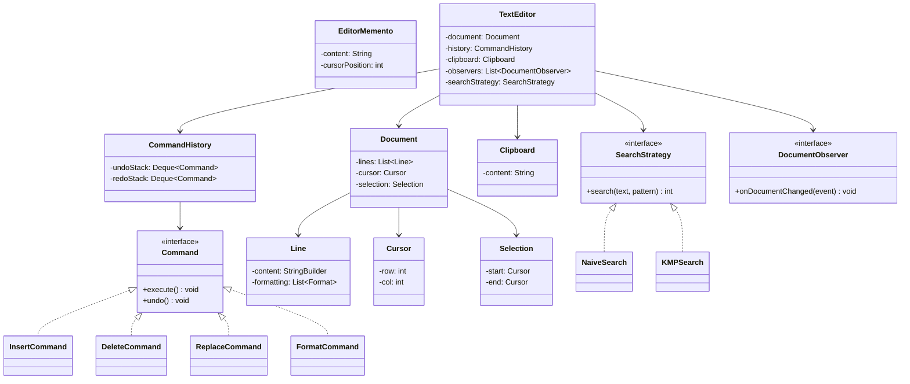

# Low-Level Design: Text Editor

## 1. Problem Statement

Design a text editor supporting insert, delete, find, replace, copy/cut/paste, formatting (bold/italic/underline), undo/redo operations, and document state snapshots. The system should be extensible for new commands and search algorithms.

## 2. UML Class Diagram



## 3. Design Patterns

| Pattern | Usage |
|---------|-------|
| **Command** | Encapsulates each edit operation for undo/redo |
| **Memento** | Captures and restores document snapshots |
| **Observer** | Notifies listeners on document changes |
| **Strategy** | Swappable search algorithms (Naive, KMP) |

## 4. SOLID Principles

- **SRP**: Each command class handles one operation; Document manages content only
- **OCP**: New commands/search strategies added without modifying existing code
- **LSP**: All Command implementations are interchangeable
- **ISP**: Separate interfaces for Command, SearchStrategy, DocumentObserver
- **DIP**: TextEditor depends on abstractions (Command, SearchStrategy interfaces)

## 5. Complete Java Implementation

```java
import java.util.*;

// ==================== Document Model ====================

enum FormatType { BOLD, ITALIC, UNDERLINE }

class Cursor {
    private int row, col;
    public Cursor(int row, int col) { this.row = row; this.col = col; }
    public int getRow() { return row; }
    public int getCol() { return col; }
    public void setPosition(int row, int col) { this.row = row; this.col = col; }
    public Cursor copy() { return new Cursor(row, col); }
}

class Selection {
    private Cursor start, end;
    public Selection(Cursor start, Cursor end) { this.start = start; this.end = end; }
    public Cursor getStart() { return start; }
    public Cursor getEnd() { return end; }
    public boolean isActive() { return start != null && end != null; }
    public void clear() { start = null; end = null; }
}

class Line {
    private StringBuilder content;
    private Set<FormatType> formatting;

    public Line(String text) {
        this.content = new StringBuilder(text);
        this.formatting = new HashSet<>();
    }
    public String getContent() { return content.toString(); }
    public void insert(int col, String text) { content.insert(col, text); }
    public void delete(int start, int end) { content.delete(start, end); }
    public void applyFormat(FormatType type) { formatting.add(type); }
    public void removeFormat(FormatType type) { formatting.remove(type); }
    public Set<FormatType> getFormatting() { return formatting; }
    public int length() { return content.length(); }
}

class Document {
    private List<Line> lines;
    private Cursor cursor;
    private Selection selection;

    public Document() {
        this.lines = new ArrayList<>();
        this.lines.add(new Line(""));
        this.cursor = new Cursor(0, 0);
        this.selection = new Selection(null, null);
    }

    public String getFullContent() {
        StringBuilder sb = new StringBuilder();
        for (int i = 0; i < lines.size(); i++) {
            if (i > 0) sb.append("\n");
            sb.append(lines.get(i).getContent());
        }
        return sb.toString();
    }

    public void setContent(String content) {
        lines.clear();
        String[] parts = content.split("\n", -1);
        for (String part : parts) lines.add(new Line(part));
    }

    public void insertAt(int row, int col, String text) {
        String[] parts = text.split("\n", -1);
        Line line = lines.get(row);
        String after = line.getContent().substring(col);
        line.delete(col, line.length());
        line.insert(col, parts[0]);
        for (int i = 1; i < parts.length; i++) {
            lines.add(row + i, new Line(parts[i]));
        }
        int lastIdx = row + parts.length - 1;
        lines.get(lastIdx).insert(lines.get(lastIdx).length(), after);
        // Update cursor
        cursor.setPosition(lastIdx, parts[parts.length - 1].length());
    }

    public String deleteRange(int startRow, int startCol, int endRow, int endCol) {
        StringBuilder deleted = new StringBuilder();
        if (startRow == endRow) {
            String content = lines.get(startRow).getContent();
            deleted.append(content, startCol, endCol);
            lines.get(startRow).delete(startCol, endCol);
        } else {
            deleted.append(lines.get(startRow).getContent().substring(startCol));
            for (int i = startRow + 1; i < endRow; i++) {
                deleted.append("\n").append(lines.get(startRow + 1).getContent());
                lines.remove(startRow + 1);
            }
            deleted.append("\n").append(lines.get(startRow + 1).getContent(), 0, endCol);
            String remaining = lines.get(startRow + 1).getContent().substring(endCol);
            lines.remove(startRow + 1);
            lines.get(startRow).delete(startCol, lines.get(startRow).length());
            lines.get(startRow).insert(startCol, remaining);
        }
        cursor.setPosition(startRow, startCol);
        return deleted.toString();
    }

    public Cursor getCursor() { return cursor; }
    public Selection getSelection() { return selection; }
    public List<Line> getLines() { return lines; }
    public Line getLine(int row) { return lines.get(row); }
}

// ==================== Memento Pattern ====================

class EditorMemento {
    private final String content;
    private final int cursorRow, cursorCol;

    public EditorMemento(String content, int cursorRow, int cursorCol) {
        this.content = content;
        this.cursorRow = cursorRow;
        this.cursorCol = cursorCol;
    }
    public String getContent() { return content; }
    public int getCursorRow() { return cursorRow; }
    public int getCursorCol() { return cursorCol; }
}

class MementoCaretaker {
    private final Deque<EditorMemento> snapshots = new ArrayDeque<>();

    public void save(EditorMemento memento) { snapshots.push(memento); }
    public EditorMemento restore() { return snapshots.isEmpty() ? null : snapshots.pop(); }
    public boolean hasSnapshots() { return !snapshots.isEmpty(); }
}

// ==================== Command Pattern ====================

interface Command {
    void execute();
    void undo();
}

class InsertCommand implements Command {
    private Document document;
    private int row, col;
    private String text;

    public InsertCommand(Document doc, int row, int col, String text) {
        this.document = doc; this.row = row; this.col = col; this.text = text;
    }
    public void execute() { document.insertAt(row, col, text); }
    public void undo() {
        // Calculate end position and delete
        String[] parts = text.split("\n", -1);
        int endRow = row + parts.length - 1;
        int endCol = (parts.length == 1) ? col + text.length() : parts[parts.length - 1].length();
        document.deleteRange(row, col, endRow, endCol);
    }
}

class DeleteCommand implements Command {
    private Document document;
    private int startRow, startCol, endRow, endCol;
    private String deletedText;

    public DeleteCommand(Document doc, int sRow, int sCol, int eRow, int eCol) {
        this.document = doc;
        this.startRow = sRow; this.startCol = sCol;
        this.endRow = eRow; this.endCol = eCol;
    }
    public void execute() { deletedText = document.deleteRange(startRow, startCol, endRow, endCol); }
    public void undo() { document.insertAt(startRow, startCol, deletedText); }
}

class ReplaceCommand implements Command {
    private Document document;
    private int row, col;
    private String oldText, newText;

    public ReplaceCommand(Document doc, int row, int col, String oldText, String newText) {
        this.document = doc; this.row = row; this.col = col;
        this.oldText = oldText; this.newText = newText;
    }
    public void execute() {
        document.deleteRange(row, col, row, col + oldText.length());
        document.insertAt(row, col, newText);
    }
    public void undo() {
        document.deleteRange(row, col, row, col + newText.length());
        document.insertAt(row, col, oldText);
    }
}

class FormatCommand implements Command {
    private Line line;
    private FormatType formatType;
    private boolean wasApplied;

    public FormatCommand(Line line, FormatType type) {
        this.line = line; this.formatType = type;
    }
    public void execute() {
        wasApplied = line.getFormatting().contains(formatType);
        if (wasApplied) line.removeFormat(formatType);
        else line.applyFormat(formatType);
    }
    public void undo() {
        if (wasApplied) line.applyFormat(formatType);
        else line.removeFormat(formatType);
    }
}

// ==================== Command History (Undo/Redo) ====================

class CommandHistory {
    private final Deque<Command> undoStack = new ArrayDeque<>();
    private final Deque<Command> redoStack = new ArrayDeque<>();

    public void executeCommand(Command cmd) {
        cmd.execute();
        undoStack.push(cmd);
        redoStack.clear(); // Clear redo on new action
    }

    public void undo() {
        if (!undoStack.isEmpty()) {
            Command cmd = undoStack.pop();
            cmd.undo();
            redoStack.push(cmd);
        }
    }

    public void redo() {
        if (!redoStack.isEmpty()) {
            Command cmd = redoStack.pop();
            cmd.execute();
            undoStack.push(cmd);
        }
    }

    public boolean canUndo() { return !undoStack.isEmpty(); }
    public boolean canRedo() { return !redoStack.isEmpty(); }
}

// ==================== Clipboard ====================

class Clipboard {
    private String content = "";
    public void copy(String text) { this.content = text; }
    public String paste() { return content; }
    public boolean hasContent() { return !content.isEmpty(); }
}

// ==================== Observer Pattern ====================

enum ChangeType { INSERT, DELETE, REPLACE, FORMAT }

class DocumentChangeEvent {
    private final ChangeType type;
    private final String description;
    public DocumentChangeEvent(ChangeType type, String desc) {
        this.type = type; this.description = desc;
    }
    public ChangeType getType() { return type; }
    public String getDescription() { return description; }
}

interface DocumentObserver {
    void onDocumentChanged(DocumentChangeEvent event);
}

class AutoSaveObserver implements DocumentObserver {
    public void onDocumentChanged(DocumentChangeEvent event) {
        System.out.println("[AutoSave] Triggered on: " + event.getType());
    }
}

class SyntaxHighlightObserver implements DocumentObserver {
    public void onDocumentChanged(DocumentChangeEvent event) {
        System.out.println("[SyntaxHighlight] Re-highlighting after: " + event.getType());
    }
}

// ==================== Strategy Pattern: Search ====================

interface SearchStrategy {
    int search(String text, String pattern);
}

class NaiveSearch implements SearchStrategy {
    public int search(String text, String pattern) {
        return text.indexOf(pattern);
    }
}

class KMPSearch implements SearchStrategy {
    public int search(String text, String pattern) {
        int[] lps = buildLPS(pattern);
        int i = 0, j = 0;
        while (i < text.length()) {
            if (text.charAt(i) == pattern.charAt(j)) { i++; j++; }
            if (j == pattern.length()) return i - j;
            else if (i < text.length() && text.charAt(i) != pattern.charAt(j)) {
                if (j != 0) j = lps[j - 1];
                else i++;
            }
        }
        return -1;
    }

    private int[] buildLPS(String pattern) {
        int[] lps = new int[pattern.length()];
        int len = 0, i = 1;
        while (i < pattern.length()) {
            if (pattern.charAt(i) == pattern.charAt(len)) { lps[i++] = ++len; }
            else if (len != 0) { len = lps[len - 1]; }
            else { lps[i++] = 0; }
        }
        return lps;
    }
}

// ==================== Text Editor (Facade) ====================

class TextEditor {
    private Document document;
    private CommandHistory history;
    private Clipboard clipboard;
    private MementoCaretaker caretaker;
    private List<DocumentObserver> observers;
    private SearchStrategy searchStrategy;

    public TextEditor() {
        this.document = new Document();
        this.history = new CommandHistory();
        this.clipboard = new Clipboard();
        this.caretaker = new MementoCaretaker();
        this.observers = new ArrayList<>();
        this.searchStrategy = new NaiveSearch();
    }

    // --- Core Operations ---
    public void insert(String text) {
        Cursor c = document.getCursor();
        Command cmd = new InsertCommand(document, c.getRow(), c.getCol(), text);
        history.executeCommand(cmd);
        notifyObservers(new DocumentChangeEvent(ChangeType.INSERT, "Inserted: " + text));
    }

    public void delete(int startRow, int startCol, int endRow, int endCol) {
        Command cmd = new DeleteCommand(document, startRow, startCol, endRow, endCol);
        history.executeCommand(cmd);
        notifyObservers(new DocumentChangeEvent(ChangeType.DELETE, "Deleted range"));
    }

    public void replace(int row, int col, String oldText, String newText) {
        Command cmd = new ReplaceCommand(document, row, col, oldText, newText);
        history.executeCommand(cmd);
        notifyObservers(new DocumentChangeEvent(ChangeType.REPLACE, oldText + " -> " + newText));
    }

    public void format(int row, FormatType type) {
        Command cmd = new FormatCommand(document.getLine(row), type);
        history.executeCommand(cmd);
        notifyObservers(new DocumentChangeEvent(ChangeType.FORMAT, type.name()));
    }

    // --- Undo/Redo ---
    public void undo() { history.undo(); }
    public void redo() { history.redo(); }

    // --- Clipboard ---
    public void copy(int startRow, int startCol, int endRow, int endCol) {
        String text = document.getFullContent(); // Simplified: extract range
        clipboard.copy(text.substring(
            Math.min(startCol, text.length()),
            Math.min(endCol, text.length())
        ));
    }

    public void cut(int startRow, int startCol, int endRow, int endCol) {
        copy(startRow, startCol, endRow, endCol);
        delete(startRow, startCol, endRow, endCol);
    }

    public void paste() {
        if (clipboard.hasContent()) insert(clipboard.paste());
    }

    // --- Search ---
    public int find(String pattern) {
        return searchStrategy.search(document.getFullContent(), pattern);
    }

    public void setSearchStrategy(SearchStrategy strategy) {
        this.searchStrategy = strategy;
    }

    // --- Memento: Save/Restore ---
    public void saveSnapshot() {
        Cursor c = document.getCursor();
        caretaker.save(new EditorMemento(document.getFullContent(), c.getRow(), c.getCol()));
    }

    public void restoreSnapshot() {
        EditorMemento memento = caretaker.restore();
        if (memento != null) {
            document.setContent(memento.getContent());
            document.getCursor().setPosition(memento.getCursorRow(), memento.getCursorCol());
        }
    }

    // --- Observer ---
    public void addObserver(DocumentObserver observer) { observers.add(observer); }
    public void removeObserver(DocumentObserver observer) { observers.remove(observer); }
    private void notifyObservers(DocumentChangeEvent event) {
        observers.forEach(o -> o.onDocumentChanged(event));
    }

    // --- Getters ---
    public String getContent() { return document.getFullContent(); }
    public Document getDocument() { return document; }
}

// ==================== Demo ====================

public class TextEditorDemo {
    public static void main(String[] args) {
        TextEditor editor = new TextEditor();
        editor.addObserver(new AutoSaveObserver());
        editor.addObserver(new SyntaxHighlightObserver());

        // Insert text
        editor.insert("Hello World");
        System.out.println("After insert: " + editor.getContent());

        // Save snapshot
        editor.saveSnapshot();

        // Replace
        editor.replace(0, 6, "World", "Java");
        System.out.println("After replace: " + editor.getContent());

        // Undo
        editor.undo();
        System.out.println("After undo: " + editor.getContent());

        // Redo
        editor.redo();
        System.out.println("After redo: " + editor.getContent());

        // Search with KMP
        editor.setSearchStrategy(new KMPSearch());
        int pos = editor.find("Java");
        System.out.println("Found 'Java' at index: " + pos);

        // Format
        editor.format(0, FormatType.BOLD);
        System.out.println("Applied BOLD to line 0");

        // Restore snapshot
        editor.restoreSnapshot();
        System.out.println("After restore: " + editor.getContent());
    }
}
```

## 6. Key Interview Points

| Topic | Insight |
|-------|---------|
| **Command + Memento combo** | Commands enable granular undo/redo; Memento provides coarse-grained snapshots (e.g., autosave checkpoints) |
| **Why not just Memento for undo?** | Storing full state on every keystroke is expensive; Commands store only deltas |
| **Redo invalidation** | Redo stack clears on any new command execution (standard editor behavior) |
| **Command granularity** | Group rapid keystrokes into one compound command for better UX |
| **Strategy for search** | KMP is O(n+m) vs naive O(nm); swap at runtime based on pattern length |
| **Observer decoupling** | AutoSave, syntax highlighting, line numbering all react independently |
| **Clipboard scope** | System clipboard vs editor-local clipboard is a design choice |
| **Concurrency** | For collaborative editing, consider OT (Operational Transform) or CRDT |
