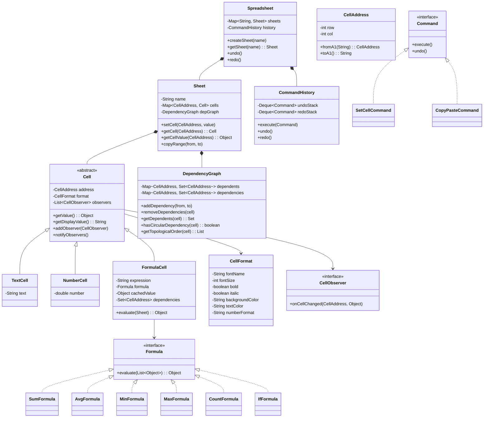

# Low-Level Design: Spreadsheet (like Excel)

## 1. Problem Statement
Design a spreadsheet application supporting multiple sheets, cell types (text, number, formula), formula evaluation with cell references and ranges, dependency tracking with circular dependency detection, undo/redo, copy/paste, and formatting.

## 2. UML Class Diagram


## 3. Design Patterns
| Pattern | Usage |
|---------|-------|
| **Observer** | Cells observe dependencies; auto-recalculate on change |
| **Strategy** | Formula interface with interchangeable implementations |
| **Composite** | Ranges as composite cell references |
| **Command** | Undo/redo for all cell operations |
| **Factory** | Create appropriate Cell type from input |

## 4. SOLID Principles
- **SRP**: Cell, Formula, DependencyGraph each have single responsibility
- **OCP**: New formula types added without modifying existing code
- **LSP**: All Cell subtypes substitutable
- **ISP**: CellObserver is a focused interface
- **DIP**: FormulaCell depends on Formula interface, not concrete implementations

## 5. Complete Java Implementation

```java
// ========== CellAddress ==========
public class CellAddress {
    private final int row;
    private final int col;

    public CellAddress(int row, int col) {
        this.row = row;
        this.col = col;
    }

    public static CellAddress fromA1(String notation) {
        int col = 0;
        int i = 0;
        while (i < notation.length() && Character.isLetter(notation.charAt(i))) {
            col = col * 26 + (Character.toUpperCase(notation.charAt(i)) - 'A' + 1);
            i++;
        }
        int row = Integer.parseInt(notation.substring(i)) - 1;
        return new CellAddress(row, col - 1);
    }

    public String toA1() {
        StringBuilder sb = new StringBuilder();
        int c = col + 1;
        while (c > 0) {
            sb.insert(0, (char) ('A' + (c - 1) % 26));
            c = (c - 1) / 26;
        }
        sb.append(row + 1);
        return sb.toString();
    }

    public int getRow() { return row; }
    public int getCol() { return col; }

    @Override
    public boolean equals(Object o) {
        if (this == o) return true;
        if (!(o instanceof CellAddress)) return false;
        CellAddress that = (CellAddress) o;
        return row == that.row && col == that.col;
    }

    @Override
    public int hashCode() { return Objects.hash(row, col); }

    public static List<CellAddress> parseRange(String range) {
        String[] parts = range.split(":");
        CellAddress start = fromA1(parts[0]);
        CellAddress end = fromA1(parts[1]);
        List<CellAddress> addresses = new ArrayList<>();
        for (int r = start.row; r <= end.row; r++)
            for (int c = start.col; c <= end.col; c++)
                addresses.add(new CellAddress(r, c));
        return addresses;
    }
}

// ========== CellFormat ==========
public class CellFormat {
    private String fontName = "Arial";
    private int fontSize = 11;
    private boolean bold = false;
    private boolean italic = false;
    private String backgroundColor = "#FFFFFF";
    private String textColor = "#000000";
    private String numberFormat = "General";
    // getters/setters omitted for brevity

    public CellFormat copy() {
        CellFormat f = new CellFormat();
        f.fontName = this.fontName; f.fontSize = this.fontSize;
        f.bold = this.bold; f.italic = this.italic;
        f.backgroundColor = this.backgroundColor;
        f.textColor = this.textColor; f.numberFormat = this.numberFormat;
        return f;
    }
}

// ========== CellObserver ==========
public interface CellObserver {
    void onCellChanged(CellAddress address, Object newValue);
}

// ========== Cell (Abstract) ==========
public abstract class Cell {
    protected CellAddress address;
    protected CellFormat format = new CellFormat();
    protected List<CellObserver> observers = new ArrayList<>();

    public Cell(CellAddress address) { this.address = address; }
    public abstract Object getValue();
    public String getDisplayValue() { return getValue() != null ? getValue().toString() : ""; }
    public CellAddress getAddress() { return address; }
    public CellFormat getFormat() { return format; }
    public void setFormat(CellFormat format) { this.format = format; }

    public void addObserver(CellObserver observer) { observers.add(observer); }
    public void removeObserver(CellObserver observer) { observers.remove(observer); }
    public void notifyObservers() {
        for (CellObserver obs : observers) obs.onCellChanged(address, getValue());
    }
}

// ========== TextCell ==========
public class TextCell extends Cell {
    private String text;
    public TextCell(CellAddress address, String text) { super(address); this.text = text; }
    @Override public Object getValue() { return text; }
}

// ========== NumberCell ==========
public class NumberCell extends Cell {
    private double number;
    public NumberCell(CellAddress address, double number) { super(address); this.number = number; }
    @Override public Object getValue() { return number; }
}

// ========== Formula (Strategy Interface) ==========
public interface Formula {
    Object evaluate(List<Object> args);
}

public class SumFormula implements Formula {
    public Object evaluate(List<Object> args) {
        return args.stream().filter(a -> a instanceof Number)
            .mapToDouble(a -> ((Number) a).doubleValue()).sum();
    }
}

public class AvgFormula implements Formula {
    public Object evaluate(List<Object> args) {
        return args.stream().filter(a -> a instanceof Number)
            .mapToDouble(a -> ((Number) a).doubleValue()).average().orElse(0);
    }
}

public class MinFormula implements Formula {
    public Object evaluate(List<Object> args) {
        return args.stream().filter(a -> a instanceof Number)
            .mapToDouble(a -> ((Number) a).doubleValue()).min().orElse(0);
    }
}

public class MaxFormula implements Formula {
    public Object evaluate(List<Object> args) {
        return args.stream().filter(a -> a instanceof Number)
            .mapToDouble(a -> ((Number) a).doubleValue()).max().orElse(0);
    }
}

public class CountFormula implements Formula {
    public Object evaluate(List<Object> args) {
        return (double) args.stream().filter(a -> a instanceof Number).count();
    }
}

public class IfFormula implements Formula {
    // args: [condition, trueValue, falseValue]
    public Object evaluate(List<Object> args) {
        if (args.size() < 3) return "#ERROR";
        boolean condition = args.get(0) instanceof Boolean ? (Boolean) args.get(0)
            : args.get(0) instanceof Number && ((Number) args.get(0)).doubleValue() != 0;
        return condition ? args.get(1) : args.get(2);
    }
}

// ========== FormulaFactory ==========
public class FormulaFactory {
    private static final Map<String, Formula> FORMULAS = Map.of(
        "SUM", new SumFormula(), "AVG", new AvgFormula(),
        "MIN", new MinFormula(), "MAX", new MaxFormula(),
        "COUNT", new CountFormula(), "IF", new IfFormula()
    );
    public static Formula getFormula(String name) { return FORMULAS.get(name.toUpperCase()); }
}

// ========== FormulaCell ==========
public class FormulaCell extends Cell implements CellObserver {
    private String expression;
    private Object cachedValue;
    private Set<CellAddress> dependencies = new HashSet<>();
    private Sheet sheet;

    public FormulaCell(CellAddress address, String expression, Sheet sheet) {
        super(address);
        this.expression = expression;
        this.sheet = sheet;
        evaluate();
    }

    public void evaluate() {
        // Parse: =SUM(A1:A10) or =A1+B1
        String expr = expression.startsWith("=") ? expression.substring(1) : expression;
        try {
            cachedValue = parseAndEvaluate(expr);
        } catch (Exception e) {
            cachedValue = "#ERROR";
        }
    }

    private Object parseAndEvaluate(String expr) {
        // Function call pattern: FUNC(args)
        Pattern funcPattern = Pattern.compile("^(\\w+)\\((.+)\\)$");
        Matcher m = funcPattern.matcher(expr.trim());
        if (m.matches()) {
            String funcName = m.group(1);
            String argsStr = m.group(2);
            Formula formula = FormulaFactory.getFormula(funcName);
            if (formula == null) return "#NAME?";
            List<Object> args = resolveArgs(argsStr);
            return formula.evaluate(args);
        }
        // Simple cell reference
        if (expr.matches("[A-Z]+\\d+")) {
            CellAddress ref = CellAddress.fromA1(expr);
            dependencies.add(ref);
            return sheet.getCellValue(ref);
        }
        return "#PARSE_ERROR";
    }

    private List<Object> resolveArgs(String argsStr) {
        List<Object> values = new ArrayList<>();
        String[] parts = argsStr.split(",");
        for (String part : parts) {
            part = part.trim();
            if (part.contains(":")) {
                List<CellAddress> range = CellAddress.parseRange(part);
                for (CellAddress addr : range) {
                    dependencies.add(addr);
                    values.add(sheet.getCellValue(addr));
                }
            } else if (part.matches("[A-Z]+\\d+")) {
                CellAddress addr = CellAddress.fromA1(part);
                dependencies.add(addr);
                values.add(sheet.getCellValue(addr));
            } else {
                try { values.add(Double.parseDouble(part)); }
                catch (NumberFormatException e) { values.add(part); }
            }
        }
        return values;
    }

    public Set<CellAddress> getDependencies() { return dependencies; }
    @Override public Object getValue() { return cachedValue; }

    @Override
    public void onCellChanged(CellAddress address, Object newValue) {
        evaluate();
        notifyObservers();
    }
}

// ========== DependencyGraph ==========
public class DependencyGraph {
    // dependents: cell -> cells that depend on it
    private Map<CellAddress, Set<CellAddress>> dependents = new HashMap<>();
    // dependencies: cell -> cells it depends on
    private Map<CellAddress, Set<CellAddress>> dependencies = new HashMap<>();

    public void addDependency(CellAddress cell, CellAddress dependsOn) {
        dependencies.computeIfAbsent(cell, k -> new HashSet<>()).add(dependsOn);
        dependents.computeIfAbsent(dependsOn, k -> new HashSet<>()).add(cell);
    }

    public void removeDependencies(CellAddress cell) {
        Set<CellAddress> deps = dependencies.remove(cell);
        if (deps != null) {
            for (CellAddress dep : deps) {
                Set<CellAddress> set = dependents.get(dep);
                if (set != null) set.remove(cell);
            }
        }
    }

    public Set<CellAddress> getDependents(CellAddress cell) {
        return dependents.getOrDefault(cell, Collections.emptySet());
    }

    // Circular dependency detection using DFS
    public boolean hasCircularDependency(CellAddress start, Set<CellAddress> newDeps) {
        Set<CellAddress> visited = new HashSet<>();
        Set<CellAddress> stack = new HashSet<>();
        // Temporarily add new deps
        for (CellAddress dep : newDeps) {
            if (dfs(dep, start, visited, stack)) return true;
        }
        return false;
    }

    private boolean dfs(CellAddress current, CellAddress target,
                        Set<CellAddress> visited, Set<CellAddress> stack) {
        if (current.equals(target)) return true;
        if (stack.contains(current)) return false;
        if (visited.contains(current)) return false;
        visited.add(current);
        stack.add(current);
        for (CellAddress dep : dependencies.getOrDefault(current, Collections.emptySet())) {
            if (dfs(dep, target, visited, stack)) return true;
        }
        stack.remove(current);
        return false;
    }

    // Topological sort: order to recalculate dependents
    public List<CellAddress> getRecalculationOrder(CellAddress changed) {
        List<CellAddress> order = new ArrayList<>();
        Set<CellAddress> visited = new HashSet<>();
        Queue<CellAddress> queue = new LinkedList<>();
        queue.add(changed);
        while (!queue.isEmpty()) {
            CellAddress curr = queue.poll();
            for (CellAddress dep : getDependents(curr)) {
                if (visited.add(dep)) {
                    order.add(dep);
                    queue.add(dep);
                }
            }
        }
        return order;
    }
}

// ========== Command Pattern ==========
public interface Command {
    void execute();
    void undo();
}

public class SetCellCommand implements Command {
    private Sheet sheet;
    private CellAddress address;
    private String newValue;
    private Cell previousCell;

    public SetCellCommand(Sheet sheet, CellAddress address, String newValue) {
        this.sheet = sheet; this.address = address; this.newValue = newValue;
    }

    @Override public void execute() {
        previousCell = sheet.getCellObject(address);
        sheet.setCellInternal(address, newValue);
    }

    @Override public void undo() {
        if (previousCell == null) sheet.removeCell(address);
        else sheet.restoreCell(address, previousCell);
    }
}

public class CopyPasteCommand implements Command {
    private Sheet sheet;
    private CellAddress from, to;
    private Cell previousTarget;

    public CopyPasteCommand(Sheet sheet, CellAddress from, CellAddress to) {
        this.sheet = sheet; this.from = from; this.to = to;
    }

    @Override public void execute() {
        previousTarget = sheet.getCellObject(to);
        sheet.copyCellInternal(from, to);
    }

    @Override public void undo() {
        if (previousTarget == null) sheet.removeCell(to);
        else sheet.restoreCell(to, previousTarget);
    }
}

public class CommandHistory {
    private Deque<Command> undoStack = new ArrayDeque<>();
    private Deque<Command> redoStack = new ArrayDeque<>();

    public void execute(Command cmd) {
        cmd.execute();
        undoStack.push(cmd);
        redoStack.clear();
    }

    public void undo() {
        if (!undoStack.isEmpty()) {
            Command cmd = undoStack.pop();
            cmd.undo();
            redoStack.push(cmd);
        }
    }

    public void redo() {
        if (!redoStack.isEmpty()) {
            Command cmd = redoStack.pop();
            cmd.execute();
            undoStack.push(cmd);
        }
    }
}

// ========== Sheet ==========
public class Sheet {
    private String name;
    private Map<CellAddress, Cell> cells = new HashMap<>();
    private DependencyGraph depGraph = new DependencyGraph();

    public Sheet(String name) { this.name = name; }

    public void setCellInternal(CellAddress address, String value) {
        depGraph.removeDependencies(address);
        Cell oldCell = cells.get(address);
        Cell newCell = CellFactory.create(address, value, this);

        if (newCell instanceof FormulaCell) {
            FormulaCell fc = (FormulaCell) newCell;
            if (depGraph.hasCircularDependency(address, fc.getDependencies())) {
                throw new IllegalStateException("Circular dependency detected!");
            }
            for (CellAddress dep : fc.getDependencies()) {
                depGraph.addDependency(address, dep);
                Cell depCell = cells.get(dep);
                if (depCell != null) depCell.addObserver(fc);
            }
        }

        cells.put(address, newCell);
        // Propagate changes via topological order
        List<CellAddress> recalcOrder = depGraph.getRecalculationOrder(address);
        for (CellAddress addr : recalcOrder) {
            Cell c = cells.get(addr);
            if (c instanceof FormulaCell) ((FormulaCell) c).evaluate();
        }
        newCell.notifyObservers();
    }

    public Object getCellValue(CellAddress address) {
        Cell cell = cells.get(address);
        return cell != null ? cell.getValue() : 0.0;
    }

    public Cell getCellObject(CellAddress address) { return cells.get(address); }
    public void removeCell(CellAddress address) { cells.remove(address); }
    public void restoreCell(CellAddress address, Cell cell) { cells.put(address, cell); }

    public void copyCellInternal(CellAddress from, CellAddress to) {
        Cell source = cells.get(from);
        if (source == null) return;
        // Deep copy with address adjustment
        if (source instanceof NumberCell) {
            cells.put(to, new NumberCell(to, (Double) source.getValue()));
        } else if (source instanceof TextCell) {
            cells.put(to, new TextCell(to, (String) source.getValue()));
        } else if (source instanceof FormulaCell) {
            // Adjust relative references (simplified)
            cells.put(to, new FormulaCell(to, adjustFormula(source, from, to), this));
        }
    }

    private String adjustFormula(Cell source, CellAddress from, CellAddress to) {
        // Offset-based reference adjustment for copy/paste
        int rowDiff = to.getRow() - from.getRow();
        int colDiff = to.getCol() - from.getCol();
        // Simplified: return original expression (full impl adjusts refs)
        return ((FormulaCell) source).getDisplayValue();
    }
}

// ========== CellFactory ==========
public class CellFactory {
    public static Cell create(CellAddress address, String value, Sheet sheet) {
        if (value == null || value.isEmpty()) return new TextCell(address, "");
        if (value.startsWith("=")) return new FormulaCell(address, value, sheet);
        try {
            return new NumberCell(address, Double.parseDouble(value));
        } catch (NumberFormatException e) {
            return new TextCell(address, value);
        }
    }
}

// ========== Spreadsheet ==========
public class Spreadsheet {
    private Map<String, Sheet> sheets = new LinkedHashMap<>();
    private CommandHistory history = new CommandHistory();

    public Sheet createSheet(String name) {
        Sheet sheet = new Sheet(name);
        sheets.put(name, sheet);
        return sheet;
    }

    public Sheet getSheet(String name) { return sheets.get(name); }

    public void setCell(String sheetName, String cellRef, String value) {
        Sheet sheet = sheets.get(sheetName);
        CellAddress address = CellAddress.fromA1(cellRef);
        history.execute(new SetCellCommand(sheet, address, value));
    }

    public void copyPaste(String sheetName, String from, String to) {
        Sheet sheet = sheets.get(sheetName);
        history.execute(new CopyPasteCommand(sheet,
            CellAddress.fromA1(from), CellAddress.fromA1(to)));
    }

    public void undo() { history.undo(); }
    public void redo() { history.redo(); }
}
```

## 6. Key Algorithm: Dependency Graph + Topological Sort

```java
// When cell A1 changes, find all cells that need recalculation in correct order
public List<CellAddress> getRecalculationOrder(CellAddress changed) {
    // BFS from changed cell through dependents graph
    List<CellAddress> order = new ArrayList<>();
    Set<CellAddress> visited = new HashSet<>();
    Queue<CellAddress> queue = new LinkedList<>();
    queue.add(changed);

    while (!queue.isEmpty()) {
        CellAddress curr = queue.poll();
        for (CellAddress dependent : getDependents(curr)) {
            if (visited.add(dependent)) {
                order.add(dependent);
                queue.add(dependent);
            }
        }
    }
    return order; // Cells in this order can be safely recalculated
}

// Circular dependency detection before adding formula
public boolean hasCircularDependency(CellAddress cell, Set<CellAddress> newDeps) {
    // DFS: can we reach 'cell' starting from any of its new dependencies?
    for (CellAddress dep : newDeps) {
        if (canReach(dep, cell, new HashSet<>())) return true;
    }
    return false;
}
```

## 7. Key Interview Points

| Topic | Key Point |
|-------|-----------|
| **Dependency Graph** | DAG tracking which cells depend on which; enables efficient recalculation |
| **Circular Detection** | DFS from dependencies back to the cell; reject if cycle found |
| **Recalculation Order** | BFS/topological sort ensures dependents recalculate after their dependencies |
| **Observer Pattern** | Cells auto-notify dependents on value change; avoids polling |
| **Command Pattern** | Every mutation is a command object; enables unlimited undo/redo |
| **Strategy Pattern** | Formula interface allows pluggable evaluation (SUM, AVG, etc.) |
| **Cell Factory** | Input parsing determines cell type (number, text, formula) |
| **Copy/Paste** | Deep copy with relative reference adjustment (row/col offset) |
| **Performance** | Only recalculate affected subgraph, not entire sheet |
| **Concurrency** | ReadWriteLock per sheet; formula evaluation is thread-safe with cached values |
