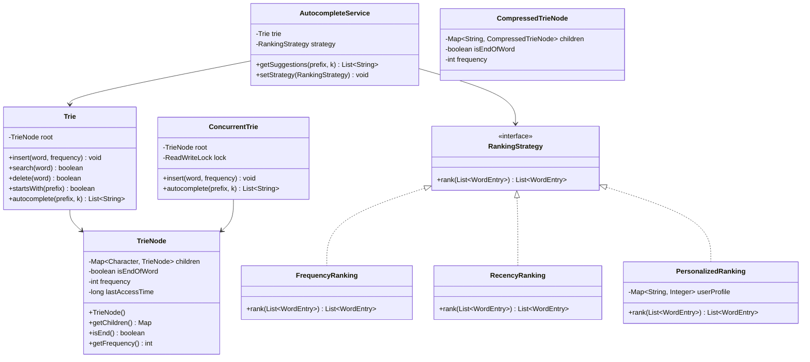

# Trie & Autocomplete System - Low-Level Design

## 1. Problem Statement

Design a Trie-based autocomplete system that efficiently stores words, supports prefix-based search, and returns top-k suggestions ranked by frequency, recency, or personalized scoring. Support thread-safety, compressed tries, and fuzzy matching.

---

## 2. UML Class Diagram



---

## 3. Design Patterns

| Pattern | Usage |
|---------|-------|
| **Composite** | TrieNode tree structure - each node contains children of same type |
| **Strategy** | Interchangeable ranking algorithms (Frequency, Recency, Personalized) |
| **Iterator** | DFS traversal over trie nodes for prefix collection |

## 4. SOLID Principles

- **SRP**: TrieNode stores data, Trie handles operations, Service handles ranking
- **OCP**: New ranking strategies without modifying existing code
- **LSP**: All RankingStrategy implementations are interchangeable
- **ISP**: Small focused interfaces (RankingStrategy)
- **DIP**: AutocompleteService depends on RankingStrategy abstraction

---

## 5. Complete Java Implementation

```java
import java.util.*;
import java.util.concurrent.locks.*;
import java.util.stream.*;

// ==================== Core Classes ====================

class WordEntry {
    String word;
    int frequency;
    long lastAccessTime;

    WordEntry(String word, int frequency, long lastAccessTime) {
        this.word = word;
        this.frequency = frequency;
        this.lastAccessTime = lastAccessTime;
    }
}

class TrieNode {
    Map<Character, TrieNode> children;
    boolean isEndOfWord;
    int frequency;
    long lastAccessTime;

    TrieNode() {
        this.children = new HashMap<>();
        this.isEndOfWord = false;
        this.frequency = 0;
        this.lastAccessTime = 0;
    }
}

// ==================== Trie Implementation ====================

class Trie {
    private final TrieNode root;

    Trie() {
        this.root = new TrieNode();
    }

    public void insert(String word, int frequency) {
        TrieNode current = root;
        for (char ch : word.toCharArray()) {
            current.children.putIfAbsent(ch, new TrieNode());
            current = current.children.get(ch);
        }
        current.isEndOfWord = true;
        current.frequency += frequency;
        current.lastAccessTime = System.currentTimeMillis();
    }

    public boolean search(String word) {
        TrieNode node = getNode(word);
        return node != null && node.isEndOfWord;
    }

    public boolean startsWith(String prefix) {
        return getNode(prefix) != null;
    }

    public boolean delete(String word) {
        return delete(root, word, 0);
    }

    private boolean delete(TrieNode current, String word, int index) {
        if (index == word.length()) {
            if (!current.isEndOfWord) return false;
            current.isEndOfWord = false;
            return current.children.isEmpty();
        }
        char ch = word.charAt(index);
        TrieNode child = current.children.get(ch);
        if (child == null) return false;

        boolean shouldDeleteChild = delete(child, word, index + 1);
        if (shouldDeleteChild) {
            current.children.remove(ch);
            return current.children.isEmpty() && !current.isEndOfWord;
        }
        return false;
    }

    public List<WordEntry> autocomplete(String prefix, int k) {
        TrieNode prefixNode = getNode(prefix);
        if (prefixNode == null) return Collections.emptyList();

        List<WordEntry> results = new ArrayList<>();
        dfs(prefixNode, new StringBuilder(prefix), results);

        // Return top-k by frequency using min-heap
        PriorityQueue<WordEntry> minHeap = new PriorityQueue<>(
            Comparator.comparingInt(e -> e.frequency));

        for (WordEntry entry : results) {
            minHeap.offer(entry);
            if (minHeap.size() > k) minHeap.poll();
        }

        List<WordEntry> topK = new ArrayList<>(minHeap);
        topK.sort((a, b) -> b.frequency - a.frequency);
        return topK;
    }

    private void dfs(TrieNode node, StringBuilder path, List<WordEntry> results) {
        if (node.isEndOfWord) {
            results.add(new WordEntry(path.toString(), node.frequency, node.lastAccessTime));
        }
        for (Map.Entry<Character, TrieNode> entry : node.children.entrySet()) {
            path.append(entry.getKey());
            dfs(entry.getValue(), path, results);
            path.deleteCharAt(path.length() - 1);
        }
    }

    private TrieNode getNode(String prefix) {
        TrieNode current = root;
        for (char ch : prefix.toCharArray()) {
            current = current.children.get(ch);
            if (current == null) return null;
        }
        return current;
    }
}

// ==================== Strategy Pattern - Ranking ====================

interface RankingStrategy {
    List<WordEntry> rank(List<WordEntry> entries);
}

class FrequencyRanking implements RankingStrategy {
    @Override
    public List<WordEntry> rank(List<WordEntry> entries) {
        entries.sort((a, b) -> b.frequency - a.frequency);
        return entries;
    }
}

class RecencyRanking implements RankingStrategy {
    @Override
    public List<WordEntry> rank(List<WordEntry> entries) {
        entries.sort((a, b) -> Long.compare(b.lastAccessTime, a.lastAccessTime));
        return entries;
    }
}

class PersonalizedRanking implements RankingStrategy {
    private final Map<String, Integer> userProfile; // word -> user-specific boost

    PersonalizedRanking(Map<String, Integer> userProfile) {
        this.userProfile = userProfile;
    }

    @Override
    public List<WordEntry> rank(List<WordEntry> entries) {
        entries.sort((a, b) -> {
            int scoreA = a.frequency + userProfile.getOrDefault(a.word, 0);
            int scoreB = b.frequency + userProfile.getOrDefault(b.word, 0);
            return scoreB - scoreA;
        });
        return entries;
    }
}

// ==================== Autocomplete Service ====================

class AutocompleteService {
    private final Trie trie;
    private RankingStrategy strategy;

    AutocompleteService(RankingStrategy strategy) {
        this.trie = new Trie();
        this.strategy = strategy;
    }

    public void addWord(String word, int frequency) {
        trie.insert(word, frequency);
    }

    public List<String> getSuggestions(String prefix, int k) {
        List<WordEntry> entries = trie.autocomplete(prefix, k * 2); // fetch more for ranking
        List<WordEntry> ranked = strategy.rank(entries);
        return ranked.stream()
            .limit(k)
            .map(e -> e.word)
            .collect(Collectors.toList());
    }

    public void setStrategy(RankingStrategy strategy) {
        this.strategy = strategy;
    }
}

// ==================== Compressed Trie (Radix Tree) ====================

class CompressedTrieNode {
    Map<String, CompressedTrieNode> children;
    boolean isEndOfWord;
    int frequency;

    CompressedTrieNode() {
        this.children = new HashMap<>();
        this.isEndOfWord = false;
    }
}

class CompressedTrie {
    private final CompressedTrieNode root;

    CompressedTrie() {
        this.root = new CompressedTrieNode();
    }

    public void insert(String word, int frequency) {
        insertHelper(root, word, frequency);
    }

    private void insertHelper(CompressedTrieNode node, String remaining, int frequency) {
        if (remaining.isEmpty()) {
            node.isEndOfWord = true;
            node.frequency += frequency;
            return;
        }

        for (Map.Entry<String, CompressedTrieNode> entry : node.children.entrySet()) {
            String edge = entry.getKey();
            int commonLen = commonPrefixLength(edge, remaining);

            if (commonLen == 0) continue;

            if (commonLen == edge.length() && commonLen == remaining.length()) {
                // Exact match
                entry.getValue().isEndOfWord = true;
                entry.getValue().frequency += frequency;
                return;
            } else if (commonLen == edge.length()) {
                // Edge is prefix of remaining
                insertHelper(entry.getValue(), remaining.substring(commonLen), frequency);
                return;
            } else {
                // Split the edge
                String commonPart = edge.substring(0, commonLen);
                String edgeRemaining = edge.substring(commonLen);
                String wordRemaining = remaining.substring(commonLen);

                CompressedTrieNode splitNode = new CompressedTrieNode();
                splitNode.children.put(edgeRemaining, entry.getValue());

                node.children.remove(edge);
                node.children.put(commonPart, splitNode);

                if (wordRemaining.isEmpty()) {
                    splitNode.isEndOfWord = true;
                    splitNode.frequency += frequency;
                } else {
                    CompressedTrieNode newNode = new CompressedTrieNode();
                    newNode.isEndOfWord = true;
                    newNode.frequency = frequency;
                    splitNode.children.put(wordRemaining, newNode);
                }
                return;
            }
        }

        // No matching edge found
        CompressedTrieNode newNode = new CompressedTrieNode();
        newNode.isEndOfWord = true;
        newNode.frequency = frequency;
        node.children.put(remaining, newNode);
    }

    private int commonPrefixLength(String a, String b) {
        int len = Math.min(a.length(), b.length());
        for (int i = 0; i < len; i++) {
            if (a.charAt(i) != b.charAt(i)) return i;
        }
        return len;
    }
}

// ==================== Thread-Safe Trie ====================

class ConcurrentTrie {
    private final TrieNode root;
    private final ReadWriteLock lock = new ReentrantReadWriteLock();

    ConcurrentTrie() {
        this.root = new TrieNode();
    }

    public void insert(String word, int frequency) {
        lock.writeLock().lock();
        try {
            TrieNode current = root;
            for (char ch : word.toCharArray()) {
                current.children.putIfAbsent(ch, new TrieNode());
                current = current.children.get(ch);
            }
            current.isEndOfWord = true;
            current.frequency += frequency;
            current.lastAccessTime = System.currentTimeMillis();
        } finally {
            lock.writeLock().unlock();
        }
    }

    public List<WordEntry> autocomplete(String prefix, int k) {
        lock.readLock().lock();
        try {
            TrieNode current = root;
            for (char ch : prefix.toCharArray()) {
                current = current.children.get(ch);
                if (current == null) return Collections.emptyList();
            }
            List<WordEntry> results = new ArrayList<>();
            dfs(current, new StringBuilder(prefix), results);
            results.sort((a, b) -> b.frequency - a.frequency);
            return results.subList(0, Math.min(k, results.size()));
        } finally {
            lock.readLock().unlock();
        }
    }

    private void dfs(TrieNode node, StringBuilder path, List<WordEntry> results) {
        if (node.isEndOfWord) {
            results.add(new WordEntry(path.toString(), node.frequency, node.lastAccessTime));
        }
        for (Map.Entry<Character, TrieNode> entry : node.children.entrySet()) {
            path.append(entry.getKey());
            dfs(entry.getValue(), path, results);
            path.deleteCharAt(path.length() - 1);
        }
    }
}

// ==================== Fuzzy Search (Edit Distance) ====================

class FuzzySearch {
    private final TrieNode root;

    FuzzySearch(TrieNode root) {
        this.root = root;
    }

    public List<WordEntry> search(String target, int maxDistance) {
        List<WordEntry> results = new ArrayList<>();
        int[] currentRow = new int[target.length() + 1];
        for (int i = 0; i <= target.length(); i++) currentRow[i] = i;

        for (Map.Entry<Character, TrieNode> entry : root.children.entrySet()) {
            searchRecursive(entry.getValue(), entry.getKey(), target,
                currentRow, maxDistance, new StringBuilder().append(entry.getKey()), results);
        }
        return results;
    }

    private void searchRecursive(TrieNode node, char ch, String target,
            int[] prevRow, int maxDist, StringBuilder word, List<WordEntry> results) {
        int cols = target.length() + 1;
        int[] currentRow = new int[cols];
        currentRow[0] = prevRow[0] + 1;

        for (int i = 1; i < cols; i++) {
            int insertCost = currentRow[i - 1] + 1;
            int deleteCost = prevRow[i] + 1;
            int replaceCost = prevRow[i - 1] + (target.charAt(i - 1) != ch ? 1 : 0);
            currentRow[i] = Math.min(Math.min(insertCost, deleteCost), replaceCost);
        }

        if (currentRow[cols - 1] <= maxDist && node.isEndOfWord) {
            results.add(new WordEntry(word.toString(), node.frequency, node.lastAccessTime));
        }

        int minInRow = Arrays.stream(currentRow).min().orElse(Integer.MAX_VALUE);
        if (minInRow <= maxDist) {
            for (Map.Entry<Character, TrieNode> entry : node.children.entrySet()) {
                word.append(entry.getKey());
                searchRecursive(entry.getValue(), entry.getKey(), target,
                    currentRow, maxDist, word, results);
                word.deleteCharAt(word.length() - 1);
            }
        }
    }
}

// ==================== Demo ====================

public class TrieAutocompleteDemo {
    public static void main(String[] args) {
        AutocompleteService service = new AutocompleteService(new FrequencyRanking());

        service.addWord("amazon", 100);
        service.addWord("amazing", 80);
        service.addWord("amaze", 60);
        service.addWord("apple", 90);
        service.addWord("application", 70);
        service.addWord("apply", 50);

        System.out.println("Prefix 'am': " + service.getSuggestions("am", 3));
        // [amazon, amazing, amaze]

        System.out.println("Prefix 'app': " + service.getSuggestions("app", 3));
        // [apple, application, apply]

        // Switch to recency-based ranking
        service.setStrategy(new RecencyRanking());
        System.out.println("Recency 'am': " + service.getSuggestions("am", 3));

        // Personalized ranking
        Map<String, Integer> profile = Map.of("apple", 50, "apply", 30);
        service.setStrategy(new PersonalizedRanking(profile));
        System.out.println("Personalized 'app': " + service.getSuggestions("app", 3));
    }
}
```

---

## 6. Time & Space Complexity

| Operation | Time | Space |
|-----------|------|-------|
| Insert | O(L) where L = word length | O(L) new nodes |
| Search | O(L) | O(1) |
| Delete | O(L) | O(L) recursion stack |
| startsWith | O(L) | O(1) |
| Autocomplete (top-k) | O(N + k log k) where N = nodes under prefix | O(N) |
| Fuzzy Search | O(N * L * maxDist) | O(L) per recursion |
| Compressed Trie Insert | O(L) | O(L) worst case, much less avg |
| ConcurrentTrie ops | Same + lock overhead | Same |

**Space**: Standard Trie: O(ALPHABET_SIZE * N * L) worst case. Compressed: O(N) where N = number of words.

---

## 7. Key Interview Points

1. **Why Trie over HashMap?** - Prefix matching in O(L), space sharing for common prefixes, ordered traversal
2. **Top-K optimization** - Use min-heap of size k instead of sorting all results
3. **Compressed Trie** - Merges single-child chains, reduces memory from O(total chars) to O(unique prefixes)
4. **Thread Safety** - ReadWriteLock allows concurrent reads; write lock for mutations
5. **Fuzzy Search** - Levenshtein automaton prunes branches early using edit distance bounds
6. **Real-world scale** - Shard by first character, use bloom filters for existence checks, cache hot prefixes
7. **Strategy Pattern** - Swap ranking algorithms at runtime without changing trie logic
8. **Trade-offs**: Standard trie (fast, more memory) vs Compressed (slower insert, less memory)
9. **Use Cases**: Search bar autocomplete, IDE code completion, spell checker, IP routing (binary trie), phone contacts
