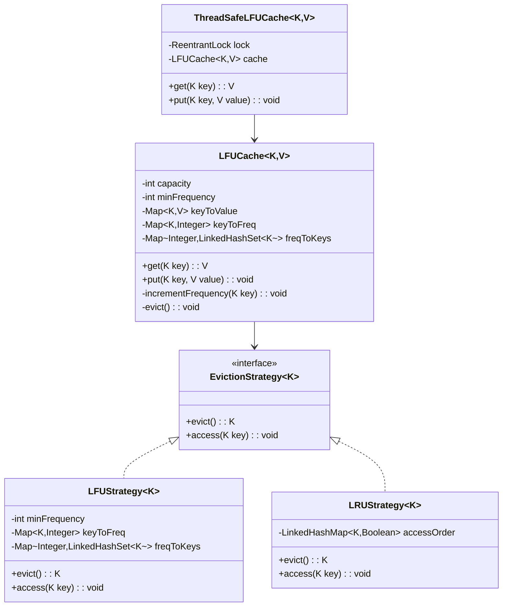

# LFU (Least Frequently Used) Cache - Low-Level Design

## 1. Problem Statement

Design a Least Frequently Used (LFU) Cache that supports **O(1)** `get` and `put` operations. When the cache reaches capacity, evict the least frequently used key. If there's a tie in frequency, evict the **least recently used** key among them.

### Requirements
- `get(key)` → returns value if exists, else -1; increments frequency
- `put(key, value)` → inserts/updates key-value; evicts LFU item if at capacity
- Both operations must be **O(1)** time complexity

---

## 2. UML Class Diagram



---

## 3. Design Patterns

| Pattern | Usage |
|---------|-------|
| **Strategy** | Pluggable eviction policies (LFU, LRU) |
| **Facade** | Simple `get`/`put` API hiding complex internal bookkeeping |

---

## 4. SOLID Principles

| Principle | Application |
|-----------|-------------|
| **SRP** | Cache storage separate from eviction logic |
| **OCP** | New eviction strategies without modifying cache |
| **LSP** | Any EvictionStrategy substitutable |
| **ISP** | Minimal interface: `evict()` + `access()` |
| **DIP** | Cache depends on EvictionStrategy abstraction |

---

## 5. Complete Java Implementation

### Core LFU Cache (O(1) Operations)

```java
import java.util.*;

public class LFUCache<K, V> {
    private final int capacity;
    private int minFrequency;
    private final Map<K, V> keyToValue;
    private final Map<K, Integer> keyToFreq;
    private final Map<Integer, LinkedHashSet<K>> freqToKeys;

    public LFUCache(int capacity) {
        this.capacity = capacity;
        this.minFrequency = 0;
        this.keyToValue = new HashMap<>();
        this.keyToFreq = new HashMap<>();
        this.freqToKeys = new HashMap<>();
    }

    public V get(K key) {
        if (!keyToValue.containsKey(key)) return null;
        incrementFrequency(key);
        return keyToValue.get(key);
    }

    public void put(K key, V value) {
        if (capacity <= 0) return;

        if (keyToValue.containsKey(key)) {
            keyToValue.put(key, value);
            incrementFrequency(key);
            return;
        }

        if (keyToValue.size() >= capacity) {
            evict();
        }

        keyToValue.put(key, value);
        keyToFreq.put(key, 1);
        freqToKeys.computeIfAbsent(1, k -> new LinkedHashSet<>()).add(key);
        minFrequency = 1;
    }

    private void incrementFrequency(K key) {
        int freq = keyToFreq.get(key);
        keyToFreq.put(key, freq + 1);

        // Remove from current frequency bucket
        LinkedHashSet<K> keys = freqToKeys.get(freq);
        keys.remove(key);
        if (keys.isEmpty()) {
            freqToKeys.remove(freq);
            if (minFrequency == freq) {
                minFrequency++;
            }
        }

        // Add to next frequency bucket
        freqToKeys.computeIfAbsent(freq + 1, k -> new LinkedHashSet<>()).add(key);
    }

    private void evict() {
        LinkedHashSet<K> keys = freqToKeys.get(minFrequency);
        K evictKey = keys.iterator().next(); // LRU among LFU
        keys.remove(evictKey);
        if (keys.isEmpty()) {
            freqToKeys.remove(minFrequency);
        }
        keyToValue.remove(evictKey);
        keyToFreq.remove(evictKey);
    }

    public int size() {
        return keyToValue.size();
    }
}
```

### Strategy Pattern - Pluggable Eviction

```java
public interface EvictionStrategy<K> {
    K evict();
    void access(K key);
    void add(K key);
    void remove(K key);
}

public class LFUStrategy<K> implements EvictionStrategy<K> {
    private int minFrequency = 0;
    private final Map<K, Integer> keyToFreq = new HashMap<>();
    private final Map<Integer, LinkedHashSet<K>> freqToKeys = new HashMap<>();

    @Override
    public K evict() {
        LinkedHashSet<K> keys = freqToKeys.get(minFrequency);
        K victim = keys.iterator().next();
        remove(victim);
        return victim;
    }

    @Override
    public void access(K key) {
        int freq = keyToFreq.get(key);
        keyToFreq.put(key, freq + 1);
        freqToKeys.get(freq).remove(key);
        if (freqToKeys.get(freq).isEmpty()) {
            freqToKeys.remove(freq);
            if (minFrequency == freq) minFrequency++;
        }
        freqToKeys.computeIfAbsent(freq + 1, k -> new LinkedHashSet<>()).add(key);
    }

    @Override
    public void add(K key) {
        keyToFreq.put(key, 1);
        freqToKeys.computeIfAbsent(1, k -> new LinkedHashSet<>()).add(key);
        minFrequency = 1;
    }

    @Override
    public void remove(K key) {
        int freq = keyToFreq.remove(key);
        LinkedHashSet<K> keys = freqToKeys.get(freq);
        keys.remove(key);
        if (keys.isEmpty()) freqToKeys.remove(freq);
    }
}
```

### Thread-Safe Version

```java
import java.util.concurrent.locks.ReentrantLock;

public class ThreadSafeLFUCache<K, V> {
    private final LFUCache<K, V> cache;
    private final ReentrantLock lock = new ReentrantLock();

    public ThreadSafeLFUCache(int capacity) {
        this.cache = new LFUCache<>(capacity);
    }

    public V get(K key) {
        lock.lock();
        try {
            return cache.get(key);
        } finally {
            lock.unlock();
        }
    }

    public void put(K key, V value) {
        lock.lock();
        try {
            cache.put(key, value);
        } finally {
            lock.unlock();
        }
    }
}
```

### ConcurrentHashMap-based Version (Higher Concurrency)

```java
import java.util.concurrent.ConcurrentHashMap;
import java.util.concurrent.atomic.AtomicInteger;

public class ConcurrentLFUCache<K, V> {
    private final int capacity;
    private final AtomicInteger minFrequency = new AtomicInteger(0);
    private final ConcurrentHashMap<K, V> keyToValue = new ConcurrentHashMap<>();
    private final ConcurrentHashMap<K, AtomicInteger> keyToFreq = new ConcurrentHashMap<>();
    private final ReentrantLock evictionLock = new ReentrantLock();

    public ConcurrentLFUCache(int capacity) {
        this.capacity = capacity;
    }

    // Note: True O(1) concurrent LFU is complex;
    // production systems often use approximate LFU (e.g., TinyLFU in Caffeine)
}
```

---

## 6. LFU vs LRU Comparison

| Aspect | LFU | LRU |
|--------|-----|-----|
| **Eviction** | Least frequently used | Least recently used |
| **Data Structures** | 3 HashMaps + LinkedHashSets | LinkedHashMap or DLL + HashMap |
| **Space** | O(n) with higher constant | O(n) |
| **Time** | O(1) | O(1) |
| **Best For** | Access patterns with frequency locality | Temporal locality |
| **Weakness** | Cache pollution from old frequent items | Scan pollution |
| **Implementation** | More complex | Simpler |

---

## 7. Time & Space Complexity

| Operation | Time | Space |
|-----------|------|-------|
| `get()` | O(1) | - |
| `put()` | O(1) | - |
| `evict()` | O(1) | - |
| **Total Space** | - | O(capacity) |

### Why O(1)?
- `keyToValue` HashMap → O(1) lookup
- `keyToFreq` HashMap → O(1) frequency lookup
- `freqToKeys` LinkedHashSet → O(1) add/remove + maintains insertion order for LRU tiebreaker
- `minFrequency` variable → O(1) find eviction candidate (only increments by 1 or resets to 1)

---

## 8. Key Interview Points

1. **Three HashMap Trick**: `key→value`, `key→freq`, `freq→LinkedHashSet<key>`
2. **minFrequency invariant**: Only changes in two ways — increments when min bucket empties, resets to 1 on new insert
3. **LinkedHashSet**: Gives O(1) add/remove AND preserves insertion order (LRU within same frequency)
4. **Eviction tie-breaking**: Among same-frequency keys, evict the one accessed least recently (first in LinkedHashSet)
5. **Why not TreeMap for frequencies?** That would be O(log n); tracking minFrequency gives O(1)
6. **Production alternatives**: Caffeine uses Window-TinyLFU (approximate counting with better hit rates)
7. **Thread safety**: Simple lock wrapper for correctness; segment locks or lock-free for performance

### Common Follow-ups
- **Decay/aging**: Periodically halve frequencies to prevent stale popular items
- **Bounded frequency**: Cap max frequency to prevent overflow and aid eviction fairness
- **LeetCode 460**: Direct application of this design
