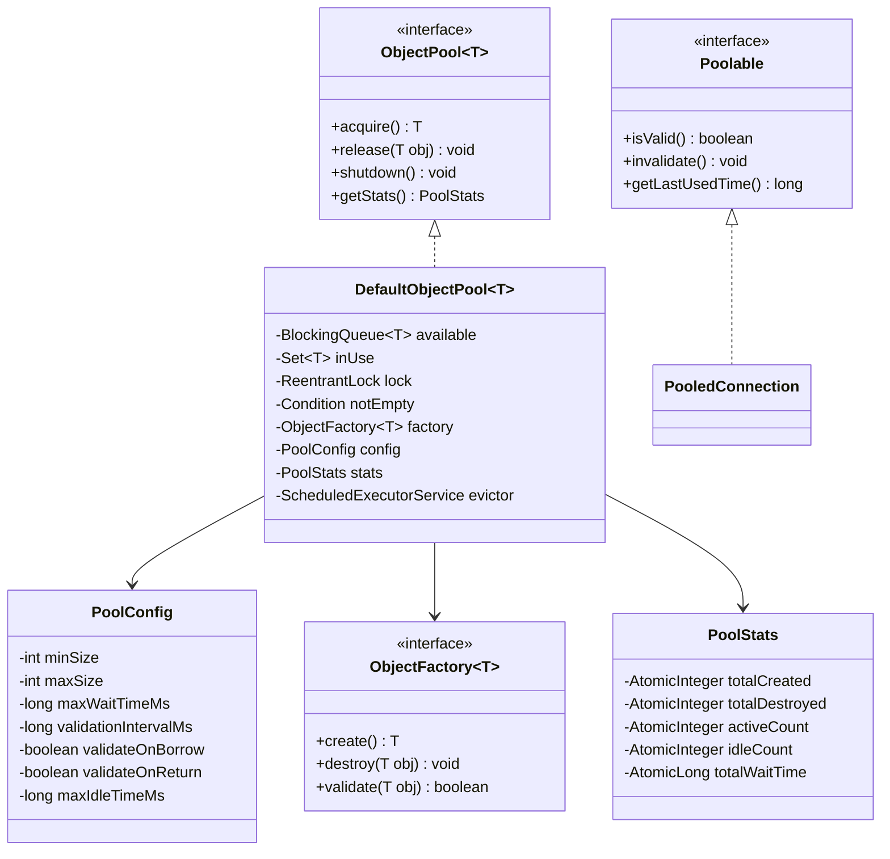

# Object Pool Pattern - Low-Level Design

## 1. Problem Statement
Design a generic, thread-safe Object Pool that manages reusable expensive objects (DB connections, threads, sockets). The pool should handle object creation, validation, eviction, and lifecycle management efficiently.

## 2. UML Class Diagram


## 3. Design Patterns
- **Object Pool (Core)**: Reuse expensive objects instead of creating/destroying repeatedly
- **Factory**: `ObjectFactory<T>` abstracts object creation/destruction
- **Strategy**: Validation and eviction strategies are pluggable

## 4. SOLID Principles
- **SRP**: Pool manages lifecycle; Factory handles creation; Stats tracks metrics
- **OCP**: New object types via new Factory implementations
- **LSP**: Any `Poolable` implementation works with the pool
- **ISP**: Separate interfaces for Pool, Factory, Poolable
- **DIP**: Pool depends on abstractions (ObjectFactory, Poolable)

## 5. Java Implementation

```java
// ==================== Interfaces ====================
public interface Poolable {
    boolean isValid();
    void invalidate();
    long getLastUsedTime();
    void setLastUsedTime(long time);
}

public interface ObjectFactory<T> {
    T create();
    void destroy(T obj);
    boolean validate(T obj);
}

public interface ObjectPool<T> {
    T acquire() throws InterruptedException, TimeoutException;
    void release(T obj);
    void shutdown();
    PoolStats getStats();
}

// ==================== Config ====================
public class PoolConfig {
    private final int minSize;
    private final int maxSize;
    private final long maxWaitTimeMs;
    private final long validationIntervalMs;
    private final boolean validateOnBorrow;
    private final boolean validateOnReturn;
    private final long maxIdleTimeMs;

    private PoolConfig(Builder builder) {
        this.minSize = builder.minSize;
        this.maxSize = builder.maxSize;
        this.maxWaitTimeMs = builder.maxWaitTimeMs;
        this.validationIntervalMs = builder.validationIntervalMs;
        this.validateOnBorrow = builder.validateOnBorrow;
        this.validateOnReturn = builder.validateOnReturn;
        this.maxIdleTimeMs = builder.maxIdleTimeMs;
    }

    // Getters omitted for brevity
    public int getMinSize() { return minSize; }
    public int getMaxSize() { return maxSize; }
    public long getMaxWaitTimeMs() { return maxWaitTimeMs; }
    public long getValidationIntervalMs() { return validationIntervalMs; }
    public boolean isValidateOnBorrow() { return validateOnBorrow; }
    public boolean isValidateOnReturn() { return validateOnReturn; }
    public long getMaxIdleTimeMs() { return maxIdleTimeMs; }

    public static class Builder {
        private int minSize = 2;
        private int maxSize = 10;
        private long maxWaitTimeMs = 5000;
        private long validationIntervalMs = 30000;
        private boolean validateOnBorrow = true;
        private boolean validateOnReturn = false;
        private long maxIdleTimeMs = 60000;

        public Builder minSize(int v) { this.minSize = v; return this; }
        public Builder maxSize(int v) { this.maxSize = v; return this; }
        public Builder maxWaitTimeMs(long v) { this.maxWaitTimeMs = v; return this; }
        public Builder validationIntervalMs(long v) { this.validationIntervalMs = v; return this; }
        public Builder validateOnBorrow(boolean v) { this.validateOnBorrow = v; return this; }
        public Builder validateOnReturn(boolean v) { this.validateOnReturn = v; return this; }
        public Builder maxIdleTimeMs(long v) { this.maxIdleTimeMs = v; return this; }
        public PoolConfig build() { return new PoolConfig(this); }
    }
}

// ==================== Pool Stats ====================
public class PoolStats {
    private final AtomicInteger totalCreated = new AtomicInteger(0);
    private final AtomicInteger totalDestroyed = new AtomicInteger(0);
    private final AtomicInteger activeCount = new AtomicInteger(0);
    private final AtomicInteger idleCount = new AtomicInteger(0);
    private final AtomicLong totalWaitTimeMs = new AtomicLong(0);
    private final AtomicLong acquireCount = new AtomicLong(0);

    public void recordCreation() { totalCreated.incrementAndGet(); }
    public void recordDestruction() { totalDestroyed.incrementAndGet(); }
    public void recordAcquire(long waitMs) {
        activeCount.incrementAndGet();
        idleCount.decrementAndGet();
        totalWaitTimeMs.addAndGet(waitMs);
        acquireCount.incrementAndGet();
    }
    public void recordRelease() { activeCount.decrementAndGet(); idleCount.incrementAndGet(); }
    public double getAvgWaitTimeMs() {
        long count = acquireCount.get();
        return count == 0 ? 0 : (double) totalWaitTimeMs.get() / count;
    }
    public int getActiveCount() { return activeCount.get(); }
    public int getIdleCount() { return idleCount.get(); }
    public int getTotalCreated() { return totalCreated.get(); }
}

// ==================== Default Object Pool ====================
public class DefaultObjectPool<T> implements ObjectPool<T> {
    private final LinkedBlockingDeque<T> available;
    private final Set<T> inUse;
    private final ObjectFactory<T> factory;
    private final PoolConfig config;
    private final PoolStats stats;
    private final ReentrantLock lock = new ReentrantLock(true); // fair lock
    private final Condition notEmpty = lock.newCondition();
    private final ScheduledExecutorService evictor;
    private volatile boolean shutdown = false;
    private final AtomicInteger totalSize = new AtomicInteger(0);

    public DefaultObjectPool(ObjectFactory<T> factory, PoolConfig config) {
        this.factory = factory;
        this.config = config;
        this.available = new LinkedBlockingDeque<>(config.getMaxSize());
        this.inUse = ConcurrentHashMap.newKeySet();
        this.stats = new PoolStats();
        this.evictor = Executors.newSingleThreadScheduledExecutor(r -> {
            Thread t = new Thread(r, "pool-evictor");
            t.setDaemon(true);
            return t;
        });

        initializePool();
        startEvictor();
    }

    private void initializePool() {
        for (int i = 0; i < config.getMinSize(); i++) {
            T obj = createObject();
            if (obj != null) available.offer(obj);
        }
    }

    private T createObject() {
        if (totalSize.get() >= config.getMaxSize()) return null;
        T obj = factory.create();
        totalSize.incrementAndGet();
        stats.recordCreation();
        stats.idleCount.incrementAndGet(); // track idle on creation
        return obj;
    }

    private void destroyObject(T obj) {
        factory.destroy(obj);
        totalSize.decrementAndGet();
        stats.recordDestruction();
    }

    @Override
    public T acquire() throws InterruptedException, TimeoutException {
        if (shutdown) throw new IllegalStateException("Pool is shut down");
        long startTime = System.currentTimeMillis();
        long waitTime = config.getMaxWaitTimeMs();

        lock.lock();
        try {
            while (true) {
                // Try to get from available
                T obj = available.pollFirst();
                if (obj != null) {
                    if (config.isValidateOnBorrow() && !factory.validate(obj)) {
                        destroyObject(obj);
                        stats.idleCount.decrementAndGet();
                        continue; // try next
                    }
                    inUse.add(obj);
                    long elapsed = System.currentTimeMillis() - startTime;
                    stats.recordAcquire(elapsed);
                    return obj;
                }

                // Try to create new object if under max
                if (totalSize.get() < config.getMaxSize()) {
                    T newObj = createObject();
                    if (newObj != null) {
                        inUse.add(newObj);
                        long elapsed = System.currentTimeMillis() - startTime;
                        stats.recordAcquire(elapsed);
                        return newObj;
                    }
                }

                // Wait for release
                long elapsed = System.currentTimeMillis() - startTime;
                long remaining = waitTime - elapsed;
                if (remaining <= 0) {
                    throw new TimeoutException("Timed out waiting for object from pool");
                }
                notEmpty.await(remaining, TimeUnit.MILLISECONDS);

                if (shutdown) throw new IllegalStateException("Pool shut down while waiting");
            }
        } finally {
            lock.unlock();
        }
    }

    @Override
    public void release(T obj) {
        if (obj == null) return;
        lock.lock();
        try {
            if (!inUse.remove(obj)) return; // not from this pool

            if (shutdown) {
                destroyObject(obj);
                return;
            }

            if (config.isValidateOnReturn() && !factory.validate(obj)) {
                destroyObject(obj);
                return;
            }

            if (obj instanceof Poolable) {
                ((Poolable) obj).setLastUsedTime(System.currentTimeMillis());
            }

            stats.recordRelease();
            available.offerLast(obj);
            notEmpty.signal();
        } finally {
            lock.unlock();
        }
    }

    private void startEvictor() {
        evictor.scheduleAtFixedRate(this::evictIdle,
            config.getValidationIntervalMs(),
            config.getValidationIntervalMs(),
            TimeUnit.MILLISECONDS);
    }

    private void evictIdle() {
        lock.lock();
        try {
            Iterator<T> it = available.iterator();
            while (it.hasNext() && totalSize.get() > config.getMinSize()) {
                T obj = it.next();
                boolean shouldEvict = false;
                if (obj instanceof Poolable) {
                    long idle = System.currentTimeMillis() - ((Poolable) obj).getLastUsedTime();
                    shouldEvict = idle > config.getMaxIdleTimeMs();
                } else if (!factory.validate(obj)) {
                    shouldEvict = true;
                }
                if (shouldEvict) {
                    it.remove();
                    stats.idleCount.decrementAndGet();
                    destroyObject(obj);
                }
            }
        } finally {
            lock.unlock();
        }
    }

    @Override
    public void shutdown() {
        lock.lock();
        try {
            shutdown = true;
            evictor.shutdownNow();
            // Destroy all available objects
            T obj;
            while ((obj = available.poll()) != null) {
                destroyObject(obj);
            }
            notEmpty.signalAll();
        } finally {
            lock.unlock();
        }
    }

    @Override
    public PoolStats getStats() { return stats; }
}

// ==================== Use Case: DB Connection Pool ====================
public class PooledConnection implements Poolable {
    private Connection connection;
    private volatile boolean valid = true;
    private volatile long lastUsedTime;

    public PooledConnection(Connection connection) {
        this.connection = connection;
        this.lastUsedTime = System.currentTimeMillis();
    }

    @Override
    public boolean isValid() { return valid && connection != null; }
    @Override
    public void invalidate() { valid = false; }
    @Override
    public long getLastUsedTime() { return lastUsedTime; }
    @Override
    public void setLastUsedTime(long time) { this.lastUsedTime = time; }
    public Connection getConnection() { return connection; }
}

public class ConnectionFactory implements ObjectFactory<PooledConnection> {
    private final String url, user, password;

    public ConnectionFactory(String url, String user, String password) {
        this.url = url; this.user = user; this.password = password;
    }

    @Override
    public PooledConnection create() {
        try {
            Connection conn = DriverManager.getConnection(url, user, password);
            return new PooledConnection(conn);
        } catch (SQLException e) {
            throw new RuntimeException("Failed to create connection", e);
        }
    }

    @Override
    public void destroy(PooledConnection obj) {
        try { obj.getConnection().close(); } catch (SQLException ignored) {}
    }

    @Override
    public boolean validate(PooledConnection obj) {
        try { return obj.isValid() && !obj.getConnection().isClosed(); }
        catch (SQLException e) { return false; }
    }
}

// ==================== Usage ====================
public class Main {
    public static void main(String[] args) throws Exception {
        PoolConfig config = new PoolConfig.Builder()
            .minSize(3).maxSize(10)
            .maxWaitTimeMs(5000)
            .validateOnBorrow(true)
            .maxIdleTimeMs(60000)
            .validationIntervalMs(30000)
            .build();

        ConnectionFactory factory = new ConnectionFactory(
            "jdbc:mysql://localhost:3306/db", "user", "pass");

        ObjectPool<PooledConnection> pool = new DefaultObjectPool<>(factory, config);

        // Acquire and use
        PooledConnection conn = pool.acquire();
        try {
            // use conn.getConnection() for DB operations
        } finally {
            pool.release(conn); // always release back
        }

        System.out.println("Active: " + pool.getStats().getActiveCount());
        System.out.println("Idle: " + pool.getStats().getIdleCount());
        pool.shutdown();
    }
}
```

## 6. Key Interview Points

| Topic | Detail |
|-------|--------|
| **Why Pool?** | Avoid costly creation/destruction (DB conn ~50ms, thread ~1ms) |
| **Thread Safety** | ReentrantLock (fair) + Condition for wait/notify semantics |
| **Validation** | On borrow (safe), on return (fast), background eviction (maintenance) |
| **Starvation** | Fair lock + timeout prevents indefinite blocking |
| **Leak Detection** | Track `inUse` set; alert if object not returned within threshold |
| **Sizing** | min keeps warm pool; max prevents resource exhaustion |
| **LIFO vs FIFO** | LIFO (stack) = better cache locality; FIFO = even usage distribution |
| **Real Examples** | HikariCP, Apache Commons Pool2, C3P0, Tomcat JDBC Pool |
| **Eviction** | Background thread removes idle/invalid objects to free resources |
| **Graceful Shutdown** | Stop new acquires, wait for in-use returns, destroy all |

### Complexity
- **acquire()**: O(1) amortized (poll from queue)
- **release()**: O(1)
- **eviction**: O(n) where n = idle objects, runs periodically in background
