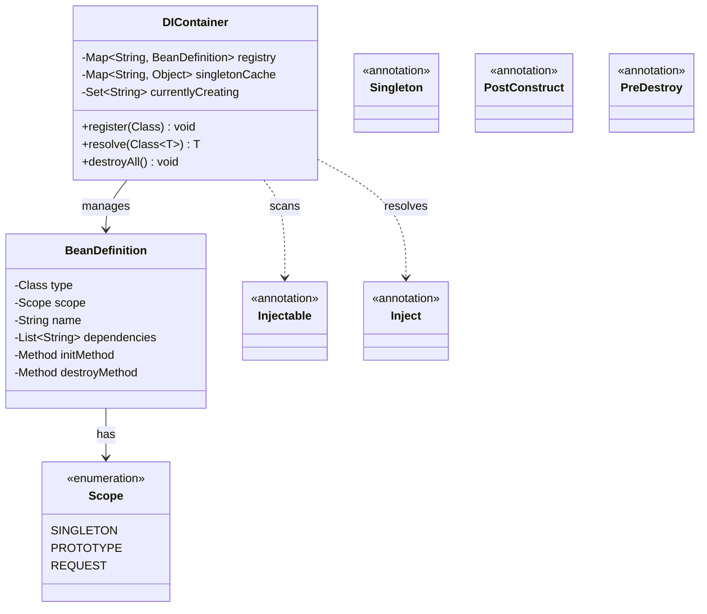

# Low-Level Design: Dependency Injection Container (Spring IoC Style)

## 1. Problem Statement

Design a lightweight DI Container that manages object creation, dependency resolution, and lifecycle management. The container should support constructor/field injection, multiple scopes, circular dependency detection, and lifecycle hooks — similar to Spring IoC.

## 2. UML Class Diagram



## 3. Design Patterns Used

| Pattern | Usage |
|---------|-------|
| **Factory** | Container creates beans dynamically via reflection |
| **Singleton** | Singleton-scoped beans cached and reused |
| **Proxy** | Lazy initialization of beans |
| **Builder** | BeanDefinition construction |
| **Registry** | Central bean registry for lookups |

## 4. SOLID Principles

- **SRP**: BeanDefinition handles metadata; Container handles lifecycle
- **OCP**: New scopes added without modifying core container
- **LSP**: All beans resolved through uniform interface
- **ISP**: Annotations are granular — @Inject, @Singleton separate concerns
- **DIP**: Clients depend on abstractions, container wires implementations

## 5. Complete Java Implementation

```java
import java.lang.annotation.*;
import java.lang.reflect.*;
import java.util.*;
import java.util.concurrent.ConcurrentHashMap;

// ==================== ANNOTATIONS ====================

@Retention(RetentionPolicy.RUNTIME)
@Target(ElementType.TYPE)
public @interface Injectable {
    String name() default "";
}

@Retention(RetentionPolicy.RUNTIME)
@Target({ElementType.FIELD, ElementType.CONSTRUCTOR, ElementType.PARAMETER})
public @interface Inject {
}

@Retention(RetentionPolicy.RUNTIME)
@Target(ElementType.TYPE)
public @interface Singleton {
}

@Retention(RetentionPolicy.RUNTIME)
@Target(ElementType.METHOD)
public @interface PostConstruct {
}

@Retention(RetentionPolicy.RUNTIME)
@Target(ElementType.METHOD)
public @interface PreDestroy {
}

// ==================== SCOPE ENUM ====================

public enum Scope {
    SINGLETON,
    PROTOTYPE,
    REQUEST
}

// ==================== BEAN DEFINITION ====================

public class BeanDefinition {
    private final Class<?> type;
    private final String name;
    private final Scope scope;
    private final List<Class<?>> dependencies;
    private Method initMethod;
    private Method destroyMethod;

    private BeanDefinition(Builder builder) {
        this.type = builder.type;
        this.name = builder.name;
        this.scope = builder.scope;
        this.dependencies = builder.dependencies;
        this.initMethod = builder.initMethod;
        this.destroyMethod = builder.destroyMethod;
    }

    // Getters
    public Class<?> getType() { return type; }
    public String getName() { return name; }
    public Scope getScope() { return scope; }
    public List<Class<?>> getDependencies() { return dependencies; }
    public Method getInitMethod() { return initMethod; }
    public Method getDestroyMethod() { return destroyMethod; }

    // Builder Pattern
    public static class Builder {
        private Class<?> type;
        private String name;
        private Scope scope = Scope.PROTOTYPE;
        private List<Class<?>> dependencies = new ArrayList<>();
        private Method initMethod;
        private Method destroyMethod;

        public Builder type(Class<?> type) { this.type = type; return this; }
        public Builder name(String name) { this.name = name; return this; }
        public Builder scope(Scope scope) { this.scope = scope; return this; }
        public Builder dependencies(List<Class<?>> deps) { this.dependencies = deps; return this; }
        public Builder initMethod(Method m) { this.initMethod = m; return this; }
        public Builder destroyMethod(Method m) { this.destroyMethod = m; return this; }
        public BeanDefinition build() { return new BeanDefinition(this); }
    }
}

// ==================== DI CONTAINER ====================

public class DIContainer {
    private final Map<String, BeanDefinition> registry = new ConcurrentHashMap<>();
    private final Map<String, Object> singletonCache = new ConcurrentHashMap<>();
    private final Set<String> currentlyCreating = new HashSet<>();
    private final Map<String, Object> requestScope = new ThreadLocal<Map<String, Object>>() {
        @Override protected Map<String, Object> initialValue() { return new HashMap<>(); }
    }.get();

    // ---- Registration ----

    public void register(Class<?>... classes) {
        for (Class<?> clazz : classes) {
            BeanDefinition def = createBeanDefinition(clazz);
            registry.put(def.getName(), def);
        }
    }

    private BeanDefinition createBeanDefinition(Class<?> clazz) {
        String name = resolveName(clazz);
        Scope scope = resolveScope(clazz);
        List<Class<?>> deps = resolveDependencies(clazz);
        Method initMethod = findAnnotatedMethod(clazz, PostConstruct.class);
        Method destroyMethod = findAnnotatedMethod(clazz, PreDestroy.class);

        return new BeanDefinition.Builder()
                .type(clazz)
                .name(name)
                .scope(scope)
                .dependencies(deps)
                .initMethod(initMethod)
                .destroyMethod(destroyMethod)
                .build();
    }

    private String resolveName(Class<?> clazz) {
        Injectable injectable = clazz.getAnnotation(Injectable.class);
        if (injectable != null && !injectable.name().isEmpty()) {
            return injectable.name();
        }
        String simpleName = clazz.getSimpleName();
        return Character.toLowerCase(simpleName.charAt(0)) + simpleName.substring(1);
    }

    private Scope resolveScope(Class<?> clazz) {
        if (clazz.isAnnotationPresent(Singleton.class)) return Scope.SINGLETON;
        return Scope.PROTOTYPE;
    }

    private List<Class<?>> resolveDependencies(Class<?> clazz) {
        List<Class<?>> deps = new ArrayList<>();
        // Constructor dependencies
        for (Constructor<?> ctor : clazz.getDeclaredConstructors()) {
            if (ctor.isAnnotationPresent(Inject.class)) {
                deps.addAll(Arrays.asList(ctor.getParameterTypes()));
                break;
            }
        }
        // Field dependencies
        for (Field field : clazz.getDeclaredFields()) {
            if (field.isAnnotationPresent(Inject.class)) {
                deps.add(field.getType());
            }
        }
        return deps;
    }

    private Method findAnnotatedMethod(Class<?> clazz, Class<? extends Annotation> ann) {
        for (Method method : clazz.getDeclaredMethods()) {
            if (method.isAnnotationPresent(ann)) return method;
        }
        return null;
    }

    // ---- Resolution ----

    @SuppressWarnings("unchecked")
    public <T> T resolve(Class<T> clazz) {
        String name = resolveName(clazz);
        return (T) resolve(name);
    }

    public Object resolve(String name) {
        BeanDefinition def = registry.get(name);
        if (def == null) {
            throw new RuntimeException("No bean registered with name: " + name);
        }

        switch (def.getScope()) {
            case SINGLETON:
                return getOrCreateSingleton(name, def);
            case REQUEST:
                return getOrCreateRequestScoped(name, def);
            case PROTOTYPE:
            default:
                return createBean(def);
        }
    }

    private Object getOrCreateSingleton(String name, BeanDefinition def) {
        if (singletonCache.containsKey(name)) {
            return singletonCache.get(name);
        }
        Object bean = createBean(def);
        singletonCache.put(name, bean);
        return bean;
    }

    private Object getOrCreateRequestScoped(String name, BeanDefinition def) {
        if (requestScope.containsKey(name)) {
            return requestScope.get(name);
        }
        Object bean = createBean(def);
        requestScope.put(name, bean);
        return bean;
    }

    // ---- Bean Creation with Circular Dependency Detection ----

    private Object createBean(BeanDefinition def) {
        String name = def.getName();

        // Circular dependency detection
        if (currentlyCreating.contains(name)) {
            throw new RuntimeException("Circular dependency detected for bean: " + name);
        }

        currentlyCreating.add(name);
        try {
            Object instance = instantiate(def);
            injectFields(instance);
            invokeLifecycleMethod(instance, def.getInitMethod());
            return instance;
        } finally {
            currentlyCreating.remove(name);
        }
    }

    // ---- Constructor Injection ----

    private Object instantiate(BeanDefinition def) {
        Class<?> clazz = def.getType();
        try {
            // Look for @Inject constructor
            for (Constructor<?> ctor : clazz.getDeclaredConstructors()) {
                if (ctor.isAnnotationPresent(Inject.class)) {
                    Class<?>[] paramTypes = ctor.getParameterTypes();
                    Object[] args = new Object[paramTypes.length];
                    for (int i = 0; i < paramTypes.length; i++) {
                        args[i] = resolve(paramTypes[i]);
                    }
                    ctor.setAccessible(true);
                    return ctor.newInstance(args);
                }
            }
            // Default no-arg constructor
            Constructor<?> defaultCtor = clazz.getDeclaredConstructor();
            defaultCtor.setAccessible(true);
            return defaultCtor.newInstance();
        } catch (Exception e) {
            throw new RuntimeException("Failed to instantiate: " + clazz.getName(), e);
        }
    }

    // ---- Field Injection ----

    private void injectFields(Object instance) {
        Class<?> clazz = instance.getClass();
        for (Field field : clazz.getDeclaredFields()) {
            if (field.isAnnotationPresent(Inject.class)) {
                try {
                    field.setAccessible(true);
                    Object dependency = resolve(field.getType());
                    field.set(instance, dependency);
                } catch (Exception e) {
                    throw new RuntimeException("Failed to inject field: " + field.getName(), e);
                }
            }
        }
    }

    // ---- Lifecycle Management ----

    private void invokeLifecycleMethod(Object instance, Method method) {
        if (method != null) {
            try {
                method.setAccessible(true);
                method.invoke(instance);
            } catch (Exception e) {
                throw new RuntimeException("Lifecycle method failed", e);
            }
        }
    }

    public void destroyAll() {
        for (Map.Entry<String, Object> entry : singletonCache.entrySet()) {
            BeanDefinition def = registry.get(entry.getKey());
            if (def != null && def.getDestroyMethod() != null) {
                invokeLifecycleMethod(entry.getValue(), def.getDestroyMethod());
            }
        }
        singletonCache.clear();
    }
}

// ==================== EXAMPLE USAGE ====================

// Service interfaces
public interface MessageService {
    String getMessage();
}

public interface NotificationService {
    void notify(String msg);
}

// Implementations
@Injectable
@Singleton
public class EmailService implements MessageService {
    @PostConstruct
    public void init() { System.out.println("EmailService initialized"); }

    @PreDestroy
    public void cleanup() { System.out.println("EmailService destroyed"); }

    @Override
    public String getMessage() { return "Email sent"; }
}

@Injectable
public class SMSNotificationService implements NotificationService {
    @Inject
    private MessageService messageService;

    @Override
    public void notify(String msg) {
        System.out.println("SMS: " + msg + " via " + messageService.getMessage());
    }
}

@Injectable
public class OrderService {
    private final NotificationService notificationService;

    @Inject
    public OrderService(NotificationService notificationService) {
        this.notificationService = notificationService;
    }

    public void placeOrder(String item) {
        System.out.println("Order placed: " + item);
        notificationService.notify("Order confirmed: " + item);
    }
}

// Main
public class Application {
    public static void main(String[] args) {
        DIContainer container = new DIContainer();

        // Register beans
        container.register(EmailService.class, SMSNotificationService.class, OrderService.class);

        // Resolve and use
        OrderService orderService = container.resolve(OrderService.class);
        orderService.placeOrder("Laptop");

        // Cleanup
        container.destroyAll();
    }
}
```

## 6. Key Interview Points

| Topic | Key Points |
|-------|-----------|
| **Reflection** | `getDeclaredConstructors()`, `getDeclaredFields()`, `setAccessible(true)` for private access |
| **Generics** | `resolve(Class<T>)` returns typed instance avoiding casts at call site |
| **Circular Deps** | Track `currentlyCreating` set; throw if bean re-entered during creation |
| **Scope** | Singleton = cached; Prototype = new each time; Request = ThreadLocal per request |
| **Lifecycle** | `@PostConstruct` after injection, `@PreDestroy` before container shutdown |
| **Thread Safety** | ConcurrentHashMap for registry/cache; ThreadLocal for request scope |
| **Constructor vs Field** | Constructor injection preferred (immutability, testability); field injection simpler |
| **Spring Comparison** | Real Spring adds BeanPostProcessor, AOP proxies, @Qualifier, profiles, lazy init |

### Common Follow-ups

1. **How to handle interface-to-impl mapping?** — Add `register(Interface.class, Impl.class)` overload with a `typeMapping` map.
2. **Lazy initialization?** — Return a JDK Proxy that delegates to container on first method call.
3. **Conditional beans?** — Add `@ConditionalOn` annotation checked during registration.
4. **How Spring detects circular deps?** — Three-level cache: singletonObjects, earlySingletonObjects, singletonFactories.
