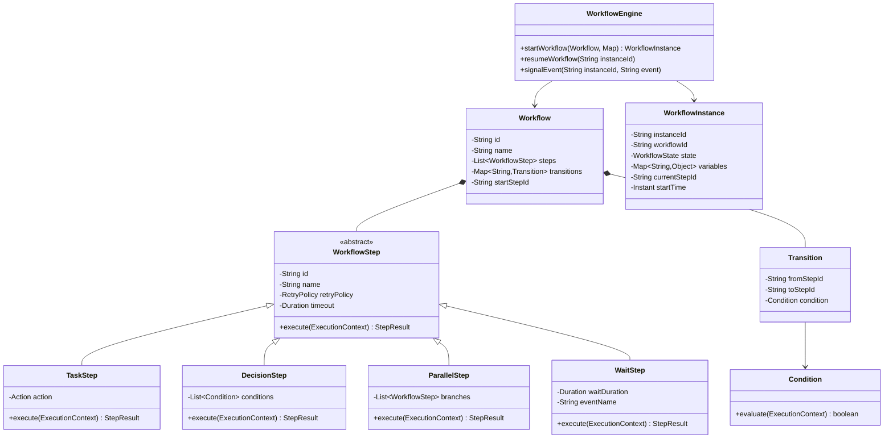

# Workflow Engine - Low-Level Design

## 1. Problem Statement
Design a workflow engine that can define, execute, and manage multi-step workflows with branching, parallel execution, retries, and state persistence.

## 2. UML Class Diagram



## 3. Design Patterns
- **State**: WorkflowInstance transitions between states (RUNNING, WAITING, COMPLETED, FAILED)
- **Strategy**: Different step types encapsulate execution strategies
- **Chain of Responsibility**: Steps form a chain with transitions
- **Observer**: Listeners notified on step/workflow completion
- **Command**: Each step action is an encapsulated command

## 4. SOLID Principles
- **SRP**: Each step type handles one concern
- **OCP**: New step types added without modifying engine
- **LSP**: All steps substitutable via WorkflowStep interface
- **ISP**: Separate interfaces for execution, persistence, observation
- **DIP**: Engine depends on abstractions (WorkflowStep, Persistence)

## 5. Complete Java Implementation

```java
// ==================== Enums ====================
enum WorkflowState {
    CREATED, RUNNING, WAITING, COMPLETED, FAILED, CANCELLED
}

enum StepStatus {
    PENDING, RUNNING, COMPLETED, FAILED, SKIPPED, WAITING
}

// ==================== Core Models ====================
@Data
class ExecutionContext {
    private final String instanceId;
    private final Map<String, Object> variables;
    private final Map<String, Object> stepOutputs;

    public void setVariable(String key, Object value) { variables.put(key, value); }
    public Object getVariable(String key) { return variables.get(key); }
    public void setStepOutput(String stepId, Object output) { stepOutputs.put(stepId, output); }
}

@Data @Builder
class StepResult {
    private StepStatus status;
    private Object output;
    private String nextStepId; // for decision steps
    private String errorMessage;

    public static StepResult success(Object output) {
        return StepResult.builder().status(StepStatus.COMPLETED).output(output).build();
    }
    public static StepResult failed(String error) {
        return StepResult.builder().status(StepStatus.FAILED).errorMessage(error).build();
    }
    public static StepResult waiting() {
        return StepResult.builder().status(StepStatus.WAITING).build();
    }
    public static StepResult branch(String nextStepId) {
        return StepResult.builder().status(StepStatus.COMPLETED).nextStepId(nextStepId).build();
    }
}

@Data @Builder
class RetryPolicy {
    private int maxRetries;
    private Duration initialDelay;
    private double backoffMultiplier;

    public static RetryPolicy none() { return RetryPolicy.builder().maxRetries(0).build(); }
    public static RetryPolicy fixed(int retries, Duration delay) {
        return RetryPolicy.builder().maxRetries(retries).initialDelay(delay).backoffMultiplier(1.0).build();
    }
    public static RetryPolicy exponential(int retries, Duration initial, double multiplier) {
        return RetryPolicy.builder().maxRetries(retries).initialDelay(initial).backoffMultiplier(multiplier).build();
    }
}

@Data @Builder
class Transition {
    private String fromStepId;
    private String toStepId;
    private Condition condition;
}

// ==================== Condition Interface ====================
@FunctionalInterface
interface Condition {
    boolean evaluate(ExecutionContext context);
}

class ExpressionCondition implements Condition {
    private final String variableName;
    private final String operator;
    private final Object expectedValue;

    public ExpressionCondition(String variableName, String operator, Object expectedValue) {
        this.variableName = variableName;
        this.operator = operator;
        this.expectedValue = expectedValue;
    }

    @Override
    public boolean evaluate(ExecutionContext context) {
        Object actual = context.getVariable(variableName);
        return switch (operator) {
            case "==" -> Objects.equals(actual, expectedValue);
            case "!=" -> !Objects.equals(actual, expectedValue);
            case ">" -> ((Comparable) actual).compareTo(expectedValue) > 0;
            case "<" -> ((Comparable) actual).compareTo(expectedValue) < 0;
            default -> false;
        };
    }
}

class CompositeCondition implements Condition {
    enum Logic { AND, OR }
    private final List<Condition> conditions;
    private final Logic logic;

    public CompositeCondition(Logic logic, Condition... conditions) {
        this.logic = logic;
        this.conditions = List.of(conditions);
    }

    @Override
    public boolean evaluate(ExecutionContext context) {
        return logic == Logic.AND
            ? conditions.stream().allMatch(c -> c.evaluate(context))
            : conditions.stream().anyMatch(c -> c.evaluate(context));
    }
}

// ==================== Action Interface (Command Pattern) ====================
@FunctionalInterface
interface Action {
    Object execute(ExecutionContext context) throws Exception;
}

// ==================== Step Types (Strategy Pattern) ====================
@Data
abstract class WorkflowStep {
    protected String id;
    protected String name;
    protected RetryPolicy retryPolicy = RetryPolicy.none();
    protected Duration timeout = Duration.ofMinutes(5);

    public abstract StepResult execute(ExecutionContext context);
}

class TaskStep extends WorkflowStep {
    private final Action action;

    public TaskStep(String id, String name, Action action) {
        this.id = id; this.name = name; this.action = action;
    }

    @Override
    public StepResult execute(ExecutionContext context) {
        try {
            Object result = action.execute(context);
            return StepResult.success(result);
        } catch (Exception e) {
            return StepResult.failed(e.getMessage());
        }
    }
}

class DecisionStep extends WorkflowStep {
    private final List<Map.Entry<Condition, String>> branches; // condition -> targetStepId

    public DecisionStep(String id, String name, List<Map.Entry<Condition, String>> branches) {
        this.id = id; this.name = name; this.branches = branches;
    }

    @Override
    public StepResult execute(ExecutionContext context) {
        for (var branch : branches) {
            if (branch.getKey().evaluate(context)) {
                return StepResult.branch(branch.getValue());
            }
        }
        return StepResult.failed("No matching condition in decision step: " + id);
    }
}

class ParallelStep extends WorkflowStep {
    private final List<WorkflowStep> branches;
    private final ExecutorService executor;

    public ParallelStep(String id, String name, List<WorkflowStep> branches) {
        this.id = id; this.name = name; this.branches = branches;
        this.executor = Executors.newFixedThreadPool(branches.size());
    }

    @Override
    public StepResult execute(ExecutionContext context) {
        List<Future<StepResult>> futures = branches.stream()
            .map(step -> executor.submit(() -> step.execute(context)))
            .toList();

        Map<String, Object> results = new HashMap<>();
        for (int i = 0; i < futures.size(); i++) {
            try {
                StepResult result = futures.get(i).get(timeout.toMillis(), TimeUnit.MILLISECONDS);
                if (result.getStatus() == StepStatus.FAILED) {
                    return StepResult.failed("Parallel branch failed: " + branches.get(i).getId());
                }
                results.put(branches.get(i).getId(), result.getOutput());
            } catch (TimeoutException e) {
                return StepResult.failed("Parallel branch timed out: " + branches.get(i).getId());
            } catch (Exception e) {
                return StepResult.failed("Parallel execution error: " + e.getMessage());
            }
        }
        return StepResult.success(results);
    }
}

class WaitStep extends WorkflowStep {
    private final Duration waitDuration;
    private final String eventName; // null if time-based wait

    public WaitStep(String id, String name, Duration waitDuration, String eventName) {
        this.id = id; this.name = name;
        this.waitDuration = waitDuration; this.eventName = eventName;
    }

    @Override
    public StepResult execute(ExecutionContext context) {
        // Engine handles actual waiting; step signals it needs to wait
        return StepResult.waiting();
    }

    public String getEventName() { return eventName; }
    public Duration getWaitDuration() { return waitDuration; }
}

// ==================== Workflow Definition (Builder DSL) ====================
@Data
class Workflow {
    private String id;
    private String name;
    private Map<String, WorkflowStep> steps = new LinkedHashMap<>();
    private List<Transition> transitions = new ArrayList<>();
    private String startStepId;
}

class WorkflowBuilder {
    private final Workflow workflow = new Workflow();

    public WorkflowBuilder(String id, String name) {
        workflow.setId(id); workflow.setName(name);
    }

    public WorkflowBuilder startWith(WorkflowStep step) {
        workflow.setStartStepId(step.getId());
        workflow.getSteps().put(step.getId(), step);
        return this;
    }

    public WorkflowBuilder addStep(WorkflowStep step) {
        workflow.getSteps().put(step.getId(), step);
        return this;
    }

    public WorkflowBuilder transition(String from, String to) {
        workflow.getTransitions().add(Transition.builder().fromStepId(from).toStepId(to).build());
        return this;
    }

    public WorkflowBuilder conditionalTransition(String from, String to, Condition condition) {
        workflow.getTransitions().add(
            Transition.builder().fromStepId(from).toStepId(to).condition(condition).build());
        return this;
    }

    public Workflow build() { return workflow; }
}

// ==================== Workflow Instance (State Pattern) ====================
@Data
class WorkflowInstance {
    private String instanceId;
    private String workflowId;
    private WorkflowState state;
    private Map<String, Object> variables;
    private String currentStepId;
    private Map<String, StepStatus> stepStatuses = new HashMap<>();
    private Instant startTime;
    private Instant endTime;
    private int currentRetryCount;
    private List<String> executionLog = new ArrayList<>();
}

// ==================== Observer Pattern ====================
interface WorkflowEventListener {
    void onWorkflowStarted(WorkflowInstance instance);
    void onStepCompleted(WorkflowInstance instance, String stepId, StepResult result);
    void onStepFailed(WorkflowInstance instance, String stepId, StepResult result);
    void onWorkflowCompleted(WorkflowInstance instance);
    void onWorkflowFailed(WorkflowInstance instance, String reason);
}

class WorkflowEventPublisher {
    private final List<WorkflowEventListener> listeners = new CopyOnWriteArrayList<>();

    public void addListener(WorkflowEventListener listener) { listeners.add(listener); }
    public void removeListener(WorkflowEventListener listener) { listeners.remove(listener); }

    public void fireWorkflowStarted(WorkflowInstance inst) {
        listeners.forEach(l -> l.onWorkflowStarted(inst));
    }
    public void fireStepCompleted(WorkflowInstance inst, String stepId, StepResult result) {
        listeners.forEach(l -> l.onStepCompleted(inst, stepId, result));
    }
    public void fireStepFailed(WorkflowInstance inst, String stepId, StepResult result) {
        listeners.forEach(l -> l.onStepFailed(inst, stepId, result));
    }
    public void fireWorkflowCompleted(WorkflowInstance inst) {
        listeners.forEach(l -> l.onWorkflowCompleted(inst));
    }
    public void fireWorkflowFailed(WorkflowInstance inst, String reason) {
        listeners.forEach(l -> l.onWorkflowFailed(inst, reason));
    }
}

// ==================== Persistence Interface ====================
interface WorkflowPersistence {
    void saveInstance(WorkflowInstance instance);
    WorkflowInstance loadInstance(String instanceId);
    List<WorkflowInstance> findByState(WorkflowState state);
    void saveWorkflow(Workflow workflow);
    Workflow loadWorkflow(String workflowId);
}

class InMemoryWorkflowPersistence implements WorkflowPersistence {
    private final Map<String, WorkflowInstance> instances = new ConcurrentHashMap<>();
    private final Map<String, Workflow> workflows = new ConcurrentHashMap<>();

    public void saveInstance(WorkflowInstance instance) { instances.put(instance.getInstanceId(), instance); }
    public WorkflowInstance loadInstance(String id) { return instances.get(id); }
    public List<WorkflowInstance> findByState(WorkflowState state) {
        return instances.values().stream().filter(i -> i.getState() == state).toList();
    }
    public void saveWorkflow(Workflow wf) { workflows.put(wf.getId(), wf); }
    public Workflow loadWorkflow(String id) { return workflows.get(id); }
}

// ==================== Workflow Engine ====================
class WorkflowEngine {
    private final WorkflowPersistence persistence;
    private final WorkflowEventPublisher eventPublisher;
    private final ScheduledExecutorService scheduler;
    private final Map<String, CompletableFuture<Void>> waitingInstances = new ConcurrentHashMap<>();

    public WorkflowEngine(WorkflowPersistence persistence) {
        this.persistence = persistence;
        this.eventPublisher = new WorkflowEventPublisher();
        this.scheduler = Executors.newScheduledThreadPool(4);
    }

    public void addListener(WorkflowEventListener listener) { eventPublisher.addListener(listener); }

    public WorkflowInstance startWorkflow(String workflowId, Map<String, Object> input) {
        Workflow workflow = persistence.loadWorkflow(workflowId);
        WorkflowInstance instance = new WorkflowInstance();
        instance.setInstanceId(UUID.randomUUID().toString());
        instance.setWorkflowId(workflowId);
        instance.setState(WorkflowState.RUNNING);
        instance.setVariables(new HashMap<>(input));
        instance.setCurrentStepId(workflow.getStartStepId());
        instance.setStartTime(Instant.now());

        persistence.saveInstance(instance);
        eventPublisher.fireWorkflowStarted(instance);
        executeStep(instance, workflow);
        return instance;
    }

    private void executeStep(WorkflowInstance instance, Workflow workflow) {
        String stepId = instance.getCurrentStepId();
        if (stepId == null) {
            completeWorkflow(instance);
            return;
        }

        WorkflowStep step = workflow.getSteps().get(stepId);
        instance.getStepStatuses().put(stepId, StepStatus.RUNNING);
        instance.getExecutionLog().add("Executing step: " + stepId);

        // Timeout handling
        ScheduledFuture<?> timeoutFuture = scheduler.schedule(() -> {
            instance.setState(WorkflowState.FAILED);
            instance.getExecutionLog().add("Step timed out: " + stepId);
            eventPublisher.fireWorkflowFailed(instance, "Timeout at step: " + stepId);
            persistence.saveInstance(instance);
        }, step.getTimeout().toMillis(), TimeUnit.MILLISECONDS);

        ExecutionContext context = new ExecutionContext(
            instance.getInstanceId(), instance.getVariables(), new HashMap<>());
        StepResult result = step.execute(context);
        timeoutFuture.cancel(false);

        handleStepResult(instance, workflow, step, result, context);
    }

    private void handleStepResult(WorkflowInstance instance, Workflow workflow,
                                   WorkflowStep step, StepResult result, ExecutionContext context) {
        switch (result.getStatus()) {
            case COMPLETED -> {
                instance.getStepStatuses().put(step.getId(), StepStatus.COMPLETED);
                instance.setVariables(context.getVariables());
                context.setStepOutput(step.getId(), result.getOutput());
                eventPublisher.fireStepCompleted(instance, step.getId(), result);

                String nextStepId = result.getNextStepId() != null
                    ? result.getNextStepId()
                    : resolveNextStep(workflow, step.getId(), context);
                instance.setCurrentStepId(nextStepId);
                instance.setCurrentRetryCount(0);
                persistence.saveInstance(instance);
                executeStep(instance, workflow);
            }
            case FAILED -> {
                if (instance.getCurrentRetryCount() < step.getRetryPolicy().getMaxRetries()) {
                    instance.setCurrentRetryCount(instance.getCurrentRetryCount() + 1);
                    long delay = calculateRetryDelay(step.getRetryPolicy(), instance.getCurrentRetryCount());
                    instance.getExecutionLog().add("Retrying step " + step.getId()
                        + " attempt " + instance.getCurrentRetryCount());
                    scheduler.schedule(() -> executeStep(instance, workflow), delay, TimeUnit.MILLISECONDS);
                } else {
                    instance.getStepStatuses().put(step.getId(), StepStatus.FAILED);
                    instance.setState(WorkflowState.FAILED);
                    eventPublisher.fireStepFailed(instance, step.getId(), result);
                    eventPublisher.fireWorkflowFailed(instance, result.getErrorMessage());
                    persistence.saveInstance(instance);
                }
            }
            case WAITING -> {
                instance.setState(WorkflowState.WAITING);
                instance.getStepStatuses().put(step.getId(), StepStatus.WAITING);
                persistence.saveInstance(instance);

                if (step instanceof WaitStep waitStep && waitStep.getWaitDuration() != null) {
                    scheduler.schedule(() -> resumeWorkflow(instance.getInstanceId()),
                        waitStep.getWaitDuration().toMillis(), TimeUnit.MILLISECONDS);
                }
            }
            default -> {}
        }
    }

    private long calculateRetryDelay(RetryPolicy policy, int attempt) {
        return (long) (policy.getInitialDelay().toMillis() * Math.pow(policy.getBackoffMultiplier(), attempt - 1));
    }

    private String resolveNextStep(Workflow workflow, String currentStepId, ExecutionContext context) {
        return workflow.getTransitions().stream()
            .filter(t -> t.getFromStepId().equals(currentStepId))
            .filter(t -> t.getCondition() == null || t.getCondition().evaluate(context))
            .findFirst()
            .map(Transition::getToStepId)
            .orElse(null);
    }

    public void resumeWorkflow(String instanceId) {
        WorkflowInstance instance = persistence.loadInstance(instanceId);
        Workflow workflow = persistence.loadWorkflow(instance.getWorkflowId());
        instance.setState(WorkflowState.RUNNING);

        String nextStepId = resolveNextStep(workflow, instance.getCurrentStepId(),
            new ExecutionContext(instanceId, instance.getVariables(), new HashMap<>()));
        instance.setCurrentStepId(nextStepId);
        persistence.saveInstance(instance);
        executeStep(instance, workflow);
    }

    public void signalEvent(String instanceId, String eventName, Map<String, Object> payload) {
        WorkflowInstance instance = persistence.loadInstance(instanceId);
        if (instance.getState() == WorkflowState.WAITING) {
            instance.getVariables().putAll(payload);
            resumeWorkflow(instanceId);
        }
    }

    private void completeWorkflow(WorkflowInstance instance) {
        instance.setState(WorkflowState.COMPLETED);
        instance.setEndTime(Instant.now());
        persistence.saveInstance(instance);
        eventPublisher.fireWorkflowCompleted(instance);
    }
}

// ==================== Logging Listener ====================
class LoggingWorkflowListener implements WorkflowEventListener {
    public void onWorkflowStarted(WorkflowInstance i) {
        System.out.println("[WORKFLOW STARTED] " + i.getInstanceId());
    }
    public void onStepCompleted(WorkflowInstance i, String stepId, StepResult r) {
        System.out.println("[STEP COMPLETED] " + stepId + " in " + i.getInstanceId());
    }
    public void onStepFailed(WorkflowInstance i, String stepId, StepResult r) {
        System.out.println("[STEP FAILED] " + stepId + ": " + r.getErrorMessage());
    }
    public void onWorkflowCompleted(WorkflowInstance i) {
        System.out.println("[WORKFLOW COMPLETED] " + i.getInstanceId());
    }
    public void onWorkflowFailed(WorkflowInstance i, String reason) {
        System.out.println("[WORKFLOW FAILED] " + i.getInstanceId() + ": " + reason);
    }
}
```

## 6. Use Cases

### Approval Workflow
```java
Workflow approvalWorkflow = new WorkflowBuilder("approval-wf", "Document Approval")
    .startWith(new TaskStep("submit", "Submit Document", ctx -> {
        ctx.setVariable("status", "submitted");
        return "Document submitted";
    }))
    .addStep(new TaskStep("review", "Manager Review", ctx -> {
        // simulate review
        ctx.setVariable("approved", true);
        return "Reviewed";
    }))
    .addStep(new DecisionStep("check-approval", "Check Approval", List.of(
        Map.entry(ctx -> Boolean.TRUE.equals(ctx.getVariable("approved")), "finalize"),
        Map.entry(ctx -> !Boolean.TRUE.equals(ctx.getVariable("approved")), "reject")
    )))
    .addStep(new TaskStep("finalize", "Finalize", ctx -> "Approved and finalized"))
    .addStep(new TaskStep("reject", "Reject", ctx -> "Rejected"))
    .transition("submit", "review")
    .transition("review", "check-approval")
    .build();
```

### Order Processing
```java
Workflow orderWorkflow = new WorkflowBuilder("order-wf", "Order Processing")
    .startWith(new TaskStep("validate", "Validate Order", ctx -> {
        ctx.setVariable("valid", true);
        return "Order validated";
    }))
    .addStep(new ParallelStep("parallel-checks", "Payment & Inventory", List.of(
        new TaskStep("payment", "Process Payment", ctx -> "Payment OK"),
        new TaskStep("inventory", "Reserve Inventory", ctx -> "Inventory reserved")
    )))
    .addStep(new TaskStep("ship", "Ship Order", ctx -> "Shipped"))
    .addStep(new WaitStep("wait-delivery", "Wait for Delivery", Duration.ofDays(3), "delivery_confirmed"))
    .addStep(new TaskStep("complete", "Complete Order", ctx -> "Order completed"))
    .transition("validate", "parallel-checks")
    .transition("parallel-checks", "ship")
    .transition("ship", "wait-delivery")
    .transition("wait-delivery", "complete")
    .build();

// Execute
WorkflowPersistence persistence = new InMemoryWorkflowPersistence();
persistence.saveWorkflow(orderWorkflow);
WorkflowEngine engine = new WorkflowEngine(persistence);
engine.addListener(new LoggingWorkflowListener());
WorkflowInstance instance = engine.startWorkflow("order-wf", Map.of("orderId", "ORD-123"));
```

## 7. Key Interview Points

| Topic | Key Insight |
|-------|-------------|
| **State Pattern** | WorkflowInstance state drives allowed transitions and behavior |
| **Strategy** | Step types encapsulate different execution strategies |
| **Persistence** | Workflow state persisted for crash recovery and long-running workflows |
| **Retry** | Exponential backoff per step with configurable policy |
| **Parallel Execution** | ParallelStep uses thread pool with timeout per branch |
| **Event-driven Wait** | WaitStep suspends execution; `signalEvent` resumes it |
| **Timeout** | ScheduledExecutor enforces step-level timeouts |
| **Observer** | Decouples monitoring/logging from execution logic |
| **Builder DSL** | Fluent API for readable workflow definition |
| **Scalability** | Persistence interface allows DB-backed distributed execution |
| **Idempotency** | Step outputs stored to avoid re-execution on resume |
| **Versioning** | Workflow definitions versioned; instances bound to version at start |
