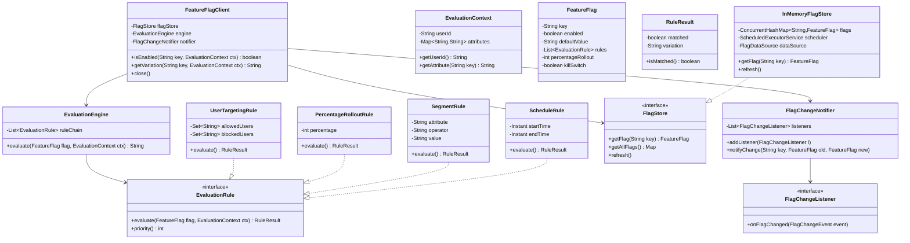

# Feature Flag SDK - Low-Level Design

## 1. Problem Statement

Design a Feature Flag SDK that allows applications to toggle features dynamically without deployments. The SDK should support user targeting, percentage rollouts, segment rules, scheduled releases, and real-time flag updates with local caching.

## 2. UML Class Diagram



## 3. Design Patterns

| Pattern | Usage |
|---------|-------|
| **Strategy** | Each `EvaluationRule` is a strategy for evaluating flag conditions |
| **Chain of Responsibility** | Rules evaluated in priority order; first match wins |
| **Observer** | `FlagChangeNotifier` notifies listeners on flag updates |
| **Proxy** | `FeatureFlagClient` proxies access to flag store with caching |
| **Factory** | `RuleFactory` creates rule instances from configuration |

## 4. SOLID Principles

- **SRP**: Each rule handles one evaluation concern
- **OCP**: New rules added without modifying engine
- **LSP**: All rules substitutable via `EvaluationRule` interface
- **ISP**: `FlagStore` interface is minimal and focused
- **DIP**: Client depends on abstractions (`FlagStore`, `EvaluationRule`)

## 5. Java Implementation

```java
// === Models ===
public class EvaluationContext {
    private final String userId;
    private final Map<String, String> attributes;

    public EvaluationContext(String userId, Map<String, String> attributes) {
        this.userId = userId;
        this.attributes = Collections.unmodifiableMap(attributes);
    }

    public String getUserId() { return userId; }
    public String getAttribute(String key) { return attributes.get(key); }
    public Map<String, String> getAttributes() { return attributes; }
}

public class RuleResult {
    private final boolean matched;
    private final String variation;

    public static RuleResult noMatch() { return new RuleResult(false, null); }
    public static RuleResult match(String variation) { return new RuleResult(true, variation); }

    private RuleResult(boolean matched, String variation) {
        this.matched = matched;
        this.variation = variation;
    }

    public boolean isMatched() { return matched; }
    public String getVariation() { return variation; }
}

public class FeatureFlag {
    private final String key;
    private final boolean enabled;
    private final boolean killSwitch;
    private final String defaultValue;
    private final List<EvaluationRule> rules;
    private final int percentageRollout; // 0-100

    public FeatureFlag(String key, boolean enabled, boolean killSwitch,
                       String defaultValue, List<EvaluationRule> rules, int percentageRollout) {
        this.key = key;
        this.enabled = enabled;
        this.killSwitch = killSwitch;
        this.defaultValue = defaultValue;
        this.rules = List.copyOf(rules);
        this.percentageRollout = percentageRollout;
    }

    public String getKey() { return key; }
    public boolean isEnabled() { return enabled; }
    public boolean isKillSwitch() { return killSwitch; }
    public String getDefaultValue() { return defaultValue; }
    public List<EvaluationRule> getRules() { return rules; }
    public int getPercentageRollout() { return percentageRollout; }
}

// === Rule Interface & Implementations ===
public interface EvaluationRule {
    RuleResult evaluate(FeatureFlag flag, EvaluationContext context);
    int priority(); // lower = higher priority
}

public class UserTargetingRule implements EvaluationRule {
    private final Set<String> allowedUsers;
    private final Set<String> blockedUsers;

    public UserTargetingRule(Set<String> allowedUsers, Set<String> blockedUsers) {
        this.allowedUsers = Set.copyOf(allowedUsers);
        this.blockedUsers = Set.copyOf(blockedUsers);
    }

    @Override
    public RuleResult evaluate(FeatureFlag flag, EvaluationContext context) {
        String userId = context.getUserId();
        if (blockedUsers.contains(userId)) return RuleResult.match("off");
        if (allowedUsers.contains(userId)) return RuleResult.match("on");
        return RuleResult.noMatch();
    }

    @Override
    public int priority() { return 1; }
}

public class PercentageRolloutRule implements EvaluationRule {
    @Override
    public RuleResult evaluate(FeatureFlag flag, EvaluationContext context) {
        if (flag.getPercentageRollout() <= 0) return RuleResult.noMatch();
        int bucket = getConsistentBucket(flag.getKey(), context.getUserId());
        return bucket < flag.getPercentageRollout()
            ? RuleResult.match("on")
            : RuleResult.match("off");
    }

    // Deterministic hashing: same user always gets same bucket for a flag
    private int getConsistentBucket(String flagKey, String userId) {
        String hashInput = flagKey + ":" + userId;
        int hash = murmurHash3(hashInput);
        return Math.abs(hash % 100);
    }

    private int murmurHash3(String input) {
        byte[] bytes = input.getBytes(StandardCharsets.UTF_8);
        int h = 0x1234ABCD;
        for (byte b : bytes) {
            h ^= b;
            h *= 0x5bd1e995;
            h ^= h >>> 15;
        }
        return h;
    }

    @Override
    public int priority() { return 10; }
}

public class SegmentRule implements EvaluationRule {
    private final String attribute;
    private final String operator; // "eq", "contains", "in"
    private final String value;

    public SegmentRule(String attribute, String operator, String value) {
        this.attribute = attribute;
        this.operator = operator;
        this.value = value;
    }

    @Override
    public RuleResult evaluate(FeatureFlag flag, EvaluationContext context) {
        String attrValue = context.getAttribute(attribute);
        if (attrValue == null) return RuleResult.noMatch();

        boolean matched = switch (operator) {
            case "eq" -> attrValue.equals(value);
            case "contains" -> attrValue.contains(value);
            case "in" -> Set.of(value.split(",")).contains(attrValue);
            default -> false;
        };
        return matched ? RuleResult.match("on") : RuleResult.noMatch();
    }

    @Override
    public int priority() { return 5; }
}

public class ScheduleRule implements EvaluationRule {
    private final Instant startTime;
    private final Instant endTime;

    public ScheduleRule(Instant startTime, Instant endTime) {
        this.startTime = startTime;
        this.endTime = endTime;
    }

    @Override
    public RuleResult evaluate(FeatureFlag flag, EvaluationContext context) {
        Instant now = Instant.now();
        if (now.isAfter(startTime) && now.isBefore(endTime)) {
            return RuleResult.match("on");
        }
        return RuleResult.noMatch();
    }

    @Override
    public int priority() { return 3; }
}

// === Evaluation Engine (Chain of Responsibility) ===
public class EvaluationEngine {
    public String evaluate(FeatureFlag flag, EvaluationContext context) {
        // Kill switch overrides everything
        if (flag.isKillSwitch()) return "off";
        if (!flag.isEnabled()) return flag.getDefaultValue();

        // Evaluate rules sorted by priority
        List<EvaluationRule> sortedRules = flag.getRules().stream()
            .sorted(Comparator.comparingInt(EvaluationRule::priority))
            .toList();

        for (EvaluationRule rule : sortedRules) {
            RuleResult result = rule.evaluate(flag, context);
            if (result.isMatched()) return result.getVariation();
        }

        return flag.getDefaultValue();
    }
}

// === Flag Store ===
public interface FlagStore {
    Optional<FeatureFlag> getFlag(String key);
    Map<String, FeatureFlag> getAllFlags();
    void refresh();
    void close();
}

public interface FlagDataSource {
    Map<String, FeatureFlag> fetchFlags();
}

public class InMemoryFlagStore implements FlagStore {
    private final ConcurrentHashMap<String, FeatureFlag> flags = new ConcurrentHashMap<>();
    private final FlagDataSource dataSource;
    private final ScheduledExecutorService scheduler;
    private final FlagChangeNotifier notifier;

    public InMemoryFlagStore(FlagDataSource dataSource, FlagChangeNotifier notifier,
                             long refreshIntervalMs) {
        this.dataSource = dataSource;
        this.notifier = notifier;
        this.scheduler = Executors.newSingleThreadScheduledExecutor(r -> {
            Thread t = new Thread(r, "flag-refresh");
            t.setDaemon(true);
            return t;
        });
        refresh(); // initial load
        scheduler.scheduleAtFixedRate(this::refresh, refreshIntervalMs,
            refreshIntervalMs, TimeUnit.MILLISECONDS);
    }

    @Override
    public Optional<FeatureFlag> getFlag(String key) {
        return Optional.ofNullable(flags.get(key));
    }

    @Override
    public Map<String, FeatureFlag> getAllFlags() {
        return Collections.unmodifiableMap(flags);
    }

    @Override
    public void refresh() {
        try {
            Map<String, FeatureFlag> newFlags = dataSource.fetchFlags();
            for (Map.Entry<String, FeatureFlag> entry : newFlags.entrySet()) {
                FeatureFlag oldFlag = flags.put(entry.getKey(), entry.getValue());
                if (oldFlag != null && !oldFlag.equals(entry.getValue())) {
                    notifier.notifyChange(entry.getKey(), oldFlag, entry.getValue());
                }
            }
        } catch (Exception e) {
            // Log error, keep stale flags (resilience)
        }
    }

    @Override
    public void close() {
        scheduler.shutdown();
    }
}

// === Observer Pattern for Flag Changes ===
public class FlagChangeEvent {
    private final String flagKey;
    private final FeatureFlag oldFlag;
    private final FeatureFlag newFlag;

    public FlagChangeEvent(String flagKey, FeatureFlag oldFlag, FeatureFlag newFlag) {
        this.flagKey = flagKey;
        this.oldFlag = oldFlag;
        this.newFlag = newFlag;
    }

    public String getFlagKey() { return flagKey; }
    public FeatureFlag getOldFlag() { return oldFlag; }
    public FeatureFlag getNewFlag() { return newFlag; }
}

@FunctionalInterface
public interface FlagChangeListener {
    void onFlagChanged(FlagChangeEvent event);
}

public class FlagChangeNotifier {
    private final List<FlagChangeListener> listeners = new CopyOnWriteArrayList<>();

    public void addListener(FlagChangeListener listener) {
        listeners.add(listener);
    }

    public void removeListener(FlagChangeListener listener) {
        listeners.remove(listener);
    }

    public void notifyChange(String key, FeatureFlag oldFlag, FeatureFlag newFlag) {
        FlagChangeEvent event = new FlagChangeEvent(key, oldFlag, newFlag);
        for (FlagChangeListener listener : listeners) {
            try {
                listener.onFlagChanged(event);
            } catch (Exception e) {
                // Log, don't let one listener break others
            }
        }
    }
}

// === Main Client ===
public class FeatureFlagClient implements AutoCloseable {
    private final FlagStore flagStore;
    private final EvaluationEngine engine;
    private final FlagChangeNotifier notifier;

    public FeatureFlagClient(FlagDataSource dataSource, long refreshIntervalMs) {
        this.notifier = new FlagChangeNotifier();
        this.flagStore = new InMemoryFlagStore(dataSource, notifier, refreshIntervalMs);
        this.engine = new EvaluationEngine();
    }

    public boolean isEnabled(String flagKey, EvaluationContext context) {
        return "on".equals(getVariation(flagKey, context));
    }

    public String getVariation(String flagKey, EvaluationContext context) {
        Optional<FeatureFlag> flag = flagStore.getFlag(flagKey);
        if (flag.isEmpty()) return "off"; // safe default
        return engine.evaluate(flag.get(), context);
    }

    public void addChangeListener(FlagChangeListener listener) {
        notifier.addListener(listener);
    }

    @Override
    public void close() {
        flagStore.close();
    }
}

// === Usage Example ===
public class Main {
    public static void main(String[] args) {
        FlagDataSource source = () -> Map.of(
            "new-checkout", new FeatureFlag("new-checkout", true, false, "off",
                List.of(
                    new UserTargetingRule(Set.of("beta-user-1"), Set.of("banned-user")),
                    new SegmentRule("country", "eq", "US"),
                    new PercentageRolloutRule()
                ), 25)
        );

        try (FeatureFlagClient client = new FeatureFlagClient(source, 30000)) {
            EvaluationContext ctx = new EvaluationContext("user-123",
                Map.of("country", "US", "plan", "premium"));

            boolean enabled = client.isEnabled("new-checkout", ctx);
            System.out.println("new-checkout enabled: " + enabled);

            // Listen for changes
            client.addChangeListener(event ->
                System.out.println("Flag changed: " + event.getFlagKey()));
        }
    }
}
```

## 6. Key Interview Points

| Topic | Detail |
|-------|--------|
| **Deterministic rollout** | MurmurHash on `flagKey:userId` ensures same user always in/out of rollout |
| **Kill switch** | Highest priority override — instantly disables without removing flag |
| **Resilience** | Stale cache on refresh failure; safe defaults on missing flags |
| **Thread safety** | `ConcurrentHashMap` for store, `CopyOnWriteArrayList` for listeners |
| **Extensibility** | New rules added by implementing `EvaluationRule` interface |
| **Gradual rollout** | Percentage can be increased incrementally; deterministic = no flicker |
| **Performance** | O(1) flag lookup, O(R) rule evaluation where R = number of rules |
| **Testing** | Rules are pure functions; easy to unit test with mock context |
| **Real systems** | LaunchDarkly, Unleash, Split.io follow similar architectures |
