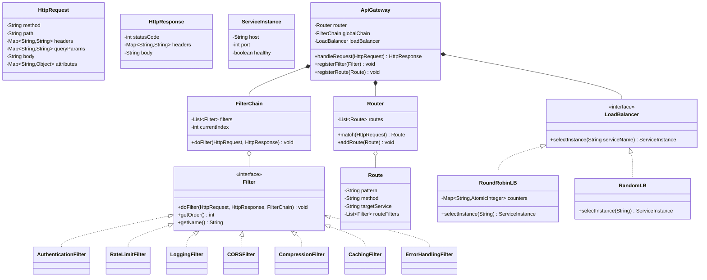
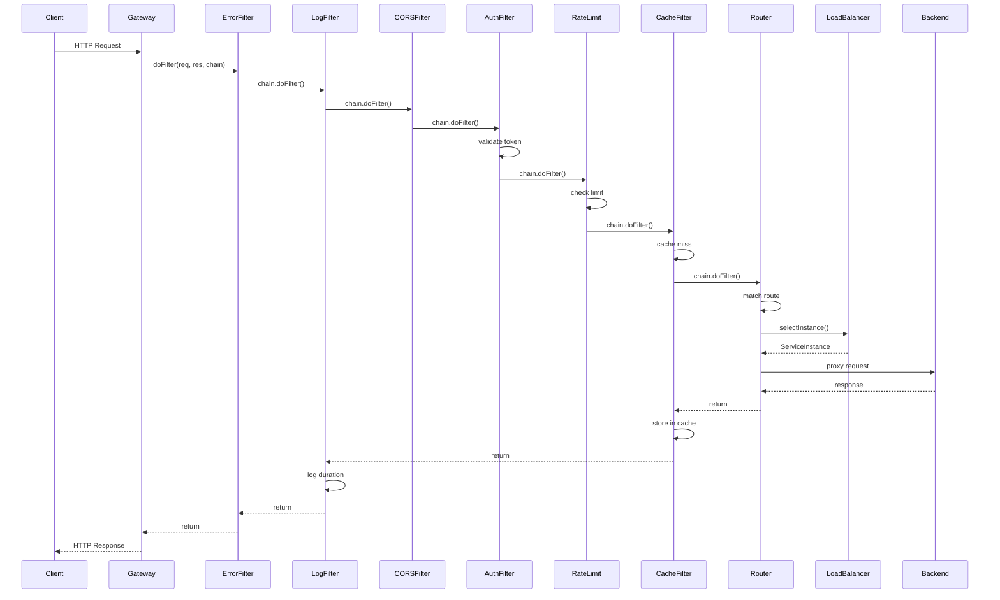

# API Gateway / Middleware Pipeline - Low-Level Design

## 1. Problem Statement

Design an API Gateway that acts as a single entry point for microservices, providing cross-cutting concerns (authentication, rate limiting, logging, CORS, caching, compression) via a composable middleware pipeline. Support dynamic filter registration, priority-based ordering, route matching, load balancing, and request/response transformation.

## 2. UML Class Diagram



## 3. Design Patterns

| Pattern | Usage |
|---------|-------|
| **Chain of Responsibility** | Core pipeline - each filter processes or delegates to next |
| **Strategy** | Load balancing algorithms are interchangeable |
| **Decorator** | Filters decorate request/response with additional behavior |
| **Proxy** | Gateway proxies requests to backend services |

## 4. SOLID Principles

- **SRP**: Each filter handles one concern (auth, rate limit, logging, etc.)
- **OCP**: New filters added without modifying existing code
- **LSP**: All filters are interchangeable via Filter interface
- **ISP**: Filter interface is minimal (doFilter, getOrder, getName)
- **DIP**: Gateway depends on Filter/LoadBalancer abstractions, not concrete implementations

## 5. Java Implementation

```java
import java.util.*;
import java.util.concurrent.*;
import java.util.concurrent.atomic.*;
import java.util.regex.*;
import java.util.stream.*;
import java.time.*;
import java.util.zip.*;
import java.nio.charset.StandardCharsets;
import java.util.Base64;

// ==================== Models ====================

class HttpRequest {
    private String method;
    private String path;
    private Map<String, String> headers;
    private Map<String, String> queryParams;
    private String body;
    private Map<String, Object> attributes; // mutable context for filters

    public HttpRequest(String method, String path, Map<String, String> headers,
                       Map<String, String> queryParams, String body) {
        this.method = method;
        this.path = path;
        this.headers = new HashMap<>(headers);
        this.queryParams = new HashMap<>(queryParams);
        this.body = body;
        this.attributes = new ConcurrentHashMap<>();
    }

    public String getMethod() { return method; }
    public String getPath() { return path; }
    public Map<String, String> getHeaders() { return headers; }
    public String getHeader(String key) { return headers.get(key); }
    public Map<String, String> getQueryParams() { return queryParams; }
    public String getBody() { return body; }
    public void setBody(String body) { this.body = body; }
    public void setAttribute(String key, Object val) { attributes.put(key, val); }
    public Object getAttribute(String key) { return attributes.get(key); }
    public void setHeader(String key, String val) { headers.put(key, val); }
}

class HttpResponse {
    private int statusCode;
    private Map<String, String> headers;
    private String body;

    public HttpResponse() {
        this.statusCode = 200;
        this.headers = new HashMap<>();
        this.body = "";
    }

    public int getStatusCode() { return statusCode; }
    public void setStatusCode(int code) { this.statusCode = code; }
    public Map<String, String> getHeaders() { return headers; }
    public void setHeader(String key, String val) { headers.put(key, val); }
    public String getBody() { return body; }
    public void setBody(String body) { this.body = body; }
}

// ==================== Filter Interface & Chain ====================

interface Filter {
    void doFilter(HttpRequest request, HttpResponse response, FilterChain chain) throws Exception;
    int getOrder(); // lower = higher priority
    String getName();
}

class FilterChain {
    private final List<Filter> filters;
    private int currentIndex = 0;

    public FilterChain(List<Filter> filters) {
        this.filters = new ArrayList<>(filters);
    }

    public void doFilter(HttpRequest request, HttpResponse response) throws Exception {
        if (currentIndex < filters.size()) {
            Filter current = filters.get(currentIndex++);
            current.doFilter(request, response, this);
        }
    }

    public void reset() { currentIndex = 0; }
}

// ==================== Built-in Filters ====================

class AuthenticationFilter implements Filter {
    private final Set<String> validTokens = ConcurrentHashMap.newKeySet();

    public AuthenticationFilter() {
        validTokens.add("valid-token-123");
        validTokens.add("admin-token-456");
    }

    @Override
    public void doFilter(HttpRequest request, HttpResponse response, FilterChain chain) throws Exception {
        String authHeader = request.getHeader("Authorization");
        if (authHeader == null || !authHeader.startsWith("Bearer ")) {
            response.setStatusCode(401);
            response.setBody("{\"error\":\"Missing or invalid Authorization header\"}");
            return; // short-circuit chain
        }
        String token = authHeader.substring(7);
        if (!validTokens.contains(token)) {
            response.setStatusCode(403);
            response.setBody("{\"error\":\"Invalid token\"}");
            return;
        }
        request.setAttribute("authenticated", true);
        request.setAttribute("token", token);
        chain.doFilter(request, response);
    }

    @Override public int getOrder() { return 10; }
    @Override public String getName() { return "AuthenticationFilter"; }
}

class RateLimitFilter implements Filter {
    private final Map<String, Deque<Long>> requestLog = new ConcurrentHashMap<>();
    private final int maxRequests;
    private final long windowMs;

    public RateLimitFilter(int maxRequests, long windowMs) {
        this.maxRequests = maxRequests;
        this.windowMs = windowMs;
    }

    @Override
    public void doFilter(HttpRequest request, HttpResponse response, FilterChain chain) throws Exception {
        String clientId = Optional.ofNullable(request.getHeader("X-Client-Id")).orElse("anonymous");
        long now = System.currentTimeMillis();

        requestLog.putIfAbsent(clientId, new ConcurrentLinkedDeque<>());
        Deque<Long> timestamps = requestLog.get(clientId);

        // Remove expired entries
        while (!timestamps.isEmpty() && now - timestamps.peekFirst() > windowMs) {
            timestamps.pollFirst();
        }

        if (timestamps.size() >= maxRequests) {
            response.setStatusCode(429);
            response.setHeader("Retry-After", String.valueOf(windowMs / 1000));
            response.setBody("{\"error\":\"Rate limit exceeded\"}");
            return;
        }

        timestamps.addLast(now);
        response.setHeader("X-RateLimit-Remaining", String.valueOf(maxRequests - timestamps.size()));
        chain.doFilter(request, response);
    }

    @Override public int getOrder() { return 20; }
    @Override public String getName() { return "RateLimitFilter"; }
}

class LoggingFilter implements Filter {
    @Override
    public void doFilter(HttpRequest request, HttpResponse response, FilterChain chain) throws Exception {
        long start = System.nanoTime();
        String reqId = UUID.randomUUID().toString().substring(0, 8);
        request.setAttribute("requestId", reqId);
        response.setHeader("X-Request-Id", reqId);

        System.out.printf("[%s] --> %s %s%n", reqId, request.getMethod(), request.getPath());

        chain.doFilter(request, response);

        long durationMs = (System.nanoTime() - start) / 1_000_000;
        System.out.printf("[%s] <-- %d (%dms)%n", reqId, response.getStatusCode(), durationMs);
    }

    @Override public int getOrder() { return 1; } // first in chain
    @Override public String getName() { return "LoggingFilter"; }
}

class CORSFilter implements Filter {
    private final Set<String> allowedOrigins;

    public CORSFilter(Set<String> allowedOrigins) {
        this.allowedOrigins = allowedOrigins;
    }

    @Override
    public void doFilter(HttpRequest request, HttpResponse response, FilterChain chain) throws Exception {
        String origin = request.getHeader("Origin");
        if (origin != null && allowedOrigins.contains(origin)) {
            response.setHeader("Access-Control-Allow-Origin", origin);
            response.setHeader("Access-Control-Allow-Methods", "GET,POST,PUT,DELETE,OPTIONS");
            response.setHeader("Access-Control-Allow-Headers", "Authorization,Content-Type");
        }
        if ("OPTIONS".equalsIgnoreCase(request.getMethod())) {
            response.setStatusCode(204);
            return; // preflight handled
        }
        chain.doFilter(request, response);
    }

    @Override public int getOrder() { return 5; }
    @Override public String getName() { return "CORSFilter"; }
}

class CompressionFilter implements Filter {
    @Override
    public void doFilter(HttpRequest request, HttpResponse response, FilterChain chain) throws Exception {
        chain.doFilter(request, response); // post-processing filter

        String acceptEncoding = request.getHeader("Accept-Encoding");
        if (acceptEncoding != null && acceptEncoding.contains("gzip") &&
            response.getBody() != null && response.getBody().length() > 256) {
            response.setHeader("Content-Encoding", "gzip");
            response.setBody("[gzip-compressed:" + response.getBody().length() + " bytes]");
        }
    }

    @Override public int getOrder() { return 90; }
    @Override public String getName() { return "CompressionFilter"; }
}

class CachingFilter implements Filter {
    private final Map<String, CacheEntry> cache = new ConcurrentHashMap<>();
    private final long ttlMs;

    record CacheEntry(String body, Map<String, String> headers, long timestamp) {}

    public CachingFilter(long ttlMs) { this.ttlMs = ttlMs; }

    @Override
    public void doFilter(HttpRequest request, HttpResponse response, FilterChain chain) throws Exception {
        if (!"GET".equalsIgnoreCase(request.getMethod())) {
            chain.doFilter(request, response);
            return;
        }
        String key = request.getPath() + "?" + request.getQueryParams();
        CacheEntry entry = cache.get(key);
        long now = System.currentTimeMillis();

        if (entry != null && (now - entry.timestamp()) < ttlMs) {
            response.setBody(entry.body());
            entry.headers().forEach(response::setHeader);
            response.setHeader("X-Cache", "HIT");
            return;
        }

        chain.doFilter(request, response);

        if (response.getStatusCode() == 200) {
            cache.put(key, new CacheEntry(response.getBody(), new HashMap<>(response.getHeaders()), now));
            response.setHeader("X-Cache", "MISS");
        }
    }

    @Override public int getOrder() { return 15; }
    @Override public String getName() { return "CachingFilter"; }
}

class ErrorHandlingFilter implements Filter {
    @Override
    public void doFilter(HttpRequest request, HttpResponse response, FilterChain chain) throws Exception {
        try {
            chain.doFilter(request, response);
        } catch (Exception e) {
            response.setStatusCode(500);
            response.setBody("{\"error\":\"Internal Server Error\",\"message\":\"" + e.getMessage() + "\"}");
            response.setHeader("Content-Type", "application/json");
        }
    }

    @Override public int getOrder() { return 0; } // outermost
    @Override public String getName() { return "ErrorHandlingFilter"; }
}

// ==================== Routing ====================

class Route {
    private final String pattern; // e.g., "/api/users/{id}"
    private final String method;  // GET, POST, etc. or "*"
    private final String targetService;
    private final Pattern compiledPattern;

    public Route(String pattern, String method, String targetService) {
        this.pattern = pattern;
        this.method = method;
        this.targetService = targetService;
        String regex = pattern.replaceAll("\\{\\w+\\}", "[^/]+");
        this.compiledPattern = Pattern.compile("^" + regex + "$");
    }

    public boolean matches(HttpRequest request) {
        return ("*".equals(method) || method.equalsIgnoreCase(request.getMethod()))
                && compiledPattern.matcher(request.getPath()).matches();
    }

    public String getTargetService() { return targetService; }
    public String getPattern() { return pattern; }
}

class Router {
    private final List<Route> routes = new CopyOnWriteArrayList<>();

    public void addRoute(Route route) { routes.add(route); }

    public Optional<Route> match(HttpRequest request) {
        return routes.stream().filter(r -> r.matches(request)).findFirst();
    }
}

// ==================== Load Balancing ====================

class ServiceInstance {
    private final String host;
    private final int port;
    private volatile boolean healthy;

    public ServiceInstance(String host, int port) {
        this.host = host; this.port = port; this.healthy = true;
    }

    public String getUrl() { return "http://" + host + ":" + port; }
    public boolean isHealthy() { return healthy; }
    public void setHealthy(boolean h) { this.healthy = h; }
}

interface LoadBalancer {
    ServiceInstance selectInstance(String serviceName);
    void registerInstance(String serviceName, ServiceInstance instance);
}

class RoundRobinLoadBalancer implements LoadBalancer {
    private final Map<String, List<ServiceInstance>> registry = new ConcurrentHashMap<>();
    private final Map<String, AtomicInteger> counters = new ConcurrentHashMap<>();

    @Override
    public void registerInstance(String serviceName, ServiceInstance instance) {
        registry.computeIfAbsent(serviceName, k -> new CopyOnWriteArrayList<>()).add(instance);
        counters.putIfAbsent(serviceName, new AtomicInteger(0));
    }

    @Override
    public ServiceInstance selectInstance(String serviceName) {
        List<ServiceInstance> instances = registry.getOrDefault(serviceName, List.of())
            .stream().filter(ServiceInstance::isHealthy).collect(Collectors.toList());
        if (instances.isEmpty()) throw new RuntimeException("No healthy instances for: " + serviceName);
        int idx = counters.get(serviceName).getAndIncrement() % instances.size();
        return instances.get(Math.abs(idx));
    }
}

class RandomLoadBalancer implements LoadBalancer {
    private final Map<String, List<ServiceInstance>> registry = new ConcurrentHashMap<>();
    private final Random random = new Random();

    @Override
    public void registerInstance(String serviceName, ServiceInstance instance) {
        registry.computeIfAbsent(serviceName, k -> new CopyOnWriteArrayList<>()).add(instance);
    }

    @Override
    public ServiceInstance selectInstance(String serviceName) {
        List<ServiceInstance> instances = registry.getOrDefault(serviceName, List.of())
            .stream().filter(ServiceInstance::isHealthy).collect(Collectors.toList());
        if (instances.isEmpty()) throw new RuntimeException("No healthy instances for: " + serviceName);
        return instances.get(random.nextInt(instances.size()));
    }
}

// ==================== API Gateway ====================

class ApiGateway {
    private final Router router;
    private final List<Filter> globalFilters;
    private final LoadBalancer loadBalancer;

    public ApiGateway(LoadBalancer loadBalancer) {
        this.router = new Router();
        this.globalFilters = new CopyOnWriteArrayList<>();
        this.loadBalancer = loadBalancer;
    }

    public void registerFilter(Filter filter) {
        globalFilters.add(filter);
    }

    public void registerRoute(Route route) {
        router.addRoute(route);
    }

    public HttpResponse handleRequest(HttpRequest request) {
        HttpResponse response = new HttpResponse();

        // Build ordered filter chain + routing filter at end
        List<Filter> ordered = new ArrayList<>(globalFilters);
        ordered.add(new RoutingFilter(router, loadBalancer)); // terminal filter
        ordered.sort(Comparator.comparingInt(Filter::getOrder));

        FilterChain chain = new FilterChain(ordered);
        try {
            chain.doFilter(request, response);
        } catch (Exception e) {
            response.setStatusCode(500);
            response.setBody("{\"error\":\"Gateway error: " + e.getMessage() + "\"}");
        }
        return response;
    }
}

// Terminal filter that routes to backend
class RoutingFilter implements Filter {
    private final Router router;
    private final LoadBalancer loadBalancer;

    public RoutingFilter(Router router, LoadBalancer loadBalancer) {
        this.router = router;
        this.loadBalancer = loadBalancer;
    }

    @Override
    public void doFilter(HttpRequest request, HttpResponse response, FilterChain chain) throws Exception {
        Optional<Route> route = router.match(request);
        if (route.isEmpty()) {
            response.setStatusCode(404);
            response.setBody("{\"error\":\"No route found for: " + request.getPath() + "\"}");
            return;
        }
        ServiceInstance instance = loadBalancer.selectInstance(route.get().getTargetService());
        // Simulate proxying to backend
        response.setStatusCode(200);
        response.setBody("{\"data\":\"Response from " + instance.getUrl() + request.getPath() + "\"}");
        response.setHeader("X-Upstream", instance.getUrl());
    }

    @Override public int getOrder() { return 100; } // always last
    @Override public String getName() { return "RoutingFilter"; }
}

// ==================== Demo ====================

class ApiGatewayDemo {
    public static void main(String[] args) {
        // Setup load balancer
        RoundRobinLoadBalancer lb = new RoundRobinLoadBalancer();
        lb.registerInstance("user-service", new ServiceInstance("10.0.1.1", 8080));
        lb.registerInstance("user-service", new ServiceInstance("10.0.1.2", 8080));
        lb.registerInstance("order-service", new ServiceInstance("10.0.2.1", 9090));

        // Setup gateway
        ApiGateway gateway = new ApiGateway(lb);
        gateway.registerFilter(new ErrorHandlingFilter());
        gateway.registerFilter(new LoggingFilter());
        gateway.registerFilter(new CORSFilter(Set.of("https://frontend.com")));
        gateway.registerFilter(new AuthenticationFilter());
        gateway.registerFilter(new RateLimitFilter(100, 60_000));
        gateway.registerFilter(new CachingFilter(30_000));
        gateway.registerFilter(new CompressionFilter());

        // Register routes
        gateway.registerRoute(new Route("/api/users/{id}", "GET", "user-service"));
        gateway.registerRoute(new Route("/api/users", "POST", "user-service"));
        gateway.registerRoute(new Route("/api/orders/{id}", "*", "order-service"));

        // Test: valid request
        HttpRequest req = new HttpRequest("GET", "/api/users/42",
            Map.of("Authorization", "Bearer valid-token-123",
                   "Origin", "https://frontend.com",
                   "Accept-Encoding", "gzip",
                   "X-Client-Id", "client-1"),
            Map.of(), "");
        HttpResponse resp = gateway.handleRequest(req);
        System.out.println("Status: " + resp.getStatusCode());
        System.out.println("Body: " + resp.getBody());
        System.out.println("Headers: " + resp.getHeaders());

        // Test: unauthorized
        HttpRequest unauth = new HttpRequest("GET", "/api/users/1",
            Map.of(), Map.of(), "");
        HttpResponse unauthResp = gateway.handleRequest(unauth);
        System.out.println("\nUnauth Status: " + unauthResp.getStatusCode());
        System.out.println("Unauth Body: " + unauthResp.getBody());
    }
}
```

## 6. Sequence Diagram



## 7. Key Interview Points

| Topic | Detail |
|-------|--------|
| **Why Chain of Responsibility?** | Decouples filters, supports dynamic ordering, each filter decides to pass or short-circuit |
| **Filter ordering** | `getOrder()` priority — sorted before building chain; lower value = earlier execution |
| **Short-circuiting** | Filter can set response and NOT call `chain.doFilter()` to halt pipeline (e.g., 401, 429) |
| **Pre vs Post processing** | Call `chain.doFilter()` first for post-processing (Compression), last for pre-processing (Auth) |
| **Thread safety** | ConcurrentHashMap for rate limit state, CopyOnWriteArrayList for dynamic registration |
| **Load balancing** | Strategy pattern — swap RoundRobin/Random/WeightedRandom without changing gateway |
| **Caching** | Only GET requests cached; keyed on path+params; TTL-based expiry |
| **Dynamic registration** | `registerFilter()` at runtime; list re-sorted on each request (or use insertion sort) |
| **vs Spring Cloud Gateway** | Similar concept: Predicate (route match) + GatewayFilter (filter chain) + LoadBalancer |
| **Scalability** | Stateless gateway scales horizontally; rate limit state needs Redis for distributed deployments |
| **Circuit Breaker** | Can add as another filter wrapping backend calls to handle cascading failures |
