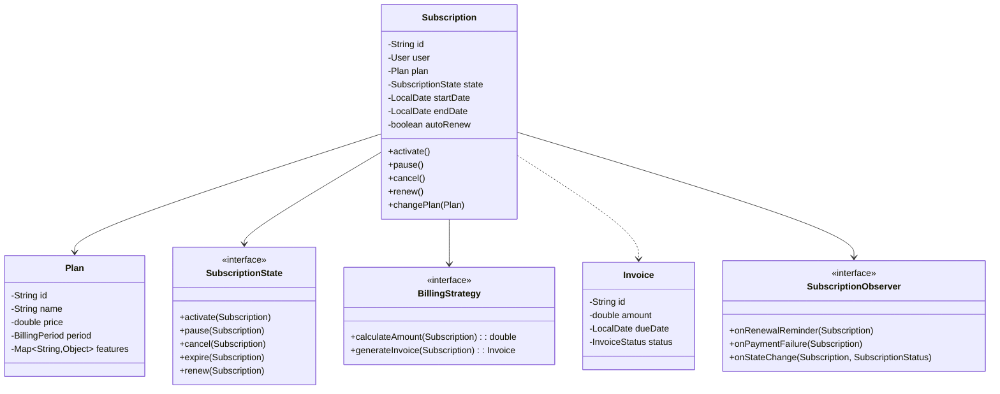
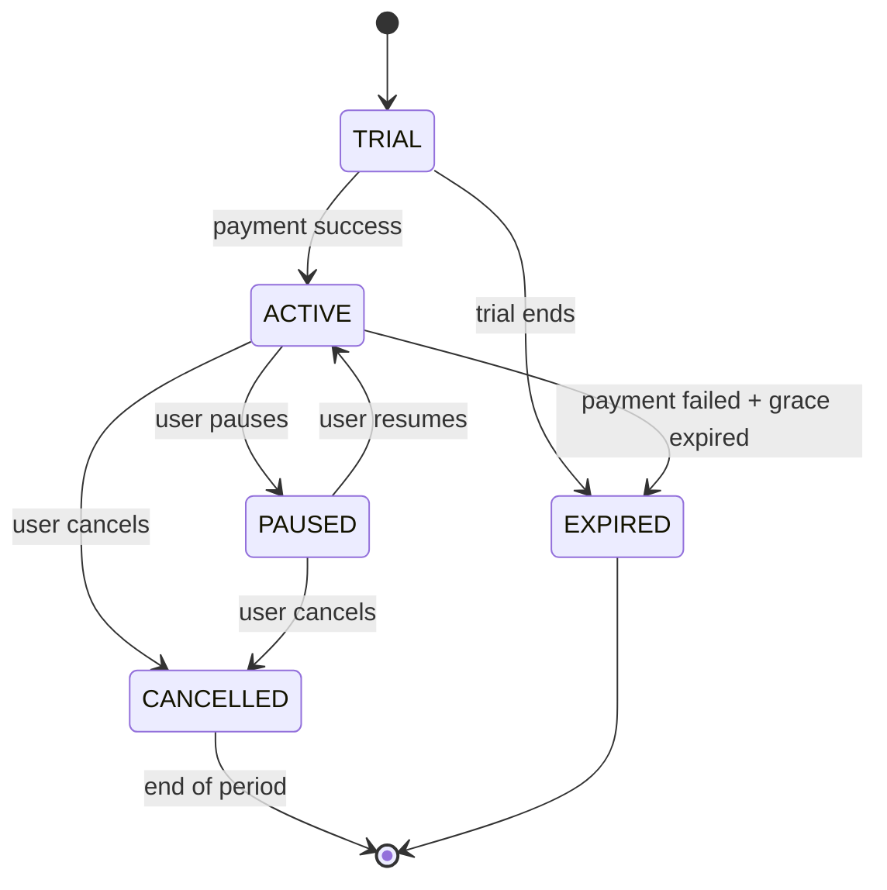

# Subscription Management System - Low-Level Design

## 1. Problem Statement
Design a subscription management system supporting multiple plans, billing cycles, proration, auto-renewal, grace periods, and lifecycle state management.

## 2. UML Class Diagram


## 3. State Diagram


## 4. Design Patterns
- **State**: Subscription lifecycle (Trial → Active → Paused/Cancelled/Expired)
- **Strategy**: Billing calculation (Monthly, Yearly, Usage-based)
- **Observer**: Notifications for renewal reminders, payment failures, state changes
- **Builder**: Complex Subscription object construction

## 5. Java Implementation

```java
// === Enums ===
public enum SubscriptionStatus { TRIAL, ACTIVE, PAUSED, CANCELLED, EXPIRED }
public enum BillingPeriod { MONTHLY, YEARLY }

// === Models ===
public class User {
    private String id;
    private String name;
    private String email;
    public User(String id, String name, String email) {
        this.id = id; this.name = name; this.email = email;
    }
    // getters
    public String getId() { return id; }
    public String getEmail() { return email; }
    public String getName() { return name; }
}

public class Plan {
    private String id;
    private String name;
    private double monthlyPrice;
    private double yearlyPrice;
    private Map<String, Object> features;

    public Plan(String id, String name, double monthlyPrice, double yearlyPrice, Map<String, Object> features) {
        this.id = id; this.name = name;
        this.monthlyPrice = monthlyPrice; this.yearlyPrice = yearlyPrice;
        this.features = features;
    }
    public double getPrice(BillingPeriod period) {
        return period == BillingPeriod.MONTHLY ? monthlyPrice : yearlyPrice;
    }
    public String getId() { return id; }
    public String getName() { return name; }
    public Map<String, Object> getFeatures() { return features; }
}

public class PlanCatalog {
    public static final Plan FREE = new Plan("free", "Free", 0, 0, Map.of("storage", "1GB"));
    public static final Plan BASIC = new Plan("basic", "Basic", 9.99, 99.99, Map.of("storage", "10GB", "support", "email"));
    public static final Plan PREMIUM = new Plan("premium", "Premium", 29.99, 299.99, Map.of("storage", "100GB", "support", "priority"));
    public static final Plan ENTERPRISE = new Plan("enterprise", "Enterprise", 99.99, 999.99, Map.of("storage", "unlimited", "support", "dedicated"));
}

public class Invoice {
    private String id;
    private String subscriptionId;
    private double amount;
    private LocalDate issueDate;
    private LocalDate dueDate;
    private String description;
    private boolean paid;

    public Invoice(String id, String subscriptionId, double amount, LocalDate dueDate, String description) {
        this.id = id; this.subscriptionId = subscriptionId;
        this.amount = amount; this.issueDate = LocalDate.now();
        this.dueDate = dueDate; this.description = description;
    }
    public void markPaid() { this.paid = true; }
    public double getAmount() { return amount; }
    public boolean isPaid() { return paid; }
    public String getId() { return id; }
}

// === Observer Pattern ===
public interface SubscriptionObserver {
    void onRenewalReminder(Subscription sub, int daysUntilRenewal);
    void onPaymentFailure(Subscription sub, String reason);
    void onStateChange(Subscription sub, SubscriptionStatus oldState, SubscriptionStatus newState);
}

public class EmailNotificationObserver implements SubscriptionObserver {
    public void onRenewalReminder(Subscription sub, int days) {
        System.out.println("Email to " + sub.getUser().getEmail() + ": Renewal in " + days + " days");
    }
    public void onPaymentFailure(Subscription sub, String reason) {
        System.out.println("Email to " + sub.getUser().getEmail() + ": Payment failed - " + reason);
    }
    public void onStateChange(Subscription sub, SubscriptionStatus oldState, SubscriptionStatus newState) {
        System.out.println("Email to " + sub.getUser().getEmail() + ": Status changed " + oldState + " -> " + newState);
    }
}

// === State Pattern ===
public interface SubscriptionState {
    void activate(Subscription sub);
    void pause(Subscription sub);
    void cancel(Subscription sub);
    void expire(Subscription sub);
    void renew(Subscription sub);
    SubscriptionStatus getStatus();
}

public class TrialState implements SubscriptionState {
    public void activate(Subscription sub) { sub.setState(new ActiveState()); }
    public void pause(Subscription sub) { throw new IllegalStateException("Cannot pause trial"); }
    public void cancel(Subscription sub) { sub.setState(new CancelledState()); }
    public void expire(Subscription sub) { sub.setState(new ExpiredState()); }
    public void renew(Subscription sub) { throw new IllegalStateException("Cannot renew trial"); }
    public SubscriptionStatus getStatus() { return SubscriptionStatus.TRIAL; }
}

public class ActiveState implements SubscriptionState {
    public void activate(Subscription sub) { throw new IllegalStateException("Already active"); }
    public void pause(Subscription sub) { sub.setState(new PausedState()); }
    public void cancel(Subscription sub) {
        sub.setCancelAtPeriodEnd(true);
        sub.setState(new CancelledState());
    }
    public void expire(Subscription sub) { sub.setState(new ExpiredState()); }
    public void renew(Subscription sub) {
        sub.setStartDate(LocalDate.now());
        sub.setEndDate(sub.calculateNextEndDate());
    }
    public SubscriptionStatus getStatus() { return SubscriptionStatus.ACTIVE; }
}

public class PausedState implements SubscriptionState {
    public void activate(Subscription sub) { sub.setState(new ActiveState()); }
    public void pause(Subscription sub) { throw new IllegalStateException("Already paused"); }
    public void cancel(Subscription sub) { sub.setState(new CancelledState()); }
    public void expire(Subscription sub) { sub.setState(new ExpiredState()); }
    public void renew(Subscription sub) { throw new IllegalStateException("Cannot renew paused"); }
    public SubscriptionStatus getStatus() { return SubscriptionStatus.PAUSED; }
}

public class CancelledState implements SubscriptionState {
    public void activate(Subscription sub) { sub.setState(new ActiveState()); }
    public void pause(Subscription sub) { throw new IllegalStateException("Cannot pause cancelled"); }
    public void cancel(Subscription sub) { throw new IllegalStateException("Already cancelled"); }
    public void expire(Subscription sub) { sub.setState(new ExpiredState()); }
    public void renew(Subscription sub) { throw new IllegalStateException("Cannot renew cancelled"); }
    public SubscriptionStatus getStatus() { return SubscriptionStatus.CANCELLED; }
}

public class ExpiredState implements SubscriptionState {
    public void activate(Subscription sub) { sub.setState(new ActiveState()); }
    public void pause(Subscription sub) { throw new IllegalStateException("Cannot pause expired"); }
    public void cancel(Subscription sub) { throw new IllegalStateException("Cannot cancel expired"); }
    public void expire(Subscription sub) { throw new IllegalStateException("Already expired"); }
    public void renew(Subscription sub) { throw new IllegalStateException("Cannot renew expired"); }
    public SubscriptionStatus getStatus() { return SubscriptionStatus.EXPIRED; }
}

// === Strategy Pattern: Billing ===
public interface BillingStrategy {
    double calculateAmount(Subscription sub);
    Invoice generateInvoice(Subscription sub);
}

public class MonthlyBillingStrategy implements BillingStrategy {
    public double calculateAmount(Subscription sub) {
        return sub.getPlan().getPrice(BillingPeriod.MONTHLY);
    }
    public Invoice generateInvoice(Subscription sub) {
        double amount = calculateAmount(sub);
        return new Invoice(UUID.randomUUID().toString(), sub.getId(), amount,
            LocalDate.now().plusDays(7), "Monthly subscription: " + sub.getPlan().getName());
    }
}

public class YearlyBillingStrategy implements BillingStrategy {
    public double calculateAmount(Subscription sub) {
        return sub.getPlan().getPrice(BillingPeriod.YEARLY);
    }
    public Invoice generateInvoice(Subscription sub) {
        double amount = calculateAmount(sub);
        return new Invoice(UUID.randomUUID().toString(), sub.getId(), amount,
            LocalDate.now().plusDays(7), "Yearly subscription: " + sub.getPlan().getName());
    }
}

public class UsageBasedBillingStrategy implements BillingStrategy {
    private double basePrice;
    private double perUnitPrice;

    public UsageBasedBillingStrategy(double basePrice, double perUnitPrice) {
        this.basePrice = basePrice; this.perUnitPrice = perUnitPrice;
    }
    public double calculateAmount(Subscription sub) {
        long usage = sub.getUsageUnits();
        return basePrice + (usage * perUnitPrice);
    }
    public Invoice generateInvoice(Subscription sub) {
        double amount = calculateAmount(sub);
        return new Invoice(UUID.randomUUID().toString(), sub.getId(), amount,
            LocalDate.now().plusDays(7), "Usage-based: " + sub.getUsageUnits() + " units");
    }
}

// === Proration Calculator ===
public class ProrationCalculator {
    public static double calculateProration(Subscription sub, Plan newPlan) {
        LocalDate today = LocalDate.now();
        long totalDays = ChronoUnit.DAYS.between(sub.getStartDate(), sub.getEndDate());
        long remainingDays = ChronoUnit.DAYS.between(today, sub.getEndDate());
        if (totalDays <= 0 || remainingDays <= 0) return 0;

        double dailyOld = sub.getPlan().getPrice(BillingPeriod.MONTHLY) / 30.0;
        double dailyNew = newPlan.getPrice(BillingPeriod.MONTHLY) / 30.0;
        double credit = dailyOld * remainingDays;
        double charge = dailyNew * remainingDays;
        return charge - credit; // positive = upgrade charge, negative = refund
    }
}

// === Main Subscription Class (Builder Pattern) ===
public class Subscription {
    private String id;
    private User user;
    private Plan plan;
    private SubscriptionState state;
    private BillingStrategy billingStrategy;
    private LocalDate startDate;
    private LocalDate endDate;
    private boolean autoRenew;
    private boolean cancelAtPeriodEnd;
    private int gracePeriodDays;
    private long usageUnits;
    private List<Invoice> invoices = new ArrayList<>();
    private List<SubscriptionObserver> observers = new ArrayList<>();

    private Subscription() {}

    // Builder
    public static class Builder {
        private Subscription sub = new Subscription();
        public Builder id(String id) { sub.id = id; return this; }
        public Builder user(User user) { sub.user = user; return this; }
        public Builder plan(Plan plan) { sub.plan = plan; return this; }
        public Builder billingStrategy(BillingStrategy s) { sub.billingStrategy = s; return this; }
        public Builder autoRenew(boolean b) { sub.autoRenew = b; return this; }
        public Builder gracePeriodDays(int d) { sub.gracePeriodDays = d; return this; }
        public Builder trial(int trialDays) {
            sub.state = new TrialState();
            sub.startDate = LocalDate.now();
            sub.endDate = LocalDate.now().plusDays(trialDays);
            return this;
        }
        public Subscription build() {
            if (sub.id == null) sub.id = UUID.randomUUID().toString();
            if (sub.state == null) { sub.state = new ActiveState(); sub.startDate = LocalDate.now(); sub.endDate = sub.calculateNextEndDate(); }
            return sub;
        }
    }

    // State transitions with observer notification
    public void activate() {
        SubscriptionStatus old = state.getStatus();
        state.activate(this);
        notifyStateChange(old, state.getStatus());
    }
    public void pause() {
        SubscriptionStatus old = state.getStatus();
        state.pause(this);
        notifyStateChange(old, state.getStatus());
    }
    public void cancel() {
        SubscriptionStatus old = state.getStatus();
        state.cancel(this);
        notifyStateChange(old, state.getStatus());
    }
    public void renew() {
        if (!autoRenew) { expire(); return; }
        Invoice invoice = billingStrategy.generateInvoice(this);
        invoices.add(invoice);
        // Simulate payment
        if (processPayment(invoice)) {
            invoice.markPaid();
            state.renew(this);
        } else {
            notifyPaymentFailure("Payment declined");
            handleGracePeriod();
        }
    }
    public void expire() {
        SubscriptionStatus old = state.getStatus();
        state.expire(this);
        notifyStateChange(old, state.getStatus());
    }

    // Plan change with proration
    public Invoice changePlan(Plan newPlan) {
        double proration = ProrationCalculator.calculateProration(this, newPlan);
        this.plan = newPlan;
        if (proration > 0) {
            Invoice invoice = new Invoice(UUID.randomUUID().toString(), id, proration,
                LocalDate.now(), "Plan upgrade proration");
            invoices.add(invoice);
            return invoice;
        }
        return null; // downgrade credit applied to next cycle
    }

    // Grace period
    private void handleGracePeriod() {
        // In production: schedule retry after grace period
        System.out.println("Grace period started: " + gracePeriodDays + " days");
    }

    private boolean processPayment(Invoice invoice) { return true; } // stub

    LocalDate calculateNextEndDate() {
        if (billingStrategy instanceof YearlyBillingStrategy)
            return LocalDate.now().plusYears(1);
        return LocalDate.now().plusMonths(1);
    }

    // Observer management
    public void addObserver(SubscriptionObserver obs) { observers.add(obs); }
    public void removeObserver(SubscriptionObserver obs) { observers.remove(obs); }
    private void notifyStateChange(SubscriptionStatus oldS, SubscriptionStatus newS) {
        observers.forEach(o -> o.onStateChange(this, oldS, newS));
    }
    private void notifyPaymentFailure(String reason) {
        observers.forEach(o -> o.onPaymentFailure(this, reason));
    }
    public void sendRenewalReminder(int daysUntil) {
        observers.forEach(o -> o.onRenewalReminder(this, daysUntil));
    }

    // Getters/Setters
    public String getId() { return id; }
    public User getUser() { return user; }
    public Plan getPlan() { return plan; }
    public SubscriptionStatus getStatus() { return state.getStatus(); }
    public LocalDate getStartDate() { return startDate; }
    public LocalDate getEndDate() { return endDate; }
    public long getUsageUnits() { return usageUnits; }
    public void setUsageUnits(long u) { this.usageUnits = u; }
    void setState(SubscriptionState s) { this.state = s; }
    void setStartDate(LocalDate d) { this.startDate = d; }
    void setEndDate(LocalDate d) { this.endDate = d; }
    void setCancelAtPeriodEnd(boolean b) { this.cancelAtPeriodEnd = b; }
    public boolean isCancelAtPeriodEnd() { return cancelAtPeriodEnd; }
}

// === Subscription Manager ===
public class SubscriptionManager {
    private Map<String, Subscription> subscriptions = new ConcurrentHashMap<>();

    public Subscription createSubscription(User user, Plan plan, BillingStrategy strategy, boolean trial) {
        Subscription.Builder builder = new Subscription.Builder()
            .user(user).plan(plan).billingStrategy(strategy).autoRenew(true).gracePeriodDays(3);
        if (trial) builder.trial(14);
        Subscription sub = builder.build();
        subscriptions.put(sub.getId(), sub);
        return sub;
    }

    public void processRenewals() {
        LocalDate today = LocalDate.now();
        subscriptions.values().stream()
            .filter(s -> s.getStatus() == SubscriptionStatus.ACTIVE)
            .filter(s -> !s.getEndDate().isAfter(today))
            .forEach(Subscription::renew);
    }

    public void sendRenewalReminders(int daysBefore) {
        LocalDate target = LocalDate.now().plusDays(daysBefore);
        subscriptions.values().stream()
            .filter(s -> s.getStatus() == SubscriptionStatus.ACTIVE)
            .filter(s -> s.getEndDate().equals(target))
            .forEach(s -> s.sendRenewalReminder(daysBefore));
    }
}

// === Demo ===
public class SubscriptionDemo {
    public static void main(String[] args) {
        User user = new User("u1", "Alice", "alice@example.com");
        SubscriptionManager manager = new SubscriptionManager();

        Subscription sub = manager.createSubscription(user, PlanCatalog.PREMIUM, new MonthlyBillingStrategy(), true);
        sub.addObserver(new EmailNotificationObserver());

        System.out.println("Status: " + sub.getStatus());    // TRIAL
        sub.activate();                                        // TRIAL -> ACTIVE
        System.out.println("Status: " + sub.getStatus());    // ACTIVE

        Invoice inv = sub.changePlan(PlanCatalog.ENTERPRISE); // Upgrade
        if (inv != null) System.out.println("Proration charge: $" + inv.getAmount());

        sub.pause();                                           // ACTIVE -> PAUSED
        sub.activate();                                        // PAUSED -> ACTIVE
        sub.cancel();                                          // ACTIVE -> CANCELLED (end of period)
    }
}
```

## 6. SOLID Principles Applied
| Principle | Application |
|-----------|-------------|
| **SRP** | Each state class handles one status; BillingStrategy only calculates billing |
| **OCP** | New plans/states/strategies added without modifying existing code |
| **LSP** | All SubscriptionState implementations are interchangeable |
| **ISP** | Observer interface is focused; BillingStrategy is minimal |
| **DIP** | Subscription depends on abstractions (SubscriptionState, BillingStrategy) |

## 7. Key Interview Points
- **State Pattern** eliminates complex if-else chains for status transitions
- **Strategy Pattern** decouples billing logic from subscription lifecycle
- **Proration** uses daily rate calculation for mid-cycle plan changes
- **Grace Period** allows retry window before expiring subscription
- **Cancel at period end** grants access until billing cycle completes
- **Auto-renewal** scheduled via manager scanning end dates
- **Observer** decouples notifications from business logic
- **Builder** handles optional fields (trial, grace period, billing strategy)
- **Thread-safe** manager uses ConcurrentHashMap for concurrent access
- **Extensibility**: Add new plans, billing strategies, or notification channels without touching core logic
