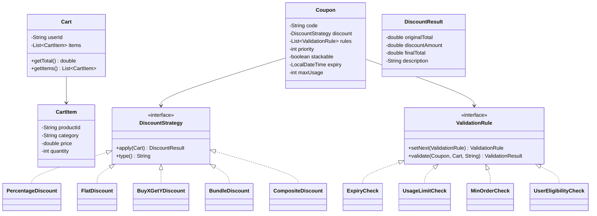

# Coupon & Discount Engine - Low-Level Design

## 1. Problem Statement
Design a coupon and discount engine that supports multiple discount types, validates coupons through a chain of rules, handles stacking/priority, tracks usage, and applies the best possible discount to a cart.

## 2. UML Class Diagram


## 3. Design Patterns
- **Strategy**: Each discount type implements `DiscountStrategy`
- **Chain of Responsibility**: Validation rules linked in a chain
- **Factory**: `CouponFactory` creates coupons with appropriate strategies
- **Composite**: `CompositeDiscount` applies multiple discounts with rules

## 4. SOLID Principles
- **SRP**: Each class has one responsibility (validation, discount calc, tracking)
- **OCP**: New discount types/rules added without modifying existing code
- **LSP**: All strategies/rules are interchangeable via interfaces
- **ISP**: Thin interfaces for Strategy and ValidationRule
- **DIP**: Engine depends on abstractions, not concrete discount types

## 5. Java Implementation

```java
// ==================== Models ====================
class CartItem {
    private String productId;
    private String category;
    private double price;
    private int quantity;

    public CartItem(String productId, String category, double price, int quantity) {
        this.productId = productId; this.category = category;
        this.price = price; this.quantity = quantity;
    }
    public String getProductId() { return productId; }
    public String getCategory() { return category; }
    public double getPrice() { return price; }
    public int getQuantity() { return quantity; }
    public double getSubtotal() { return price * quantity; }
}

class Cart {
    private String userId;
    private List<CartItem> items = new ArrayList<>();

    public Cart(String userId) { this.userId = userId; }
    public void addItem(CartItem item) { items.add(item); }
    public String getUserId() { return userId; }
    public List<CartItem> getItems() { return items; }
    public double getTotal() {
        return items.stream().mapToDouble(CartItem::getSubtotal).sum();
    }
}

class DiscountResult {
    private double originalTotal;
    private double discountAmount;
    private double finalTotal;
    private String description;

    public DiscountResult(double original, double discount, String desc) {
        this.originalTotal = original;
        this.discountAmount = discount;
        this.finalTotal = original - discount;
        this.description = desc;
    }
    public double getOriginalTotal() { return originalTotal; }
    public double getDiscountAmount() { return discountAmount; }
    public double getFinalTotal() { return finalTotal; }
    public String getDescription() { return description; }
}

class ValidationResult {
    private boolean valid;
    private String message;
    public ValidationResult(boolean valid, String message) {
        this.valid = valid; this.message = message;
    }
    public boolean isValid() { return valid; }
    public String getMessage() { return message; }
    public static ValidationResult success() { return new ValidationResult(true, "Valid"); }
    public static ValidationResult failure(String msg) { return new ValidationResult(false, msg); }
}

// ==================== Strategy: Discount Types ====================
interface DiscountStrategy {
    DiscountResult apply(Cart cart);
    String type();
}

class PercentageDiscount implements DiscountStrategy {
    private double percentage;
    private double maxDiscount;

    public PercentageDiscount(double percentage, double maxDiscount) {
        this.percentage = percentage; this.maxDiscount = maxDiscount;
    }
    public DiscountResult apply(Cart cart) {
        double total = cart.getTotal();
        double discount = Math.min(total * percentage / 100, maxDiscount);
        return new DiscountResult(total, discount, percentage + "% off (max " + maxDiscount + ")");
    }
    public String type() { return "PERCENTAGE"; }
}

class FlatDiscount implements DiscountStrategy {
    private double amount;

    public FlatDiscount(double amount) { this.amount = amount; }
    public DiscountResult apply(Cart cart) {
        double total = cart.getTotal();
        double discount = Math.min(amount, total);
        return new DiscountResult(total, discount, "Flat ₹" + amount + " off");
    }
    public String type() { return "FLAT"; }
}

class BuyXGetYDiscount implements DiscountStrategy {
    private String productId;
    private int buyQty;
    private int freeQty;

    public BuyXGetYDiscount(String productId, int buyQty, int freeQty) {
        this.productId = productId; this.buyQty = buyQty; this.freeQty = freeQty;
    }
    public DiscountResult apply(Cart cart) {
        double total = cart.getTotal();
        double discount = 0;
        for (CartItem item : cart.getItems()) {
            if (item.getProductId().equals(productId) && item.getQuantity() >= buyQty + freeQty) {
                discount = item.getPrice() * freeQty;
            }
        }
        return new DiscountResult(total, discount, "Buy " + buyQty + " Get " + freeQty + " Free");
    }
    public String type() { return "BUY_X_GET_Y"; }
}

class BundleDiscount implements DiscountStrategy {
    private Set<String> requiredProducts;
    private double bundlePrice;

    public BundleDiscount(Set<String> requiredProducts, double bundlePrice) {
        this.requiredProducts = requiredProducts; this.bundlePrice = bundlePrice;
    }
    public DiscountResult apply(Cart cart) {
        double total = cart.getTotal();
        Set<String> cartProducts = cart.getItems().stream()
            .map(CartItem::getProductId).collect(Collectors.toSet());
        if (cartProducts.containsAll(requiredProducts)) {
            double bundleTotal = cart.getItems().stream()
                .filter(i -> requiredProducts.contains(i.getProductId()))
                .mapToDouble(CartItem::getSubtotal).sum();
            double discount = bundleTotal - bundlePrice;
            return new DiscountResult(total, Math.max(0, discount), "Bundle deal @ ₹" + bundlePrice);
        }
        return new DiscountResult(total, 0, "Bundle conditions not met");
    }
    public String type() { return "BUNDLE"; }
}

// Composite Pattern: Apply multiple discounts
class CompositeDiscount implements DiscountStrategy {
    private List<DiscountStrategy> strategies;
    private boolean applySequentially; // true = each on reduced total

    public CompositeDiscount(List<DiscountStrategy> strategies, boolean applySequentially) {
        this.strategies = strategies; this.applySequentially = applySequentially;
    }
    public DiscountResult apply(Cart cart) {
        double total = cart.getTotal();
        double totalDiscount = 0;
        StringBuilder desc = new StringBuilder("Composite: ");
        for (DiscountStrategy s : strategies) {
            DiscountResult r = s.apply(cart);
            totalDiscount += r.getDiscountAmount();
            desc.append(r.getDescription()).append(" + ");
        }
        totalDiscount = Math.min(totalDiscount, total); // can't exceed total
        return new DiscountResult(total, totalDiscount, desc.toString());
    }
    public String type() { return "COMPOSITE"; }
}

// ==================== Chain of Responsibility: Validation ====================
abstract class ValidationRule {
    private ValidationRule next;

    public ValidationRule setNext(ValidationRule next) {
        this.next = next; return next;
    }
    public ValidationResult validate(Coupon coupon, Cart cart, String userId) {
        ValidationResult result = doValidate(coupon, cart, userId);
        if (!result.isValid()) return result;
        if (next != null) return next.validate(coupon, cart, userId);
        return ValidationResult.success();
    }
    protected abstract ValidationResult doValidate(Coupon coupon, Cart cart, String userId);
}

class ExpiryCheck extends ValidationRule {
    protected ValidationResult doValidate(Coupon coupon, Cart cart, String userId) {
        if (coupon.getExpiry() != null && LocalDateTime.now().isAfter(coupon.getExpiry()))
            return ValidationResult.failure("Coupon expired");
        return ValidationResult.success();
    }
}

class UsageLimitCheck extends ValidationRule {
    private UsageTracker tracker;
    public UsageLimitCheck(UsageTracker tracker) { this.tracker = tracker; }

    protected ValidationResult doValidate(Coupon coupon, Cart cart, String userId) {
        int used = tracker.getUsageCount(coupon.getCode(), userId);
        if (used >= coupon.getMaxUsagePerUser())
            return ValidationResult.failure("Usage limit reached");
        if (tracker.getTotalUsage(coupon.getCode()) >= coupon.getMaxUsage())
            return ValidationResult.failure("Coupon fully redeemed");
        return ValidationResult.success();
    }
}

class MinOrderCheck extends ValidationRule {
    protected ValidationResult doValidate(Coupon coupon, Cart cart, String userId) {
        if (cart.getTotal() < coupon.getMinOrderAmount())
            return ValidationResult.failure("Min order ₹" + coupon.getMinOrderAmount() + " required");
        return ValidationResult.success();
    }
}

class UserEligibilityCheck extends ValidationRule {
    protected ValidationResult doValidate(Coupon coupon, Cart cart, String userId) {
        if (coupon.getEligibleUsers() != null && !coupon.getEligibleUsers().isEmpty()
                && !coupon.getEligibleUsers().contains(userId))
            return ValidationResult.failure("User not eligible for this coupon");
        return ValidationResult.success();
    }
}

// ==================== Coupon Model ====================
class Coupon {
    private String code;
    private DiscountStrategy discount;
    private int priority; // lower = higher priority
    private boolean stackable;
    private LocalDateTime expiry;
    private int maxUsage;
    private int maxUsagePerUser;
    private double minOrderAmount;
    private Set<String> eligibleUsers;

    // Builder pattern for construction
    public static class Builder {
        private Coupon c = new Coupon();
        public Builder code(String code) { c.code = code; return this; }
        public Builder discount(DiscountStrategy d) { c.discount = d; return this; }
        public Builder priority(int p) { c.priority = p; return this; }
        public Builder stackable(boolean s) { c.stackable = s; return this; }
        public Builder expiry(LocalDateTime e) { c.expiry = e; return this; }
        public Builder maxUsage(int m) { c.maxUsage = m; return this; }
        public Builder maxUsagePerUser(int m) { c.maxUsagePerUser = m; return this; }
        public Builder minOrderAmount(double m) { c.minOrderAmount = m; return this; }
        public Builder eligibleUsers(Set<String> u) { c.eligibleUsers = u; return this; }
        public Coupon build() { return c; }
    }

    // Getters
    public String getCode() { return code; }
    public DiscountStrategy getDiscount() { return discount; }
    public int getPriority() { return priority; }
    public boolean isStackable() { return stackable; }
    public LocalDateTime getExpiry() { return expiry; }
    public int getMaxUsage() { return maxUsage; }
    public int getMaxUsagePerUser() { return maxUsagePerUser; }
    public double getMinOrderAmount() { return minOrderAmount; }
    public Set<String> getEligibleUsers() { return eligibleUsers; }
}

// ==================== Repository & Tracking ====================
class CouponRepository {
    private Map<String, Coupon> coupons = new ConcurrentHashMap<>();

    public void save(Coupon coupon) { coupons.put(coupon.getCode(), coupon); }
    public Optional<Coupon> findByCode(String code) { return Optional.ofNullable(coupons.get(code)); }
    public List<Coupon> findAll() { return new ArrayList<>(coupons.values()); }
    public List<Coupon> findStackable() {
        return coupons.values().stream().filter(Coupon::isStackable)
            .sorted(Comparator.comparingInt(Coupon::getPriority)).collect(Collectors.toList());
    }
}

class UsageTracker {
    private Map<String, Map<String, Integer>> usageMap = new ConcurrentHashMap<>(); // code -> userId -> count
    private Map<String, Integer> totalUsage = new ConcurrentHashMap<>();

    public void recordUsage(String code, String userId) {
        usageMap.computeIfAbsent(code, k -> new ConcurrentHashMap<>())
            .merge(userId, 1, Integer::sum);
        totalUsage.merge(code, 1, Integer::sum);
    }
    public int getUsageCount(String code, String userId) {
        return usageMap.getOrDefault(code, Collections.emptyMap()).getOrDefault(userId, 0);
    }
    public int getTotalUsage(String code) { return totalUsage.getOrDefault(code, 0); }
}

// ==================== Coupon Code Generator ====================
class CouponCodeGenerator {
    private static final String CHARS = "ABCDEFGHIJKLMNOPQRSTUVWXYZ0123456789";
    private static final SecureRandom RANDOM = new SecureRandom();

    public static String generate(String prefix, int length) {
        StringBuilder sb = new StringBuilder(prefix);
        for (int i = 0; i < length; i++)
            sb.append(CHARS.charAt(RANDOM.nextInt(CHARS.length())));
        return sb.toString();
    }
    public static List<String> generateBatch(String prefix, int length, int count) {
        Set<String> codes = new HashSet<>();
        while (codes.size() < count) codes.add(generate(prefix, length));
        return new ArrayList<>(codes);
    }
}

// ==================== Discount Engine ====================
class DiscountEngine {
    private CouponRepository repository;
    private UsageTracker tracker;
    private ValidationRule validationChain;

    public DiscountEngine(CouponRepository repository, UsageTracker tracker) {
        this.repository = repository;
        this.tracker = tracker;
        this.validationChain = buildValidationChain();
    }

    private ValidationRule buildValidationChain() {
        ValidationRule expiry = new ExpiryCheck();
        ValidationRule usage = new UsageLimitCheck(tracker);
        ValidationRule minOrder = new MinOrderCheck();
        ValidationRule eligibility = new UserEligibilityCheck();
        expiry.setNext(usage).setNext(minOrder).setNext(eligibility);
        return expiry;
    }

    // Apply a specific coupon
    public DiscountResult applyCoupon(String code, Cart cart) {
        Coupon coupon = repository.findByCode(code)
            .orElseThrow(() -> new IllegalArgumentException("Invalid coupon: " + code));

        ValidationResult validation = validationChain.validate(coupon, cart, cart.getUserId());
        if (!validation.isValid())
            throw new IllegalStateException(validation.getMessage());

        DiscountResult result = coupon.getDiscount().apply(cart);
        tracker.recordUsage(code, cart.getUserId());
        return result;
    }

    // Find and apply best single coupon
    public DiscountResult applyBestDiscount(Cart cart) {
        List<Coupon> all = repository.findAll();
        DiscountResult best = null;

        for (Coupon coupon : all) {
            ValidationResult v = validationChain.validate(coupon, cart, cart.getUserId());
            if (v.isValid()) {
                DiscountResult r = coupon.getDiscount().apply(cart);
                if (best == null || r.getDiscountAmount() > best.getDiscountAmount())
                    best = r;
            }
        }
        if (best == null) return new DiscountResult(cart.getTotal(), 0, "No applicable discount");
        return best;
    }

    // Apply stacked discounts (sorted by priority)
    public DiscountResult applyStackedDiscounts(Cart cart) {
        List<Coupon> stackable = repository.findStackable();
        double total = cart.getTotal();
        double totalDiscount = 0;
        StringBuilder desc = new StringBuilder();

        for (Coupon coupon : stackable) {
            ValidationResult v = validationChain.validate(coupon, cart, cart.getUserId());
            if (v.isValid()) {
                DiscountResult r = coupon.getDiscount().apply(cart);
                totalDiscount += r.getDiscountAmount();
                desc.append(coupon.getCode()).append(": ").append(r.getDescription()).append("; ");
            }
        }
        totalDiscount = Math.min(totalDiscount, total);
        return new DiscountResult(total, totalDiscount, desc.toString());
    }
}

// ==================== Demo ====================
class Demo {
    public static void main(String[] args) {
        CouponRepository repo = new CouponRepository();
        UsageTracker tracker = new UsageTracker();
        DiscountEngine engine = new DiscountEngine(repo, tracker);

        // Create coupons
        repo.save(new Coupon.Builder().code("SAVE20").discount(new PercentageDiscount(20, 500))
            .priority(1).stackable(false).expiry(LocalDateTime.now().plusDays(30))
            .maxUsage(1000).maxUsagePerUser(2).minOrderAmount(200).build());

        repo.save(new Coupon.Builder().code("FLAT100").discount(new FlatDiscount(100))
            .priority(2).stackable(true).expiry(LocalDateTime.now().plusDays(7))
            .maxUsage(500).maxUsagePerUser(1).minOrderAmount(500).build());

        // Build cart
        Cart cart = new Cart("user123");
        cart.addItem(new CartItem("P1", "electronics", 1000, 1));
        cart.addItem(new CartItem("P2", "clothing", 500, 2));

        // Apply best discount
        DiscountResult result = engine.applyBestDiscount(cart);
        System.out.println("Best: " + result.getDescription() + " | Saved: ₹" + result.getDiscountAmount());
    }
}
```

## 6. Key Interview Points

| Topic | Talking Point |
|-------|--------------|
| **Strategy** | Each discount type is plug-and-play; new types need zero changes to engine |
| **Chain of Resp.** | Validation rules are ordered, short-circuit on failure, easily reordered |
| **Composite** | Stacking multiple discounts uses composite pattern with cap at cart total |
| **Priority** | Lower priority number = applied first; non-stackable coupons compete for "best" |
| **Thread Safety** | ConcurrentHashMap for repo & tracker; atomic usage recording |
| **Best Discount** | O(n) scan of all valid coupons, pick max discount amount |
| **Stacking Rules** | Only `stackable=true` coupons combine; applied in priority order |
| **Code Generation** | SecureRandom + prefix for branded codes; batch with dedup |
| **Extensibility** | Add category-specific discount, time-based rules, or tier discounts without modifying core |
| **Edge Cases** | Discount > total (capped), expired mid-checkout (re-validate), race on usage limit |
