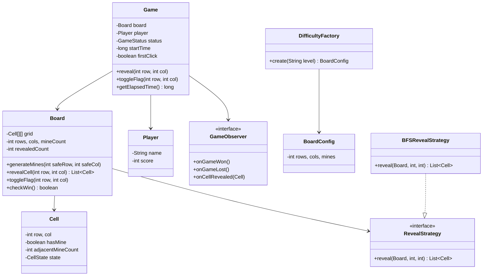

# Minesweeper Game - Low-Level Design

## 1. Problem Statement
Design a Minesweeper game supporting multiple difficulty levels, flood-fill reveal, first-click safety, flagging, timer, and win/loss detection.

## 2. UML Class Diagram


## 3. Design Patterns
- **Factory**: `DifficultyFactory` creates board configurations for Easy/Medium/Hard
- **Strategy**: `RevealStrategy` allows swapping BFS/DFS flood-fill algorithms
- **Observer**: `GameObserver` notifies UI of game state changes

## 4. SOLID Principles
- **SRP**: Cell manages state, Board manages grid logic, Game orchestrates flow
- **OCP**: New difficulties/reveal strategies added without modifying existing code
- **LSP**: Any RevealStrategy implementation works interchangeably
- **ISP**: GameObserver has focused callbacks
- **DIP**: Board depends on RevealStrategy interface, not concrete implementation

## 5. Java Implementation

```java
// === Enums ===
public enum CellState { HIDDEN, REVEALED, FLAGGED }
public enum GameStatus { IN_PROGRESS, WON, LOST }

// === Models ===
public class Cell {
    private final int row, col;
    private boolean hasMine;
    private int adjacentMineCount;
    private CellState state;

    public Cell(int row, int col) {
        this.row = row; this.col = col;
        this.state = CellState.HIDDEN;
    }
    // getters/setters
    public boolean isHidden() { return state == CellState.HIDDEN; }
    public boolean isFlagged() { return state == CellState.FLAGGED; }
    public boolean isRevealed() { return state == CellState.REVEALED; }
    public int getRow() { return row; }
    public int getCol() { return col; }
    public boolean hasMine() { return hasMine; }
    public void setHasMine(boolean m) { hasMine = m; }
    public int getAdjacentMineCount() { return adjacentMineCount; }
    public void setAdjacentMineCount(int c) { adjacentMineCount = c; }
    public CellState getState() { return state; }
    public void setState(CellState s) { state = s; }
}

public class BoardConfig {
    private final int rows, cols, mines;
    public BoardConfig(int rows, int cols, int mines) {
        this.rows = rows; this.cols = cols; this.mines = mines;
    }
    public int getRows() { return rows; }
    public int getCols() { return cols; }
    public int getMines() { return mines; }
}

public class Player {
    private final String name;
    private int score;
    public Player(String name) { this.name = name; }
    public String getName() { return name; }
    public int getScore() { return score; }
    public void setScore(int s) { score = s; }
}

// === Factory ===
public class DifficultyFactory {
    public static BoardConfig create(String level) {
        return switch (level.toUpperCase()) {
            case "EASY" -> new BoardConfig(9, 9, 10);
            case "MEDIUM" -> new BoardConfig(16, 16, 40);
            case "HARD" -> new BoardConfig(30, 16, 99);
            default -> throw new IllegalArgumentException("Unknown: " + level);
        };
    }
}

// === Observer ===
public interface GameObserver {
    void onGameWon();
    void onGameLost();
    void onCellRevealed(Cell cell);
}

// === Strategy ===
public interface RevealStrategy {
    List<Cell> reveal(Cell[][] grid, int rows, int cols, int row, int col);
}

public class BFSRevealStrategy implements RevealStrategy {
    private static final int[][] DIRS = {
        {-1,-1},{-1,0},{-1,1},{0,-1},{0,1},{1,-1},{1,0},{1,1}
    };

    @Override
    public List<Cell> reveal(Cell[][] grid, int rows, int cols, int row, int col) {
        List<Cell> revealed = new ArrayList<>();
        Queue<int[]> queue = new LinkedList<>();
        queue.offer(new int[]{row, col});
        grid[row][col].setState(CellState.REVEALED);
        revealed.add(grid[row][col]);

        while (!queue.isEmpty()) {
            int[] curr = queue.poll();
            if (grid[curr[0]][curr[1]].getAdjacentMineCount() > 0) continue;
            for (int[] d : DIRS) {
                int nr = curr[0] + d[0], nc = curr[1] + d[1];
                if (nr >= 0 && nr < rows && nc >= 0 && nc < cols
                        && grid[nr][nc].isHidden()) {
                    grid[nr][nc].setState(CellState.REVEALED);
                    revealed.add(grid[nr][nc]);
                    if (grid[nr][nc].getAdjacentMineCount() == 0) {
                        queue.offer(new int[]{nr, nc});
                    }
                }
            }
        }
        return revealed;
    }
}

// === Board ===
public class Board {
    private final Cell[][] grid;
    private final int rows, cols, mineCount;
    private int revealedCount;
    private final RevealStrategy revealStrategy;

    public Board(BoardConfig config, RevealStrategy strategy) {
        this.rows = config.getRows(); this.cols = config.getCols();
        this.mineCount = config.getMines();
        this.revealStrategy = strategy;
        this.grid = new Cell[rows][cols];
        for (int i = 0; i < rows; i++)
            for (int j = 0; j < cols; j++)
                grid[i][j] = new Cell(i, j);
    }

    public void generateMines(int safeRow, int safeCol) {
        Random rand = new Random();
        int placed = 0;
        while (placed < mineCount) {
            int r = rand.nextInt(rows), c = rand.nextInt(cols);
            if (grid[r][c].hasMine() || (Math.abs(r - safeRow) <= 1 && Math.abs(c - safeCol) <= 1))
                continue;
            grid[r][c].setHasMine(true);
            placed++;
        }
        calculateAdjacentCounts();
    }

    private void calculateAdjacentCounts() {
        int[][] dirs = {{-1,-1},{-1,0},{-1,1},{0,-1},{0,1},{1,-1},{1,0},{1,1}};
        for (int i = 0; i < rows; i++)
            for (int j = 0; j < cols; j++) {
                if (grid[i][j].hasMine()) continue;
                int count = 0;
                for (int[] d : dirs) {
                    int nr = i + d[0], nc = j + d[1];
                    if (nr >= 0 && nr < rows && nc >= 0 && nc < cols && grid[nr][nc].hasMine())
                        count++;
                }
                grid[i][j].setAdjacentMineCount(count);
            }
    }

    public List<Cell> revealCell(int row, int col) {
        if (!grid[row][col].isHidden()) return Collections.emptyList();
        if (grid[row][col].hasMine()) {
            grid[row][col].setState(CellState.REVEALED);
            return List.of(grid[row][col]);
        }
        List<Cell> revealed = revealStrategy.reveal(grid, rows, cols, row, col);
        revealedCount += revealed.size();
        return revealed;
    }

    public void toggleFlag(int row, int col) {
        Cell cell = grid[row][col];
        if (cell.isRevealed()) return;
        cell.setState(cell.isFlagged() ? CellState.HIDDEN : CellState.FLAGGED);
    }

    public boolean checkWin() {
        return revealedCount == (rows * cols - mineCount);
    }

    public Cell getCell(int r, int c) { return grid[r][c]; }
    public int getRows() { return rows; }
    public int getCols() { return cols; }
}

// === Game ===
public class Game {
    private final Board board;
    private final Player player;
    private GameStatus status;
    private long startTime;
    private boolean firstClick;
    private final List<GameObserver> observers = new ArrayList<>();

    public Game(String difficulty, Player player) {
        BoardConfig config = DifficultyFactory.create(difficulty);
        this.board = new Board(config, new BFSRevealStrategy());
        this.player = player;
        this.status = GameStatus.IN_PROGRESS;
        this.firstClick = true;
    }

    public void addObserver(GameObserver o) { observers.add(o); }

    public void reveal(int row, int col) {
        if (status != GameStatus.IN_PROGRESS) return;
        if (firstClick) {
            board.generateMines(row, col); // first-click safety
            startTime = System.currentTimeMillis();
            firstClick = false;
        }
        List<Cell> revealed = board.revealCell(row, col);
        if (!revealed.isEmpty() && revealed.get(0).hasMine()) {
            status = GameStatus.LOST;
            observers.forEach(GameObserver::onGameLost);
        } else {
            revealed.forEach(c -> observers.forEach(o -> o.onCellRevealed(c)));
            if (board.checkWin()) {
                status = GameStatus.WON;
                player.setScore((int) getElapsedTime());
                observers.forEach(GameObserver::onGameWon);
            }
        }
    }

    public void toggleFlag(int row, int col) {
        if (status != GameStatus.IN_PROGRESS) return;
        board.toggleFlag(row, col);
    }

    public long getElapsedTime() {
        return (System.currentTimeMillis() - startTime) / 1000;
    }

    public GameStatus getStatus() { return status; }
    public Board getBoard() { return board; }
}
```

## 6. BFS Flood Fill Algorithm
```
reveal(row, col):
  if cell has mine → game over
  queue = [(row, col)], mark revealed
  while queue not empty:
    curr = dequeue
    if curr.adjacentMineCount > 0 → skip expanding
    for each 8-neighbor:
      if valid & hidden:
        mark revealed, add to result
        if neighbor.adjacentMineCount == 0 → enqueue
```
**Time**: O(rows × cols) worst case | **Space**: O(rows × cols) for queue

## 7. Key Interview Points
- **First-click safety**: Mines generated AFTER first click, ensuring safe zone (3×3 around click)
- **Flood fill**: BFS preferred over DFS to avoid stack overflow on large boards
- **Win condition**: revealed count == total cells - mine count (O(1) check)
- **Strategy pattern**: Allows switching BFS/DFS without touching Board logic
- **Thread safety**: Timer runs independently; game state mutations should be synchronized in concurrent contexts
- **Edge cases**: Flagged cells can't be revealed; already-revealed cells are no-ops
