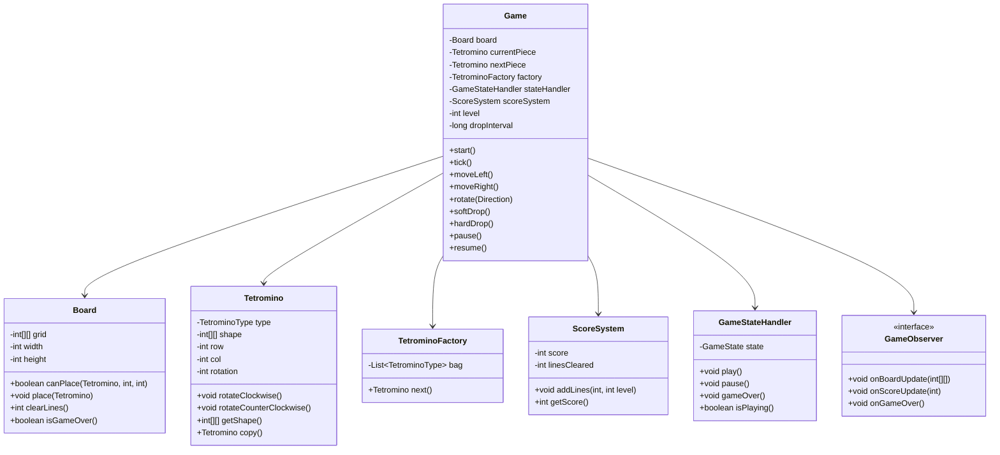

# Low-Level Design: Tetris Game

## 1. Problem Statement
Design a Tetris game supporting piece generation (7-bag randomizer), rotation with wall kicks, collision detection, line clearing, scoring (single/double/triple/tetris), level progression with speed increase, and game state management.

## 2. UML Class Diagram


## 3. Design Patterns
| Pattern | Usage |
|---------|-------|
| **Factory** | `TetrominoFactory` creates pieces using 7-bag randomizer |
| **State** | `GameStateHandler` manages PLAYING/PAUSED/GAME_OVER transitions |
| **Observer** | `GameObserver` notifies UI of board/score changes |
| **Strategy** | `RotationStrategy` for wall kick logic (SRS vs basic) |

## 4. SOLID Principles
- **SRP**: Board handles grid logic, ScoreSystem handles scoring, Factory handles piece generation
- **OCP**: New piece types or rotation systems via new strategies without modifying existing code
- **LSP**: All tetrominoes behave uniformly through the Tetromino class
- **ISP**: GameObserver has focused callbacks
- **DIP**: Game depends on abstractions (observer interface, rotation strategy)

## 5. Complete Java Implementation

```java
// ==================== Enums ====================
public enum TetrominoType {
    I, O, T, S, Z, L, J
}

public enum Direction {
    CLOCKWISE, COUNTERCLOCKWISE
}

public enum GameState {
    PLAYING, PAUSED, GAME_OVER
}

// ==================== Tetromino ====================
public class Tetromino {
    private TetrominoType type;
    private int[][][] rotations; // all 4 rotation states
    private int rotationIndex;
    private int row, col;

    private static final Map<TetrominoType, int[][][]> SHAPES = Map.of(
        TetrominoType.I, new int[][][]{
            {{0,0,0,0},{1,1,1,1},{0,0,0,0},{0,0,0,0}},
            {{0,0,1,0},{0,0,1,0},{0,0,1,0},{0,0,1,0}},
            {{0,0,0,0},{0,0,0,0},{1,1,1,1},{0,0,0,0}},
            {{0,1,0,0},{0,1,0,0},{0,1,0,0},{0,1,0,0}}
        },
        TetrominoType.O, new int[][][]{
            {{1,1},{1,1}},{{1,1},{1,1}},{{1,1},{1,1}},{{1,1},{1,1}}
        },
        TetrominoType.T, new int[][][]{
            {{0,1,0},{1,1,1},{0,0,0}},
            {{0,1,0},{0,1,1},{0,1,0}},
            {{0,0,0},{1,1,1},{0,1,0}},
            {{0,1,0},{1,1,0},{0,1,0}}
        },
        TetrominoType.S, new int[][][]{
            {{0,1,1},{1,1,0},{0,0,0}},
            {{0,1,0},{0,1,1},{0,0,1}},
            {{0,0,0},{0,1,1},{1,1,0}},
            {{1,0,0},{1,1,0},{0,1,0}}
        },
        TetrominoType.Z, new int[][][]{
            {{1,1,0},{0,1,1},{0,0,0}},
            {{0,0,1},{0,1,1},{0,1,0}},
            {{0,0,0},{1,1,0},{0,1,1}},
            {{0,1,0},{1,1,0},{1,0,0}}
        },
        TetrominoType.L, new int[][][]{
            {{0,0,1},{1,1,1},{0,0,0}},
            {{0,1,0},{0,1,0},{0,1,1}},
            {{0,0,0},{1,1,1},{1,0,0}},
            {{1,1,0},{0,1,0},{0,1,0}}
        },
        TetrominoType.J, new int[][][]{
            {{1,0,0},{1,1,1},{0,0,0}},
            {{0,1,1},{0,1,0},{0,1,0}},
            {{0,0,0},{1,1,1},{0,0,1}},
            {{0,1,0},{0,1,0},{1,1,0}}
        }
    );

    public Tetromino(TetrominoType type) {
        this.type = type;
        this.rotations = SHAPES.get(type);
        this.rotationIndex = 0;
        this.row = 0;
        this.col = 3; // spawn center
    }

    public int[][] getShape() { return rotations[rotationIndex]; }
    public TetrominoType getType() { return type; }
    public int getRow() { return row; }
    public int getCol() { return col; }
    public int getRotationIndex() { return rotationIndex; }

    public void move(int dRow, int dCol) { row += dRow; col += dCol; }

    public void rotate(Direction dir) {
        if (dir == Direction.CLOCKWISE) {
            rotationIndex = (rotationIndex + 1) % 4;
        } else {
            rotationIndex = (rotationIndex + 3) % 4;
        }
    }

    public Tetromino copy() {
        Tetromino t = new Tetromino(this.type);
        t.row = this.row;
        t.col = this.col;
        t.rotationIndex = this.rotationIndex;
        return t;
    }
}

// ==================== Board ====================
public class Board {
    private static final int WIDTH = 10;
    private static final int HEIGHT = 20;
    private int[][] grid;

    public Board() {
        grid = new int[HEIGHT][WIDTH];
    }

    public boolean canPlace(Tetromino piece, int row, int col) {
        int[][] shape = piece.getShape();
        for (int r = 0; r < shape.length; r++) {
            for (int c = 0; c < shape[0].length; c++) {
                if (shape[r][c] == 0) continue;
                int newR = row + r, newC = col + c;
                if (newR < 0 || newR >= HEIGHT || newC < 0 || newC >= WIDTH) return false;
                if (grid[newR][newC] != 0) return false;
            }
        }
        return true;
    }

    public boolean canPlace(Tetromino piece) {
        return canPlace(piece, piece.getRow(), piece.getCol());
    }

    public void place(Tetromino piece) {
        int[][] shape = piece.getShape();
        int typeVal = piece.getType().ordinal() + 1;
        for (int r = 0; r < shape.length; r++) {
            for (int c = 0; c < shape[0].length; c++) {
                if (shape[r][c] == 1) {
                    grid[piece.getRow() + r][piece.getCol() + c] = typeVal;
                }
            }
        }
    }

    public int clearLines() {
        int cleared = 0;
        for (int r = HEIGHT - 1; r >= 0; r--) {
            if (isLineFull(r)) {
                removeLine(r);
                cleared++;
                r++; // recheck same row
            }
        }
        return cleared;
    }

    private boolean isLineFull(int row) {
        for (int c = 0; c < WIDTH; c++) {
            if (grid[row][c] == 0) return false;
        }
        return true;
    }

    private void removeLine(int row) {
        for (int r = row; r > 0; r--) {
            grid[r] = Arrays.copyOf(grid[r - 1], WIDTH);
        }
        grid[0] = new int[WIDTH];
    }

    public boolean isGameOver() {
        for (int c = 0; c < WIDTH; c++) {
            if (grid[0][c] != 0 || grid[1][c] != 0) return true;
        }
        return false;
    }

    public int[][] getGrid() { return grid; }
    public int getWidth() { return WIDTH; }
    public int getHeight() { return HEIGHT; }
}

// ==================== Wall Kick (SRS) ====================
public class WallKickData {
    // Standard SRS wall kick offsets for non-I pieces
    private static final int[][][] KICK_OFFSETS = {
        // 0->1: {{0,0},{-1,0},{-1,1},{0,-2},{-1,-2}}
        {{0,0},{-1,0},{-1,1},{0,-2},{-1,-2}},
        // 1->2
        {{0,0},{1,0},{1,-1},{0,2},{1,2}},
        // 2->3
        {{0,0},{1,0},{1,1},{0,-2},{1,-2}},
        // 3->0
        {{0,0},{-1,0},{-1,-1},{0,2},{-1,2}}
    };

    public static int[][] getKicks(int fromRotation, Direction dir) {
        int index = (dir == Direction.CLOCKWISE) ? fromRotation : (fromRotation + 3) % 4;
        return KICK_OFFSETS[index];
    }
}

// ==================== Factory (7-Bag Randomizer) ====================
public class TetrominoFactory {
    private Queue<TetrominoType> bag = new LinkedList<>();
    private Random random = new Random();

    public Tetromino next() {
        if (bag.isEmpty()) refillBag();
        return new Tetromino(bag.poll());
    }

    private void refillBag() {
        List<TetrominoType> types = new ArrayList<>(Arrays.asList(TetrominoType.values()));
        Collections.shuffle(types, random);
        bag.addAll(types);
    }

    public Tetromino peek() {
        if (bag.isEmpty()) refillBag();
        return new Tetromino(bag.peek());
    }
}

// ==================== Score System ====================
public class ScoreSystem {
    private int score;
    private int totalLinesCleared;
    private static final int[] LINE_SCORES = {0, 100, 300, 500, 800}; // 0,1,2,3,4 lines

    public void addLines(int lines, int level) {
        if (lines > 0 && lines <= 4) {
            score += LINE_SCORES[lines] * (level + 1);
            totalLinesCleared += lines;
        }
    }

    public void addSoftDrop(int cells) { score += cells; }
    public void addHardDrop(int cells) { score += cells * 2; }
    public int getScore() { return score; }
    public int getTotalLinesCleared() { return totalLinesCleared; }
    public int getLevel() { return totalLinesCleared / 10; }
}

// ==================== State Handler ====================
public class GameStateHandler {
    private GameState state = GameState.PLAYING;

    public void play() { state = GameState.PLAYING; }
    public void pause() { if (state == GameState.PLAYING) state = GameState.PAUSED; }
    public void resume() { if (state == GameState.PAUSED) state = GameState.PLAYING; }
    public void gameOver() { state = GameState.GAME_OVER; }
    public boolean isPlaying() { return state == GameState.PLAYING; }
    public GameState getState() { return state; }
}

// ==================== Observer ====================
public interface GameObserver {
    void onBoardUpdate(int[][] grid);
    void onScoreUpdate(int score, int level, int lines);
    void onNextPiece(TetrominoType type);
    void onGameOver(int finalScore);
}

// ==================== Game (Main Controller) ====================
public class Game {
    private Board board;
    private Tetromino currentPiece;
    private Tetromino nextPiece;
    private TetrominoFactory factory;
    private ScoreSystem scoreSystem;
    private GameStateHandler stateHandler;
    private List<GameObserver> observers = new ArrayList<>();

    public Game() {
        board = new Board();
        factory = new TetrominoFactory();
        scoreSystem = new ScoreSystem();
        stateHandler = new GameStateHandler();
        spawnNext();
        spawnNext();
    }

    public void addObserver(GameObserver o) { observers.add(o); }

    private void spawnNext() {
        currentPiece = (nextPiece != null) ? nextPiece : factory.next();
        nextPiece = factory.next();
        if (!board.canPlace(currentPiece)) {
            stateHandler.gameOver();
            observers.forEach(o -> o.onGameOver(scoreSystem.getScore()));
        }
        observers.forEach(o -> o.onNextPiece(nextPiece.getType()));
    }

    // Game loop tick - called at interval based on level
    public void tick() {
        if (!stateHandler.isPlaying()) return;
        if (!tryMove(1, 0)) {
            lockPiece();
        }
    }

    public void moveLeft() { if (stateHandler.isPlaying()) tryMove(0, -1); }
    public void moveRight() { if (stateHandler.isPlaying()) tryMove(0, 1); }

    public void softDrop() {
        if (stateHandler.isPlaying() && tryMove(1, 0)) {
            scoreSystem.addSoftDrop(1);
        }
    }

    public void hardDrop() {
        if (!stateHandler.isPlaying()) return;
        int dropped = 0;
        while (tryMove(1, 0)) dropped++;
        scoreSystem.addHardDrop(dropped);
        lockPiece();
    }

    public void rotate(Direction dir) {
        if (!stateHandler.isPlaying()) return;
        int origRotation = currentPiece.getRotationIndex();
        currentPiece.rotate(dir);

        // Try wall kicks
        int[][] kicks = WallKickData.getKicks(origRotation, dir);
        for (int[] kick : kicks) {
            int newRow = currentPiece.getRow() + kick[1];
            int newCol = currentPiece.getCol() + kick[0];
            if (board.canPlace(currentPiece, newRow, newCol)) {
                currentPiece.move(kick[1], kick[0]);
                notifyBoardUpdate();
                return;
            }
        }
        // All kicks failed, revert
        currentPiece.rotate(dir == Direction.CLOCKWISE ?
            Direction.COUNTERCLOCKWISE : Direction.CLOCKWISE);
    }

    private boolean tryMove(int dRow, int dCol) {
        Tetromino test = currentPiece.copy();
        test.move(dRow, dCol);
        if (board.canPlace(test)) {
            currentPiece.move(dRow, dCol);
            notifyBoardUpdate();
            return true;
        }
        return false;
    }

    private void lockPiece() {
        board.place(currentPiece);
        int cleared = board.clearLines();
        if (cleared > 0) {
            scoreSystem.addLines(cleared, scoreSystem.getLevel());
            observers.forEach(o -> o.onScoreUpdate(
                scoreSystem.getScore(), scoreSystem.getLevel(), scoreSystem.getTotalLinesCleared()));
        }
        spawnNext();
        notifyBoardUpdate();
    }

    public void pause() { stateHandler.pause(); }
    public void resume() { stateHandler.resume(); }

    public long getDropInterval() {
        // Speed increases with level: roughly frames = (0.8 - level*0.007)^level * 1000ms
        int level = scoreSystem.getLevel();
        return Math.max(100, 1000 - (level * 80));
    }

    private void notifyBoardUpdate() {
        observers.forEach(o -> o.onBoardUpdate(board.getGrid()));
    }
}
```

## 6. Key Interview Points

| Topic | Detail |
|-------|--------|
| **7-Bag Randomizer** | Shuffle all 7 pieces, deal in order, reshuffle on empty — guarantees no drought >12 pieces |
| **SRS Wall Kicks** | 5 offset tests per rotation attempt; prevents pieces getting stuck at walls |
| **Collision Detection** | O(shape_size) check against grid bounds and occupied cells |
| **Line Clearing** | Bottom-up scan, shift rows down on clear, O(H*W) |
| **Scoring** | NES-style: 100/300/500/800 * (level+1) for 1/2/3/4 lines |
| **Level Progression** | Every 10 lines increases level, reduces drop interval |
| **Lock Delay** | Real Tetris has lock delay (500ms) before piece locks — extend on successful move |
| **Ghost Piece** | Hard-drop preview: project piece downward until collision |
| **Game Loop** | Timer-based tick at `getDropInterval()` ms; input handling separate from gravity |
| **Thread Safety** | Synchronize input handlers and tick if multithreaded |
| **Extensibility** | Add hold piece, T-spin detection, multiplayer via observer pattern |
