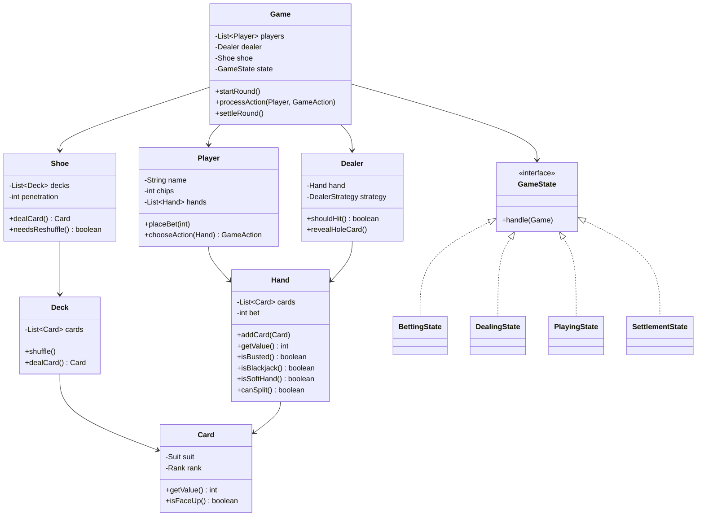

# Blackjack Card Game - Low-Level Design

## 1. Problem Statement
Design a Blackjack card game supporting multiple players, betting, dealer AI, hand splitting, and standard casino rules with proper game state management.

## 2. UML Class Diagram



## 3. Design Patterns

| Pattern | Usage |
|---------|-------|
| **Strategy** | DealerStrategy for hit/stand logic; PlayerStrategy for AI players |
| **State** | Game flow: Betting → Dealing → Playing → Settlement |
| **Observer** | Notify UI/logger on game events (card dealt, bust, blackjack) |
| **Template Method** | Base round flow with hooks for custom rules |

## 4. SOLID Principles
- **SRP**: Hand calculates value, Game manages flow, Dealer has strategy
- **OCP**: New actions/strategies without modifying Game
- **LSP**: All GameState implementations are interchangeable
- **ISP**: Player interface separated from Dealer interface
- **DIP**: Game depends on abstractions (GameState, Strategy interfaces)

## 5. Complete Java Implementation

```java
// ============ Enums ============
enum Suit { HEARTS, DIAMONDS, CLUBS, SPADES }

enum Rank {
    ACE(11), TWO(2), THREE(3), FOUR(4), FIVE(5), SIX(6), SEVEN(7),
    EIGHT(8), NINE(9), TEN(10), JACK(10), QUEEN(10), KING(10);
    
    private final int value;
    Rank(int value) { this.value = value; }
    public int getValue() { return value; }
}

enum GameAction { HIT, STAND, DOUBLE_DOWN, SPLIT, SURRENDER }

// ============ Card ============
class Card {
    private final Suit suit;
    private final Rank rank;
    private boolean faceUp;

    public Card(Suit suit, Rank rank) {
        this.suit = suit;
        this.rank = rank;
        this.faceUp = true;
    }

    public int getValue() { return rank.getValue(); }
    public Rank getRank() { return rank; }
    public boolean isFaceUp() { return faceUp; }
    public void setFaceUp(boolean faceUp) { this.faceUp = faceUp; }
}

// ============ Deck & Shoe ============
class Deck {
    private List<Card> cards = new ArrayList<>();

    public Deck() {
        for (Suit s : Suit.values())
            for (Rank r : Rank.values())
                cards.add(new Card(s, r));
    }

    public void shuffle() { Collections.shuffle(cards); }
    public Card dealCard() { return cards.remove(cards.size() - 1); }
    public int remaining() { return cards.size(); }
}

class Shoe {
    private List<Card> cards = new ArrayList<>();
    private final int numDecks;
    private final double penetration; // reshuffle threshold

    public Shoe(int numDecks, double penetration) {
        this.numDecks = numDecks;
        this.penetration = penetration;
        reshuffle();
    }

    public void reshuffle() {
        cards.clear();
        for (int i = 0; i < numDecks; i++) {
            Deck deck = new Deck();
            for (Suit s : Suit.values())
                for (Rank r : Rank.values())
                    cards.add(new Card(s, r));
        }
        Collections.shuffle(cards);
    }

    public Card dealCard() { return cards.remove(cards.size() - 1); }

    public boolean needsReshuffle() {
        int total = numDecks * 52;
        return cards.size() < total * (1 - penetration);
    }
}

// ============ Hand ============
class Hand {
    private List<Card> cards = new ArrayList<>();
    private int bet;

    public Hand(int bet) { this.bet = bet; }

    public void addCard(Card card) { cards.add(card); }

    public int getValue() {
        int sum = 0, aces = 0;
        for (Card c : cards) {
            sum += c.getValue();
            if (c.getRank() == Rank.ACE) aces++;
        }
        while (sum > 21 && aces > 0) { sum -= 10; aces--; }
        return sum;
    }

    public boolean isBusted() { return getValue() > 21; }
    public boolean isBlackjack() { return cards.size() == 2 && getValue() == 21; }
    public boolean isSoftHand() {
        int sum = 0, aces = 0;
        for (Card c : cards) { sum += c.getValue(); if (c.getRank() == Rank.ACE) aces++; }
        return aces > 0 && sum <= 21;
    }

    public boolean canSplit() {
        return cards.size() == 2 && cards.get(0).getRank() == cards.get(1).getRank();
    }

    public Card removeCard() { return cards.remove(cards.size() - 1); }
    public int getBet() { return bet; }
    public void doubleBet() { bet *= 2; }
    public List<Card> getCards() { return cards; }
    public int size() { return cards.size(); }
}

// ============ Observer ============
interface GameObserver {
    void onCardDealt(String playerName, Card card);
    void onBust(String playerName);
    void onBlackjack(String playerName);
    void onRoundResult(String playerName, int payout);
}

// ============ Player ============
class Player {
    private String name;
    private int chips;
    private List<Hand> hands = new ArrayList<>();
    private PlayerStrategy strategy;

    public Player(String name, int chips, PlayerStrategy strategy) {
        this.name = name;
        this.chips = chips;
        this.strategy = strategy;
    }

    public void placeBet(int amount) {
        chips -= amount;
        hands.clear();
        hands.add(new Hand(amount));
    }

    public GameAction chooseAction(Hand hand, Card dealerUpCard) {
        return strategy.decide(hand, dealerUpCard);
    }

    public void split(Hand hand) {
        Card splitCard = hand.removeCard();
        Hand newHand = new Hand(hand.getBet());
        chips -= hand.getBet();
        newHand.addCard(splitCard);
        hands.add(newHand);
    }

    public void addChips(int amount) { chips += amount; }
    public String getName() { return name; }
    public int getChips() { return chips; }
    public List<Hand> getHands() { return hands; }
}

// ============ Strategy ============
interface PlayerStrategy {
    GameAction decide(Hand hand, Card dealerUpCard);
}

interface DealerStrategy {
    boolean shouldHit(Hand hand);
}

class StandardDealerStrategy implements DealerStrategy {
    @Override
    public boolean shouldHit(Hand hand) {
        return hand.getValue() < 17; // must hit on 16, stand on 17
    }
}

class BasicPlayerStrategy implements PlayerStrategy {
    @Override
    public GameAction decide(Hand hand, Card dealerUpCard) {
        if (hand.getValue() < 12) return GameAction.HIT;
        if (hand.getValue() >= 17) return GameAction.STAND;
        if (dealerUpCard.getValue() >= 7) return GameAction.HIT;
        return GameAction.STAND;
    }
}

// ============ Dealer ============
class Dealer {
    private Hand hand;
    private DealerStrategy strategy;

    public Dealer(DealerStrategy strategy) {
        this.strategy = strategy;
    }

    public void newHand() { hand = new Hand(0); }
    public Hand getHand() { return hand; }
    public boolean shouldHit() { return strategy.shouldHit(hand); }

    public Card getUpCard() {
        return hand.getCards().stream().filter(Card::isFaceUp).findFirst().orElse(null);
    }

    public void revealHoleCard() {
        hand.getCards().forEach(c -> c.setFaceUp(true));
    }
}

// ============ State Pattern ============
interface GameState {
    void handle(Game game);
}

class BettingState implements GameState {
    @Override
    public void handle(Game game) {
        for (Player p : game.getPlayers()) {
            int bet = game.getMinBet(); // simplified
            p.placeBet(bet);
        }
        game.setState(new DealingState());
    }
}

class DealingState implements GameState {
    @Override
    public void handle(Game game) {
        Shoe shoe = game.getShoe();
        Dealer dealer = game.getDealer();
        dealer.newHand();

        // Deal 2 cards to each player and dealer
        for (int i = 0; i < 2; i++) {
            for (Player p : game.getPlayers()) {
                p.getHands().get(0).addCard(shoe.dealCard());
            }
            Card dealerCard = shoe.dealCard();
            if (i == 1) dealerCard.setFaceUp(false); // hole card
            dealer.getHand().addCard(dealerCard);
        }
        game.setState(new PlayingState());
    }
}

class PlayingState implements GameState {
    @Override
    public void handle(Game game) {
        Card dealerUpCard = game.getDealer().getUpCard();

        for (Player player : game.getPlayers()) {
            for (Hand hand : player.getHands()) {
                playHand(game, player, hand, dealerUpCard);
            }
        }

        // Dealer plays
        game.getDealer().revealHoleCard();
        while (game.getDealer().shouldHit()) {
            game.getDealer().getHand().addCard(game.getShoe().dealCard());
        }
        game.setState(new SettlementState());
    }

    private void playHand(Game game, Player player, Hand hand, Card dealerUpCard) {
        while (!hand.isBusted()) {
            GameAction action = player.chooseAction(hand, dealerUpCard);
            switch (action) {
                case HIT:
                    hand.addCard(game.getShoe().dealCard());
                    break;
                case STAND:
                    return;
                case DOUBLE_DOWN:
                    hand.doubleBet();
                    player.addChips(-hand.getBet() / 2);
                    hand.addCard(game.getShoe().dealCard());
                    return;
                case SPLIT:
                    if (hand.canSplit()) {
                        player.split(hand);
                        hand.addCard(game.getShoe().dealCard());
                    }
                    break;
                case SURRENDER:
                    player.addChips(hand.getBet() / 2);
                    return;
            }
        }
    }
}

class SettlementState implements GameState {
    @Override
    public void handle(Game game) {
        int dealerValue = game.getDealer().getHand().getValue();
        boolean dealerBusted = game.getDealer().getHand().isBusted();
        boolean dealerBlackjack = game.getDealer().getHand().isBlackjack();

        for (Player player : game.getPlayers()) {
            for (Hand hand : player.getHands()) {
                int payout = calculatePayout(hand, dealerValue, dealerBusted, dealerBlackjack);
                player.addChips(payout);
                game.notifyResult(player.getName(), payout);
            }
        }
        game.setState(new BettingState());
    }

    private int calculatePayout(Hand hand, int dealerVal, boolean dealerBusted, boolean dealerBJ) {
        if (hand.isBusted()) return 0;
        int bet = hand.getBet();

        if (hand.isBlackjack()) {
            if (dealerBJ) return bet;         // push
            return bet + (bet * 3 / 2);       // blackjack pays 3:2
        }
        if (dealerBusted || hand.getValue() > dealerVal) return bet * 2;  // win 1:1
        if (hand.getValue() == dealerVal) return bet;                      // push
        return 0;                                                          // lose
    }
}

// ============ Game ============
class Game {
    private List<Player> players;
    private Dealer dealer;
    private Shoe shoe;
    private GameState state;
    private List<GameObserver> observers = new ArrayList<>();
    private int minBet;

    public Game(List<Player> players, int numDecks, int minBet) {
        this.players = players;
        this.dealer = new Dealer(new StandardDealerStrategy());
        this.shoe = new Shoe(numDecks, 0.75);
        this.minBet = minBet;
        this.state = new BettingState();
    }

    public void playRound() {
        state.handle(this); // Betting
        state.handle(this); // Dealing
        state.handle(this); // Playing
        state.handle(this); // Settlement
        if (shoe.needsReshuffle()) shoe.reshuffle();
    }

    public void addObserver(GameObserver o) { observers.add(o); }
    public void notifyResult(String name, int payout) {
        observers.forEach(o -> o.onRoundResult(name, payout));
    }

    public void setState(GameState state) { this.state = state; }
    public List<Player> getPlayers() { return players; }
    public Dealer getDealer() { return dealer; }
    public Shoe getShoe() { return shoe; }
    public int getMinBet() { return minBet; }
}

// ============ Main ============
public class BlackjackGame {
    public static void main(String[] args) {
        List<Player> players = List.of(
            new Player("Alice", 1000, new BasicPlayerStrategy()),
            new Player("Bob", 1000, new BasicPlayerStrategy())
        );

        Game game = new Game(players, 6, 25);
        game.addObserver(new GameObserver() {
            public void onCardDealt(String n, Card c) { System.out.println(n + " dealt card"); }
            public void onBust(String n) { System.out.println(n + " busted!"); }
            public void onBlackjack(String n) { System.out.println(n + " blackjack!"); }
            public void onRoundResult(String n, int p) { System.out.println(n + " payout: " + p); }
        });

        for (int i = 0; i < 5; i++) game.playRound();
    }
}
```

## 6. Key Interview Points

1. **Ace Handling**: Sum all as 11, then subtract 10 per ace until ≤21
2. **State Pattern**: Clean game flow management without complex conditionals
3. **Strategy Pattern**: Dealer logic and player AI are interchangeable
4. **Shoe vs Deck**: Casino uses 6-8 deck shoe with penetration-based reshuffle
5. **Payout**: Blackjack 3:2, win 1:1, push returns bet, surrender returns half
6. **Split**: Creates new hand with same bet; each hand plays independently
7. **Concurrency**: For online play, synchronize game state; use locks per table
8. **Extensibility**: Add insurance, side bets, card counting detection via observers
