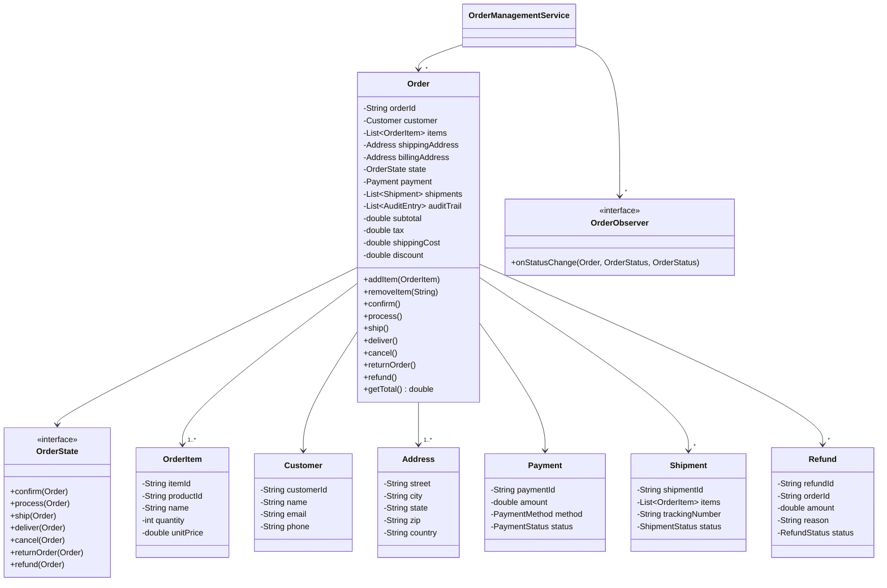
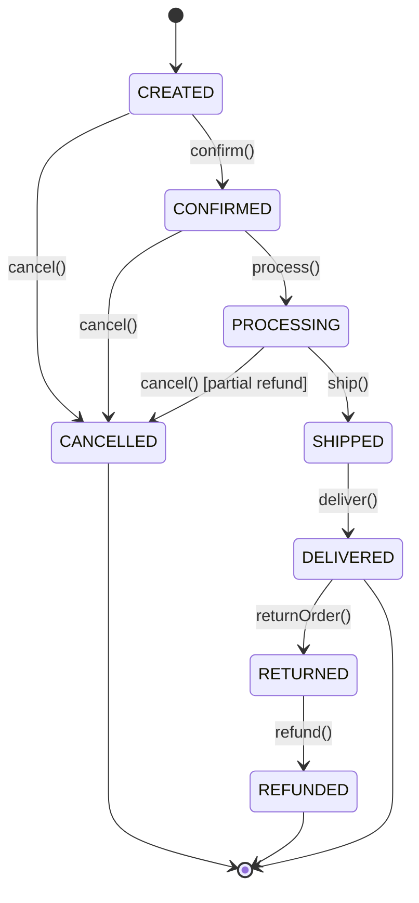

# Order Management System - Low-Level Design

## 1. Problem Statement
Design an Order Management System that handles the complete order lifecycle from creation to delivery/return, supporting split shipments, cancellations, refunds, and order modifications with proper state transitions and audit trails.

## 2. UML Class Diagram


## 3. State Diagram


## 4. Design Patterns
- **State Pattern**: Order lifecycle transitions with validation
- **Builder Pattern**: Complex order construction
- **Observer Pattern**: Status change notifications
- **Strategy Pattern**: Pricing/discount calculation

## 5. Complete Java Implementation

```java
import java.util.*;
import java.time.LocalDateTime;

// ==================== ENUMS ====================
enum OrderStatus {
    CREATED, CONFIRMED, PROCESSING, SHIPPED, DELIVERED, CANCELLED, RETURNED, REFUNDED
}

enum PaymentMethod { CREDIT_CARD, DEBIT_CARD, UPI, WALLET, COD }
enum PaymentStatus { PENDING, COMPLETED, FAILED, REFUNDED }
enum ShipmentStatus { PREPARING, DISPATCHED, IN_TRANSIT, DELIVERED }
enum RefundStatus { INITIATED, PROCESSING, COMPLETED, FAILED }

// ==================== MODELS ====================
class Customer {
    private String customerId, name, email, phone;
    public Customer(String id, String name, String email, String phone) {
        this.customerId = id; this.name = name; this.email = email; this.phone = phone;
    }
    public String getCustomerId() { return customerId; }
    public String getName() { return name; }
    public String getEmail() { return email; }
}

class Address {
    private String street, city, state, zip, country;
    public Address(String street, String city, String state, String zip, String country) {
        this.street = street; this.city = city; this.state = state; this.zip = zip; this.country = country;
    }
    @Override public String toString() { return street + ", " + city + ", " + state + " " + zip; }
}

class OrderItem {
    private String itemId, productId, name;
    private int quantity;
    private double unitPrice;
    public OrderItem(String itemId, String productId, String name, int qty, double price) {
        this.itemId = itemId; this.productId = productId; this.name = name;
        this.quantity = qty; this.unitPrice = price;
    }
    public String getItemId() { return itemId; }
    public String getName() { return name; }
    public int getQuantity() { return quantity; }
    public double getUnitPrice() { return unitPrice; }
    public double getTotal() { return quantity * unitPrice; }
    public void setQuantity(int qty) { this.quantity = qty; }
}

class Payment {
    private String paymentId;
    private double amount;
    private PaymentMethod method;
    private PaymentStatus status;
    public Payment(String id, double amount, PaymentMethod method) {
        this.paymentId = id; this.amount = amount; this.method = method;
        this.status = PaymentStatus.PENDING;
    }
    public void complete() { this.status = PaymentStatus.COMPLETED; }
    public void markRefunded() { this.status = PaymentStatus.REFUNDED; }
    public PaymentStatus getStatus() { return status; }
    public double getAmount() { return amount; }
}

class Shipment {
    private String shipmentId, trackingNumber;
    private List<OrderItem> items;
    private ShipmentStatus status;
    public Shipment(String id, List<OrderItem> items) {
        this.shipmentId = id; this.items = items;
        this.status = ShipmentStatus.PREPARING;
        this.trackingNumber = "TRK-" + UUID.randomUUID().toString().substring(0, 8);
    }
    public void dispatch() { this.status = ShipmentStatus.DISPATCHED; }
    public void deliver() { this.status = ShipmentStatus.DELIVERED; }
    public String getTrackingNumber() { return trackingNumber; }
    public List<OrderItem> getItems() { return items; }
}

class Refund {
    private String refundId, orderId, reason;
    private double amount;
    private RefundStatus status;
    private LocalDateTime createdAt;
    public Refund(String refundId, String orderId, double amount, String reason) {
        this.refundId = refundId; this.orderId = orderId;
        this.amount = amount; this.reason = reason;
        this.status = RefundStatus.INITIATED; this.createdAt = LocalDateTime.now();
    }
    public void process() { this.status = RefundStatus.PROCESSING; }
    public void complete() { this.status = RefundStatus.COMPLETED; }
    public double getAmount() { return amount; }
}

class AuditEntry {
    private LocalDateTime timestamp;
    private String action, details, performedBy;
    public AuditEntry(String action, String details, String performedBy) {
        this.timestamp = LocalDateTime.now();
        this.action = action; this.details = details; this.performedBy = performedBy;
    }
    @Override public String toString() {
        return "[" + timestamp + "] " + action + ": " + details + " by " + performedBy;
    }
}

// ==================== STATE PATTERN ====================
interface OrderState {
    default void confirm(Order o) { throw new IllegalStateException("Cannot confirm in " + this); }
    default void process(Order o) { throw new IllegalStateException("Cannot process in " + this); }
    default void ship(Order o) { throw new IllegalStateException("Cannot ship in " + this); }
    default void deliver(Order o) { throw new IllegalStateException("Cannot deliver in " + this); }
    default void cancel(Order o) { throw new IllegalStateException("Cannot cancel in " + this); }
    default void returnOrder(Order o) { throw new IllegalStateException("Cannot return in " + this); }
    default void refund(Order o) { throw new IllegalStateException("Cannot refund in " + this); }
}

class CreatedState implements OrderState {
    public void confirm(Order o) { o.transitionTo(new ConfirmedState(), OrderStatus.CONFIRMED); }
    public void cancel(Order o) { o.transitionTo(new CancelledState(), OrderStatus.CANCELLED); }
    @Override public String toString() { return "CREATED"; }
}

class ConfirmedState implements OrderState {
    public void process(Order o) { o.transitionTo(new ProcessingState(), OrderStatus.PROCESSING); }
    public void cancel(Order o) { o.transitionTo(new CancelledState(), OrderStatus.CANCELLED); }
    @Override public String toString() { return "CONFIRMED"; }
}

class ProcessingState implements OrderState {
    public void ship(Order o) { o.transitionTo(new ShippedState(), OrderStatus.SHIPPED); }
    public void cancel(Order o) {
        // Partial refund for processing cancellation
        o.transitionTo(new CancelledState(), OrderStatus.CANCELLED);
    }
    @Override public String toString() { return "PROCESSING"; }
}

class ShippedState implements OrderState {
    public void deliver(Order o) { o.transitionTo(new DeliveredState(), OrderStatus.DELIVERED); }
    // Cannot cancel after shipping
    @Override public String toString() { return "SHIPPED"; }
}

class DeliveredState implements OrderState {
    public void returnOrder(Order o) { o.transitionTo(new ReturnedState(), OrderStatus.RETURNED); }
    @Override public String toString() { return "DELIVERED"; }
}

class ReturnedState implements OrderState {
    public void refund(Order o) { o.transitionTo(new RefundedState(), OrderStatus.REFUNDED); }
    @Override public String toString() { return "RETURNED"; }
}

class CancelledState implements OrderState {
    @Override public String toString() { return "CANCELLED"; }
}

class RefundedState implements OrderState {
    @Override public String toString() { return "REFUNDED"; }
}

// ==================== OBSERVER PATTERN ====================
interface OrderObserver {
    void onStatusChange(Order order, OrderStatus from, OrderStatus to);
}

class EmailNotificationObserver implements OrderObserver {
    public void onStatusChange(Order order, OrderStatus from, OrderStatus to) {
        System.out.println("[EMAIL] Order " + order.getOrderId() + " status: " + from + " -> " + to
            + " | Notifying: " + order.getCustomer().getEmail());
    }
}

class SMSNotificationObserver implements OrderObserver {
    public void onStatusChange(Order order, OrderStatus from, OrderStatus to) {
        System.out.println("[SMS] Order " + order.getOrderId() + " moved to " + to);
    }
}

class InventoryObserver implements OrderObserver {
    public void onStatusChange(Order order, OrderStatus from, OrderStatus to) {
        if (to == OrderStatus.CANCELLED || to == OrderStatus.RETURNED) {
            System.out.println("[INVENTORY] Restocking items for order " + order.getOrderId());
        }
    }
}

// ==================== STRATEGY PATTERN (Pricing) ====================
interface PricingStrategy {
    double calculateDiscount(double subtotal, Customer customer);
}

class StandardPricing implements PricingStrategy {
    public double calculateDiscount(double subtotal, Customer customer) { return 0; }
}

class PremiumPricing implements PricingStrategy {
    public double calculateDiscount(double subtotal, Customer customer) {
        return subtotal * 0.10; // 10% for premium
    }
}

class BulkPricing implements PricingStrategy {
    public double calculateDiscount(double subtotal, Customer customer) {
        return subtotal > 1000 ? subtotal * 0.15 : subtotal * 0.05;
    }
}

// ==================== ORDER (Core Entity) ====================
class Order {
    private String orderId;
    private Customer customer;
    private List<OrderItem> items;
    private Address shippingAddress, billingAddress;
    private OrderState state;
    private OrderStatus status;
    private Payment payment;
    private List<Shipment> shipments;
    private List<Refund> refunds;
    private List<AuditEntry> auditTrail;
    private List<OrderObserver> observers;
    private double tax, shippingCost, discount;
    private LocalDateTime createdAt, updatedAt;

    Order(String orderId, Customer customer, List<OrderItem> items,
          Address shippingAddr, Address billingAddr) {
        this.orderId = orderId; this.customer = customer; this.items = new ArrayList<>(items);
        this.shippingAddress = shippingAddr; this.billingAddress = billingAddr;
        this.state = new CreatedState(); this.status = OrderStatus.CREATED;
        this.shipments = new ArrayList<>(); this.refunds = new ArrayList<>();
        this.auditTrail = new ArrayList<>(); this.observers = new ArrayList<>();
        this.createdAt = LocalDateTime.now(); this.updatedAt = createdAt;
        addAudit("ORDER_CREATED", "Order created with " + items.size() + " items", "SYSTEM");
    }

    public void addObserver(OrderObserver obs) { observers.add(obs); }

    public void transitionTo(OrderState newState, OrderStatus newStatus) {
        OrderStatus oldStatus = this.status;
        this.state = newState;
        this.status = newStatus;
        this.updatedAt = LocalDateTime.now();
        addAudit("STATUS_CHANGE", oldStatus + " -> " + newStatus, "SYSTEM");
        observers.forEach(o -> o.onStatusChange(this, oldStatus, newStatus));
    }

    public void confirm() { state.confirm(this); }
    public void process() { state.process(this); }
    public void ship() { state.ship(this); }
    public void deliver() { state.deliver(this); }
    public void cancel() { state.cancel(this); }
    public void returnOrder() { state.returnOrder(this); }
    public void refund() { state.refund(this); }

    // Order modification - only before PROCESSING
    public void modifyItem(String itemId, int newQty) {
        if (status != OrderStatus.CREATED && status != OrderStatus.CONFIRMED)
            throw new IllegalStateException("Cannot modify order after processing begins");
        items.stream().filter(i -> i.getItemId().equals(itemId)).findFirst()
            .ifPresent(item -> {
                item.setQuantity(newQty);
                addAudit("ITEM_MODIFIED", "Item " + itemId + " qty -> " + newQty, "CUSTOMER");
            });
    }

    public void addItem(OrderItem item) {
        if (status != OrderStatus.CREATED && status != OrderStatus.CONFIRMED)
            throw new IllegalStateException("Cannot modify order after processing begins");
        items.add(item);
        addAudit("ITEM_ADDED", "Added " + item.getName(), "CUSTOMER");
    }

    // Split shipment support
    public Shipment createShipment(List<String> itemIds) {
        List<OrderItem> shipItems = items.stream()
            .filter(i -> itemIds.contains(i.getItemId())).toList();
        Shipment shipment = new Shipment(UUID.randomUUID().toString(), shipItems);
        shipments.add(shipment);
        addAudit("SHIPMENT_CREATED", "Shipment with " + shipItems.size() + " items", "SYSTEM");
        return shipment;
    }

    public Refund initiateRefund(double amount, String reason) {
        Refund r = new Refund(UUID.randomUUID().toString(), orderId, amount, reason);
        refunds.add(r);
        addAudit("REFUND_INITIATED", "Amount: " + amount + " Reason: " + reason, "SYSTEM");
        return r;
    }

    public double getSubtotal() { return items.stream().mapToDouble(OrderItem::getTotal).sum(); }
    public double getTotal() { return getSubtotal() + tax + shippingCost - discount; }
    public void setTax(double tax) { this.tax = tax; }
    public void setShippingCost(double cost) { this.shippingCost = cost; }
    public void setDiscount(double disc) { this.discount = disc; }
    public void setPayment(Payment p) { this.payment = p; }

    private void addAudit(String action, String details, String by) {
        auditTrail.add(new AuditEntry(action, details, by));
    }

    public String getOrderId() { return orderId; }
    public Customer getCustomer() { return customer; }
    public OrderStatus getStatus() { return status; }
    public List<AuditEntry> getAuditTrail() { return Collections.unmodifiableList(auditTrail); }
    public List<Shipment> getShipments() { return shipments; }
}

// ==================== BUILDER PATTERN ====================
class OrderBuilder {
    private String orderId;
    private Customer customer;
    private List<OrderItem> items = new ArrayList<>();
    private Address shippingAddress, billingAddress;
    private PricingStrategy pricingStrategy = new StandardPricing();
    private double taxRate = 0.08, shippingCost = 5.99;

    public OrderBuilder(String orderId, Customer customer) {
        this.orderId = orderId; this.customer = customer;
    }
    public OrderBuilder addItem(String id, String prodId, String name, int qty, double price) {
        items.add(new OrderItem(id, prodId, name, qty, price));
        return this;
    }
    public OrderBuilder shippingAddress(Address addr) { this.shippingAddress = addr; return this; }
    public OrderBuilder billingAddress(Address addr) { this.billingAddress = addr; return this; }
    public OrderBuilder pricingStrategy(PricingStrategy s) { this.pricingStrategy = s; return this; }
    public OrderBuilder taxRate(double rate) { this.taxRate = rate; return this; }
    public OrderBuilder shippingCost(double cost) { this.shippingCost = cost; return this; }

    public Order build() {
        if (customer == null || items.isEmpty() || shippingAddress == null)
            throw new IllegalArgumentException("Customer, items, and shipping address required");
        if (billingAddress == null) billingAddress = shippingAddress;
        Order order = new Order(orderId, customer, items, shippingAddress, billingAddress);
        double subtotal = order.getSubtotal();
        order.setTax(subtotal * taxRate);
        order.setShippingCost(shippingCost);
        order.setDiscount(pricingStrategy.calculateDiscount(subtotal, customer));
        return order;
    }
}

// ==================== SERVICE ====================
class OrderManagementService {
    private Map<String, Order> orders = new HashMap<>();
    private List<OrderObserver> defaultObservers = new ArrayList<>();

    public void registerObserver(OrderObserver obs) { defaultObservers.add(obs); }

    public Order placeOrder(OrderBuilder builder) {
        Order order = builder.build();
        defaultObservers.forEach(order::addObserver);
        orders.put(order.getOrderId(), order);
        return order;
    }

    public void confirmOrder(String orderId, Payment payment) {
        Order order = getOrder(orderId);
        payment.complete();
        order.setPayment(payment);
        order.confirm();
    }

    public void cancelOrder(String orderId) {
        Order order = getOrder(orderId);
        order.cancel();
        order.initiateRefund(order.getTotal(), "Customer cancelled");
    }

    public void shipOrder(String orderId, List<List<String>> shipmentGroups) {
        Order order = getOrder(orderId);
        order.process();
        for (List<String> group : shipmentGroups) {
            order.createShipment(group);
        }
        order.ship();
    }

    public void deliverOrder(String orderId) { getOrder(orderId).deliver(); }

    public void returnAndRefund(String orderId, String reason) {
        Order order = getOrder(orderId);
        order.returnOrder();
        order.initiateRefund(order.getTotal(), reason);
        order.refund();
    }

    private Order getOrder(String id) {
        Order o = orders.get(id);
        if (o == null) throw new NoSuchElementException("Order not found: " + id);
        return o;
    }
}

// ==================== DEMO ====================
class OrderManagementDemo {
    public static void main(String[] args) {
        OrderManagementService service = new OrderManagementService();
        service.registerObserver(new EmailNotificationObserver());
        service.registerObserver(new SMSNotificationObserver());
        service.registerObserver(new InventoryObserver());

        Customer customer = new Customer("C1", "John Doe", "john@email.com", "9876543210");
        Address addr = new Address("123 Main St", "Springfield", "IL", "62701", "US");

        // Build and place order
        OrderBuilder builder = new OrderBuilder("ORD-001", customer)
            .addItem("I1", "P1", "Laptop", 1, 999.99)
            .addItem("I2", "P2", "Mouse", 2, 29.99)
            .addItem("I3", "P3", "Keyboard", 1, 79.99)
            .shippingAddress(addr)
            .pricingStrategy(new PremiumPricing());

        Order order = service.placeOrder(builder);
        System.out.println("Order Total: $" + String.format("%.2f", order.getTotal()));

        // Modify before processing
        order.modifyItem("I2", 3);

        // Confirm with payment
        Payment payment = new Payment("PAY-001", order.getTotal(), PaymentMethod.CREDIT_CARD);
        service.confirmOrder("ORD-001", payment);

        // Ship with split shipments
        service.shipOrder("ORD-001", List.of(List.of("I1"), List.of("I2", "I3")));

        // Deliver
        service.deliverOrder("ORD-001");

        // Print audit trail
        System.out.println("\n--- Audit Trail ---");
        order.getAuditTrail().forEach(System.out::println);
    }
}
```

## 6. SOLID Principles Applied
| Principle | Application |
|-----------|-------------|
| **SRP** | Each state class handles only its valid transitions; Order manages data, Service orchestrates |
| **OCP** | New states/observers added without modifying existing code |
| **LSP** | All OrderState implementations are substitutable via the interface |
| **ISP** | OrderObserver has single method; OrderState uses default methods |
| **DIP** | Order depends on OrderState interface, not concrete states; PricingStrategy abstraction |

## 7. Key Interview Points

1. **State Pattern over if-else**: Eliminates complex switch statements for status transitions; each state knows only its valid transitions
2. **Invalid transitions throw exceptions**: Prevents illegal state changes (e.g., cancel after shipping)
3. **Split Shipments**: Order can have multiple shipments for partial fulfillment
4. **Cancellation Policy**: Allowed before shipping; after shipping requires return flow
5. **Order Modification**: Only permitted in CREATED/CONFIRMED states before processing
6. **Audit Trail**: Every state change and modification is logged with timestamp
7. **Observer decoupling**: Notifications (email, SMS, inventory) are decoupled from order logic
8. **Builder validation**: Ensures required fields before order creation
9. **Pricing Strategy**: Different discount calculations swappable at runtime
10. **Thread Safety**: In production, add synchronization on state transitions or use optimistic locking
