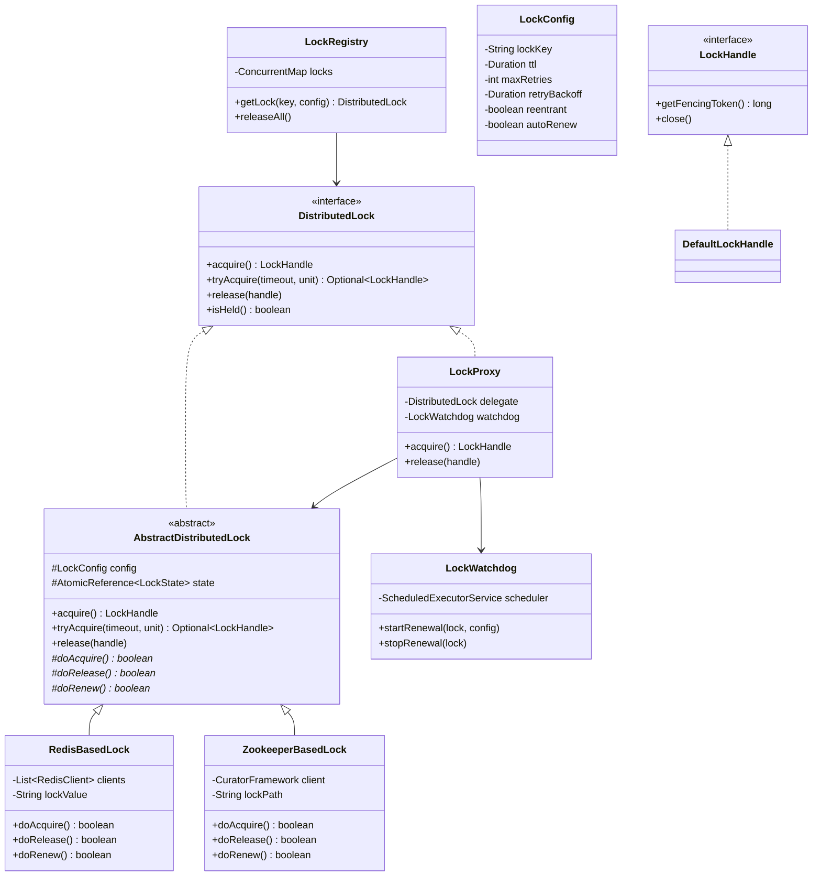

# Distributed Lock Client - Low Level Design

## 1. Problem Statement
Design a distributed lock client library that provides mutual exclusion across multiple nodes/processes. Must support multiple backends (Redis, Zookeeper), fencing tokens for safety, auto-renewal, reentrant locking, and try-with-resources pattern.

## 2. UML Class Diagram



## 3. Design Patterns
- **Strategy**: Swappable lock backends (Redis, Zookeeper) behind common interface
- **Template Method**: `AbstractDistributedLock` defines acquire/release flow; subclasses implement `doAcquire`/`doRelease`
- **Proxy**: `LockProxy` adds watchdog auto-renewal transparently

## 4. SOLID Principles
- **SRP**: Each class has one responsibility (LockWatchdog=renewal, LockRegistry=management)
- **OCP**: New backends without modifying existing code
- **LSP**: All lock implementations substitutable via interface
- **ISP**: Minimal `DistributedLock` interface
- **DIP**: Depend on `DistributedLock` abstraction, not concrete implementations

## 5. Complete Java Implementation

```java
import java.time.Duration;
import java.util.*;
import java.util.concurrent.*;
import java.util.concurrent.atomic.*;
import java.util.concurrent.locks.ReentrantLock;

// ─── Configuration ───
public class LockConfig {
    private final String lockKey;
    private final Duration ttl;
    private final int maxRetries;
    private final Duration retryBackoff;
    private final boolean reentrant;
    private final boolean autoRenew;

    private LockConfig(Builder b) {
        this.lockKey = b.lockKey; this.ttl = b.ttl;
        this.maxRetries = b.maxRetries; this.retryBackoff = b.retryBackoff;
        this.reentrant = b.reentrant; this.autoRenew = b.autoRenew;
    }

    // Getters...
    public String getLockKey() { return lockKey; }
    public Duration getTtl() { return ttl; }
    public int getMaxRetries() { return maxRetries; }
    public Duration getRetryBackoff() { return retryBackoff; }
    public boolean isReentrant() { return reentrant; }
    public boolean isAutoRenew() { return autoRenew; }

    public static class Builder {
        private String lockKey;
        private Duration ttl = Duration.ofSeconds(30);
        private int maxRetries = 3;
        private Duration retryBackoff = Duration.ofMillis(200);
        private boolean reentrant = false;
        private boolean autoRenew = true;

        public Builder lockKey(String key) { this.lockKey = key; return this; }
        public Builder ttl(Duration ttl) { this.ttl = ttl; return this; }
        public Builder maxRetries(int r) { this.maxRetries = r; return this; }
        public Builder retryBackoff(Duration d) { this.retryBackoff = d; return this; }
        public Builder reentrant(boolean r) { this.reentrant = r; return this; }
        public Builder autoRenew(boolean a) { this.autoRenew = a; return this; }
        public LockConfig build() { return new LockConfig(this); }
    }
}

// ─── Fencing Token & Lock Handle ───
public interface LockHandle extends AutoCloseable {
    long getFencingToken();
    @Override void close(); // releases the lock
}

class DefaultLockHandle implements LockHandle {
    private final long fencingToken;
    private final DistributedLock lock;
    private final AtomicBoolean released = new AtomicBoolean(false);

    DefaultLockHandle(long fencingToken, DistributedLock lock) {
        this.fencingToken = fencingToken;
        this.lock = lock;
    }

    @Override public long getFencingToken() { return fencingToken; }

    @Override
    public void close() {
        if (released.compareAndSet(false, true)) {
            lock.release(this);
        }
    }
}

// ─── Interface ───
public interface DistributedLock {
    LockHandle acquire() throws LockAcquisitionException;
    Optional<LockHandle> tryAcquire(long timeout, TimeUnit unit);
    void release(LockHandle handle);
    boolean isHeld();
}

// ─── Template Method Base ───
abstract class AbstractDistributedLock implements DistributedLock {
    protected final LockConfig config;
    protected final AtomicLong fencingTokenGen = new AtomicLong(0);
    protected final AtomicReference<Thread> ownerThread = new AtomicReference<>();
    protected final AtomicInteger holdCount = new AtomicInteger(0);
    private final ReentrantLock localLock = new ReentrantLock();

    protected AbstractDistributedLock(LockConfig config) { this.config = config; }

    @Override
    public LockHandle acquire() throws LockAcquisitionException {
        return tryAcquire(Long.MAX_VALUE, TimeUnit.MILLISECONDS)
                .orElseThrow(() -> new LockAcquisitionException("Failed to acquire: " + config.getLockKey()));
    }

    @Override
    public Optional<LockHandle> tryAcquire(long timeout, TimeUnit unit) {
        long deadline = System.currentTimeMillis() + unit.toMillis(timeout);
        localLock.lock();
        try {
            // Reentrant check
            if (config.isReentrant() && Thread.currentThread().equals(ownerThread.get())) {
                holdCount.incrementAndGet();
                return Optional.of(new DefaultLockHandle(fencingTokenGen.get(), this));
            }

            for (int attempt = 0; attempt <= config.getMaxRetries(); attempt++) {
                if (System.currentTimeMillis() > deadline) break;

                if (doAcquire()) {
                    ownerThread.set(Thread.currentThread());
                    holdCount.set(1);
                    long token = fencingTokenGen.incrementAndGet();
                    return Optional.of(new DefaultLockHandle(token, this));
                }

                // Exponential backoff with jitter
                long backoff = config.getRetryBackoff().toMillis() * (1L << attempt);
                backoff += ThreadLocalRandom.current().nextLong(backoff / 4);
                Thread.sleep(Math.min(backoff, deadline - System.currentTimeMillis()));
            }
        } catch (InterruptedException e) {
            Thread.currentThread().interrupt();
        } finally {
            localLock.unlock();
        }
        return Optional.empty();
    }

    @Override
    public void release(LockHandle handle) {
        localLock.lock();
        try {
            if (holdCount.decrementAndGet() <= 0) {
                doRelease();
                ownerThread.set(null);
                holdCount.set(0);
            }
        } finally {
            localLock.unlock();
        }
    }

    @Override
    public boolean isHeld() { return ownerThread.get() != null; }

    protected abstract boolean doAcquire();
    protected abstract boolean doRelease();
    protected abstract boolean doRenew();
}

// ─── Redis Redlock Implementation ───
class RedisBasedLock extends AbstractDistributedLock {
    private final List<RedisClient> clients; // multiple nodes for Redlock
    private final String lockValue = UUID.randomUUID().toString();

    RedisBasedLock(LockConfig config, List<RedisClient> clients) {
        super(config);
        this.clients = clients;
    }

    @Override
    protected boolean doAcquire() {
        int quorum = clients.size() / 2 + 1;
        long start = System.currentTimeMillis();
        int acquired = 0;

        for (RedisClient client : clients) {
            // SET key value NX PX ttl
            if (client.setNxPx(config.getLockKey(), lockValue, config.getTtl().toMillis())) {
                acquired++;
            }
        }

        long elapsed = System.currentTimeMillis() - start;
        long validityTime = config.getTtl().toMillis() - elapsed;

        if (acquired >= quorum && validityTime > 0) {
            return true;
        }
        // Failed - release all partial locks
        doRelease();
        return false;
    }

    @Override
    protected boolean doRelease() {
        // Lua script: release only if value matches (atomic check-and-delete)
        String luaScript = "if redis.call('get',KEYS[1])==ARGV[1] then " +
                "return redis.call('del',KEYS[1]) else return 0 end";
        for (RedisClient client : clients) {
            client.eval(luaScript, config.getLockKey(), lockValue);
        }
        return true;
    }

    @Override
    protected boolean doRenew() {
        // Lua script: extend TTL only if we still hold lock
        String luaScript = "if redis.call('get',KEYS[1])==ARGV[1] then " +
                "return redis.call('pexpire',KEYS[1],ARGV[2]) else return 0 end";
        int renewed = 0;
        for (RedisClient client : clients) {
            if (client.eval(luaScript, config.getLockKey(), lockValue,
                    String.valueOf(config.getTtl().toMillis())) > 0) {
                renewed++;
            }
        }
        return renewed >= clients.size() / 2 + 1;
    }
}

// ─── Zookeeper Implementation ───
class ZookeeperBasedLock extends AbstractDistributedLock {
    private final CuratorFramework client;
    private final String basePath;
    private String lockNode;

    ZookeeperBasedLock(LockConfig config, CuratorFramework client) {
        super(config);
        this.client = client;
        this.basePath = "/locks/" + config.getLockKey();
    }

    @Override
    protected boolean doAcquire() {
        try {
            // Create ephemeral sequential node
            lockNode = client.create().creatingParentsIfNeeded()
                    .withMode(CreateMode.EPHEMERAL_SEQUENTIAL)
                    .forPath(basePath + "/lock-");

            // Check if we have the lowest sequence number
            List<String> children = client.getChildren().forPath(basePath);
            Collections.sort(children);
            String smallest = basePath + "/" + children.get(0);

            if (lockNode.equals(smallest)) return true;

            // Watch predecessor node and wait
            String predecessor = basePath + "/" + children.get(children.indexOf(
                    lockNode.substring(lockNode.lastIndexOf('/') + 1)) - 1);
            // Set watcher on predecessor, block until notified
            CountDownLatch latch = new CountDownLatch(1);
            client.getData().usingWatcher((Watcher) e -> latch.countDown()).forPath(predecessor);
            latch.await(config.getTtl().toMillis(), TimeUnit.MILLISECONDS);
            return true;
        } catch (Exception e) {
            return false;
        }
    }

    @Override
    protected boolean doRelease() {
        try {
            if (lockNode != null) client.delete().forPath(lockNode);
            return true;
        } catch (Exception e) { return false; }
    }

    @Override
    protected boolean doRenew() {
        return true; // Ephemeral nodes auto-renew via ZK session heartbeat
    }
}

// ─── Watchdog (Auto-Renewal) ───
class LockWatchdog {
    private final ScheduledExecutorService scheduler =
            Executors.newScheduledThreadPool(2, r -> {
                Thread t = new Thread(r, "lock-watchdog");
                t.setDaemon(true);
                return t;
            });
    private final ConcurrentMap<String, ScheduledFuture<?>> renewals = new ConcurrentHashMap<>();

    void startRenewal(AbstractDistributedLock lock, LockConfig config) {
        long renewInterval = config.getTtl().toMillis() / 3; // renew at 1/3 TTL
        ScheduledFuture<?> future = scheduler.scheduleAtFixedRate(() -> {
            if (lock.isHeld()) {
                lock.doRenew();
            } else {
                stopRenewal(config.getLockKey());
            }
        }, renewInterval, renewInterval, TimeUnit.MILLISECONDS);
        renewals.put(config.getLockKey(), future);
    }

    void stopRenewal(String lockKey) {
        ScheduledFuture<?> f = renewals.remove(lockKey);
        if (f != null) f.cancel(false);
    }
}

// ─── Proxy (adds watchdog) ───
class LockProxy implements DistributedLock {
    private final AbstractDistributedLock delegate;
    private final LockWatchdog watchdog;
    private final LockConfig config;

    LockProxy(AbstractDistributedLock delegate, LockWatchdog watchdog, LockConfig config) {
        this.delegate = delegate; this.watchdog = watchdog; this.config = config;
    }

    @Override
    public LockHandle acquire() throws LockAcquisitionException {
        LockHandle handle = delegate.acquire();
        if (config.isAutoRenew()) watchdog.startRenewal(delegate, config);
        return handle;
    }

    @Override
    public Optional<LockHandle> tryAcquire(long timeout, TimeUnit unit) {
        Optional<LockHandle> handle = delegate.tryAcquire(timeout, unit);
        handle.ifPresent(h -> { if (config.isAutoRenew()) watchdog.startRenewal(delegate, config); });
        return handle;
    }

    @Override
    public void release(LockHandle handle) {
        watchdog.stopRenewal(config.getLockKey());
        delegate.release(handle);
    }

    @Override public boolean isHeld() { return delegate.isHeld(); }
}

// ─── Lock Registry ───
public class LockRegistry {
    private final ConcurrentMap<String, DistributedLock> locks = new ConcurrentHashMap<>();
    private final LockWatchdog watchdog = new LockWatchdog();
    private final LockFactory factory;

    public LockRegistry(LockFactory factory) { this.factory = factory; }

    public DistributedLock getLock(LockConfig config) {
        return locks.computeIfAbsent(config.getLockKey(), k -> {
            AbstractDistributedLock impl = factory.create(config);
            return new LockProxy(impl, watchdog, config);
        });
    }

    public void releaseAll() {
        locks.values().forEach(l -> { if (l.isHeld()) l.release(null); });
        locks.clear();
    }
}

// ─── Usage Example ───
class UsageExample {
    void example() {
        LockConfig config = new LockConfig.Builder()
                .lockKey("order:12345")
                .ttl(Duration.ofSeconds(30))
                .maxRetries(3)
                .retryBackoff(Duration.ofMillis(100))
                .reentrant(true)
                .autoRenew(true)
                .build();

        LockRegistry registry = new LockRegistry(new RedisLockFactory(redisClients));
        DistributedLock lock = registry.getLock(config);

        // try-with-resources pattern
        try (LockHandle handle = lock.acquire()) {
            // Protected critical section
            long fencingToken = handle.getFencingToken();
            // Pass fencingToken to storage layer for safety
            db.update("UPDATE orders SET status=? WHERE id=? AND lock_token < ?",
                    "PROCESSED", 12345, fencingToken);
        }
    }
}

// ─── Custom Exception ───
class LockAcquisitionException extends RuntimeException {
    LockAcquisitionException(String msg) { super(msg); }
}
```

## 6. Key Interview Points

| Topic | Key Insight |
|-------|-------------|
| **Fencing Tokens** | Monotonically increasing tokens prevent stale clients from corrupting data even after lock expires |
| **Redlock Quorum** | Acquire on N/2+1 nodes; validity = TTL - acquisition_time; must be > 0 |
| **Clock Drift** | Redlock assumes bounded clock drift; use `validity_time -= CLOCK_DRIFT_FACTOR` |
| **Watchdog** | Renews at TTL/3; prevents premature expiry during long operations |
| **Ephemeral Nodes** | ZK auto-deletes on session loss — no orphan locks |
| **Herd Effect** | ZK sequential nodes watch only predecessor — avoids thundering herd |
| **Reentrancy** | Track owner thread + hold count; same thread can re-acquire |
| **Lua Atomicity** | Redis Lua scripts ensure check-and-act is atomic (no TOCTOU) |
| **AutoCloseable** | Guarantees release even on exceptions via try-with-resources |
| **Split Brain** | Redlock tolerates minority node failures; ZK uses majority quorum |
