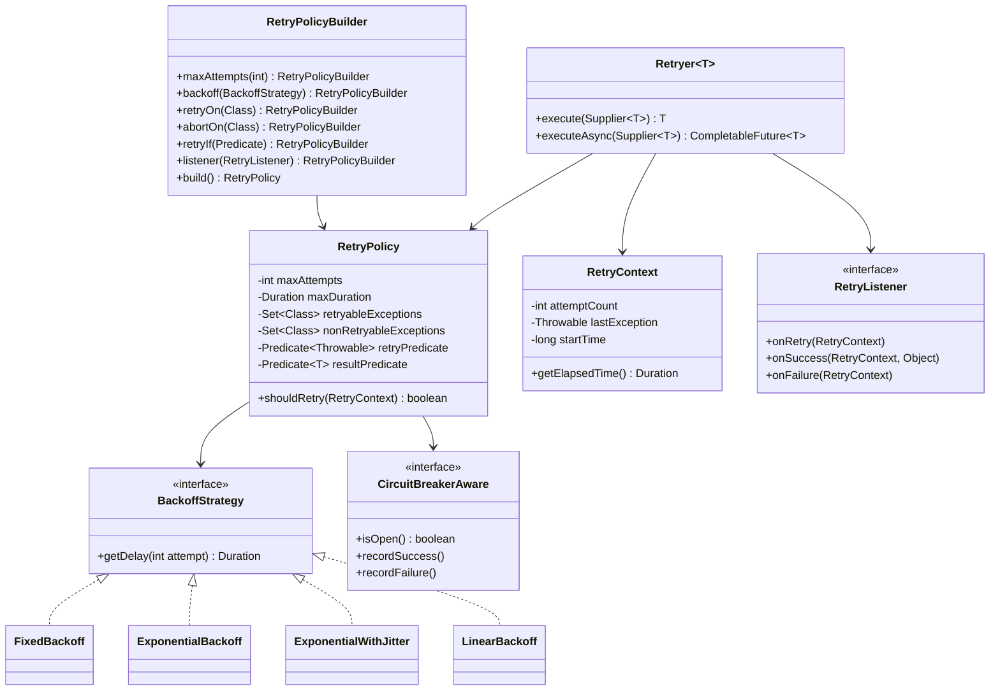

# Retry Library - Low Level Design

## 1. Problem Statement
Design a configurable retry library that allows applications to transparently retry failed operations with customizable backoff strategies, retry policies, and listener hooks. Must support sync/async execution, predicate-based retry decisions, and circuit breaker integration.

## 2. UML Class Diagram



## 3. Design Patterns
- **Strategy**: BackoffStrategy implementations are interchangeable algorithms
- **Builder**: RetryPolicyBuilder for fluent, readable configuration
- **Template Method**: Retryer.execute() defines the retry skeleton; hooks customize behavior
- **Decorator**: RetryListener wraps execution with cross-cutting concerns (logging, metrics)
- **Observer**: Listeners notified on retry/success/failure events

## 4. SOLID Principles
- **SRP**: Each class has one responsibility (policy decides, backoff computes delay, context tracks state)
- **OCP**: New backoff strategies added without modifying existing code
- **LSP**: All BackoffStrategy implementations are substitutable
- **ISP**: RetryListener has focused callbacks; CircuitBreakerAware is separate interface
- **DIP**: Retryer depends on abstractions (BackoffStrategy, RetryListener), not concrete classes

## 5. Complete Java Implementation

```java
// ===== BackoffStrategy.java =====
public interface BackoffStrategy {
    Duration getDelay(int attempt);
}

public class FixedBackoff implements BackoffStrategy {
    private final Duration delay;
    public FixedBackoff(Duration delay) { this.delay = delay; }
    public Duration getDelay(int attempt) { return delay; }
}

public class ExponentialBackoff implements BackoffStrategy {
    private final Duration initialDelay;
    private final double multiplier;
    private final Duration maxDelay;

    public ExponentialBackoff(Duration initialDelay, double multiplier, Duration maxDelay) {
        this.initialDelay = initialDelay;
        this.multiplier = multiplier;
        this.maxDelay = maxDelay;
    }

    public Duration getDelay(int attempt) {
        long delayMs = (long) (initialDelay.toMillis() * Math.pow(multiplier, attempt - 1));
        return Duration.ofMillis(Math.min(delayMs, maxDelay.toMillis()));
    }
}

public class ExponentialWithJitter implements BackoffStrategy {
    private final ExponentialBackoff base;
    private final ThreadLocalRandom random = ThreadLocalRandom.current();

    public ExponentialWithJitter(Duration initialDelay, double multiplier, Duration maxDelay) {
        this.base = new ExponentialBackoff(initialDelay, multiplier, maxDelay);
    }

    public Duration getDelay(int attempt) {
        long baseDelay = base.getDelay(attempt).toMillis();
        long jitter = random.nextLong(0, baseDelay / 2 + 1);
        return Duration.ofMillis(baseDelay / 2 + jitter);
    }
}

public class LinearBackoff implements BackoffStrategy {
    private final Duration initialDelay;
    private final Duration increment;

    public LinearBackoff(Duration initialDelay, Duration increment) {
        this.initialDelay = initialDelay;
        this.increment = increment;
    }

    public Duration getDelay(int attempt) {
        return initialDelay.plus(increment.multipliedBy(attempt - 1));
    }
}

// ===== RetryContext.java =====
public class RetryContext {
    private int attemptCount;
    private Throwable lastException;
    private final long startTimeNanos;
    private Object lastResult;

    public RetryContext() { this.startTimeNanos = System.nanoTime(); }

    public void incrementAttempt() { attemptCount++; }
    public void setLastException(Throwable e) { this.lastException = e; }
    public void setLastResult(Object result) { this.lastResult = result; }
    public int getAttemptCount() { return attemptCount; }
    public Throwable getLastException() { return lastException; }
    public Duration getElapsedTime() {
        return Duration.ofNanos(System.nanoTime() - startTimeNanos);
    }
    public Object getLastResult() { return lastResult; }
}

// ===== RetryListener.java =====
public interface RetryListener {
    default void onRetry(RetryContext context) {}
    default void onSuccess(RetryContext context, Object result) {}
    default void onFailure(RetryContext context) {}
}

// ===== CircuitBreakerAware.java =====
public interface CircuitBreakerAware {
    boolean isOpen();
    void recordSuccess();
    void recordFailure();
}

// ===== RetryPolicy.java =====
public class RetryPolicy<T> {
    private final int maxAttempts;
    private final Duration maxDuration;
    private final Set<Class<? extends Throwable>> retryableExceptions;
    private final Set<Class<? extends Throwable>> nonRetryableExceptions;
    private final Predicate<Throwable> retryPredicate;
    private final Predicate<T> resultPredicate; // retry if result matches
    private final BackoffStrategy backoffStrategy;
    private final List<RetryListener> listeners;
    private final CircuitBreakerAware circuitBreaker;

    RetryPolicy(Builder<T> builder) {
        this.maxAttempts = builder.maxAttempts;
        this.maxDuration = builder.maxDuration;
        this.retryableExceptions = builder.retryableExceptions;
        this.nonRetryableExceptions = builder.nonRetryableExceptions;
        this.retryPredicate = builder.retryPredicate;
        this.resultPredicate = builder.resultPredicate;
        this.backoffStrategy = builder.backoffStrategy;
        this.listeners = builder.listeners;
        this.circuitBreaker = builder.circuitBreaker;
    }

    public boolean shouldRetry(RetryContext context) {
        if (context.getAttemptCount() >= maxAttempts) return false;
        if (maxDuration != null && context.getElapsedTime().compareTo(maxDuration) > 0) return false;
        if (circuitBreaker != null && circuitBreaker.isOpen()) return false;

        Throwable ex = context.getLastException();
        if (ex != null) {
            if (nonRetryableExceptions.stream().anyMatch(c -> c.isInstance(ex))) return false;
            if (!retryableExceptions.isEmpty() &&
                retryableExceptions.stream().noneMatch(c -> c.isInstance(ex))) return false;
            if (retryPredicate != null && !retryPredicate.test(ex)) return false;
        }
        return true;
    }

    @SuppressWarnings("unchecked")
    public boolean shouldRetryOnResult(Object result) {
        return resultPredicate != null && resultPredicate.test((T) result);
    }

    public BackoffStrategy getBackoffStrategy() { return backoffStrategy; }
    public List<RetryListener> getListeners() { return listeners; }
    public CircuitBreakerAware getCircuitBreaker() { return circuitBreaker; }

    public static <T> Builder<T> builder() { return new Builder<>(); }

    // ===== Builder =====
    public static class Builder<T> {
        private int maxAttempts = 3;
        private Duration maxDuration;
        private Set<Class<? extends Throwable>> retryableExceptions = new HashSet<>();
        private Set<Class<? extends Throwable>> nonRetryableExceptions = new HashSet<>();
        private Predicate<Throwable> retryPredicate;
        private Predicate<T> resultPredicate;
        private BackoffStrategy backoffStrategy = new FixedBackoff(Duration.ofSeconds(1));
        private List<RetryListener> listeners = new ArrayList<>();
        private CircuitBreakerAware circuitBreaker;

        public Builder<T> maxAttempts(int max) { this.maxAttempts = max; return this; }
        public Builder<T> maxDuration(Duration d) { this.maxDuration = d; return this; }
        public Builder<T> retryOn(Class<? extends Throwable> ex) { retryableExceptions.add(ex); return this; }
        public Builder<T> abortOn(Class<? extends Throwable> ex) { nonRetryableExceptions.add(ex); return this; }
        public Builder<T> retryIf(Predicate<Throwable> p) { this.retryPredicate = p; return this; }
        public Builder<T> retryOnResult(Predicate<T> p) { this.resultPredicate = p; return this; }
        public Builder<T> backoff(BackoffStrategy s) { this.backoffStrategy = s; return this; }
        public Builder<T> listener(RetryListener l) { listeners.add(l); return this; }
        public Builder<T> circuitBreaker(CircuitBreakerAware cb) { this.circuitBreaker = cb; return this; }
        public RetryPolicy<T> build() { return new RetryPolicy<>(this); }
    }
}

// ===== Retryer.java =====
public class Retryer<T> {
    private final RetryPolicy<T> policy;
    private final ScheduledExecutorService scheduler;

    public Retryer(RetryPolicy<T> policy) {
        this(policy, Executors.newSingleThreadScheduledExecutor());
    }

    public Retryer(RetryPolicy<T> policy, ScheduledExecutorService scheduler) {
        this.policy = policy;
        this.scheduler = scheduler;
    }

    // Supplier support
    public T execute(Supplier<T> supplier) {
        return execute(() -> supplier.get());
    }

    // Callable support
    public T execute(Callable<T> callable) {
        RetryContext context = new RetryContext();

        while (true) {
            context.incrementAttempt();
            try {
                T result = callable.call();
                context.setLastResult(result);

                if (policy.shouldRetryOnResult(result) && policy.shouldRetry(context)) {
                    notifyRetry(context);
                    sleep(context.getAttemptCount());
                    continue;
                }

                notifySuccess(context, result);
                recordCircuitBreakerSuccess();
                return result;
            } catch (Throwable e) {
                context.setLastException(e);
                recordCircuitBreakerFailure();

                if (!policy.shouldRetry(context)) {
                    notifyFailure(context);
                    throw new RetryExhaustedException(
                        "Retry exhausted after " + context.getAttemptCount() + " attempts", e);
                }
                notifyRetry(context);
                sleep(context.getAttemptCount());
            }
        }
    }

    // Runnable support (void operations)
    public void execute(Runnable runnable) {
        execute(() -> { runnable.run(); return null; });
    }

    // Async support
    public CompletableFuture<T> executeAsync(Supplier<T> supplier) {
        return CompletableFuture.supplyAsync(() -> execute(supplier), scheduler);
    }

    public CompletableFuture<T> executeAsync(Callable<T> callable) {
        RetryContext context = new RetryContext();
        CompletableFuture<T> future = new CompletableFuture<>();
        scheduleAttempt(callable, context, future);
        return future;
    }

    private void scheduleAttempt(Callable<T> callable, RetryContext context,
                                  CompletableFuture<T> future) {
        scheduler.schedule(() -> {
            context.incrementAttempt();
            try {
                T result = callable.call();
                if (policy.shouldRetryOnResult(result) && policy.shouldRetry(context)) {
                    notifyRetry(context);
                    scheduleAttempt(callable, context, future);
                } else {
                    notifySuccess(context, result);
                    future.complete(result);
                }
            } catch (Throwable e) {
                context.setLastException(e);
                if (!policy.shouldRetry(context)) {
                    notifyFailure(context);
                    future.completeExceptionally(new RetryExhaustedException(
                        "Exhausted after " + context.getAttemptCount() + " attempts", e));
                } else {
                    notifyRetry(context);
                    scheduleAttempt(callable, context, future);
                }
            }
        }, context.getAttemptCount() == 0 ? 0 :
            policy.getBackoffStrategy().getDelay(context.getAttemptCount()).toMillis(),
            TimeUnit.MILLISECONDS);
    }

    private void sleep(int attempt) {
        try {
            Thread.sleep(policy.getBackoffStrategy().getDelay(attempt).toMillis());
        } catch (InterruptedException e) {
            Thread.currentThread().interrupt();
            throw new RetryInterruptedException(e);
        }
    }

    private void notifyRetry(RetryContext ctx) {
        policy.getListeners().forEach(l -> l.onRetry(ctx));
    }
    private void notifySuccess(RetryContext ctx, Object result) {
        policy.getListeners().forEach(l -> l.onSuccess(ctx, result));
    }
    private void notifyFailure(RetryContext ctx) {
        policy.getListeners().forEach(l -> l.onFailure(ctx));
    }
    private void recordCircuitBreakerSuccess() {
        if (policy.getCircuitBreaker() != null) policy.getCircuitBreaker().recordSuccess();
    }
    private void recordCircuitBreakerFailure() {
        if (policy.getCircuitBreaker() != null) policy.getCircuitBreaker().recordFailure();
    }
}

// ===== Exceptions =====
public class RetryExhaustedException extends RuntimeException {
    public RetryExhaustedException(String msg, Throwable cause) { super(msg, cause); }
}

public class RetryInterruptedException extends RuntimeException {
    public RetryInterruptedException(Throwable cause) { super(cause); }
}

// ===== Usage Example =====
public class Main {
    public static void main(String[] args) {
        RetryPolicy<String> policy = RetryPolicy.<String>builder()
            .maxAttempts(5)
            .retryOn(IOException.class)
            .abortOn(IllegalArgumentException.class)
            .retryIf(e -> e.getMessage().contains("timeout"))
            .retryOnResult(result -> result == null || result.isEmpty())
            .backoff(new ExponentialWithJitter(Duration.ofMillis(100), 2.0, Duration.ofSeconds(10)))
            .listener(new RetryListener() {
                public void onRetry(RetryContext ctx) {
                    System.out.println("Retry #" + ctx.getAttemptCount());
                }
                public void onFailure(RetryContext ctx) {
                    System.out.println("Failed after " + ctx.getAttemptCount() + " attempts");
                }
            })
            .build();

        Retryer<String> retryer = new Retryer<>(policy);

        // Sync
        String result = retryer.execute(() -> callExternalService());

        // Async
        CompletableFuture<String> future = retryer.executeAsync(() -> callExternalService());
    }
}
```

## 6. Key Interview Points

| Topic | Key Insight |
|-------|-------------|
| **Why Strategy for Backoff?** | Algorithms vary independently of retry logic; easy to add new strategies |
| **Thread Safety** | RetryContext is per-execution (not shared); policy is immutable after build |
| **Jitter importance** | Prevents thundering herd when many clients retry simultaneously |
| **Circuit Breaker integration** | Fail-fast when downstream is known-broken; avoids wasting retry budget |
| **Result-based retry** | Not just exceptions; retry on null/empty/invalid results via predicate |
| **Async design** | Non-blocking retries via ScheduledExecutorService; no thread pinning during backoff |
| **Idempotency requirement** | Caller must ensure operations are safe to retry (GET vs POST) |
| **Backoff cap** | maxDelay prevents unbounded exponential growth |
| **Composability** | Listeners enable logging/metrics without modifying core retry logic |
| **Testing** | Inject BackoffStrategy returning Duration.ZERO for fast unit tests |
