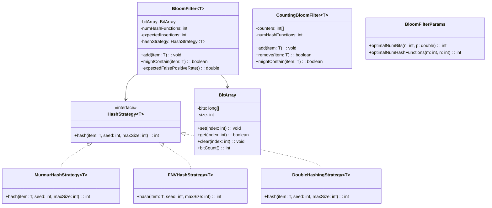

# Bloom Filter - Low Level Design

## 1. Problem Statement
Design a space-efficient probabilistic data structure that tests whether an element is a member of a set. False positives are possible, but false negatives are not. Support optimal parameter calculation, multiple hash strategies, counting (deletable) variant, and thread safety.

## 2. UML Class Diagram


## 3. Design Patterns
- **Strategy Pattern**: `HashStrategy` interface allows swapping hash function implementations
- **Template Method**: Common bloom filter logic with pluggable hash computation

## 4. SOLID Principles
- **SRP**: BitArray handles bit manipulation; BloomFilter handles membership logic; Params handles math
- **OCP**: New hash strategies added without modifying BloomFilter
- **LSP**: All HashStrategy implementations are interchangeable
- **ISP**: HashStrategy has single focused method
- **DIP**: BloomFilter depends on HashStrategy abstraction, not concrete hashes

## 5. Complete Java Implementation

```java
import java.io.*;
import java.util.concurrent.atomic.AtomicLongArray;
import java.util.concurrent.locks.ReentrantReadWriteLock;

// ─── Hash Strategy Interface ───
interface HashStrategy<T> {
    int hash(T item, int seed, int maxSize);
}

class MurmurHashStrategy<T> implements HashStrategy<T> {
    @Override
    public int hash(T item, int seed, int maxSize) {
        byte[] data = item.toString().getBytes();
        int h = seed ^ data.length;
        for (int i = 0; i < data.length; i++) {
            h ^= data[i];
            h *= 0x5bd1e995;
            h ^= h >>> 15;
        }
        h ^= h >>> 13;
        h *= 0xc2b2ae35;
        h ^= h >>> 16;
        return Math.abs(h % maxSize);
    }
}

class FNVHashStrategy<T> implements HashStrategy<T> {
    private static final int FNV_OFFSET = 0x811c9dc5;
    private static final int FNV_PRIME = 0x01000193;

    @Override
    public int hash(T item, int seed, int maxSize) {
        byte[] data = item.toString().getBytes();
        int hash = FNV_OFFSET ^ seed;
        for (byte b : data) {
            hash ^= b;
            hash *= FNV_PRIME;
        }
        return Math.abs(hash % maxSize);
    }
}

class DoubleHashingStrategy<T> implements HashStrategy<T> {
    @Override
    public int hash(T item, int seed, int maxSize) {
        int hash1 = item.hashCode();
        int hash2 = hash1 >>> 16 | hash1 << 16;
        int combined = hash1 + seed * hash2;
        return Math.abs(combined % maxSize);
    }
}

// ─── Bit Array ───
class BitArray implements Serializable {
    private final long[] bits;
    private final int size;

    public BitArray(int size) {
        this.size = size;
        this.bits = new long[(size + 63) / 64];
    }

    public void set(int index) {
        bits[index / 64] |= (1L << (index % 64));
    }

    public boolean get(int index) {
        return (bits[index / 64] & (1L << (index % 64))) != 0;
    }

    public void clear(int index) {
        bits[index / 64] &= ~(1L << (index % 64));
    }

    public int bitCount() {
        int count = 0;
        for (long word : bits) count += Long.bitCount(word);
        return count;
    }

    public int size() { return size; }
}

// ─── Optimal Parameters ───
class BloomFilterParams {
    // m = -n * ln(p) / (ln2)^2
    public static int optimalNumBits(int expectedInsertions, double falsePositiveRate) {
        return (int) Math.ceil(-expectedInsertions * Math.log(falsePositiveRate)
                / (Math.log(2) * Math.log(2)));
    }

    // k = (m/n) * ln2
    public static int optimalNumHashFunctions(int numBits, int expectedInsertions) {
        return Math.max(1, (int) Math.round((double) numBits / expectedInsertions * Math.log(2)));
    }
}

// ─── Bloom Filter ───
class BloomFilter<T> implements Serializable {
    private final BitArray bitArray;
    private final int numHashFunctions;
    private final int expectedInsertions;
    private transient HashStrategy<T> hashStrategy;
    private int insertedCount;

    public BloomFilter(int expectedInsertions, double falsePositiveRate, HashStrategy<T> strategy) {
        int numBits = BloomFilterParams.optimalNumBits(expectedInsertions, falsePositiveRate);
        this.numHashFunctions = BloomFilterParams.optimalNumHashFunctions(numBits, expectedInsertions);
        this.bitArray = new BitArray(numBits);
        this.expectedInsertions = expectedInsertions;
        this.hashStrategy = strategy;
        this.insertedCount = 0;
    }

    public void add(T item) {
        for (int i = 0; i < numHashFunctions; i++) {
            int index = hashStrategy.hash(item, i, bitArray.size());
            bitArray.set(index);
        }
        insertedCount++;
    }

    public boolean mightContain(T item) {
        for (int i = 0; i < numHashFunctions; i++) {
            int index = hashStrategy.hash(item, i, bitArray.size());
            if (!bitArray.get(index)) return false;
        }
        return true;
    }

    // Actual FPR ≈ (1 - e^(-k*n/m))^k
    public double expectedFalsePositiveRate() {
        double m = bitArray.size();
        double k = numHashFunctions;
        double n = insertedCount;
        return Math.pow(1 - Math.exp(-k * n / m), k);
    }

    public int getNumBits() { return bitArray.size(); }
    public int getNumHashFunctions() { return numHashFunctions; }
}

// ─── Counting Bloom Filter (supports delete) ───
class CountingBloomFilter<T> {
    private final int[] counters;
    private final int size;
    private final int numHashFunctions;
    private final HashStrategy<T> hashStrategy;

    public CountingBloomFilter(int expectedInsertions, double falsePositiveRate, HashStrategy<T> strategy) {
        this.size = BloomFilterParams.optimalNumBits(expectedInsertions, falsePositiveRate);
        this.numHashFunctions = BloomFilterParams.optimalNumHashFunctions(size, expectedInsertions);
        this.counters = new int[size];
        this.hashStrategy = strategy;
    }

    public void add(T item) {
        for (int i = 0; i < numHashFunctions; i++) {
            int index = hashStrategy.hash(item, i, size);
            counters[index]++;
        }
    }

    public boolean remove(T item) {
        if (!mightContain(item)) return false;
        for (int i = 0; i < numHashFunctions; i++) {
            int index = hashStrategy.hash(item, i, size);
            if (counters[index] > 0) counters[index]--;
        }
        return true;
    }

    public boolean mightContain(T item) {
        for (int i = 0; i < numHashFunctions; i++) {
            int index = hashStrategy.hash(item, i, size);
            if (counters[index] == 0) return false;
        }
        return true;
    }
}

// ─── Thread-Safe Bloom Filter ───
class ConcurrentBloomFilter<T> {
    private final AtomicLongArray bits;
    private final int size;
    private final int numHashFunctions;
    private final HashStrategy<T> hashStrategy;

    public ConcurrentBloomFilter(int expectedInsertions, double falsePositiveRate, HashStrategy<T> strategy) {
        this.size = BloomFilterParams.optimalNumBits(expectedInsertions, falsePositiveRate);
        this.numHashFunctions = BloomFilterParams.optimalNumHashFunctions(size, expectedInsertions);
        this.bits = new AtomicLongArray((size + 63) / 64);
        this.hashStrategy = strategy;
    }

    public void add(T item) {
        for (int i = 0; i < numHashFunctions; i++) {
            int index = hashStrategy.hash(item, i, size);
            int wordIdx = index / 64;
            long mask = 1L << (index % 64);
            long oldVal, newVal;
            do {
                oldVal = bits.get(wordIdx);
                newVal = oldVal | mask;
            } while (!bits.compareAndSet(wordIdx, oldVal, newVal));
        }
    }

    public boolean mightContain(T item) {
        for (int i = 0; i < numHashFunctions; i++) {
            int index = hashStrategy.hash(item, i, size);
            int wordIdx = index / 64;
            long mask = 1L << (index % 64);
            if ((bits.get(wordIdx) & mask) == 0) return false;
        }
        return true;
    }
}

// ─── Demo ───
public class BloomFilterDemo {
    public static void main(String[] args) {
        BloomFilter<String> filter = new BloomFilter<>(1000, 0.01, new DoubleHashingStrategy<>());

        System.out.println("Bits: " + filter.getNumBits() + ", Hash functions: " + filter.getNumHashFunctions());

        filter.add("hello");
        filter.add("world");
        filter.add("bloom");

        System.out.println("Contains 'hello': " + filter.mightContain("hello"));   // true
        System.out.println("Contains 'missing': " + filter.mightContain("missing")); // likely false
        System.out.println("FPR: " + filter.expectedFalsePositiveRate());

        // Counting variant
        CountingBloomFilter<String> cbf = new CountingBloomFilter<>(1000, 0.01, new MurmurHashStrategy<>());
        cbf.add("item1");
        System.out.println("Before remove: " + cbf.mightContain("item1")); // true
        cbf.remove("item1");
        System.out.println("After remove: " + cbf.mightContain("item1"));  // false
    }
}
```

## 6. Math Behind False Positive Rate

| Symbol | Meaning |
|--------|---------|
| m | Number of bits in array |
| n | Number of inserted elements |
| k | Number of hash functions |
| p | Desired false positive probability |

**Derivation:**
- Probability a specific bit is NOT set by one hash: `1 - 1/m`
- After inserting n elements with k hashes: `(1 - 1/m)^(kn) ≈ e^(-kn/m)`
- Probability a bit IS set: `1 - e^(-kn/m)`
- FPR (all k bits set for non-member): `(1 - e^(-kn/m))^k`

**Optimal formulas:**
- `m = -n·ln(p) / (ln2)²` → minimizes space for given FPR
- `k = (m/n)·ln2` → minimizes FPR for given m and n

**Example:** n=1M, p=1% → m≈9.6M bits (1.2MB), k=7

## 7. Key Interview Points

| Topic | Point |
|-------|-------|
| Space | O(m) bits, much less than storing actual elements |
| Add/Query | O(k) — constant time |
| No false negatives | If filter says "no", element is definitely absent |
| Cannot delete | Standard bloom filter; use Counting variant for deletion |
| Hash independence | Hash functions must be independent; double hashing approximates this |
| Thread safety | Use AtomicLongArray with CAS for lock-free concurrent access |
| Serialization | Serialize bit array for persistence/network transfer |
| Use cases | Duplicate detection, spell check, cache pre-filter, DB query optimization |
| vs HashSet | Bloom: O(m) bits, FP possible; HashSet: O(n) objects, exact |
| Scalable variant | Scalable Bloom Filter grows by adding new filters when capacity reached |
