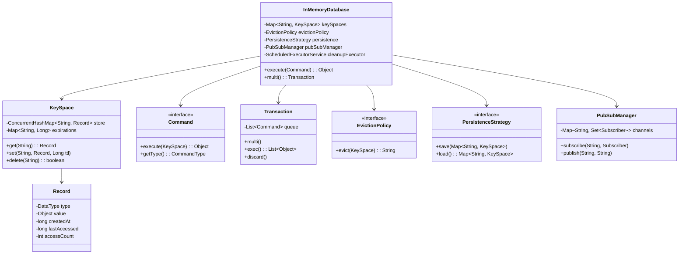

# In-Memory Database (Redis-like) - Low Level Design

## 1. Problem Statement
Design an in-memory database supporting multiple data types, TTL expiration, transactions, pub/sub, persistence snapshots, and key eviction policies with thread-safe concurrent access.

## 2. UML Class Diagram


## 3. Design Patterns
- **Command**: Each operation (GET, SET, DEL, etc.) encapsulated as command object
- **Strategy**: Eviction policies (LRU, LFU, Random, TTL) and persistence strategies
- **Factory**: CommandFactory creates command objects from parsed input
- **Observer**: Pub/Sub uses observer pattern for message broadcasting

## 4. SOLID Principles
- **SRP**: Each class has single responsibility (KeySpace stores, Record holds data, Command executes)
- **OCP**: New commands/eviction policies added without modifying existing code
- **LSP**: All eviction policies substitutable via EvictionPolicy interface
- **ISP**: Separate interfaces for Command, EvictionPolicy, PersistenceStrategy
- **DIP**: Database depends on abstractions (interfaces) not concrete implementations

## 5. Complete Java Implementation

```java
import java.util.*;
import java.util.concurrent.*;
import java.util.concurrent.locks.*;
import java.io.*;
import java.time.Instant;

// ==================== DATA TYPES ====================
enum DataType { STRING, INTEGER, LIST, SET, HASH_MAP, SORTED_SET }
enum CommandType { GET, SET, DEL, EXPIRE, INCR, LPUSH, LPOP, SADD, SMEMBERS, HSET, HGET, MULTI, EXEC, DISCARD, PUBLISH, SUBSCRIBE }

// ==================== RECORD ====================
class Record implements Serializable {
    private DataType type;
    private Object value;
    private long createdAt;
    private long lastAccessed;
    private int accessCount;

    public Record(DataType type, Object value) {
        this.type = type;
        this.value = value;
        this.createdAt = System.currentTimeMillis();
        this.lastAccessed = this.createdAt;
        this.accessCount = 0;
    }

    public void touch() { lastAccessed = System.currentTimeMillis(); accessCount++; }
    public DataType getType() { return type; }
    public Object getValue() { return value; }
    public void setValue(Object value) { this.value = value; }
    public long getLastAccessed() { return lastAccessed; }
    public int getAccessCount() { return accessCount; }
}

// ==================== KEYSPACE ====================
class KeySpace implements Serializable {
    private final ConcurrentHashMap<String, Record> store = new ConcurrentHashMap<>();
    private final ConcurrentHashMap<String, Long> expirations = new ConcurrentHashMap<>();
    private final ReadWriteLock lock = new ReentrantReadWriteLock();
    private int maxKeys;

    public KeySpace(int maxKeys) { this.maxKeys = maxKeys; }

    public Record get(String key) {
        if (isExpired(key)) { delete(key); return null; }
        Record r = store.get(key);
        if (r != null) r.touch();
        return r;
    }

    public void set(String key, Record record, Long ttlMs) {
        store.put(key, record);
        if (ttlMs != null && ttlMs > 0) {
            expirations.put(key, System.currentTimeMillis() + ttlMs);
        }
    }

    public boolean delete(String key) {
        expirations.remove(key);
        return store.remove(key) != null;
    }

    public void setExpiry(String key, long ttlMs) {
        if (store.containsKey(key)) expirations.put(key, System.currentTimeMillis() + ttlMs);
    }

    // Lazy expiration check
    private boolean isExpired(String key) {
        Long exp = expirations.get(key);
        return exp != null && System.currentTimeMillis() > exp;
    }

    // Periodic cleanup
    public void cleanupExpired() {
        expirations.forEach((key, exp) -> {
            if (System.currentTimeMillis() > exp) delete(key);
        });
    }

    public ConcurrentHashMap<String, Record> getStore() { return store; }
    public ConcurrentHashMap<String, Long> getExpirations() { return expirations; }
    public int size() { return store.size(); }
    public int getMaxKeys() { return maxKeys; }
    public ReadWriteLock getLock() { return lock; }
}

// ==================== COMMAND INTERFACE ====================
interface Command {
    Object execute(KeySpace keySpace);
    CommandType getType();
}

// ==================== COMMANDS ====================
class GetCommand implements Command {
    private final String key;
    public GetCommand(String key) { this.key = key; }
    public CommandType getType() { return CommandType.GET; }
    public Object execute(KeySpace ks) {
        Record r = ks.get(key);
        return r != null ? r.getValue() : null;
    }
}

class SetCommand implements Command {
    private final String key;
    private final Object value;
    private final Long ttlMs;
    public SetCommand(String key, Object value, Long ttlMs) {
        this.key = key; this.value = value; this.ttlMs = ttlMs;
    }
    public CommandType getType() { return CommandType.SET; }
    public Object execute(KeySpace ks) {
        DataType type = value instanceof Integer ? DataType.INTEGER : DataType.STRING;
        ks.set(key, new Record(type, value), ttlMs);
        return "OK";
    }
}

class DelCommand implements Command {
    private final String key;
    public DelCommand(String key) { this.key = key; }
    public CommandType getType() { return CommandType.DEL; }
    public Object execute(KeySpace ks) { return ks.delete(key) ? 1 : 0; }
}

class ExpireCommand implements Command {
    private final String key;
    private final long ttlMs;
    public ExpireCommand(String key, long ttlMs) { this.key = key; this.ttlMs = ttlMs; }
    public CommandType getType() { return CommandType.EXPIRE; }
    public Object execute(KeySpace ks) { ks.setExpiry(key, ttlMs); return 1; }
}

class IncrCommand implements Command {
    private final String key;
    public IncrCommand(String key) { this.key = key; }
    public CommandType getType() { return CommandType.INCR; }
    public Object execute(KeySpace ks) {
        Record r = ks.get(key);
        int val = r == null ? 0 : (int) r.getValue();
        val++;
        ks.set(key, new Record(DataType.INTEGER, val), null);
        return val;
    }
}

class LPushCommand implements Command {
    private final String key;
    private final Object value;
    public LPushCommand(String key, Object value) { this.key = key; this.value = value; }
    public CommandType getType() { return CommandType.LPUSH; }
    public Object execute(KeySpace ks) {
        Record r = ks.get(key);
        LinkedList<Object> list = r != null ? (LinkedList<Object>) r.getValue() : new LinkedList<>();
        list.addFirst(value);
        ks.set(key, new Record(DataType.LIST, list), null);
        return list.size();
    }
}

class LPopCommand implements Command {
    private final String key;
    public LPopCommand(String key) { this.key = key; }
    public CommandType getType() { return CommandType.LPOP; }
    public Object execute(KeySpace ks) {
        Record r = ks.get(key);
        if (r == null) return null;
        LinkedList<Object> list = (LinkedList<Object>) r.getValue();
        return list.isEmpty() ? null : list.removeFirst();
    }
}

class SAddCommand implements Command {
    private final String key;
    private final Object value;
    public SAddCommand(String key, Object value) { this.key = key; this.value = value; }
    public CommandType getType() { return CommandType.SADD; }
    public Object execute(KeySpace ks) {
        Record r = ks.get(key);
        Set<Object> set = r != null ? (Set<Object>) r.getValue() : ConcurrentHashMap.newKeySet();
        boolean added = set.add(value);
        ks.set(key, new Record(DataType.SET, set), null);
        return added ? 1 : 0;
    }
}

class SMembersCommand implements Command {
    private final String key;
    public SMembersCommand(String key) { this.key = key; }
    public CommandType getType() { return CommandType.SMEMBERS; }
    public Object execute(KeySpace ks) {
        Record r = ks.get(key);
        return r != null ? r.getValue() : Collections.emptySet();
    }
}

class HSetCommand implements Command {
    private final String key, field;
    private final Object value;
    public HSetCommand(String key, String field, Object value) {
        this.key = key; this.field = field; this.value = value;
    }
    public CommandType getType() { return CommandType.HSET; }
    public Object execute(KeySpace ks) {
        Record r = ks.get(key);
        Map<String, Object> map = r != null ? (Map<String, Object>) r.getValue() : new ConcurrentHashMap<>();
        map.put(field, value);
        ks.set(key, new Record(DataType.HASH_MAP, map), null);
        return 1;
    }
}

class HGetCommand implements Command {
    private final String key, field;
    public HGetCommand(String key, String field) { this.key = key; this.field = field; }
    public CommandType getType() { return CommandType.HGET; }
    public Object execute(KeySpace ks) {
        Record r = ks.get(key);
        if (r == null) return null;
        Map<String, Object> map = (Map<String, Object>) r.getValue();
        return map.get(field);
    }
}

// ==================== COMMAND FACTORY ====================
class CommandFactory {
    public static Command parse(String input) {
        String[] parts = input.trim().split("\\s+");
        String cmd = parts[0].toUpperCase();
        switch (cmd) {
            case "GET": return new GetCommand(parts[1]);
            case "SET":
                Long ttl = parts.length > 3 && parts[3].equalsIgnoreCase("PX") ? Long.parseLong(parts[4]) : null;
                return new SetCommand(parts[1], parts[2], ttl);
            case "DEL": return new DelCommand(parts[1]);
            case "EXPIRE": return new ExpireCommand(parts[1], Long.parseLong(parts[2]) * 1000);
            case "INCR": return new IncrCommand(parts[1]);
            case "LPUSH": return new LPushCommand(parts[1], parts[2]);
            case "LPOP": return new LPopCommand(parts[1]);
            case "SADD": return new SAddCommand(parts[1], parts[2]);
            case "SMEMBERS": return new SMembersCommand(parts[1]);
            case "HSET": return new HSetCommand(parts[1], parts[2], parts[3]);
            case "HGET": return new HGetCommand(parts[1], parts[2]);
            default: throw new IllegalArgumentException("Unknown command: " + cmd);
        }
    }
}

// ==================== TRANSACTION ====================
class Transaction {
    private final List<Command> queue = new ArrayList<>();
    private boolean active = false;

    public void multi() { active = true; queue.clear(); }

    public void enqueue(Command cmd) {
        if (!active) throw new IllegalStateException("No active transaction");
        queue.add(cmd);
    }

    public List<Object> exec(KeySpace ks) {
        if (!active) throw new IllegalStateException("No active transaction");
        List<Object> results = new ArrayList<>();
        ReadWriteLock lock = ks.getLock();
        lock.writeLock().lock();
        try {
            for (Command cmd : queue) results.add(cmd.execute(ks));
        } finally {
            lock.writeLock().unlock();
            discard();
        }
        return results;
    }

    public void discard() { active = false; queue.clear(); }
    public boolean isActive() { return active; }
}

// ==================== EVICTION POLICIES (Strategy) ====================
interface EvictionPolicy {
    String selectKeyToEvict(KeySpace keySpace);
}

class LRUEvictionPolicy implements EvictionPolicy {
    public String selectKeyToEvict(KeySpace ks) {
        return ks.getStore().entrySet().stream()
            .min(Comparator.comparingLong(e -> e.getValue().getLastAccessed()))
            .map(Map.Entry::getKey).orElse(null);
    }
}

class LFUEvictionPolicy implements EvictionPolicy {
    public String selectKeyToEvict(KeySpace ks) {
        return ks.getStore().entrySet().stream()
            .min(Comparator.comparingInt(e -> e.getValue().getAccessCount()))
            .map(Map.Entry::getKey).orElse(null);
    }
}

class RandomEvictionPolicy implements EvictionPolicy {
    private final Random random = new Random();
    public String selectKeyToEvict(KeySpace ks) {
        Object[] keys = ks.getStore().keySet().toArray();
        return keys.length > 0 ? (String) keys[random.nextInt(keys.length)] : null;
    }
}

class TTLEvictionPolicy implements EvictionPolicy {
    public String selectKeyToEvict(KeySpace ks) {
        return ks.getExpirations().entrySet().stream()
            .min(Comparator.comparingLong(Map.Entry::getValue))
            .map(Map.Entry::getKey).orElse(null);
    }
}

// ==================== PERSISTENCE (Strategy) ====================
interface PersistenceStrategy {
    void save(Map<String, KeySpace> data);
    Map<String, KeySpace> load();
}

class RDBPersistence implements PersistenceStrategy {
    private final String filePath;
    public RDBPersistence(String filePath) { this.filePath = filePath; }

    public void save(Map<String, KeySpace> data) {
        try (ObjectOutputStream oos = new ObjectOutputStream(new FileOutputStream(filePath))) {
            oos.writeObject(data);
        } catch (IOException e) { throw new RuntimeException("Snapshot save failed", e); }
    }

    public Map<String, KeySpace> load() {
        File f = new File(filePath);
        if (!f.exists()) return new ConcurrentHashMap<>();
        try (ObjectInputStream ois = new ObjectInputStream(new FileInputStream(filePath))) {
            return (Map<String, KeySpace>) ois.readObject();
        } catch (Exception e) { throw new RuntimeException("Snapshot load failed", e); }
    }
}

// ==================== PUB/SUB (Observer) ====================
interface Subscriber {
    void onMessage(String channel, String message);
}

class PubSubManager {
    private final Map<String, Set<Subscriber>> channels = new ConcurrentHashMap<>();

    public void subscribe(String channel, Subscriber subscriber) {
        channels.computeIfAbsent(channel, k -> ConcurrentHashMap.newKeySet()).add(subscriber);
    }

    public void unsubscribe(String channel, Subscriber subscriber) {
        Set<Subscriber> subs = channels.get(channel);
        if (subs != null) subs.remove(subscriber);
    }

    public int publish(String channel, String message) {
        Set<Subscriber> subs = channels.get(channel);
        if (subs == null) return 0;
        subs.forEach(s -> s.onMessage(channel, message));
        return subs.size();
    }
}

// ==================== IN-MEMORY DATABASE ====================
class InMemoryDatabase {
    private final ConcurrentHashMap<String, KeySpace> keySpaces = new ConcurrentHashMap<>();
    private final EvictionPolicy evictionPolicy;
    private final PersistenceStrategy persistence;
    private final PubSubManager pubSubManager = new PubSubManager();
    private final ScheduledExecutorService cleanupExecutor;
    private final ThreadLocal<Transaction> currentTransaction = new ThreadLocal<>();
    private static InMemoryDatabase instance;

    private InMemoryDatabase(EvictionPolicy evictionPolicy, PersistenceStrategy persistence) {
        this.evictionPolicy = evictionPolicy;
        this.persistence = persistence;
        this.keySpaces.put("default", new KeySpace(10000));

        // Periodic cleanup every 100ms
        cleanupExecutor = Executors.newSingleThreadScheduledExecutor();
        cleanupExecutor.scheduleAtFixedRate(this::periodicCleanup, 100, 100, TimeUnit.MILLISECONDS);
    }

    public static synchronized InMemoryDatabase getInstance(EvictionPolicy ep, PersistenceStrategy ps) {
        if (instance == null) instance = new InMemoryDatabase(ep, ps);
        return instance;
    }

    public Object execute(String input) {
        String[] parts = input.trim().split("\\s+");
        String cmd = parts[0].toUpperCase();

        // Transaction commands
        if (cmd.equals("MULTI")) { multi(); return "OK"; }
        if (cmd.equals("EXEC")) { return exec(); }
        if (cmd.equals("DISCARD")) { discard(); return "OK"; }
        if (cmd.equals("PUBLISH")) { return pubSubManager.publish(parts[1], parts[2]); }

        Command command = CommandFactory.parse(input);
        Transaction tx = currentTransaction.get();
        if (tx != null && tx.isActive()) { tx.enqueue(command); return "QUEUED"; }

        KeySpace ks = keySpaces.get("default");
        evictIfNeeded(ks);

        ks.getLock().readLock().lock();
        try { return command.execute(ks); }
        finally { ks.getLock().readLock().unlock(); }
    }

    public void multi() {
        Transaction tx = new Transaction();
        tx.multi();
        currentTransaction.set(tx);
    }

    public List<Object> exec() {
        Transaction tx = currentTransaction.get();
        if (tx == null) throw new IllegalStateException("No transaction");
        List<Object> results = tx.exec(keySpaces.get("default"));
        currentTransaction.remove();
        return results;
    }

    public void discard() {
        Transaction tx = currentTransaction.get();
        if (tx != null) tx.discard();
        currentTransaction.remove();
    }

    public void subscribe(String channel, Subscriber subscriber) {
        pubSubManager.subscribe(channel, subscriber);
    }

    public void publish(String channel, String message) {
        pubSubManager.publish(channel, message);
    }

    public void snapshot() { persistence.save(keySpaces); }
    public void restore() { keySpaces.putAll(persistence.load()); }

    private void evictIfNeeded(KeySpace ks) {
        while (ks.size() >= ks.getMaxKeys()) {
            String key = evictionPolicy.selectKeyToEvict(ks);
            if (key != null) ks.delete(key);
            else break;
        }
    }

    private void periodicCleanup() {
        keySpaces.values().forEach(KeySpace::cleanupExpired);
    }

    public void shutdown() { cleanupExecutor.shutdown(); }
}

// ==================== DEMO ====================
class InMemoryDatabaseDemo {
    public static void main(String[] args) {
        InMemoryDatabase db = InMemoryDatabase.getInstance(
            new LRUEvictionPolicy(), new RDBPersistence("dump.rdb"));

        // Basic operations
        System.out.println(db.execute("SET name Redis"));       // OK
        System.out.println(db.execute("GET name"));             // Redis
        System.out.println(db.execute("SET counter 0"));        // OK
        System.out.println(db.execute("INCR counter"));         // 1
        System.out.println(db.execute("INCR counter"));         // 2

        // List operations
        System.out.println(db.execute("LPUSH mylist a"));       // 1
        System.out.println(db.execute("LPUSH mylist b"));       // 2
        System.out.println(db.execute("LPOP mylist"));          // b

        // Set operations
        System.out.println(db.execute("SADD myset x"));        // 1
        System.out.println(db.execute("SADD myset y"));        // 1
        System.out.println(db.execute("SMEMBERS myset"));       // [x, y]

        // Hash operations
        System.out.println(db.execute("HSET user name John")); // 1
        System.out.println(db.execute("HGET user name"));       // John

        // Transaction
        System.out.println(db.execute("MULTI"));                // OK
        System.out.println(db.execute("SET a 1"));              // QUEUED
        System.out.println(db.execute("SET b 2"));              // QUEUED
        System.out.println(db.execute("EXEC"));                 // [OK, OK]

        // Pub/Sub
        db.subscribe("news", (ch, msg) -> System.out.println("Received: " + msg));
        db.publish("news", "hello");                            // Received: hello

        // TTL
        System.out.println(db.execute("SET temp val PX 1000")); // OK with 1s TTL

        db.snapshot();
        db.shutdown();
    }
}
```

## 6. Key Interview Points

| Topic | Key Point |
|-------|-----------|
| **TTL Strategy** | Dual approach: lazy (check on access) + periodic (scheduled cleanup) - same as Redis |
| **Thread Safety** | ReadWriteLock for transactions, ConcurrentHashMap for general ops |
| **Eviction** | Strategy pattern allows swapping LRU/LFU/Random/TTL without code changes |
| **Transactions** | Commands queued during MULTI, executed atomically under write lock on EXEC |
| **Persistence** | RDB snapshots via Java serialization; can extend to AOF (append-only file) |
| **Pub/Sub** | Observer pattern; subscribers get async notifications per channel |
| **Time Complexity** | GET/SET O(1), eviction scan O(n) - production Redis uses approximated LRU with sampling |
| **Singleton** | Single DB instance; thread-local transactions for per-client isolation |
| **Extensibility** | New commands = new Command class + factory entry. OCP compliant |
| **Production Gaps** | No cluster/replication, no AOF, no Lua scripting, simplified eviction |
