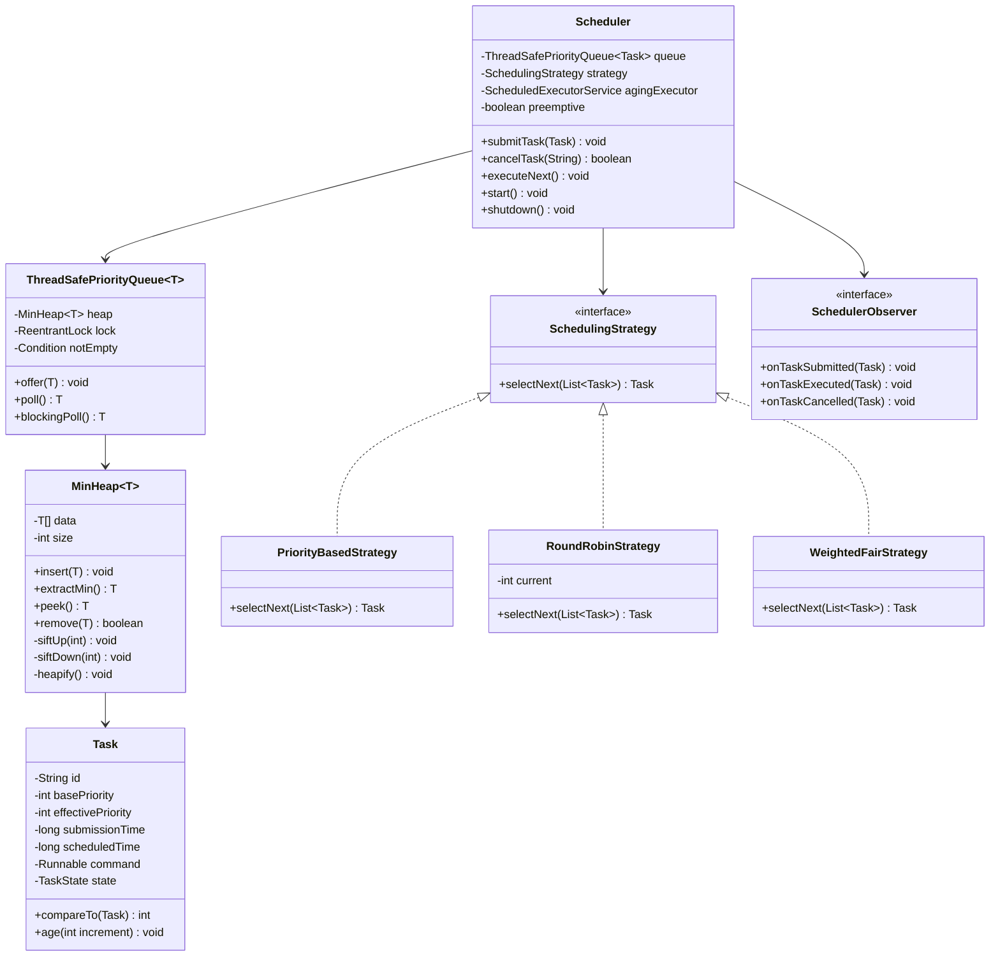

# Priority Queue Scheduler - Low Level Design

## 1. Problem Statement
Design a priority queue-based task scheduler supporting multiple scheduling strategies, preemptive/non-preemptive modes, starvation prevention via priority aging, delayed task execution, and thread-safety.

## 2. UML Class Diagram


## 3. Design Patterns
- **Strategy**: Interchangeable scheduling algorithms (Priority, RoundRobin, WeightedFair)
- **Observer**: Notify listeners on task lifecycle events
- **Command**: Tasks encapsulate executable actions as Runnable

## 4. SOLID Principles
- **SRP**: MinHeap handles data structure; Scheduler handles orchestration
- **OCP**: New strategies added without modifying Scheduler
- **LSP**: All strategies substitutable via interface
- **ISP**: Focused interfaces (SchedulingStrategy, SchedulerObserver)
- **DIP**: Scheduler depends on abstractions not concrete strategies

## 5. Complete Java Implementation

```java
import java.util.*;
import java.util.concurrent.*;
import java.util.concurrent.locks.*;

// === Task State ===
enum TaskState { PENDING, RUNNING, COMPLETED, CANCELLED }

// === Task Model ===
class Task implements Comparable<Task> {
    private final String id;
    private final int basePriority;
    private volatile int effectivePriority;
    private final long submissionTime;
    private final long scheduledTime; // 0 = immediate
    private final Runnable command;
    private volatile TaskState state;
    private int weight; // for weighted fair

    public Task(String id, int priority, Runnable command) {
        this(id, priority, 0, 1, command);
    }

    public Task(String id, int priority, long scheduledTime, int weight, Runnable command) {
        this.id = id;
        this.basePriority = priority;
        this.effectivePriority = priority;
        this.submissionTime = System.currentTimeMillis();
        this.scheduledTime = scheduledTime;
        this.weight = weight;
        this.command = command;
        this.state = TaskState.PENDING;
    }

    @Override
    public int compareTo(Task other) {
        return Integer.compare(this.effectivePriority, other.effectivePriority);
    }

    public void age(int increment) {
        this.effectivePriority = Math.max(0, this.effectivePriority - increment);
    }

    public void resetPriority() { this.effectivePriority = this.basePriority; }
    public boolean isReady() {
        return scheduledTime == 0 || System.currentTimeMillis() >= scheduledTime;
    }

    // Getters
    public String getId() { return id; }
    public int getEffectivePriority() { return effectivePriority; }
    public long getScheduledTime() { return scheduledTime; }
    public Runnable getCommand() { return command; }
    public TaskState getState() { return state; }
    public void setState(TaskState s) { this.state = s; }
    public int getWeight() { return weight; }
}

// === Custom Min-Heap Implementation ===
class MinHeap<T extends Comparable<T>> {
    private Object[] data;
    private int size;
    private static final int DEFAULT_CAPACITY = 16;

    public MinHeap() { this(DEFAULT_CAPACITY); }

    public MinHeap(int capacity) {
        this.data = new Object[capacity];
        this.size = 0;
    }

    public void insert(T item) {
        ensureCapacity();
        data[size] = item;
        siftUp(size);
        size++;
    }

    @SuppressWarnings("unchecked")
    public T extractMin() {
        if (size == 0) throw new NoSuchElementException("Heap is empty");
        T min = (T) data[0];
        data[0] = data[--size];
        data[size] = null;
        if (size > 0) siftDown(0);
        return min;
    }

    @SuppressWarnings("unchecked")
    public T peek() {
        if (size == 0) throw new NoSuchElementException("Heap is empty");
        return (T) data[0];
    }

    public boolean remove(T item) {
        int idx = indexOf(item);
        if (idx == -1) return false;
        data[idx] = data[--size];
        data[size] = null;
        if (idx < size) {
            siftDown(idx);
            siftUp(idx);
        }
        return true;
    }

    public int size() { return size; }
    public boolean isEmpty() { return size == 0; }

    // Rebuild heap - O(n)
    public void heapify() {
        for (int i = (size / 2) - 1; i >= 0; i--) {
            siftDown(i);
        }
    }

    @SuppressWarnings("unchecked")
    private void siftUp(int idx) {
        while (idx > 0) {
            int parent = (idx - 1) / 2;
            if (((T) data[idx]).compareTo((T) data[parent]) < 0) {
                swap(idx, parent);
                idx = parent;
            } else break;
        }
    }

    @SuppressWarnings("unchecked")
    private void siftDown(int idx) {
        while (true) {
            int left = 2 * idx + 1, right = 2 * idx + 2, smallest = idx;
            if (left < size && ((T) data[left]).compareTo((T) data[smallest]) < 0)
                smallest = left;
            if (right < size && ((T) data[right]).compareTo((T) data[smallest]) < 0)
                smallest = right;
            if (smallest != idx) {
                swap(idx, smallest);
                idx = smallest;
            } else break;
        }
    }

    private void swap(int i, int j) {
        Object tmp = data[i]; data[i] = data[j]; data[j] = tmp;
    }

    private int indexOf(T item) {
        for (int i = 0; i < size; i++)
            if (data[i].equals(item)) return i;
        return -1;
    }

    private void ensureCapacity() {
        if (size == data.length)
            data = Arrays.copyOf(data, data.length * 2);
    }

    @SuppressWarnings("unchecked")
    public List<T> snapshot() {
        List<T> list = new ArrayList<>(size);
        for (int i = 0; i < size; i++) list.add((T) data[i]);
        return list;
    }
}

// === Thread-Safe Priority Queue ===
class ThreadSafePriorityQueue<T extends Comparable<T>> {
    private final MinHeap<T> heap = new MinHeap<>();
    private final ReentrantLock lock = new ReentrantLock();
    private final Condition notEmpty = lock.newCondition();

    public void offer(T item) {
        lock.lock();
        try {
            heap.insert(item);
            notEmpty.signal();
        } finally { lock.unlock(); }
    }

    public T poll() {
        lock.lock();
        try {
            return heap.isEmpty() ? null : heap.extractMin();
        } finally { lock.unlock(); }
    }

    public T blockingPoll() throws InterruptedException {
        lock.lock();
        try {
            while (heap.isEmpty()) notEmpty.await();
            return heap.extractMin();
        } finally { lock.unlock(); }
    }

    public T peek() {
        lock.lock();
        try { return heap.isEmpty() ? null : heap.peek(); }
        finally { lock.unlock(); }
    }

    public boolean remove(T item) {
        lock.lock();
        try { return heap.remove(item); }
        finally { lock.unlock(); }
    }

    public int size() {
        lock.lock();
        try { return heap.size(); }
        finally { lock.unlock(); }
    }

    public void reheapify() {
        lock.lock();
        try { heap.heapify(); }
        finally { lock.unlock(); }
    }

    public List<T> snapshot() {
        lock.lock();
        try { return heap.snapshot(); }
        finally { lock.unlock(); }
    }
}

// === Observer Interface ===
interface SchedulerObserver {
    void onTaskSubmitted(Task task);
    void onTaskExecuted(Task task);
    void onTaskCancelled(Task task);
}

// === Scheduling Strategies ===
interface SchedulingStrategy {
    Task selectNext(List<Task> readyTasks);
}

class PriorityBasedStrategy implements SchedulingStrategy {
    @Override
    public Task selectNext(List<Task> readyTasks) {
        return readyTasks.stream()
            .filter(Task::isReady)
            .min(Comparator.comparingInt(Task::getEffectivePriority))
            .orElse(null);
    }
}

class RoundRobinStrategy implements SchedulingStrategy {
    private int current = 0;

    @Override
    public Task selectNext(List<Task> readyTasks) {
        List<Task> ready = readyTasks.stream()
            .filter(Task::isReady).toList();
        if (ready.isEmpty()) return null;
        current = current % ready.size();
        return ready.get(current++);
    }
}

class WeightedFairStrategy implements SchedulingStrategy {
    private final Map<String, Integer> served = new ConcurrentHashMap<>();

    @Override
    public Task selectNext(List<Task> readyTasks) {
        return readyTasks.stream()
            .filter(Task::isReady)
            .min(Comparator.comparingDouble(t -> {
                int s = served.getOrDefault(t.getId(), 0);
                return (double) s / t.getWeight(); // least served ratio
            }))
            .map(t -> { served.merge(t.getId(), 1, Integer::sum); return t; })
            .orElse(null);
    }
}

// === Scheduler ===
class Scheduler {
    private final ThreadSafePriorityQueue<Task> queue = new ThreadSafePriorityQueue<>();
    private final List<SchedulerObserver> observers = new CopyOnWriteArrayList<>();
    private final SchedulingStrategy strategy;
    private final boolean preemptive;
    private final ScheduledExecutorService agingExecutor;
    private final ExecutorService workerPool;
    private volatile Task currentTask;
    private volatile boolean running;

    public Scheduler(SchedulingStrategy strategy, boolean preemptive) {
        this.strategy = strategy;
        this.preemptive = preemptive;
        this.agingExecutor = Executors.newSingleThreadScheduledExecutor();
        this.workerPool = Executors.newFixedThreadPool(4);
    }

    public void start() {
        running = true;
        // Priority aging: every 5s, decrease effective priority by 1
        agingExecutor.scheduleAtFixedRate(this::applyAging, 5, 5, TimeUnit.SECONDS);
        // Worker thread
        workerPool.submit(this::schedulingLoop);
    }

    private void schedulingLoop() {
        while (running) {
            try {
                executeNext();
                Thread.sleep(100); // scheduling interval
            } catch (InterruptedException e) {
                Thread.currentThread().interrupt();
                break;
            }
        }
    }

    public void submitTask(Task task) {
        queue.offer(task);
        observers.forEach(o -> o.onTaskSubmitted(task));
        // Preemptive: if new task has higher priority, preempt current
        if (preemptive && currentTask != null
                && task.getEffectivePriority() < currentTask.getEffectivePriority()
                && task.isReady()) {
            preemptCurrent();
        }
    }

    public boolean cancelTask(String taskId) {
        List<Task> snapshot = queue.snapshot();
        for (Task t : snapshot) {
            if (t.getId().equals(taskId) && t.getState() == TaskState.PENDING) {
                t.setState(TaskState.CANCELLED);
                queue.remove(t);
                observers.forEach(o -> o.onTaskCancelled(t));
                return true;
            }
        }
        return false;
    }

    public void executeNext() throws InterruptedException {
        List<Task> snapshot = queue.snapshot();
        Task next = strategy.selectNext(snapshot);
        if (next == null || !next.isReady()) return;

        queue.remove(next);
        currentTask = next;
        next.setState(TaskState.RUNNING);
        try {
            next.getCommand().run();
            next.setState(TaskState.COMPLETED);
            observers.forEach(o -> o.onTaskExecuted(next));
        } finally {
            next.resetPriority();
            currentTask = null;
        }
    }

    private void preemptCurrent() {
        if (currentTask != null && currentTask.getState() == TaskState.RUNNING) {
            currentTask.setState(TaskState.PENDING);
            queue.offer(currentTask); // re-enqueue
        }
    }

    private void applyAging() {
        List<Task> tasks = queue.snapshot();
        tasks.forEach(t -> t.age(1)); // decrease priority value = increase priority
        queue.reheapify(); // rebuild heap after priority changes
    }

    public void addObserver(SchedulerObserver o) { observers.add(o); }
    public void removeObserver(SchedulerObserver o) { observers.remove(o); }

    public void shutdown() {
        running = false;
        agingExecutor.shutdown();
        workerPool.shutdown();
    }
}

// === Demo ===
class SchedulerDemo {
    public static void main(String[] args) throws Exception {
        Scheduler scheduler = new Scheduler(new PriorityBasedStrategy(), true);
        scheduler.addObserver(new SchedulerObserver() {
            public void onTaskSubmitted(Task t) { System.out.println("Submitted: " + t.getId()); }
            public void onTaskExecuted(Task t) { System.out.println("Executed: " + t.getId()); }
            public void onTaskCancelled(Task t) { System.out.println("Cancelled: " + t.getId()); }
        });

        scheduler.start();

        scheduler.submitTask(new Task("low", 10, () -> System.out.println("Low priority task")));
        scheduler.submitTask(new Task("high", 1, () -> System.out.println("High priority task")));
        // Delayed task: execute 3 seconds from now
        scheduler.submitTask(new Task("delayed", 5, System.currentTimeMillis() + 3000, 1,
            () -> System.out.println("Delayed task")));

        Thread.sleep(5000);
        scheduler.shutdown();
    }
}
```

## 6. Heap Operations Explained

| Operation | Time Complexity | Description |
|-----------|----------------|-------------|
| insert | O(log n) | Add at end, sift up |
| extractMin | O(log n) | Remove root, move last to root, sift down |
| peek | O(1) | Return root |
| remove(item) | O(n) | Linear search + O(log n) fix |
| heapify | O(n) | Bottom-up sift down from n/2 to 0 |

**Sift Up**: Compare child with parent; swap if child < parent. Repeat until heap property restored.
**Sift Down**: Compare parent with children; swap with smallest child. Repeat until leaf or valid.

## 7. Key Interview Points

- **Why custom heap?** Shows understanding of internals vs using `java.util.PriorityQueue`
- **Starvation prevention**: Aging periodically boosts waiting tasks' effective priority
- **Preemptive vs Non-preemptive**: Preemptive re-enqueues running task if higher priority arrives
- **Thread safety**: ReentrantLock + Condition for blocking poll; CopyOnWriteArrayList for observers
- **Delayed tasks**: `scheduledTime` field; strategy skips tasks where `!isReady()`
- **Reheapify after aging**: Must rebuild heap since priorities changed externally
- **Trade-offs**: Thread-safe queue adds lock contention; `snapshot()` is O(n) copy
- **WeightedFair**: Ensures proportional CPU share based on weight
