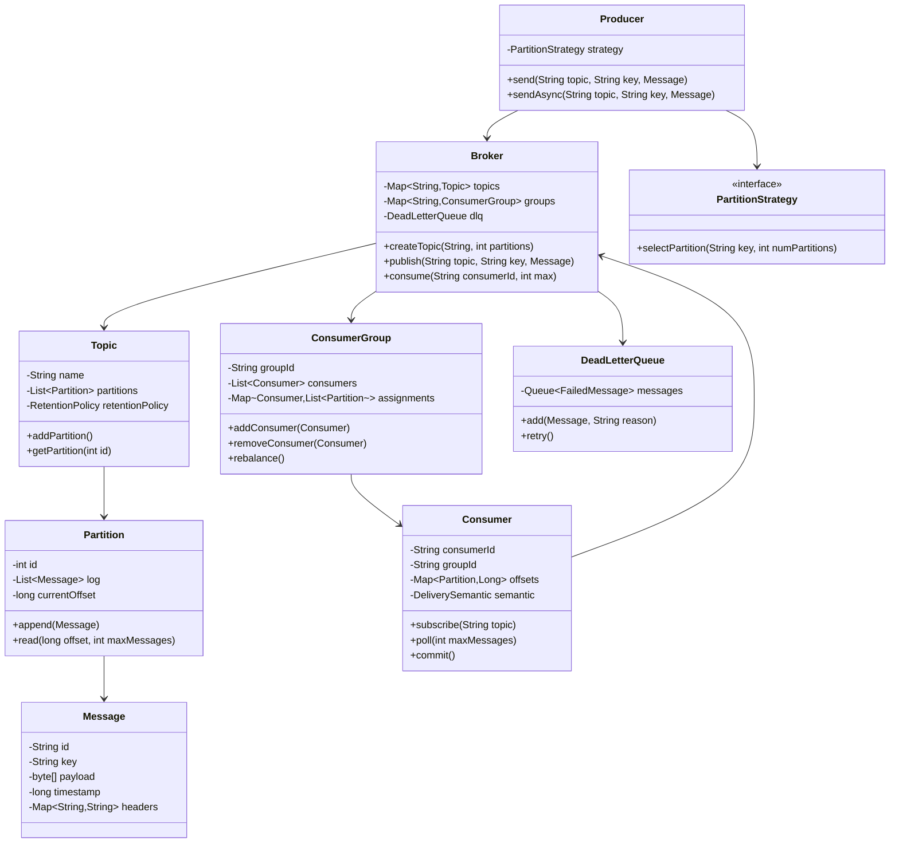

# Message Queue (Kafka/RabbitMQ Simplified) - LLD

## 1. Problem Statement
Design a simplified distributed message queue supporting topics with partitions, consumer groups, offset management, multiple delivery semantics, and message retention policies.

## 2. UML Class Diagram


## 3. Design Patterns
- **Observer**: Consumers subscribe to topics, get notified on new messages
- **Strategy**: Pluggable partition selection (hash-based, round-robin)
- **Factory**: Topic/Partition creation via Broker
- **Producer-Consumer**: Core threading model with blocking queues

## 4. SOLID Principles
- **SRP**: Partition handles log, Consumer handles offset, Broker orchestrates
- **OCP**: PartitionStrategy interface allows new strategies without modification
- **LSP**: All strategy implementations are interchangeable
- **ISP**: Separate Producer/Consumer interfaces
- **DIP**: Broker depends on abstractions (PartitionStrategy, DeliverySemantic)

## 5. Complete Java Implementation

```java
import java.util.*;
import java.util.concurrent.*;
import java.util.concurrent.atomic.*;
import java.util.concurrent.locks.*;
import java.util.function.*;

// ==================== ENUMS ====================
enum DeliverySemantic { AT_MOST_ONCE, AT_LEAST_ONCE, EXACTLY_ONCE }

enum AckMode { NONE, LEADER, ALL }

// ==================== MODELS ====================
class Message {
    private final String id;
    private final String key;
    private final byte[] payload;
    private final long timestamp;
    private final Map<String, String> headers;

    public Message(String key, byte[] payload) {
        this.id = UUID.randomUUID().toString();
        this.key = key;
        this.payload = payload;
        this.timestamp = System.currentTimeMillis();
        this.headers = new ConcurrentHashMap<>();
    }

    public String getId() { return id; }
    public String getKey() { return key; }
    public byte[] getPayload() { return payload; }
    public long getTimestamp() { return timestamp; }
    public Map<String, String> getHeaders() { return headers; }
}

class FailedMessage {
    private final Message message;
    private final String reason;
    private final long failedAt;
    private int retryCount;

    public FailedMessage(Message message, String reason) {
        this.message = message;
        this.reason = reason;
        this.failedAt = System.currentTimeMillis();
        this.retryCount = 0;
    }

    public Message getMessage() { return message; }
    public String getReason() { return reason; }
    public int getRetryCount() { return retryCount; }
    public void incrementRetry() { retryCount++; }
}

// ==================== PARTITION STRATEGY ====================
interface PartitionStrategy {
    int selectPartition(String key, int numPartitions);
}

class HashPartitionStrategy implements PartitionStrategy {
    public int selectPartition(String key, int numPartitions) {
        if (key == null) return ThreadLocalRandom.current().nextInt(numPartitions);
        return Math.abs(key.hashCode() % numPartitions);
    }
}

class RoundRobinPartitionStrategy implements PartitionStrategy {
    private final AtomicInteger counter = new AtomicInteger(0);

    public int selectPartition(String key, int numPartitions) {
        return Math.abs(counter.getAndIncrement() % numPartitions);
    }
}

// ==================== RETENTION POLICY ====================
class RetentionPolicy {
    private final long maxAgeMs;
    private final long maxSizeBytes;

    public RetentionPolicy(long maxAgeMs, long maxSizeBytes) {
        this.maxAgeMs = maxAgeMs;
        this.maxSizeBytes = maxSizeBytes;
    }

    public boolean shouldRetain(Message msg) {
        return (System.currentTimeMillis() - msg.getTimestamp()) < maxAgeMs;
    }

    public long getMaxAgeMs() { return maxAgeMs; }
    public long getMaxSizeBytes() { return maxSizeBytes; }
}

// ==================== PARTITION (APPEND-ONLY LOG) ====================
class Partition {
    private final int id;
    private final List<Message> log;
    private final ReadWriteLock lock = new ReentrantReadWriteLock();
    private final AtomicLong currentOffset = new AtomicLong(0);

    public Partition(int id) {
        this.id = id;
        this.log = new ArrayList<>();
    }

    public long append(Message message) {
        lock.writeLock().lock();
        try {
            log.add(message);
            return currentOffset.getAndIncrement();
        } finally {
            lock.writeLock().unlock();
        }
    }

    public List<Message> read(long fromOffset, int maxMessages) {
        lock.readLock().lock();
        try {
            int start = (int) fromOffset;
            if (start >= log.size()) return Collections.emptyList();
            int end = Math.min(start + maxMessages, log.size());
            return new ArrayList<>(log.subList(start, end));
        } finally {
            lock.readLock().unlock();
        }
    }

    public void applyRetention(RetentionPolicy policy) {
        lock.writeLock().lock();
        try {
            log.removeIf(msg -> !policy.shouldRetain(msg));
        } finally {
            lock.writeLock().unlock();
        }
    }

    public int getId() { return id; }
    public long getCurrentOffset() { return currentOffset.get(); }
}

// ==================== TOPIC ====================
class Topic {
    private final String name;
    private final List<Partition> partitions;
    private final RetentionPolicy retentionPolicy;

    public Topic(String name, int numPartitions, RetentionPolicy policy) {
        this.name = name;
        this.retentionPolicy = policy;
        this.partitions = new ArrayList<>();
        for (int i = 0; i < numPartitions; i++) {
            partitions.add(new Partition(i));
        }
    }

    public String getName() { return name; }
    public int getNumPartitions() { return partitions.size(); }
    public Partition getPartition(int id) { return partitions.get(id); }
    public List<Partition> getPartitions() { return Collections.unmodifiableList(partitions); }
    public RetentionPolicy getRetentionPolicy() { return retentionPolicy; }
}

// ==================== DEAD LETTER QUEUE ====================
class DeadLetterQueue {
    private final ConcurrentLinkedQueue<FailedMessage> queue = new ConcurrentLinkedQueue<>();
    private static final int MAX_RETRIES = 3;

    public void add(Message message, String reason) {
        queue.offer(new FailedMessage(message, reason));
    }

    public Optional<FailedMessage> poll() { return Optional.ofNullable(queue.poll()); }

    public List<FailedMessage> getRetryable() {
        List<FailedMessage> retryable = new ArrayList<>();
        for (FailedMessage fm : queue) {
            if (fm.getRetryCount() < MAX_RETRIES) retryable.add(fm);
        }
        return retryable;
    }

    public int size() { return queue.size(); }
}

// ==================== OFFSET MANAGER ====================
class OffsetManager {
    // groupId -> (partitionKey -> offset)
    private final ConcurrentHashMap<String, ConcurrentHashMap<String, Long>> committedOffsets = new ConcurrentHashMap<>();

    public void commit(String groupId, int partitionId, String topic, long offset) {
        String key = topic + "-" + partitionId;
        committedOffsets.computeIfAbsent(groupId, k -> new ConcurrentHashMap<>()).put(key, offset);
    }

    public long getCommittedOffset(String groupId, int partitionId, String topic) {
        String key = topic + "-" + partitionId;
        return committedOffsets.getOrDefault(groupId, new ConcurrentHashMap<>()).getOrDefault(key, 0L);
    }
}

// ==================== CONSUMER GROUP ====================
class ConsumerGroup {
    private final String groupId;
    private final List<Consumer> consumers = new CopyOnWriteArrayList<>();
    private final Map<String, List<Partition>> assignments = new ConcurrentHashMap<>(); // consumerId -> partitions
    private final ReentrantLock rebalanceLock = new ReentrantLock();

    public ConsumerGroup(String groupId) {
        this.groupId = groupId;
    }

    public void addConsumer(Consumer consumer) {
        consumers.add(consumer);
        rebalance();
    }

    public void removeConsumer(Consumer consumer) {
        consumers.remove(consumer);
        assignments.remove(consumer.getConsumerId());
        rebalance();
    }

    public void rebalance() {
        rebalanceLock.lock();
        try {
            assignments.clear();
            if (consumers.isEmpty()) return;
            // Gather all subscribed partitions
            Set<Partition> allPartitions = new HashSet<>();
            for (Consumer c : consumers) {
                allPartitions.addAll(c.getAssignedPartitions());
            }
            // Round-robin assignment
            List<Partition> partitionList = new ArrayList<>(allPartitions);
            for (Consumer c : consumers) {
                assignments.put(c.getConsumerId(), new ArrayList<>());
            }
            for (int i = 0; i < partitionList.size(); i++) {
                Consumer target = consumers.get(i % consumers.size());
                assignments.get(target.getConsumerId()).add(partitionList.get(i));
            }
            // Update consumer assignments
            for (Consumer c : consumers) {
                c.setAssignedPartitions(assignments.getOrDefault(c.getConsumerId(), Collections.emptyList()));
            }
        } finally {
            rebalanceLock.unlock();
        }
    }

    public String getGroupId() { return groupId; }
    public List<Consumer> getConsumers() { return consumers; }
}

// ==================== PRODUCER ====================
class Producer {
    private final Broker broker;
    private final PartitionStrategy strategy;
    private final ExecutorService asyncExecutor;

    public Producer(Broker broker, PartitionStrategy strategy) {
        this.broker = broker;
        this.strategy = strategy;
        this.asyncExecutor = Executors.newFixedThreadPool(4);
    }

    public void send(String topic, String key, Message message) {
        broker.publish(topic, key, message, strategy);
    }

    public CompletableFuture<Void> sendAsync(String topic, String key, Message message) {
        return CompletableFuture.runAsync(() -> send(topic, key, message), asyncExecutor);
    }

    public void close() { asyncExecutor.shutdown(); }
}

// ==================== CONSUMER ====================
class Consumer {
    private final String consumerId;
    private final String groupId;
    private final DeliverySemantic semantic;
    private final Broker broker;
    private final Map<String, Long> currentOffsets = new ConcurrentHashMap<>(); // partitionKey -> offset
    private List<Partition> assignedPartitions = new CopyOnWriteArrayList<>();
    private String subscribedTopic;

    public Consumer(String consumerId, String groupId, DeliverySemantic semantic, Broker broker) {
        this.consumerId = consumerId;
        this.groupId = groupId;
        this.semantic = semantic;
        this.broker = broker;
    }

    public void subscribe(String topic) {
        this.subscribedTopic = topic;
        Topic t = broker.getTopic(topic);
        if (t != null) {
            this.assignedPartitions = new CopyOnWriteArrayList<>(t.getPartitions());
        }
        broker.registerConsumer(this);
    }

    public List<Message> poll(int maxMessages) {
        List<Message> result = new ArrayList<>();
        for (Partition p : assignedPartitions) {
            String key = subscribedTopic + "-" + p.getId();
            long offset = currentOffsets.getOrDefault(key, 
                broker.getOffsetManager().getCommittedOffset(groupId, p.getId(), subscribedTopic));
            
            // AT_MOST_ONCE: commit before processing
            if (semantic == DeliverySemantic.AT_MOST_ONCE) {
                currentOffsets.put(key, offset + maxMessages);
                commit();
            }
            
            List<Message> messages = p.read(offset, maxMessages - result.size());
            result.addAll(messages);
            
            if (semantic != DeliverySemantic.AT_MOST_ONCE) {
                currentOffsets.put(key, offset + messages.size());
            }
            if (result.size() >= maxMessages) break;
        }
        return result;
    }

    public void commit() {
        for (Map.Entry<String, Long> entry : currentOffsets.entrySet()) {
            String[] parts = entry.getKey().split("-");
            String topic = parts[0];
            int partitionId = Integer.parseInt(parts[1]);
            broker.getOffsetManager().commit(groupId, partitionId, topic, entry.getValue());
        }
    }

    public String getConsumerId() { return consumerId; }
    public String getGroupId() { return groupId; }
    public List<Partition> getAssignedPartitions() { return assignedPartitions; }
    public void setAssignedPartitions(List<Partition> partitions) { this.assignedPartitions = new CopyOnWriteArrayList<>(partitions); }
}

// ==================== BROKER ====================
class Broker {
    private final ConcurrentHashMap<String, Topic> topics = new ConcurrentHashMap<>();
    private final ConcurrentHashMap<String, ConsumerGroup> groups = new ConcurrentHashMap<>();
    private final OffsetManager offsetManager = new OffsetManager();
    private final DeadLetterQueue dlq = new DeadLetterQueue();
    private final ScheduledExecutorService retentionScheduler = Executors.newScheduledThreadPool(1);

    public Broker() {
        // Periodic retention cleanup
        retentionScheduler.scheduleAtFixedRate(this::applyRetention, 1, 1, TimeUnit.MINUTES);
    }

    public Topic createTopic(String name, int numPartitions, RetentionPolicy policy) {
        Topic topic = new Topic(name, numPartitions, policy);
        topics.put(name, topic);
        return topic;
    }

    public void publish(String topicName, String key, Message message, PartitionStrategy strategy) {
        Topic topic = topics.get(topicName);
        if (topic == null) throw new IllegalArgumentException("Topic not found: " + topicName);
        int partitionId = strategy.selectPartition(key, topic.getNumPartitions());
        topic.getPartition(partitionId).append(message);
    }

    public void registerConsumer(Consumer consumer) {
        ConsumerGroup group = groups.computeIfAbsent(consumer.getGroupId(), ConsumerGroup::new);
        group.addConsumer(consumer);
    }

    public void sendToDLQ(Message message, String reason) { dlq.add(message, reason); }

    public Topic getTopic(String name) { return topics.get(name); }
    public OffsetManager getOffsetManager() { return offsetManager; }
    public DeadLetterQueue getDlq() { return dlq; }

    private void applyRetention() {
        for (Topic topic : topics.values()) {
            for (Partition p : topic.getPartitions()) {
                p.applyRetention(topic.getRetentionPolicy());
            }
        }
    }

    public void shutdown() { retentionScheduler.shutdown(); }
}

// ==================== DEMO ====================
class MessageQueueDemo {
    public static void main(String[] args) throws Exception {
        Broker broker = new Broker();
        RetentionPolicy policy = new RetentionPolicy(TimeUnit.HOURS.toMillis(24), 1024 * 1024 * 100);
        broker.createTopic("orders", 3, policy);

        Producer producer = new Producer(broker, new HashPartitionStrategy());
        Consumer consumer1 = new Consumer("c1", "order-group", DeliverySemantic.AT_LEAST_ONCE, broker);
        Consumer consumer2 = new Consumer("c2", "order-group", DeliverySemantic.AT_LEAST_ONCE, broker);

        consumer1.subscribe("orders");
        consumer2.subscribe("orders");

        // Produce messages
        for (int i = 0; i < 10; i++) {
            producer.send("orders", "order-" + i, new Message("order-" + i, ("payload-" + i).getBytes()));
        }

        // Consume
        List<Message> msgs = consumer1.poll(5);
        System.out.println("Consumer1 polled: " + msgs.size() + " messages");
        consumer1.commit(); // AT_LEAST_ONCE: commit after processing

        // Async produce
        producer.sendAsync("orders", "async-key", new Message("async-key", "async-payload".getBytes()))
                .thenRun(() -> System.out.println("Async send completed"));

        Thread.sleep(100);
        producer.close();
        broker.shutdown();
    }
}
```

## 6. Architecture Diagram
```
┌─────────────┐         ┌──────────────────────────────────────┐
│  Producer 1  │────────▶│              BROKER                   │
│  Producer 2  │────────▶│                                      │
└─────────────┘         │  ┌─────────────────────────────────┐ │
                        │  │  Topic: "orders"                 │ │
                        │  │  ┌───────┐ ┌───────┐ ┌───────┐  │ │
                        │  │  │Part-0 │ │Part-1 │ │Part-2 │  │ │
                        │  │  │[msg,.]│ │[msg,.]│ │[msg,.]│  │ │
                        │  │  └───────┘ └───────┘ └───────┘  │ │
                        │  └─────────────────────────────────┘ │
                        │                                      │
                        │  ┌──────────────┐  ┌─────────────┐  │
                        │  │Offset Manager│  │     DLQ     │  │
                        │  └──────────────┘  └─────────────┘  │
                        └──────────┬───────────────────────────┘
                                   │
                    ┌──────────────┼──────────────┐
                    ▼              ▼              ▼
             ┌──────────┐  ┌──────────┐  ┌──────────┐
             │Consumer 1│  │Consumer 2│  │Consumer 3│
             └──────────┘  └──────────┘  └──────────┘
                    └──── Consumer Group ─────┘
```

## 7. Key Interview Points

| Aspect | Detail |
|--------|--------|
| **Partitioning** | Key-based hash ensures ordering per key; round-robin for load distribution |
| **Consumer Groups** | Each partition assigned to exactly one consumer in a group; rebalance on join/leave |
| **Delivery Semantics** | AT_MOST_ONCE: commit before process; AT_LEAST_ONCE: commit after; EXACTLY_ONCE: idempotent + transactional |
| **Offset Management** | Consumer tracks position per partition; committed offsets survive restarts |
| **Retention** | Time-based + size-based; scheduled cleanup thread |
| **DLQ** | Failed messages routed to DLQ with retry count; prevents poison pill blocking |
| **Thread Safety** | ReadWriteLock on partitions, ConcurrentHashMap for metadata, CopyOnWriteArrayList for consumer lists |
| **Scalability** | Add partitions to scale throughput; add consumers (up to partition count) to scale consumption |
| **Ordering** | Guaranteed within a partition only; key routing ensures related messages stay ordered |
| **Backpressure** | Consumer-driven pull model (poll) naturally handles backpressure |
