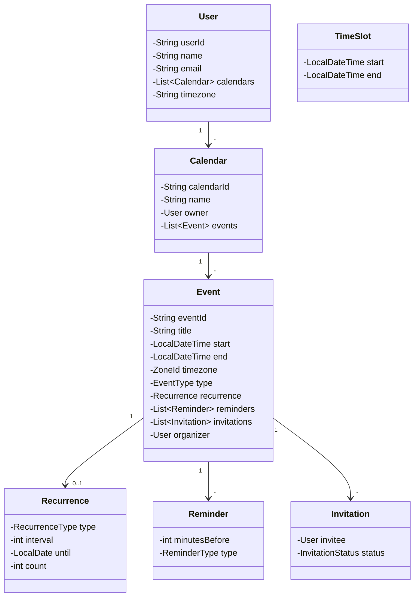

# Calendar Application - Low Level Design

## 1. Problem Statement
Design a Calendar Application supporting event CRUD, recurring events, conflict detection, free/busy time calculation, reminders, invitation management, multiple calendars per user, and timezone handling.

## 2. UML Class Diagram


## 3. Design Patterns
- **Observer**: Notify attendees on event changes, trigger reminders
- **Strategy**: Different reminder delivery strategies (email, push, in-app)
- **Builder**: Complex Event construction
- **Factory**: Create recurrence rule instances

## 4. SOLID Principles
- **SRP**: Separate classes for conflict detection, reminder scheduling, invitation management
- **OCP**: New reminder types via Strategy without modifying existing code
- **LSP**: All notification strategies interchangeable
- **ISP**: Separate interfaces for EventObserver, ReminderStrategy
- **DIP**: Services depend on abstractions (NotificationStrategy, EventRepository)

## 5. Complete Java Implementation

```java
import java.time.*;
import java.util.*;
import java.util.concurrent.*;
import java.util.stream.*;

// ==================== ENUMS ====================
enum EventType { MEETING, APPOINTMENT, REMINDER, OUT_OF_OFFICE, FOCUS_TIME }
enum RecurrenceType { DAILY, WEEKLY, MONTHLY, YEARLY }
enum ReminderType { EMAIL, PUSH, IN_APP }
enum InvitationStatus { PENDING, ACCEPTED, DECLINED, TENTATIVE }

// ==================== MODELS ====================
class TimeSlot {
    private final LocalDateTime start;
    private final LocalDateTime end;

    public TimeSlot(LocalDateTime start, LocalDateTime end) {
        this.start = start;
        this.end = end;
    }

    public boolean overlaps(TimeSlot other) {
        return start.isBefore(other.end) && other.start.isBefore(end);
    }

    public LocalDateTime getStart() { return start; }
    public LocalDateTime getEnd() { return end; }
}

class Recurrence {
    private final RecurrenceType type;
    private final int interval;
    private final LocalDate until;
    private final int count;

    public Recurrence(RecurrenceType type, int interval, LocalDate until, int count) {
        this.type = type;
        this.interval = interval;
        this.until = until;
        this.count = count;
    }

    public List<LocalDateTime> generateOccurrences(LocalDateTime start) {
        List<LocalDateTime> occurrences = new ArrayList<>();
        LocalDateTime current = start;
        int generated = 0;
        while ((count <= 0 || generated < count) &&
               (until == null || !current.toLocalDate().isAfter(until))) {
            occurrences.add(current);
            current = switch (type) {
                case DAILY -> current.plusDays(interval);
                case WEEKLY -> current.plusWeeks(interval);
                case MONTHLY -> current.plusMonths(interval);
                case YEARLY -> current.plusYears(interval);
            };
            generated++;
        }
        return occurrences;
    }

    public RecurrenceType getType() { return type; }
}

class Reminder {
    private final int minutesBefore;
    private final ReminderType type;

    public Reminder(int minutesBefore, ReminderType type) {
        this.minutesBefore = minutesBefore;
        this.type = type;
    }

    public int getMinutesBefore() { return minutesBefore; }
    public ReminderType getType() { return type; }
}

class Invitation {
    private final User invitee;
    private InvitationStatus status;

    public Invitation(User invitee) {
        this.invitee = invitee;
        this.status = InvitationStatus.PENDING;
    }

    public void respond(InvitationStatus status) { this.status = status; }
    public User getInvitee() { return invitee; }
    public InvitationStatus getStatus() { return status; }
}

class Event {
    private final String eventId;
    private String title;
    private LocalDateTime start;
    private LocalDateTime end;
    private ZoneId timezone;
    private EventType type;
    private Recurrence recurrence;
    private final List<Reminder> reminders = new ArrayList<>();
    private final List<Invitation> invitations = new ArrayList<>();
    private User organizer;

    private Event(Builder builder) {
        this.eventId = builder.eventId;
        this.title = builder.title;
        this.start = builder.start;
        this.end = builder.end;
        this.timezone = builder.timezone;
        this.type = builder.type;
        this.recurrence = builder.recurrence;
        this.organizer = builder.organizer;
        this.reminders.addAll(builder.reminders);
    }

    public TimeSlot getTimeSlot() { return new TimeSlot(start, end); }
    public String getEventId() { return eventId; }
    public String getTitle() { return title; }
    public LocalDateTime getStart() { return start; }
    public LocalDateTime getEnd() { return end; }
    public ZoneId getTimezone() { return timezone; }
    public EventType getType() { return type; }
    public Recurrence getRecurrence() { return recurrence; }
    public List<Reminder> getReminders() { return reminders; }
    public List<Invitation> getInvitations() { return invitations; }
    public User getOrganizer() { return organizer; }

    public void setTitle(String title) { this.title = title; }
    public void setStart(LocalDateTime start) { this.start = start; }
    public void setEnd(LocalDateTime end) { this.end = end; }

    public void addInvitation(Invitation inv) { invitations.add(inv); }

    // Builder Pattern
    static class Builder {
        private final String eventId;
        private String title;
        private LocalDateTime start;
        private LocalDateTime end;
        private ZoneId timezone = ZoneId.systemDefault();
        private EventType type = EventType.MEETING;
        private Recurrence recurrence;
        private User organizer;
        private List<Reminder> reminders = new ArrayList<>();

        public Builder(String eventId) { this.eventId = eventId; }
        public Builder title(String t) { this.title = t; return this; }
        public Builder start(LocalDateTime s) { this.start = s; return this; }
        public Builder end(LocalDateTime e) { this.end = e; return this; }
        public Builder timezone(ZoneId tz) { this.timezone = tz; return this; }
        public Builder type(EventType t) { this.type = t; return this; }
        public Builder recurrence(Recurrence r) { this.recurrence = r; return this; }
        public Builder organizer(User u) { this.organizer = u; return this; }
        public Builder reminder(Reminder r) { this.reminders.add(r); return this; }
        public Event build() { return new Event(this); }
    }
}

class Calendar {
    private final String calendarId;
    private final String name;
    private final User owner;
    private final List<Event> events = new ArrayList<>();

    public Calendar(String calendarId, String name, User owner) {
        this.calendarId = calendarId;
        this.name = name;
        this.owner = owner;
    }

    public void addEvent(Event event) { events.add(event); }
    public void removeEvent(String eventId) {
        events.removeIf(e -> e.getEventId().equals(eventId));
    }
    public List<Event> getEvents() { return Collections.unmodifiableList(events); }
    public String getCalendarId() { return calendarId; }
    public String getName() { return name; }
}

class User {
    private final String userId;
    private final String name;
    private final String email;
    private final List<Calendar> calendars = new ArrayList<>();
    private final ZoneId timezone;

    public User(String userId, String name, String email, ZoneId timezone) {
        this.userId = userId;
        this.name = name;
        this.email = email;
        this.timezone = timezone;
    }

    public void addCalendar(Calendar calendar) { calendars.add(calendar); }
    public List<Calendar> getCalendars() { return calendars; }
    public String getUserId() { return userId; }
    public String getName() { return name; }
    public String getEmail() { return email; }
    public ZoneId getTimezone() { return timezone; }
}

// ==================== OBSERVER PATTERN ====================
interface EventObserver {
    void onEventCreated(Event event);
    void onEventUpdated(Event event);
    void onEventCancelled(Event event);
}

class AttendeeNotifier implements EventObserver {
    private final NotificationStrategy strategy;

    public AttendeeNotifier(NotificationStrategy strategy) {
        this.strategy = strategy;
    }

    @Override
    public void onEventCreated(Event event) {
        event.getInvitations().forEach(inv ->
            strategy.send(inv.getInvitee(), "New invitation: " + event.getTitle()));
    }

    @Override
    public void onEventUpdated(Event event) {
        event.getInvitations().forEach(inv ->
            strategy.send(inv.getInvitee(), "Event updated: " + event.getTitle()));
    }

    @Override
    public void onEventCancelled(Event event) {
        event.getInvitations().forEach(inv ->
            strategy.send(inv.getInvitee(), "Event cancelled: " + event.getTitle()));
    }
}

// ==================== STRATEGY PATTERN (Notifications) ====================
interface NotificationStrategy {
    void send(User user, String message);
}

class EmailNotification implements NotificationStrategy {
    @Override
    public void send(User user, String message) {
        System.out.println("[EMAIL -> " + user.getEmail() + "] " + message);
    }
}

class PushNotification implements NotificationStrategy {
    @Override
    public void send(User user, String message) {
        System.out.println("[PUSH -> " + user.getName() + "] " + message);
    }
}

class InAppNotification implements NotificationStrategy {
    @Override
    public void send(User user, String message) {
        System.out.println("[IN-APP -> " + user.getName() + "] " + message);
    }
}

// ==================== FACTORY (Recurrence) ====================
class RecurrenceFactory {
    public static Recurrence daily(int interval, int count) {
        return new Recurrence(RecurrenceType.DAILY, interval, null, count);
    }
    public static Recurrence weekly(int interval, LocalDate until) {
        return new Recurrence(RecurrenceType.WEEKLY, interval, until, 0);
    }
    public static Recurrence monthly(int interval, int count) {
        return new Recurrence(RecurrenceType.MONTHLY, interval, null, count);
    }
    public static Recurrence yearly() {
        return new Recurrence(RecurrenceType.YEARLY, 1, null, 0);
    }
}

// ==================== SERVICES ====================
class ConflictDetector {
    public List<Event> findConflicts(Event newEvent, List<Event> existing) {
        TimeSlot newSlot = newEvent.getTimeSlot();
        return existing.stream()
            .filter(e -> !e.getEventId().equals(newEvent.getEventId()))
            .filter(e -> e.getTimeSlot().overlaps(newSlot))
            .collect(Collectors.toList());
    }

    public boolean hasConflict(Event newEvent, List<Event> existing) {
        return !findConflicts(newEvent, existing).isEmpty();
    }
}

class FreeBusyService {
    public List<TimeSlot> getBusySlots(User user, LocalDate date) {
        return user.getCalendars().stream()
            .flatMap(cal -> cal.getEvents().stream())
            .filter(e -> e.getStart().toLocalDate().equals(date))
            .map(Event::getTimeSlot)
            .sorted(Comparator.comparing(TimeSlot::getStart))
            .collect(Collectors.toList());
    }

    public List<TimeSlot> getFreeSlots(User user, LocalDate date,
                                        LocalTime dayStart, LocalTime dayEnd) {
        List<TimeSlot> busy = getBusySlots(user, date);
        List<TimeSlot> free = new ArrayList<>();
        LocalDateTime current = LocalDateTime.of(date, dayStart);
        LocalDateTime endOfDay = LocalDateTime.of(date, dayEnd);

        for (TimeSlot slot : busy) {
            if (current.isBefore(slot.getStart())) {
                free.add(new TimeSlot(current, slot.getStart()));
            }
            if (slot.getEnd().isAfter(current)) {
                current = slot.getEnd();
            }
        }
        if (current.isBefore(endOfDay)) {
            free.add(new TimeSlot(current, endOfDay));
        }
        return free;
    }
}

class InvitationService {
    private final List<EventObserver> observers = new ArrayList<>();

    public void addObserver(EventObserver observer) { observers.add(observer); }

    public void invite(Event event, User invitee) {
        Invitation inv = new Invitation(invitee);
        event.addInvitation(inv);
        observers.forEach(o -> o.onEventCreated(event));
    }

    public void respond(Event event, User user, InvitationStatus status) {
        event.getInvitations().stream()
            .filter(inv -> inv.getInvitee().getUserId().equals(user.getUserId()))
            .findFirst()
            .ifPresent(inv -> inv.respond(status));
    }
}

class ReminderScheduler {
    private final Map<ReminderType, NotificationStrategy> strategies = new EnumMap<>(ReminderType.class);
    private final ScheduledExecutorService executor = Executors.newScheduledThreadPool(2);

    public ReminderScheduler() {
        strategies.put(ReminderType.EMAIL, new EmailNotification());
        strategies.put(ReminderType.PUSH, new PushNotification());
        strategies.put(ReminderType.IN_APP, new InAppNotification());
    }

    public void scheduleReminders(Event event) {
        for (Reminder reminder : event.getReminders()) {
            LocalDateTime triggerTime = event.getStart().minusMinutes(reminder.getMinutesBefore());
            long delay = Duration.between(LocalDateTime.now(), triggerTime).toMillis();
            if (delay > 0) {
                executor.schedule(() -> {
                    NotificationStrategy strategy = strategies.get(reminder.getType());
                    strategy.send(event.getOrganizer(), "Reminder: " + event.getTitle());
                }, delay, TimeUnit.MILLISECONDS);
            }
        }
    }
}

// ==================== MAIN SERVICE (FACADE) ====================
class CalendarService {
    private final ConflictDetector conflictDetector = new ConflictDetector();
    private final FreeBusyService freeBusyService = new FreeBusyService();
    private final InvitationService invitationService = new InvitationService();
    private final ReminderScheduler reminderScheduler = new ReminderScheduler();
    private final List<EventObserver> observers = new ArrayList<>();

    public void addObserver(EventObserver observer) {
        observers.add(observer);
        invitationService.addObserver(observer);
    }

    public Event createEvent(Calendar calendar, Event event) {
        if (conflictDetector.hasConflict(event, calendar.getEvents())) {
            throw new IllegalStateException("Event conflicts with existing events");
        }
        calendar.addEvent(event);
        reminderScheduler.scheduleReminders(event);
        observers.forEach(o -> o.onEventCreated(event));
        return event;
    }

    public void updateEvent(Calendar calendar, Event event) {
        if (conflictDetector.hasConflict(event, calendar.getEvents())) {
            throw new IllegalStateException("Updated event conflicts");
        }
        observers.forEach(o -> o.onEventUpdated(event));
    }

    public void deleteEvent(Calendar calendar, String eventId) {
        calendar.getEvents().stream()
            .filter(e -> e.getEventId().equals(eventId))
            .findFirst()
            .ifPresent(e -> {
                observers.forEach(o -> o.onEventCancelled(e));
                calendar.removeEvent(eventId);
            });
    }

    public List<TimeSlot> getFreeSlots(User user, LocalDate date) {
        return freeBusyService.getFreeSlots(user, date,
            LocalTime.of(9, 0), LocalTime.of(17, 0));
    }

    public void inviteUser(Event event, User invitee) {
        invitationService.invite(event, invitee);
    }

    public void respondToInvitation(Event event, User user, InvitationStatus status) {
        invitationService.respond(event, user, status);
    }
}

// ==================== DEMO ====================
class CalendarApp {
    public static void main(String[] args) {
        User alice = new User("u1", "Alice", "alice@mail.com", ZoneId.of("America/New_York"));
        User bob = new User("u2", "Bob", "bob@mail.com", ZoneId.of("Europe/London"));

        Calendar aliceCal = new Calendar("c1", "Work", alice);
        alice.addCalendar(aliceCal);

        CalendarService service = new CalendarService();
        service.addObserver(new AttendeeNotifier(new EmailNotification()));

        // Create recurring event
        Event standup = new Event.Builder(UUID.randomUUID().toString())
            .title("Daily Standup")
            .start(LocalDateTime.of(2024, 1, 15, 9, 0))
            .end(LocalDateTime.of(2024, 1, 15, 9, 30))
            .timezone(ZoneId.of("America/New_York"))
            .type(EventType.MEETING)
            .recurrence(RecurrenceFactory.daily(1, 5))
            .organizer(alice)
            .reminder(new Reminder(15, ReminderType.PUSH))
            .build();

        service.createEvent(aliceCal, standup);
        service.inviteUser(standup, bob);
        service.respondToInvitation(standup, bob, InvitationStatus.ACCEPTED);

        // Check free slots
        List<TimeSlot> freeSlots = service.getFreeSlots(alice, LocalDate.of(2024, 1, 15));
        freeSlots.forEach(s -> System.out.println("Free: " + s.getStart() + " - " + s.getEnd()));
    }
}
```

## 6. Key Interview Points

| Topic | Key Insight |
|-------|-------------|
| **Conflict Detection** | O(n) scan with interval overlap check: `A.start < B.end && B.start < A.end` |
| **Recurring Events** | Store rule, expand on query (lazy expansion avoids infinite storage) |
| **Timezone** | Store in UTC internally, convert on display using user's ZoneId |
| **Scalability** | Partition events by user+date; index on (userId, startTime) |
| **Observer** | Decouples event mutations from notification delivery |
| **Strategy** | Adding SMS notification requires zero changes to existing code |
| **Builder** | Events have many optional fields — Builder prevents telescoping constructors |
| **Concurrency** | ScheduledExecutorService for reminder triggers; ConcurrentHashMap for shared state |
| **Invitation Flow** | State machine: PENDING → ACCEPTED/DECLINED/TENTATIVE |
| **Free/Busy** | Merge overlapping busy intervals, return gaps as free slots |
