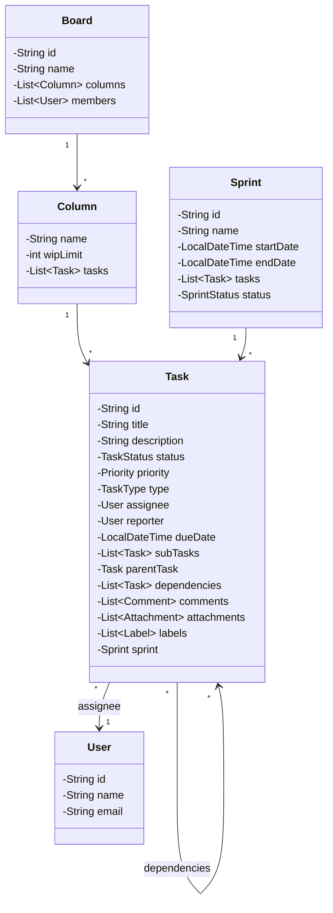
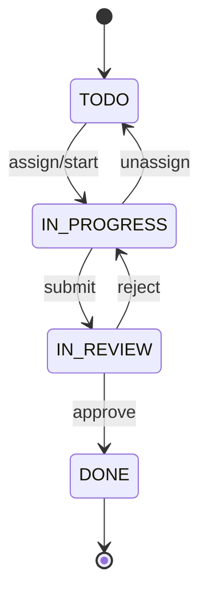

# Task Management Application (Jira/Trello) - LLD

## 1. Problem Statement
Design a task management system supporting boards, sprints, task lifecycle, assignments, dependencies, filtering, and notifications.

## 2. UML Class Diagram


## 3. State Diagram


## 4. Design Patterns & Implementation

```java
// ==================== ENUMS ====================
enum TaskStatus { TODO, IN_PROGRESS, IN_REVIEW, DONE }
enum Priority { CRITICAL, HIGH, MEDIUM, LOW }
enum TaskType { BUG, FEATURE, STORY, EPIC }
enum SprintStatus { PLANNED, ACTIVE, COMPLETED }

// ==================== MODELS ====================
class User {
    private String id, name, email;
    public User(String id, String name, String email) {
        this.id = id; this.name = name; this.email = email;
    }
    // getters
}

class Comment {
    private String id, content;
    private User author;
    private LocalDateTime createdAt;
    public Comment(String id, String content, User author) {
        this.id = id; this.content = content; this.author = author;
        this.createdAt = LocalDateTime.now();
    }
}

class Attachment {
    private String id, fileName, url;
    private User uploadedBy;
}

class Label {
    private String name, color;
    public Label(String name, String color) { this.name = name; this.color = color; }
}

// ==================== STATE PATTERN ====================
interface TaskState {
    void assign(Task task, User user);
    void startWork(Task task);
    void submitForReview(Task task);
    void approve(Task task);
    void reject(Task task);
}

class TodoState implements TaskState {
    public void assign(Task task, User user) {
        task.setAssignee(user);
        task.setState(new InProgressState());
        task.setStatus(TaskStatus.IN_PROGRESS);
        task.notifyObservers("Task assigned to " + user.getName());
    }
    public void startWork(Task task) { assign(task, task.getAssignee()); }
    public void submitForReview(Task task) { throw new IllegalStateException("Cannot review from TODO"); }
    public void approve(Task task) { throw new IllegalStateException("Cannot approve from TODO"); }
    public void reject(Task task) { throw new IllegalStateException("Cannot reject from TODO"); }
}

class InProgressState implements TaskState {
    public void assign(Task task, User user) { task.setAssignee(user); }
    public void startWork(Task task) { /* already in progress */ }
    public void submitForReview(Task task) {
        task.setState(new InReviewState());
        task.setStatus(TaskStatus.IN_REVIEW);
        task.notifyObservers("Task submitted for review");
    }
    public void approve(Task task) { throw new IllegalStateException("Submit for review first"); }
    public void reject(Task task) { throw new IllegalStateException("Not in review"); }
}

class InReviewState implements TaskState {
    public void assign(Task task, User user) { task.setAssignee(user); }
    public void startWork(Task task) { throw new IllegalStateException("In review"); }
    public void submitForReview(Task task) { /* already */ }
    public void approve(Task task) {
        task.setState(new DoneState());
        task.setStatus(TaskStatus.DONE);
        task.notifyObservers("Task approved and done");
    }
    public void reject(Task task) {
        task.setState(new InProgressState());
        task.setStatus(TaskStatus.IN_PROGRESS);
        task.notifyObservers("Task rejected, back to in-progress");
    }
}

class DoneState implements TaskState {
    public void assign(Task t, User u) { throw new IllegalStateException("Task is done"); }
    public void startWork(Task t) { throw new IllegalStateException("Task is done"); }
    public void submitForReview(Task t) { throw new IllegalStateException("Task is done"); }
    public void approve(Task t) { /* already done */ }
    public void reject(Task t) { throw new IllegalStateException("Task is done"); }
}

// ==================== OBSERVER PATTERN ====================
interface TaskObserver {
    void onTaskEvent(Task task, String event);
}

class AssignmentNotifier implements TaskObserver {
    public void onTaskEvent(Task task, String event) {
        if (event.contains("assigned"))
            System.out.println("Email to " + task.getAssignee().getEmail() + ": " + event);
    }
}

class DueDateReminder implements TaskObserver {
    public void onTaskEvent(Task task, String event) {
        if (task.getDueDate() != null && task.getDueDate().isBefore(LocalDateTime.now().plusDays(1)))
            System.out.println("URGENT: " + task.getTitle() + " due soon!");
    }
}

class StatusChangeNotifier implements TaskObserver {
    public void onTaskEvent(Task task, String event) {
        System.out.println("[StatusChange] " + task.getTitle() + ": " + event);
    }
}

// ==================== TASK (BUILDER PATTERN) ====================
class Task {
    private String id, title, description;
    private TaskStatus status;
    private Priority priority;
    private TaskType type;
    private User assignee, reporter;
    private LocalDateTime dueDate, createdAt;
    private List<Task> subTasks = new ArrayList<>();
    private Task parentTask;
    private List<Task> dependencies = new ArrayList<>();
    private List<Comment> comments = new ArrayList<>();
    private List<Attachment> attachments = new ArrayList<>();
    private List<Label> labels = new ArrayList<>();
    private Sprint sprint;
    private TaskState state;
    private List<TaskObserver> observers = new ArrayList<>();

    private Task(Builder builder) {
        this.id = builder.id; this.title = builder.title;
        this.description = builder.description; this.priority = builder.priority;
        this.type = builder.type; this.reporter = builder.reporter;
        this.dueDate = builder.dueDate; this.status = TaskStatus.TODO;
        this.state = new TodoState(); this.createdAt = LocalDateTime.now();
    }

    public void addObserver(TaskObserver o) { observers.add(o); }
    public void notifyObservers(String event) { observers.forEach(o -> o.onTaskEvent(this, event)); }

    public void assign(User user) { state.assign(this, user); }
    public void submitForReview() { state.submitForReview(this); }
    public void approve() { state.approve(this); }
    public void reject() { state.reject(this); }

    public void addSubTask(Task sub) { sub.parentTask = this; subTasks.add(sub); }
    public void addDependency(Task dep) { dependencies.add(dep); }
    public boolean areDependenciesMet() {
        return dependencies.stream().allMatch(d -> d.getStatus() == TaskStatus.DONE);
    }
    public void addComment(Comment c) { comments.add(c); }

    // getters/setters
    public void setState(TaskState s) { this.state = s; }
    public void setStatus(TaskStatus s) { this.status = s; }
    public void setAssignee(User u) { this.assignee = u; }
    public TaskStatus getStatus() { return status; }
    public Priority getPriority() { return priority; }
    public User getAssignee() { return assignee; }
    public String getTitle() { return title; }
    public LocalDateTime getDueDate() { return dueDate; }
    public TaskType getType() { return type; }
    public List<Label> getLabels() { return labels; }

    static class Builder {
        private String id, title, description;
        private Priority priority; private TaskType type;
        private User reporter; private LocalDateTime dueDate;
        public Builder(String id, String title) { this.id = id; this.title = title; }
        public Builder description(String d) { description = d; return this; }
        public Builder priority(Priority p) { priority = p; return this; }
        public Builder type(TaskType t) { type = t; return this; }
        public Builder reporter(User u) { reporter = u; return this; }
        public Builder dueDate(LocalDateTime d) { dueDate = d; return this; }
        public Task build() { return new Task(this); }
    }
}

// ==================== STRATEGY PATTERN (Filter/Sort) ====================
interface FilterStrategy {
    List<Task> filter(List<Task> tasks);
}

class StatusFilter implements FilterStrategy {
    private TaskStatus status;
    public StatusFilter(TaskStatus status) { this.status = status; }
    public List<Task> filter(List<Task> tasks) {
        return tasks.stream().filter(t -> t.getStatus() == status).collect(Collectors.toList());
    }
}

class AssigneeFilter implements FilterStrategy {
    private User assignee;
    public AssigneeFilter(User assignee) { this.assignee = assignee; }
    public List<Task> filter(List<Task> tasks) {
        return tasks.stream().filter(t -> assignee.equals(t.getAssignee())).collect(Collectors.toList());
    }
}

class PriorityFilter implements FilterStrategy {
    private Priority priority;
    public PriorityFilter(Priority p) { this.priority = p; }
    public List<Task> filter(List<Task> tasks) {
        return tasks.stream().filter(t -> t.getPriority() == priority).collect(Collectors.toList());
    }
}

class LabelFilter implements FilterStrategy {
    private String labelName;
    public LabelFilter(String labelName) { this.labelName = labelName; }
    public List<Task> filter(List<Task> tasks) {
        return tasks.stream()
            .filter(t -> t.getLabels().stream().anyMatch(l -> l.getName().equals(labelName)))
            .collect(Collectors.toList());
    }
}

interface SortStrategy {
    List<Task> sort(List<Task> tasks);
}

class PrioritySorter implements SortStrategy {
    public List<Task> sort(List<Task> tasks) {
        return tasks.stream().sorted(Comparator.comparing(Task::getPriority)).collect(Collectors.toList());
    }
}

class DueDateSorter implements SortStrategy {
    public List<Task> sort(List<Task> tasks) {
        return tasks.stream()
            .sorted(Comparator.comparing(Task::getDueDate, Comparator.nullsLast(Comparator.naturalOrder())))
            .collect(Collectors.toList());
    }
}

// ==================== COLUMN & BOARD ====================
class Column {
    private String name;
    private int wipLimit;
    private List<Task> tasks = new ArrayList<>();

    public Column(String name, int wipLimit) { this.name = name; this.wipLimit = wipLimit; }

    public boolean addTask(Task task) {
        if (wipLimit > 0 && tasks.size() >= wipLimit)
            throw new IllegalStateException("WIP limit reached for column: " + name);
        return tasks.add(task);
    }
    public void removeTask(Task task) { tasks.remove(task); }
    public List<Task> getTasks() { return Collections.unmodifiableList(tasks); }
    public String getName() { return name; }
}

class Board {
    private String id, name;
    private List<Column> columns = new ArrayList<>();
    private List<User> members = new ArrayList<>();

    public Board(String id, String name) { this.id = id; this.name = name; }

    public void addColumn(Column col) { columns.add(col); }
    public void addMember(User user) { members.add(user); }

    public void moveTask(Task task, String fromCol, String toCol) {
        Column src = findColumn(fromCol);
        Column dest = findColumn(toCol);
        src.removeTask(task);
        dest.addTask(task);
    }

    private Column findColumn(String name) {
        return columns.stream().filter(c -> c.getName().equals(name))
            .findFirst().orElseThrow(() -> new IllegalArgumentException("Column not found: " + name));
    }

    public List<Task> searchTasks(String query) {
        return columns.stream().flatMap(c -> c.getTasks().stream())
            .filter(t -> t.getTitle().toLowerCase().contains(query.toLowerCase()))
            .collect(Collectors.toList());
    }

    public List<Task> filterTasks(FilterStrategy filter) {
        List<Task> all = columns.stream().flatMap(c -> c.getTasks().stream()).collect(Collectors.toList());
        return filter.filter(all);
    }

    public List<Task> sortTasks(SortStrategy sorter) {
        List<Task> all = columns.stream().flatMap(c -> c.getTasks().stream()).collect(Collectors.toList());
        return sorter.sort(all);
    }
}

// ==================== SPRINT MANAGEMENT ====================
class Sprint {
    private String id, name;
    private LocalDateTime startDate, endDate;
    private List<Task> tasks = new ArrayList<>();
    private SprintStatus status = SprintStatus.PLANNED;

    public Sprint(String id, String name) { this.id = id; this.name = name; }

    public void addTask(Task task) { tasks.add(task); }
    public void removeTask(Task task) { tasks.remove(task); }

    public void start(LocalDateTime start, LocalDateTime end) {
        if (status != SprintStatus.PLANNED) throw new IllegalStateException("Sprint already started");
        this.startDate = start; this.endDate = end;
        this.status = SprintStatus.ACTIVE;
    }

    public List<Task> end() {
        if (status != SprintStatus.ACTIVE) throw new IllegalStateException("Sprint not active");
        this.status = SprintStatus.COMPLETED;
        return tasks.stream().filter(t -> t.getStatus() != TaskStatus.DONE).collect(Collectors.toList());
    }

    public int getVelocity() {
        return (int) tasks.stream().filter(t -> t.getStatus() == TaskStatus.DONE).count();
    }
}

// ==================== FACTORY ====================
class TaskFactory {
    public static Task createBug(String id, String title, User reporter, Priority priority) {
        return new Task.Builder(id, title).type(TaskType.BUG).reporter(reporter).priority(priority).build();
    }
    public static Task createFeature(String id, String title, User reporter) {
        return new Task.Builder(id, title).type(TaskType.FEATURE).reporter(reporter).priority(Priority.MEDIUM).build();
    }
    public static Task createEpic(String id, String title, User reporter) {
        return new Task.Builder(id, title).type(TaskType.EPIC).reporter(reporter).priority(Priority.HIGH).build();
    }
}

// ==================== TASK MANAGEMENT SERVICE ====================
class TaskManagementService {
    private Map<String, Board> boards = new HashMap<>();
    private Map<String, Sprint> sprints = new HashMap<>();
    private List<TaskObserver> globalObservers = new ArrayList<>();

    public Board createBoard(String id, String name) {
        Board board = new Board(id, name);
        board.addColumn(new Column("TODO", 0));
        board.addColumn(new Column("IN_PROGRESS", 5));
        board.addColumn(new Column("IN_REVIEW", 3));
        board.addColumn(new Column("DONE", 0));
        boards.put(id, board);
        return board;
    }

    public Task createTask(String boardId, Task task) {
        globalObservers.forEach(task::addObserver);
        boards.get(boardId).moveTask(task, "TODO", "TODO"); // add to TODO
        return task;
    }

    public Sprint createSprint(String id, String name) {
        Sprint sprint = new Sprint(id, name);
        sprints.put(id, sprint);
        return sprint;
    }

    public void addGlobalObserver(TaskObserver observer) { globalObservers.add(observer); }
}
```

## 5. SOLID Principles Applied

| Principle | Application |
|-----------|-------------|
| **SRP** | Task handles state, Board manages layout, Sprint manages iterations |
| **OCP** | New filters/sorters without modifying existing code (Strategy) |
| **LSP** | All TaskState implementations are substitutable |
| **ISP** | Separate FilterStrategy and SortStrategy interfaces |
| **DIP** | Board depends on FilterStrategy/SortStrategy abstractions |

## 6. Key Interview Points

- **State Pattern**: Clean task lifecycle transitions with illegal state prevention
- **Observer**: Decoupled notification system (assignment, due date, status change)
- **Strategy**: Pluggable filtering/sorting without modifying Board
- **Builder**: Complex Task construction with optional fields
- **Factory**: Standardized task creation for common types
- **WIP Limits**: Column enforces work-in-progress constraints (Kanban)
- **Sprint**: Velocity tracking, incomplete tasks returned to backlog on end
- **Dependencies**: `areDependenciesMet()` checks before allowing transitions
- **Sub-tasks**: Parent-child with bidirectional reference
- **Thread Safety**: Consider ConcurrentHashMap and synchronized blocks for production
- **Scalability**: Event sourcing for task history, CQRS for read-heavy boards
