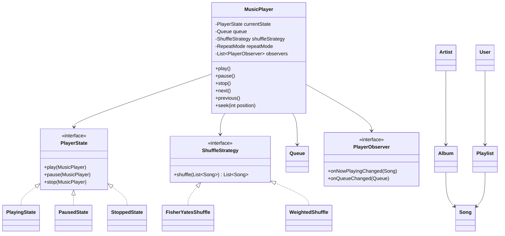
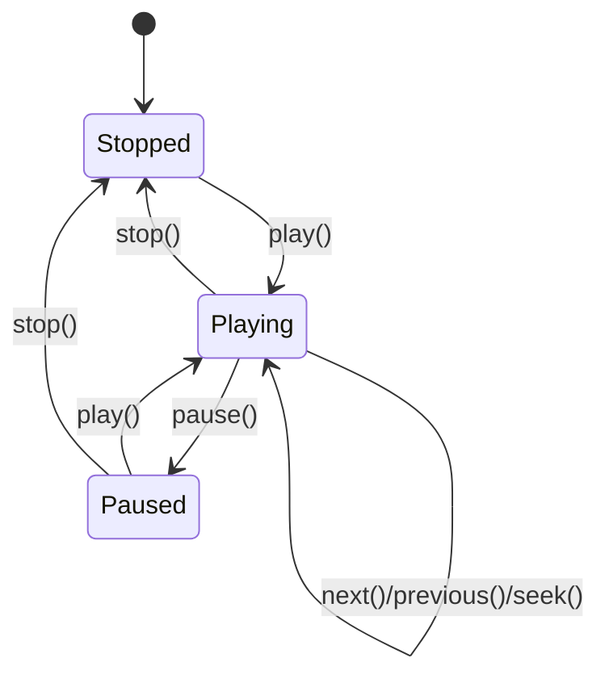

# Music Player (Spotify-like) - Low Level Design

## 1. Problem Statement
Design a music player supporting playback controls, playlists, queue management, shuffle/repeat modes, and search — similar to Spotify.

## 2. UML Class Diagram


## 3. State Machine Diagram


## 4. Design Patterns
- **State**: Playback state transitions (Playing, Paused, Stopped)
- **Strategy**: Shuffle algorithms (FisherYates, Weighted)
- **Observer**: Notify UI of now-playing/queue changes
- **Iterator**: Traverse playlist considering repeat/shuffle

## 5. SOLID Principles
- **SRP**: Each state class handles one state's behavior
- **OCP**: New shuffle strategies without modifying player
- **LSP**: All states substitutable via PlayerState interface
- **ISP**: Separate observer methods for different events
- **DIP**: Player depends on abstractions (PlayerState, ShuffleStrategy)

## 6. Complete Java Implementation

```java
// ============ Enums ============
enum PlaybackState { PLAYING, PAUSED, STOPPED }
enum RepeatMode { OFF, ONE, ALL }
enum ShuffleMode { OFF, FISHER_YATES, WEIGHTED }

// ============ Models ============
class Song {
    private String id, title, genre;
    private Artist artist;
    private Album album;
    private int durationSeconds;

    public Song(String id, String title, Artist artist, Album album, int duration, String genre) {
        this.id = id; this.title = title; this.artist = artist;
        this.album = album; this.durationSeconds = duration; this.genre = genre;
    }
    public String getId() { return id; }
    public String getTitle() { return title; }
    public Artist getArtist() { return artist; }
    public Album getAlbum() { return album; }
    public int getDurationSeconds() { return durationSeconds; }
    public String getGenre() { return genre; }
}

class Artist {
    private String id, name;
    private List<Album> albums = new ArrayList<>();
    public Artist(String id, String name) { this.id = id; this.name = name; }
    public String getName() { return name; }
    public List<Album> getAlbums() { return albums; }
    public void addAlbum(Album a) { albums.add(a); }
}

class Album {
    private String id, title;
    private Artist artist;
    private List<Song> songs = new ArrayList<>();
    public Album(String id, String title, Artist artist) {
        this.id = id; this.title = title; this.artist = artist;
    }
    public String getTitle() { return title; }
    public List<Song> getSongs() { return songs; }
    public void addSong(Song s) { songs.add(s); }
}

class Playlist {
    private String id, name;
    private User owner;
    private List<Song> songs = new ArrayList<>();

    public Playlist(String id, String name, User owner) {
        this.id = id; this.name = name; this.owner = owner;
    }
    public void addSong(Song s) { songs.add(s); }
    public void removeSong(Song s) { songs.remove(s); }
    public void reorder(int from, int to) {
        Song song = songs.remove(from);
        songs.add(to, song);
    }
    public List<Song> getSongs() { return Collections.unmodifiableList(songs); }
    public String getName() { return name; }
}

class User {
    private String id, name;
    private List<Playlist> playlists = new ArrayList<>();
    public User(String id, String name) { this.id = id; this.name = name; }
    public Playlist createPlaylist(String name) {
        Playlist p = new Playlist(UUID.randomUUID().toString(), name, this);
        playlists.add(p);
        return p;
    }
    public List<Playlist> getPlaylists() { return playlists; }
}

// ============ Queue ============
class PlaybackQueue {
    private List<Song> songs = new LinkedList<>();
    private int currentIndex = -1;

    public void loadSongs(List<Song> list) { songs = new ArrayList<>(list); currentIndex = 0; }
    public void addToQueue(Song s) { songs.add(currentIndex + 1, s); }
    public void addToEnd(Song s) { songs.add(s); }
    public Song current() { return (currentIndex >= 0 && currentIndex < songs.size()) ? songs.get(currentIndex) : null; }
    public Song next() { if (currentIndex < songs.size() - 1) currentIndex++; return current(); }
    public Song previous() { if (currentIndex > 0) currentIndex--; return current(); }
    public boolean hasNext() { return currentIndex < songs.size() - 1; }
    public int getCurrentIndex() { return currentIndex; }
    public void setCurrentIndex(int i) { currentIndex = i; }
    public List<Song> getSongs() { return songs; }
    public int size() { return songs.size(); }
}

// ============ State Pattern ============
interface PlayerState {
    void play(MusicPlayer player);
    void pause(MusicPlayer player);
    void stop(MusicPlayer player);
}

class PlayingState implements PlayerState {
    public void play(MusicPlayer player) { /* already playing */ }
    public void pause(MusicPlayer player) {
        System.out.println("Pausing: " + player.getCurrentSong().getTitle());
        player.setState(new PausedState());
    }
    public void stop(MusicPlayer player) {
        System.out.println("Stopping playback");
        player.setPosition(0);
        player.setState(new StoppedState());
    }
}

class PausedState implements PlayerState {
    public void play(MusicPlayer player) {
        System.out.println("Resuming: " + player.getCurrentSong().getTitle());
        player.setState(new PlayingState());
    }
    public void pause(MusicPlayer player) { /* already paused */ }
    public void stop(MusicPlayer player) {
        player.setPosition(0);
        player.setState(new StoppedState());
    }
}

class StoppedState implements PlayerState {
    public void play(MusicPlayer player) {
        if (player.getCurrentSong() != null) {
            System.out.println("Playing: " + player.getCurrentSong().getTitle());
            player.setState(new PlayingState());
        }
    }
    public void pause(MusicPlayer player) { /* can't pause when stopped */ }
    public void stop(MusicPlayer player) { /* already stopped */ }
}

// ============ Strategy Pattern: Shuffle ============
interface ShuffleStrategy {
    List<Song> shuffle(List<Song> songs);
}

class NoShuffle implements ShuffleStrategy {
    public List<Song> shuffle(List<Song> songs) { return new ArrayList<>(songs); }
}

class FisherYatesShuffle implements ShuffleStrategy {
    private Random random = new Random();
    public List<Song> shuffle(List<Song> songs) {
        List<Song> result = new ArrayList<>(songs);
        for (int i = result.size() - 1; i > 0; i--) {
            int j = random.nextInt(i + 1);
            Collections.swap(result, i, j);
        }
        return result;
    }
}

class WeightedShuffle implements ShuffleStrategy {
    // Weighted by play count — less played songs appear earlier
    private Map<String, Integer> playCountMap;
    public WeightedShuffle(Map<String, Integer> playCountMap) { this.playCountMap = playCountMap; }
    public List<Song> shuffle(List<Song> songs) {
        List<Song> result = new ArrayList<>(songs);
        result.sort(Comparator.comparingInt(s -> playCountMap.getOrDefault(s.getId(), 0)));
        // Add slight randomization within similar weights
        Random r = new Random();
        for (int i = 0; i < result.size() - 1; i++) {
            if (r.nextBoolean()) Collections.swap(result, i, i + 1);
        }
        return result;
    }
}

// ============ Observer Pattern ============
interface PlayerObserver {
    void onNowPlayingChanged(Song song);
    void onQueueChanged(PlaybackQueue queue);
    void onStateChanged(PlaybackState state);
}

class UIObserver implements PlayerObserver {
    public void onNowPlayingChanged(Song song) {
        System.out.println("[UI] Now playing: " + song.getTitle() + " - " + song.getArtist().getName());
    }
    public void onQueueChanged(PlaybackQueue queue) {
        System.out.println("[UI] Queue updated, " + queue.size() + " songs");
    }
    public void onStateChanged(PlaybackState state) {
        System.out.println("[UI] State: " + state);
    }
}

// ============ Iterator for Playlist ============
class PlaylistIterator implements Iterator<Song> {
    private List<Song> songs;
    private int index = 0;
    private RepeatMode repeatMode;

    public PlaylistIterator(List<Song> songs, RepeatMode mode) {
        this.songs = songs; this.repeatMode = mode;
    }
    public boolean hasNext() {
        if (repeatMode == RepeatMode.ALL || repeatMode == RepeatMode.ONE) return true;
        return index < songs.size();
    }
    public Song next() {
        if (repeatMode == RepeatMode.ONE) return songs.get(index);
        Song song = songs.get(index % songs.size());
        index++;
        if (repeatMode == RepeatMode.ALL && index >= songs.size()) index = 0;
        return song;
    }
}

// ============ Music Player (Core) ============
class MusicPlayer {
    private PlayerState state;
    private PlaybackQueue queue;
    private ShuffleStrategy shuffleStrategy;
    private RepeatMode repeatMode;
    private int positionSeconds;
    private List<PlayerObserver> observers = new ArrayList<>();

    public MusicPlayer() {
        this.state = new StoppedState();
        this.queue = new PlaybackQueue();
        this.shuffleStrategy = new NoShuffle();
        this.repeatMode = RepeatMode.OFF;
    }

    // State delegation
    public void play() { state.play(this); notifyStateChanged(); }
    public void pause() { state.pause(this); notifyStateChanged(); }
    public void stop() { state.stop(this); notifyStateChanged(); }

    public void next() {
        if (repeatMode == RepeatMode.ONE) { setPosition(0); play(); return; }
        if (queue.hasNext()) {
            queue.next();
        } else if (repeatMode == RepeatMode.ALL) {
            queue.setCurrentIndex(0);
        } else { stop(); return; }
        setPosition(0);
        state = new PlayingState();
        notifyNowPlaying();
    }

    public void previous() {
        if (positionSeconds > 3) { setPosition(0); return; } // restart if >3s in
        queue.previous();
        setPosition(0);
        state = new PlayingState();
        notifyNowPlaying();
    }

    public void seek(int seconds) { this.positionSeconds = Math.max(0, seconds); }

    // Queue management
    public void loadPlaylist(Playlist playlist) {
        List<Song> songs = shuffleStrategy.shuffle(playlist.getSongs());
        queue.loadSongs(songs);
        notifyQueueChanged();
        notifyNowPlaying();
    }

    public void addToQueue(Song song) { queue.addToQueue(song); notifyQueueChanged(); }
    public void addToEndOfQueue(Song song) { queue.addToEnd(song); notifyQueueChanged(); }

    // Shuffle & Repeat
    public void setShuffleStrategy(ShuffleStrategy strategy) {
        this.shuffleStrategy = strategy;
        // Re-shuffle remaining songs
        List<Song> remaining = queue.getSongs().subList(queue.getCurrentIndex() + 1, queue.size());
        List<Song> shuffled = strategy.shuffle(remaining);
        // Rebuild queue with current + shuffled
    }
    public void setRepeatMode(RepeatMode mode) { this.repeatMode = mode; }

    // Accessors
    public Song getCurrentSong() { return queue.current(); }
    public void setState(PlayerState s) { this.state = s; }
    public void setPosition(int p) { this.positionSeconds = p; }
    public int getPosition() { return positionSeconds; }
    public PlaybackState getPlaybackState() {
        if (state instanceof PlayingState) return PlaybackState.PLAYING;
        if (state instanceof PausedState) return PlaybackState.PAUSED;
        return PlaybackState.STOPPED;
    }

    // Observer
    public void addObserver(PlayerObserver o) { observers.add(o); }
    public void removeObserver(PlayerObserver o) { observers.remove(o); }
    private void notifyNowPlaying() {
        Song s = getCurrentSong();
        if (s != null) observers.forEach(o -> o.onNowPlayingChanged(s));
    }
    private void notifyQueueChanged() { observers.forEach(o -> o.onQueueChanged(queue)); }
    private void notifyStateChanged() { observers.forEach(o -> o.onStateChanged(getPlaybackState())); }
}

// ============ Search Service ============
class SearchService {
    private List<Song> catalog;
    public SearchService(List<Song> catalog) { this.catalog = catalog; }

    public List<Song> searchByTitle(String query) {
        return catalog.stream().filter(s -> s.getTitle().toLowerCase().contains(query.toLowerCase())).collect(Collectors.toList());
    }
    public List<Song> searchByArtist(String query) {
        return catalog.stream().filter(s -> s.getArtist().getName().toLowerCase().contains(query.toLowerCase())).collect(Collectors.toList());
    }
    public List<Song> searchByAlbum(String query) {
        return catalog.stream().filter(s -> s.getAlbum().getTitle().toLowerCase().contains(query.toLowerCase())).collect(Collectors.toList());
    }
    public List<Song> searchByGenre(String genre) {
        return catalog.stream().filter(s -> s.getGenre().equalsIgnoreCase(genre)).collect(Collectors.toList());
    }
}

// ============ Demo ============
class MusicPlayerDemo {
    public static void main(String[] args) {
        Artist artist = new Artist("1", "Coldplay");
        Album album = new Album("1", "Parachutes", artist);
        Song s1 = new Song("1", "Yellow", artist, album, 270, "Rock");
        Song s2 = new Song("2", "Shiver", artist, album, 300, "Rock");
        Song s3 = new Song("3", "Trouble", artist, album, 250, "Rock");
        album.addSong(s1); album.addSong(s2); album.addSong(s3);

        User user = new User("u1", "John");
        Playlist playlist = user.createPlaylist("Favorites");
        playlist.addSong(s1); playlist.addSong(s2); playlist.addSong(s3);

        MusicPlayer player = new MusicPlayer();
        player.addObserver(new UIObserver());
        player.loadPlaylist(playlist);

        player.play();   // Playing: Yellow
        player.next();   // Playing: Shiver
        player.pause();  // Paused
        player.play();   // Resumed
        player.setShuffleStrategy(new FisherYatesShuffle());
        player.setRepeatMode(RepeatMode.ALL);
        player.next();   // loops
        player.stop();
    }
}
```

## 7. Key Interview Points

| Topic | Insight |
|-------|---------|
| **State Pattern** | Eliminates complex if/else for playback transitions; each state only handles valid actions |
| **Strategy** | Shuffle algorithms swappable at runtime without modifying player |
| **Observer** | Decouples UI updates from player logic; supports multiple listeners |
| **Iterator** | Handles repeat/shuffle traversal transparently |
| **Queue vs Playlist** | Queue is transient playback order; Playlist is persistent user collection |
| **previous() behavior** | If >3s into song, restarts; otherwise goes to previous (Spotify behavior) |
| **Thread Safety** | Production needs synchronized state transitions or actor model |
| **Extensibility** | Add equalizer, lyrics, social features without modifying core |
| **Concurrency** | Seek/play race conditions need careful handling in real systems |
