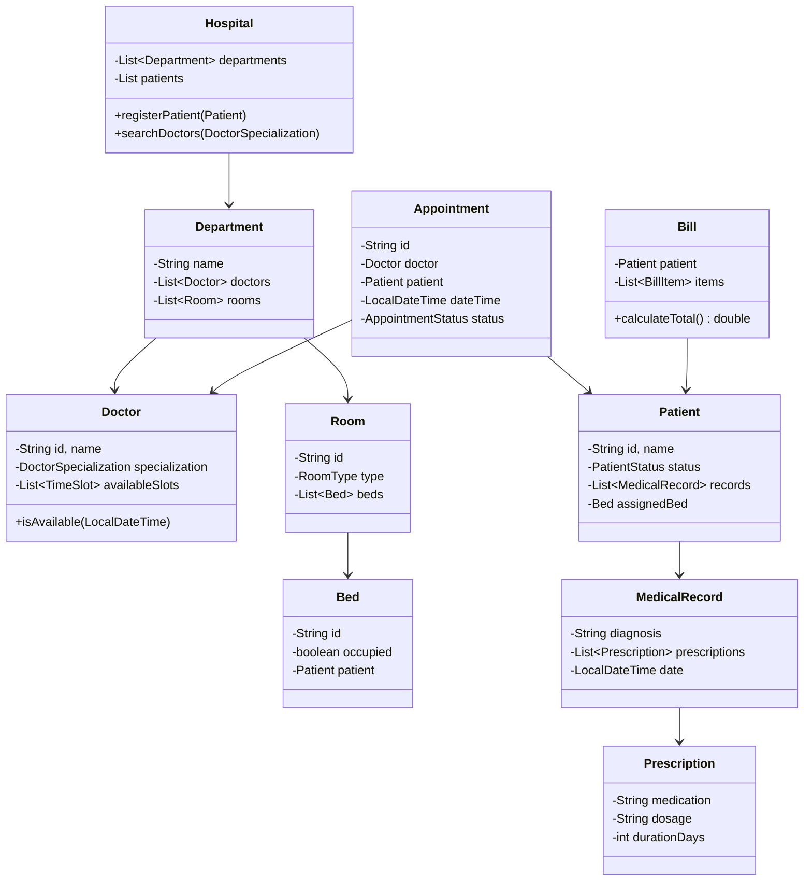

# Hospital Management System - LLD

## 1. Problem Statement
Design a Hospital Management System supporting patient registration, appointment scheduling with conflict detection, doctor availability, bed/room allocation, medical records, prescriptions, and billing.

## 2. UML Class Diagram


## 3. Design Patterns
- **Strategy**: Billing calculation strategies (consultation, room, procedure)
- **Observer**: Appointment reminders, discharge notifications
- **State**: Patient status transitions (Outpatient → Admitted → Discharged)
- **Factory**: Bill item creation

## 4. SOLID Principles
- **SRP**: Separate classes for scheduling, billing, room allocation
- **OCP**: New billing strategies without modifying existing code
- **LSP**: All notification observers are interchangeable
- **ISP**: Separate interfaces for scheduling, billing, notifications
- **DIP**: Services depend on abstractions (BillingStrategy, NotificationObserver)

## 5. Complete Java Implementation

```java
import java.util.*;
import java.time.*;

// ==================== ENUMS ====================
enum AppointmentStatus { SCHEDULED, CONFIRMED, COMPLETED, CANCELLED }
enum DoctorSpecialization { CARDIOLOGY, NEUROLOGY, ORTHOPEDICS, PEDIATRICS, GENERAL }
enum RoomType { GENERAL, SEMI_PRIVATE, PRIVATE, ICU }
enum PatientStatus { OUTPATIENT, ADMITTED, DISCHARGED }

// ==================== OBSERVER PATTERN ====================
interface HospitalEventObserver {
    void onAppointmentReminder(Appointment appointment);
    void onDischargeNotification(Patient patient);
}

class SMSNotificationObserver implements HospitalEventObserver {
    public void onAppointmentReminder(Appointment appt) {
        System.out.println("SMS Reminder: Appointment with Dr." + appt.getDoctor().getName() +
            " at " + appt.getDateTime());
    }
    public void onDischargeNotification(Patient patient) {
        System.out.println("SMS: Patient " + patient.getName() + " discharged.");
    }
}

class EmailNotificationObserver implements HospitalEventObserver {
    public void onAppointmentReminder(Appointment appt) {
        System.out.println("Email Reminder: Appointment " + appt.getId());
    }
    public void onDischargeNotification(Patient patient) {
        System.out.println("Email: Discharge summary for " + patient.getName());
    }
}

class NotificationService {
    private final List<HospitalEventObserver> observers = new ArrayList<>();
    public void addObserver(HospitalEventObserver o) { observers.add(o); }
    public void notifyAppointmentReminder(Appointment appt) {
        observers.forEach(o -> o.onAppointmentReminder(appt));
    }
    public void notifyDischarge(Patient patient) {
        observers.forEach(o -> o.onDischargeNotification(patient));
    }
}

// ==================== STRATEGY PATTERN (Billing) ====================
interface BillingStrategy {
    double calculate(Map<String, Object> params);
}

class ConsultationBilling implements BillingStrategy {
    public double calculate(Map<String, Object> params) {
        DoctorSpecialization spec = (DoctorSpecialization) params.get("specialization");
        return switch (spec) {
            case CARDIOLOGY, NEUROLOGY -> 1000.0;
            case ORTHOPEDICS -> 800.0;
            default -> 500.0;
        };
    }
}

class RoomChargeBilling implements BillingStrategy {
    public double calculate(Map<String, Object> params) {
        RoomType type = (RoomType) params.get("roomType");
        int days = (int) params.get("days");
        double rate = switch (type) {
            case ICU -> 5000.0;
            case PRIVATE -> 3000.0;
            case SEMI_PRIVATE -> 2000.0;
            case GENERAL -> 1000.0;
        };
        return rate * days;
    }
}

class ProcedureBilling implements BillingStrategy {
    public double calculate(Map<String, Object> params) {
        return (double) params.get("procedureCost");
    }
}

// ==================== STATE PATTERN (Patient Status) ====================
interface PatientState {
    void admit(Patient patient);
    void discharge(Patient patient);
}

class OutpatientState implements PatientState {
    public void admit(Patient patient) {
        patient.setStatus(PatientStatus.ADMITTED);
        patient.setState(new AdmittedState());
    }
    public void discharge(Patient patient) {
        throw new IllegalStateException("Outpatient cannot be discharged");
    }
}

class AdmittedState implements PatientState {
    public void admit(Patient patient) {
        throw new IllegalStateException("Already admitted");
    }
    public void discharge(Patient patient) {
        patient.setStatus(PatientStatus.DISCHARGED);
        patient.setState(new DischargedState());
        if (patient.getAssignedBed() != null) {
            patient.getAssignedBed().release();
            patient.setAssignedBed(null);
        }
    }
}

class DischargedState implements PatientState {
    public void admit(Patient patient) {
        patient.setStatus(PatientStatus.ADMITTED);
        patient.setState(new AdmittedState());
    }
    public void discharge(Patient patient) {
        throw new IllegalStateException("Already discharged");
    }
}

// ==================== MODELS ====================
class Prescription {
    private String medication, dosage;
    private int durationDays;
    public Prescription(String medication, String dosage, int durationDays) {
        this.medication = medication; this.dosage = dosage; this.durationDays = durationDays;
    }
    public String getMedication() { return medication; }
    public String toString() { return medication + " " + dosage + " for " + durationDays + " days"; }
}

class MedicalRecord {
    private String id, diagnosis;
    private Doctor doctor;
    private List<Prescription> prescriptions = new ArrayList<>();
    private LocalDateTime date;
    public MedicalRecord(String id, String diagnosis, Doctor doctor) {
        this.id = id; this.diagnosis = diagnosis; this.doctor = doctor; this.date = LocalDateTime.now();
    }
    public void addPrescription(Prescription p) { prescriptions.add(p); }
    public String getDiagnosis() { return diagnosis; }
    public List<Prescription> getPrescriptions() { return prescriptions; }
}

class Bed {
    private String id;
    private boolean occupied;
    private Patient patient;
    public Bed(String id) { this.id = id; }
    public boolean isOccupied() { return occupied; }
    public void assign(Patient p) { this.patient = p; this.occupied = true; }
    public void release() { this.patient = null; this.occupied = false; }
    public String getId() { return id; }
}

class Room {
    private String id;
    private RoomType type;
    private List<Bed> beds = new ArrayList<>();
    public Room(String id, RoomType type, int bedCount) {
        this.id = id; this.type = type;
        for (int i = 1; i <= bedCount; i++) beds.add(new Bed(id + "-B" + i));
    }
    public RoomType getType() { return type; }
    public Optional<Bed> findAvailableBed() {
        return beds.stream().filter(b -> !b.isOccupied()).findFirst();
    }
}

class TimeSlot {
    private LocalDateTime start, end;
    public TimeSlot(LocalDateTime start, LocalDateTime end) { this.start = start; this.end = end; }
    public boolean contains(LocalDateTime dt) { return !dt.isBefore(start) && dt.isBefore(end); }
    public boolean overlaps(LocalDateTime dt, int durationMinutes) {
        LocalDateTime apptEnd = dt.plusMinutes(durationMinutes);
        return start.isBefore(apptEnd) && end.isAfter(dt);
    }
    public LocalDateTime getStart() { return start; }
}

class Doctor {
    private String id, name;
    private DoctorSpecialization specialization;
    private List<TimeSlot> availableSlots = new ArrayList<>();
    private List<Appointment> appointments = new ArrayList<>();

    public Doctor(String id, String name, DoctorSpecialization spec) {
        this.id = id; this.name = name; this.specialization = spec;
    }
    public String getId() { return id; }
    public String getName() { return name; }
    public DoctorSpecialization getSpecialization() { return specialization; }
    public void addAvailableSlot(TimeSlot slot) { availableSlots.add(slot); }
    public List<TimeSlot> getAvailableSlots() { return availableSlots; }

    public boolean isAvailable(LocalDateTime dateTime, int durationMinutes) {
        boolean inSlot = availableSlots.stream().anyMatch(s -> s.contains(dateTime));
        boolean noConflict = appointments.stream()
            .filter(a -> a.getStatus() != AppointmentStatus.CANCELLED)
            .noneMatch(a -> Math.abs(Duration.between(a.getDateTime(), dateTime).toMinutes()) < durationMinutes);
        return inSlot && noConflict;
    }
    public void addAppointment(Appointment appt) { appointments.add(appt); }
}

class Patient {
    private String id, name, phone;
    private PatientStatus status;
    private PatientState state;
    private List<MedicalRecord> records = new ArrayList<>();
    private Bed assignedBed;

    public Patient(String id, String name, String phone) {
        this.id = id; this.name = name; this.phone = phone;
        this.status = PatientStatus.OUTPATIENT;
        this.state = new OutpatientState();
    }
    public String getId() { return id; }
    public String getName() { return name; }
    public PatientStatus getStatus() { return status; }
    public void setStatus(PatientStatus s) { this.status = s; }
    public void setState(PatientState s) { this.state = s; }
    public Bed getAssignedBed() { return assignedBed; }
    public void setAssignedBed(Bed bed) { this.assignedBed = bed; }
    public void admit() { state.admit(this); }
    public void discharge() { state.discharge(this); }
    public void addRecord(MedicalRecord r) { records.add(r); }
    public List<MedicalRecord> getRecords() { return records; }
}

class Appointment {
    private String id;
    private Doctor doctor;
    private Patient patient;
    private LocalDateTime dateTime;
    private AppointmentStatus status;

    public Appointment(String id, Doctor doctor, Patient patient, LocalDateTime dateTime) {
        this.id = id; this.doctor = doctor; this.patient = patient;
        this.dateTime = dateTime; this.status = AppointmentStatus.SCHEDULED;
    }
    public String getId() { return id; }
    public Doctor getDoctor() { return doctor; }
    public Patient getPatient() { return patient; }
    public LocalDateTime getDateTime() { return dateTime; }
    public AppointmentStatus getStatus() { return status; }
    public void setStatus(AppointmentStatus s) { this.status = s; }
}

// ==================== FACTORY (Bill Items) ====================
class BillItem {
    private String description;
    private double amount;
    public BillItem(String description, double amount) {
        this.description = description; this.amount = amount;
    }
    public double getAmount() { return amount; }
    public String toString() { return description + ": $" + amount; }
}

class BillItemFactory {
    public static BillItem createConsultationItem(Doctor doctor) {
        BillingStrategy strategy = new ConsultationBilling();
        Map<String, Object> params = Map.of("specialization", doctor.getSpecialization());
        return new BillItem("Consultation - Dr." + doctor.getName(), strategy.calculate(params));
    }
    public static BillItem createRoomItem(RoomType type, int days) {
        BillingStrategy strategy = new RoomChargeBilling();
        Map<String, Object> params = Map.of("roomType", type, "days", days);
        return new BillItem("Room (" + type + ") x " + days + " days", strategy.calculate(params));
    }
    public static BillItem createProcedureItem(String name, double cost) {
        return new BillItem("Procedure: " + name, cost);
    }
}

class Bill {
    private String id;
    private Patient patient;
    private List<BillItem> items = new ArrayList<>();
    public Bill(String id, Patient patient) { this.id = id; this.patient = patient; }
    public void addItem(BillItem item) { items.add(item); }
    public double calculateTotal() { return items.stream().mapToDouble(BillItem::getAmount).sum(); }
    public void printBill() {
        System.out.println("=== Bill for " + patient.getName() + " ===");
        items.forEach(System.out::println);
        System.out.println("Total: $" + calculateTotal());
    }
}

// ==================== SERVICES ====================
class AppointmentService {
    private final List<Appointment> appointments = new ArrayList<>();
    private final NotificationService notificationService;
    private int counter = 0;

    public AppointmentService(NotificationService ns) { this.notificationService = ns; }

    public Appointment scheduleAppointment(Doctor doctor, Patient patient, LocalDateTime dateTime) {
        if (!doctor.isAvailable(dateTime, 30)) {
            throw new IllegalStateException("Doctor not available at " + dateTime);
        }
        Appointment appt = new Appointment("APT-" + (++counter), doctor, patient, dateTime);
        doctor.addAppointment(appt);
        appointments.add(appt);
        notificationService.notifyAppointmentReminder(appt);
        return appt;
    }

    public List<TimeSlot> getAvailableSlots(Doctor doctor) {
        return doctor.getAvailableSlots();
    }
}

class RoomAllocationService {
    private final List<Room> rooms;
    public RoomAllocationService(List<Room> rooms) { this.rooms = rooms; }

    public Bed allocateBed(Patient patient, RoomType preferredType) {
        Bed bed = rooms.stream()
            .filter(r -> r.getType() == preferredType)
            .map(Room::findAvailableBed)
            .filter(Optional::isPresent)
            .map(Optional::get)
            .findFirst()
            .orElseThrow(() -> new IllegalStateException("No beds available in " + preferredType));
        bed.assign(patient);
        patient.setAssignedBed(bed);
        patient.admit();
        return bed;
    }
}

class Department {
    private String name;
    private List<Doctor> doctors = new ArrayList<>();
    private List<Room> rooms = new ArrayList<>();
    public Department(String name) { this.name = name; }
    public void addDoctor(Doctor d) { doctors.add(d); }
    public void addRoom(Room r) { rooms.add(r); }
    public List<Doctor> getDoctors() { return doctors; }
    public List<Room> getRooms() { return rooms; }
}

// ==================== HOSPITAL (FACADE) ====================
class Hospital {
    private final List<Department> departments = new ArrayList<>();
    private final List<Patient> patients = new ArrayList<>();
    private final AppointmentService appointmentService;
    private final NotificationService notificationService;

    public Hospital() {
        this.notificationService = new NotificationService();
        notificationService.addObserver(new SMSNotificationObserver());
        notificationService.addObserver(new EmailNotificationObserver());
        this.appointmentService = new AppointmentService(notificationService);
    }

    public Patient registerPatient(String id, String name, String phone) {
        Patient p = new Patient(id, name, phone);
        patients.add(p);
        return p;
    }

    public void addDepartment(Department dept) { departments.add(dept); }

    public List<Doctor> searchDoctorsBySpecialization(DoctorSpecialization spec) {
        return departments.stream()
            .flatMap(d -> d.getDoctors().stream())
            .filter(doc -> doc.getSpecialization() == spec)
            .toList();
    }

    public Appointment bookAppointment(Doctor doctor, Patient patient, LocalDateTime dt) {
        return appointmentService.scheduleAppointment(doctor, patient, dt);
    }

    public void dischargePatient(Patient patient) {
        patient.discharge();
        notificationService.notifyDischarge(patient);
    }

    public AppointmentService getAppointmentService() { return appointmentService; }
    public NotificationService getNotificationService() { return notificationService; }
}

// ==================== DEMO ====================
public class HospitalManagementDemo {
    public static void main(String[] args) {
        Hospital hospital = new Hospital();

        // Setup department
        Department cardiology = new Department("Cardiology");
        Doctor doc = new Doctor("D1", "Smith", DoctorSpecialization.CARDIOLOGY);
        doc.addAvailableSlot(new TimeSlot(
            LocalDateTime.of(2024, 1, 15, 9, 0), LocalDateTime.of(2024, 1, 15, 17, 0)));
        cardiology.addDoctor(doc);
        cardiology.addRoom(new Room("R1", RoomType.PRIVATE, 2));
        hospital.addDepartment(cardiology);

        // Register patient & book appointment
        Patient patient = hospital.registerPatient("P1", "John", "555-0101");
        LocalDateTime apptTime = LocalDateTime.of(2024, 1, 15, 10, 0);
        Appointment appt = hospital.bookAppointment(doc, patient, apptTime);

        // Conflict detection
        try {
            hospital.bookAppointment(doc, patient, apptTime.plusMinutes(15));
        } catch (IllegalStateException e) {
            System.out.println("Conflict detected: " + e.getMessage());
        }

        // Admit & allocate bed
        RoomAllocationService roomService = new RoomAllocationService(cardiology.getRooms());
        Bed bed = roomService.allocateBed(patient, RoomType.PRIVATE);
        System.out.println("Assigned bed: " + bed.getId() + ", Status: " + patient.getStatus());

        // Medical record & prescription
        MedicalRecord record = new MedicalRecord("MR1", "Hypertension", doc);
        record.addPrescription(new Prescription("Amlodipine", "5mg daily", 30));
        patient.addRecord(record);

        // Billing
        Bill bill = new Bill("B1", patient);
        bill.addItem(BillItemFactory.createConsultationItem(doc));
        bill.addItem(BillItemFactory.createRoomItem(RoomType.PRIVATE, 3));
        bill.addItem(BillItemFactory.createProcedureItem("ECG", 200.0));
        bill.printBill();

        // Discharge
        hospital.dischargePatient(patient);
        System.out.println("Final status: " + patient.getStatus());
    }
}
```

## 6. Key Interview Points

| Topic | Highlight |
|-------|-----------|
| **Conflict Detection** | Check both slot availability AND existing appointment overlap |
| **State Pattern** | Patient status transitions enforced with illegal state prevention |
| **Strategy Pattern** | Different billing calculations without conditionals in Bill class |
| **Observer Pattern** | Decoupled notifications (SMS, Email) from core logic |
| **Factory Pattern** | BillItemFactory encapsulates billing strategy selection |
| **Thread Safety** | Use ConcurrentHashMap + synchronized for production multi-threaded access |
| **Extensibility** | New specializations, room types, billing strategies added without modifying existing code |
| **Search** | Stream-based filtering for doctors by specialization, available slots |
| **Bed Allocation** | First-fit strategy; can extend to priority-based or least-recently-used |
