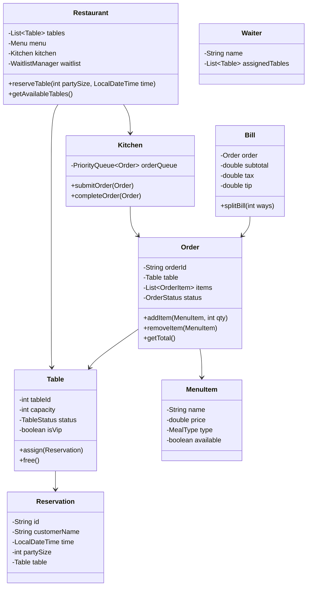

# Restaurant Management System - LLD

## 1. Problem Statement
Design a Restaurant Management System handling table reservations, order lifecycle, kitchen queue with VIP priority, billing with split support, menu management, and waitlist when tables are full.

## 2. UML Class Diagram


## 3. Design Patterns

| Pattern | Usage |
|---------|-------|
| **State** | Table status transitions, Order status lifecycle |
| **Strategy** | Billing strategies (flat tax, split, discount) |
| **Observer** | Order ready notification, reservation reminders |
| **Factory** | Order/Bill creation |

## 4. SOLID Principles
- **S**: Separate classes for Order, Bill, Kitchen, Reservation
- **O**: New MealTypes/billing strategies without modifying existing code
- **L**: All notification observers interchangeable
- **I**: Separate interfaces for OrderManagement, BillingService, KitchenService
- **D**: Services depend on abstractions (NotificationObserver, BillingStrategy)

## 5. Complete Java Implementation

```java
// ============ ENUMS ============
enum TableStatus { FREE, OCCUPIED, RESERVED }
enum OrderStatus { PLACED, PREPARING, READY, SERVED, CANCELLED }
enum MealType { STARTER, MAIN, DESSERT, DRINK }

// ============ OBSERVER PATTERN ============
interface OrderObserver {
    void onOrderReady(Order order);
    void onReservationReminder(Reservation reservation);
}

class WaiterNotifier implements OrderObserver {
    public void onOrderReady(Order order) {
        System.out.println("Waiter notified: Order " + order.getOrderId() + " ready for Table " + order.getTable().getTableId());
    }
    public void onReservationReminder(Reservation reservation) {
        System.out.println("Reminder: Reservation for " + reservation.getCustomerName() + " in 30 mins");
    }
}

class CustomerNotifier implements OrderObserver {
    public void onOrderReady(Order order) {
        System.out.println("Customer notified: Your order is ready!");
    }
    public void onReservationReminder(Reservation reservation) {
        System.out.println("SMS to " + reservation.getCustomerName() + ": Your table is ready soon");
    }
}

// ============ STRATEGY PATTERN (Billing) ============
interface BillingStrategy {
    double calculateTotal(double subtotal);
}

class StandardBilling implements BillingStrategy {
    private static final double TAX_RATE = 0.18;
    public double calculateTotal(double subtotal) { return subtotal * (1 + TAX_RATE); }
}

class DiscountBilling implements BillingStrategy {
    private double discountPercent;
    public DiscountBilling(double discountPercent) { this.discountPercent = discountPercent; }
    public double calculateTotal(double subtotal) {
        double discounted = subtotal * (1 - discountPercent / 100);
        return discounted * 1.18;
    }
}

// ============ MODELS ============
class MenuItem {
    private String name;
    private double price;
    private MealType type;
    private boolean available;
    private boolean isDailySpecial;

    public MenuItem(String name, double price, MealType type) {
        this.name = name; this.price = price; this.type = type; this.available = true;
    }
    // Getters/setters
    public String getName() { return name; }
    public double getPrice() { return price; }
    public MealType getType() { return type; }
    public boolean isAvailable() { return available; }
    public void setAvailable(boolean available) { this.available = available; }
    public void setDailySpecial(boolean special) { this.isDailySpecial = special; }
    public boolean isDailySpecial() { return isDailySpecial; }
    public void setPrice(double price) { this.price = price; }
}

class OrderItem {
    private MenuItem menuItem;
    private int quantity;
    public OrderItem(MenuItem menuItem, int quantity) { this.menuItem = menuItem; this.quantity = quantity; }
    public double getTotal() { return menuItem.getPrice() * quantity; }
    public MenuItem getMenuItem() { return menuItem; }
    public int getQuantity() { return quantity; }
    public void setQuantity(int qty) { this.quantity = qty; }
}

class Table {
    private int tableId;
    private int capacity;
    private TableStatus status;
    private boolean isVip;

    public Table(int tableId, int capacity, boolean isVip) {
        this.tableId = tableId; this.capacity = capacity; this.isVip = isVip; this.status = TableStatus.FREE;
    }
    public void occupy() { this.status = TableStatus.OCCUPIED; }
    public void reserve() { this.status = TableStatus.RESERVED; }
    public void free() { this.status = TableStatus.FREE; }
    public int getTableId() { return tableId; }
    public int getCapacity() { return capacity; }
    public TableStatus getStatus() { return status; }
    public boolean isVip() { return isVip; }
}

class Reservation {
    private String id;
    private String customerName;
    private LocalDateTime time;
    private int partySize;
    private Table table;

    public Reservation(String customerName, LocalDateTime time, int partySize, Table table) {
        this.id = UUID.randomUUID().toString().substring(0, 8);
        this.customerName = customerName; this.time = time; this.partySize = partySize; this.table = table;
        table.reserve();
    }
    public String getId() { return id; }
    public String getCustomerName() { return customerName; }
    public Table getTable() { return table; }
    public LocalDateTime getTime() { return time; }
}

class Order {
    private String orderId;
    private Table table;
    private List<OrderItem> items;
    private OrderStatus status;
    private LocalDateTime createdAt;

    public Order(Table table) {
        this.orderId = UUID.randomUUID().toString().substring(0, 8);
        this.table = table; this.items = new ArrayList<>();
        this.status = OrderStatus.PLACED; this.createdAt = LocalDateTime.now();
    }
    public void addItem(MenuItem item, int qty) {
        if (!item.isAvailable()) throw new IllegalStateException("Item not available: " + item.getName());
        items.stream().filter(oi -> oi.getMenuItem().equals(item)).findFirst()
            .ifPresentOrElse(oi -> oi.setQuantity(oi.getQuantity() + qty), () -> items.add(new OrderItem(item, qty)));
    }
    public void removeItem(MenuItem item) {
        items.removeIf(oi -> oi.getMenuItem().equals(item));
    }
    public void cancel() {
        if (status == OrderStatus.PREPARING) throw new IllegalStateException("Cannot cancel order already being prepared");
        this.status = OrderStatus.CANCELLED;
    }
    public double getSubtotal() { return items.stream().mapToDouble(OrderItem::getTotal).sum(); }
    public String getOrderId() { return orderId; }
    public Table getTable() { return table; }
    public OrderStatus getStatus() { return status; }
    public void setStatus(OrderStatus status) { this.status = status; }
    public List<OrderItem> getItems() { return items; }
    public LocalDateTime getCreatedAt() { return createdAt; }
}

class Chef {
    private String name;
    private boolean available;
    public Chef(String name) { this.name = name; this.available = true; }
    public String getName() { return name; }
    public boolean isAvailable() { return available; }
    public void setAvailable(boolean available) { this.available = available; }
}

class Waiter {
    private String name;
    private List<Table> assignedTables;
    public Waiter(String name) { this.name = name; this.assignedTables = new ArrayList<>(); }
    public void assignTable(Table table) { assignedTables.add(table); }
    public String getName() { return name; }
    public List<Table> getAssignedTables() { return assignedTables; }
}

// ============ BILL WITH SPLIT SUPPORT ============
class Bill {
    private Order order;
    private double subtotal;
    private double tax;
    private double tip;
    private BillingStrategy strategy;

    public Bill(Order order, BillingStrategy strategy) {
        this.order = order; this.strategy = strategy;
        this.subtotal = order.getSubtotal();
        this.tax = subtotal * 0.18;
    }
    public void setTip(double tip) { this.tip = tip; }
    public double getTotal() { return strategy.calculateTotal(subtotal) + tip; }

    public Map<Integer, Double> splitBill(int ways) {
        double perPerson = getTotal() / ways;
        Map<Integer, Double> splits = new HashMap<>();
        for (int i = 1; i <= ways; i++) splits.put(i, perPerson);
        return splits;
    }

    public Map<String, Double> splitByItems(Map<String, List<OrderItem>> personItems) {
        Map<String, Double> splits = new HashMap<>();
        for (var entry : personItems.entrySet()) {
            double personSubtotal = entry.getValue().stream().mapToDouble(OrderItem::getTotal).sum();
            splits.put(entry.getKey(), strategy.calculateTotal(personSubtotal) + (tip / personItems.size()));
        }
        return splits;
    }
    public void printBill() {
        System.out.println("=== BILL ===");
        order.getItems().forEach(i -> System.out.printf("  %s x%d = %.2f%n", i.getMenuItem().getName(), i.getQuantity(), i.getTotal()));
        System.out.printf("  Subtotal: %.2f | Tax: %.2f | Tip: %.2f | Total: %.2f%n", subtotal, tax, tip, getTotal());
    }
}

// ============ KITCHEN (Priority Queue - VIP first) ============
class Kitchen {
    private PriorityQueue<Order> orderQueue;
    private List<Chef> chefs;
    private List<OrderObserver> observers = new ArrayList<>();

    public Kitchen(List<Chef> chefs) {
        this.chefs = chefs;
        this.orderQueue = new PriorityQueue<>((o1, o2) -> {
            if (o1.getTable().isVip() != o2.getTable().isVip())
                return o1.getTable().isVip() ? -1 : 1;
            return o1.getCreatedAt().compareTo(o2.getCreatedAt());
        });
    }
    public void addObserver(OrderObserver observer) { observers.add(observer); }
    public void submitOrder(Order order) {
        orderQueue.offer(order);
        order.setStatus(OrderStatus.PLACED);
        System.out.println("Order " + order.getOrderId() + " submitted to kitchen" + (order.getTable().isVip() ? " [VIP PRIORITY]" : ""));
    }
    public void processNext() {
        Order order = orderQueue.poll();
        if (order == null) return;
        order.setStatus(OrderStatus.PREPARING);
        System.out.println("Preparing order: " + order.getOrderId());
    }
    public void completeOrder(Order order) {
        order.setStatus(OrderStatus.READY);
        observers.forEach(obs -> obs.onOrderReady(order));
    }
    public int getQueueSize() { return orderQueue.size(); }
}

// ============ MENU MANAGEMENT ============
class Menu {
    private List<MenuItem> items = new ArrayList<>();

    public void addItem(MenuItem item) { items.add(item); }
    public void removeItem(String name) { items.removeIf(i -> i.getName().equals(name)); }
    public void updatePrice(String name, double newPrice) {
        findItem(name).ifPresent(i -> i.setPrice(newPrice));
    }
    public void setDailySpecial(String name) {
        items.forEach(i -> i.setDailySpecial(false));
        findItem(name).ifPresent(i -> i.setDailySpecial(true));
    }
    public List<MenuItem> getDailySpecials() { return items.stream().filter(MenuItem::isDailySpecial).collect(Collectors.toList()); }
    public List<MenuItem> getByType(MealType type) { return items.stream().filter(i -> i.getType() == type && i.isAvailable()).collect(Collectors.toList()); }
    public Optional<MenuItem> findItem(String name) { return items.stream().filter(i -> i.getName().equals(name)).findFirst(); }
}

// ============ WAITLIST MANAGEMENT ============
class WaitlistEntry {
    private String customerName;
    private int partySize;
    private LocalDateTime requestedAt;
    public WaitlistEntry(String name, int size) { this.customerName = name; this.partySize = size; this.requestedAt = LocalDateTime.now(); }
    public String getCustomerName() { return customerName; }
    public int getPartySize() { return partySize; }
}

class WaitlistManager {
    private Queue<WaitlistEntry> waitlist = new LinkedList<>();

    public void addToWaitlist(String customerName, int partySize) {
        waitlist.offer(new WaitlistEntry(customerName, partySize));
        System.out.println(customerName + " added to waitlist. Position: " + waitlist.size());
    }
    public Optional<WaitlistEntry> getNext(int tableCapacity) {
        return waitlist.stream().filter(e -> e.getPartySize() <= tableCapacity).findFirst()
            .map(e -> { waitlist.remove(e); return e; });
    }
    public int getPosition(String name) {
        int pos = 1;
        for (WaitlistEntry e : waitlist) { if (e.getCustomerName().equals(name)) return pos; pos++; }
        return -1;
    }
}

// ============ RESTAURANT (Facade) ============
class Restaurant {
    private String name;
    private List<Table> tables;
    private Menu menu;
    private Kitchen kitchen;
    private WaitlistManager waitlist;
    private List<Reservation> reservations = new ArrayList<>();

    public Restaurant(String name, List<Table> tables, Menu menu, Kitchen kitchen) {
        this.name = name; this.tables = tables; this.menu = menu;
        this.kitchen = kitchen; this.waitlist = new WaitlistManager();
    }

    public Optional<Reservation> reserveTable(String customerName, int partySize, LocalDateTime time) {
        Optional<Table> available = tables.stream()
            .filter(t -> t.getStatus() == TableStatus.FREE && t.getCapacity() >= partySize)
            .min(Comparator.comparingInt(Table::getCapacity)); // best fit
        if (available.isPresent()) {
            Reservation res = new Reservation(customerName, time, partySize, available.get());
            reservations.add(res);
            return Optional.of(res);
        }
        waitlist.addToWaitlist(customerName, partySize);
        return Optional.empty();
    }

    public Order placeOrder(Table table) {
        table.occupy();
        return new Order(table);
    }

    public Bill generateBill(Order order, BillingStrategy strategy) {
        return new Bill(order, strategy);
    }

    public void freeTable(Table table) {
        table.free();
        waitlist.getNext(table.getCapacity()).ifPresent(entry ->
            System.out.println("Notifying " + entry.getCustomerName() + ": Table available!"));
    }

    public Menu getMenu() { return menu; }
    public Kitchen getKitchen() { return kitchen; }
}

// ============ DEMO ============
class RestaurantDemo {
    public static void main(String[] args) {
        // Setup
        List<Table> tables = List.of(new Table(1, 2, false), new Table(2, 4, true), new Table(3, 6, false));
        Menu menu = new Menu();
        menu.addItem(new MenuItem("Soup", 8.99, MealType.STARTER));
        menu.addItem(new MenuItem("Steak", 24.99, MealType.MAIN));
        menu.addItem(new MenuItem("Cake", 7.99, MealType.DESSERT));
        menu.addItem(new MenuItem("Wine", 12.99, MealType.DRINK));
        menu.setDailySpecial("Steak");

        Kitchen kitchen = new Kitchen(List.of(new Chef("Gordon"), new Chef("Julia")));
        kitchen.addObserver(new WaiterNotifier());

        Restaurant restaurant = new Restaurant("Fine Dine", tables, menu, kitchen);

        // Reserve & Order
        var reservation = restaurant.reserveTable("Alice", 4, LocalDateTime.now().plusHours(1));
        reservation.ifPresent(r -> System.out.println("Reserved table " + r.getTable().getTableId()));

        Order order = restaurant.placeOrder(tables.get(1));
        order.addItem(menu.findItem("Steak").get(), 2);
        order.addItem(menu.findItem("Wine").get(), 2);

        kitchen.submitOrder(order); // VIP table - priority
        kitchen.processNext();
        kitchen.completeOrder(order); // triggers observer

        // Bill with split
        Bill bill = restaurant.generateBill(order, new StandardBilling());
        bill.setTip(10.0);
        bill.printBill();
        System.out.println("Split 2 ways: " + bill.splitBill(2));

        // Waitlist
        restaurant.reserveTable("Bob", 4, LocalDateTime.now());
        restaurant.freeTable(tables.get(1)); // notifies Bob
    }
}
```

## 6. Key Interview Points

| Topic | Insight |
|-------|---------|
| **State Pattern** | Table/Order status transitions enforce valid state changes |
| **Priority Queue** | VIP tables get kitchen priority via custom comparator |
| **Strategy** | Billing strategies (standard, discount) swap without code changes |
| **Observer** | Decouples kitchen completion from waiter/customer notification |
| **Waitlist** | FIFO queue with capacity-aware matching when tables free up |
| **Split Bill** | Equal split or item-based split with proportional tax/tip |
| **Best-fit Table** | Smallest table that fits party size to optimize seating |
| **Concurrency** | Production: ConcurrentLinkedQueue for kitchen, synchronized table status |
| **Extensibility** | Add loyalty points, online ordering, table merge without modifying core |
