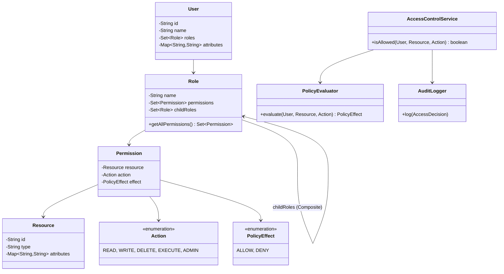

# Access Control System (RBAC) - Low Level Design

## 1. Problem Statement
Design a flexible Access Control System supporting Role-Based (RBAC) and Attribute-Based (ABAC) access control with role hierarchies, permission caching, audit logging, and policy evaluation with ALLOW/DENY precedence.

## 2. UML Class Diagram


## 3. Design Patterns
- **Composite**: Role hierarchy (Admin contains Manager contains Employee)
- **Chain of Responsibility**: Permission evaluation chain (DENY-first, then ALLOW)
- **Strategy**: Pluggable policy evaluators (RBAC, ABAC)
- **Proxy**: Permission caching proxy around evaluator

## 4. SOLID Principles
- **SRP**: Separate classes for evaluation, caching, auditing
- **OCP**: New policy types via Strategy without modifying core
- **LSP**: All evaluators implement same interface
- **ISP**: Fine-grained interfaces for each concern
- **DIP**: Core depends on abstractions (PolicyEvaluator interface)

## 5. Complete Java Implementation

```java
import java.util.*;
import java.util.concurrent.*;
import java.time.*;

// ========== Enums ==========
enum Action { READ, WRITE, DELETE, EXECUTE, ADMIN }
enum PolicyEffect { ALLOW, DENY }

// ========== Models ==========
class Resource {
    private final String id;
    private final String type;
    private final Map<String, String> attributes;

    public Resource(String id, String type) {
        this.id = id;
        this.type = type;
        this.attributes = new HashMap<>();
    }

    public String getId() { return id; }
    public String getType() { return type; }
    public Map<String, String> getAttributes() { return attributes; }
}

class Permission {
    private final String resourceType; // "*" for all
    private final String resourceId;   // "*" for all of type
    private final Action action;
    private final PolicyEffect effect;

    public Permission(String resourceType, String resourceId, Action action, PolicyEffect effect) {
        this.resourceType = resourceType;
        this.resourceId = resourceId;
        this.action = action;
        this.effect = effect;
    }

    public boolean matches(Resource resource, Action action) {
        boolean typeMatch = "*".equals(resourceType) || resourceType.equals(resource.getType());
        boolean idMatch = "*".equals(resourceId) || resourceId.equals(resource.getId());
        boolean actionMatch = this.action == action || this.action == Action.ADMIN;
        return typeMatch && idMatch && actionMatch;
    }

    public PolicyEffect getEffect() { return effect; }
    public Action getAction() { return action; }
}

// Composite Pattern: Role hierarchy
class Role {
    private final String name;
    private final Set<Permission> permissions = new HashSet<>();
    private final Set<Role> childRoles = new HashSet<>(); // inherited roles

    public Role(String name) { this.name = name; }

    public void addPermission(Permission p) { permissions.add(p); }
    public void addChildRole(Role r) { childRoles.add(r); }
    public String getName() { return name; }

    // Composite: collect all permissions recursively
    public Set<Permission> getAllPermissions() {
        Set<Permission> all = new HashSet<>(permissions);
        for (Role child : childRoles) {
            all.addAll(child.getAllPermissions());
        }
        return all;
    }
}

class User {
    private final String id;
    private final String name;
    private final Set<Role> roles = new HashSet<>();
    private final Map<String, String> attributes = new HashMap<>();

    public User(String id, String name) { this.id = id; this.name = name; }

    public void assignRole(Role role) { roles.add(role); }
    public void removeRole(Role role) { roles.remove(role); }
    public void setAttribute(String key, String value) { attributes.put(key, value); }

    public String getId() { return id; }
    public String getName() { return name; }
    public Set<Role> getRoles() { return roles; }
    public Map<String, String> getAttributes() { return attributes; }

    public Set<Permission> getAllPermissions() {
        Set<Permission> all = new HashSet<>();
        for (Role role : roles) {
            all.addAll(role.getAllPermissions());
        }
        return all;
    }
}

// ========== Policy Evaluation (Strategy + Chain of Responsibility) ==========
interface PolicyEvaluator {
    Optional<PolicyEffect> evaluate(User user, Resource resource, Action action);
}

// RBAC Evaluator
class RBACEvaluator implements PolicyEvaluator {
    @Override
    public Optional<PolicyEffect> evaluate(User user, Resource resource, Action action) {
        Set<Permission> permissions = user.getAllPermissions();
        boolean hasExplicitDeny = false;
        boolean hasAllow = false;

        for (Permission p : permissions) {
            if (p.matches(resource, action)) {
                if (p.getEffect() == PolicyEffect.DENY) hasExplicitDeny = true;
                if (p.getEffect() == PolicyEffect.ALLOW) hasAllow = true;
            }
        }
        // DENY takes precedence
        if (hasExplicitDeny) return Optional.of(PolicyEffect.DENY);
        if (hasAllow) return Optional.of(PolicyEffect.ALLOW);
        return Optional.empty();
    }
}

// ABAC Evaluator (Strategy)
class ABACEvaluator implements PolicyEvaluator {
    private final List<Policy> policies = new ArrayList<>();

    public void addPolicy(Policy policy) { policies.add(policy); }

    @Override
    public Optional<PolicyEffect> evaluate(User user, Resource resource, Action action) {
        for (Policy policy : policies) {
            if (policy.matches(user, resource, action)) {
                return Optional.of(policy.getEffect());
            }
        }
        return Optional.empty();
    }
}

// ABAC Policy
class Policy {
    private final String name;
    private final PolicyEffect effect;
    private final PolicyCondition condition;

    public Policy(String name, PolicyEffect effect, PolicyCondition condition) {
        this.name = name;
        this.effect = effect;
        this.condition = condition;
    }

    public boolean matches(User user, Resource resource, Action action) {
        return condition.evaluate(user, resource, action);
    }

    public PolicyEffect getEffect() { return effect; }
}

@FunctionalInterface
interface PolicyCondition {
    boolean evaluate(User user, Resource resource, Action action);
}

// Chain of Responsibility: Evaluator Chain
class EvaluatorChain implements PolicyEvaluator {
    private final List<PolicyEvaluator> evaluators = new ArrayList<>();

    public void addEvaluator(PolicyEvaluator evaluator) { evaluators.add(evaluator); }

    @Override
    public Optional<PolicyEffect> evaluate(User user, Resource resource, Action action) {
        for (PolicyEvaluator evaluator : evaluators) {
            Optional<PolicyEffect> result = evaluator.evaluate(user, resource, action);
            if (result.isPresent() && result.get() == PolicyEffect.DENY) {
                return result; // DENY short-circuits
            }
            if (result.isPresent()) return result;
        }
        return Optional.of(PolicyEffect.DENY); // default deny
    }
}

// ========== Caching Proxy ==========
class CachingPolicyEvaluator implements PolicyEvaluator {
    private final PolicyEvaluator delegate;
    private final Map<String, CacheEntry> cache = new ConcurrentHashMap<>();
    private final long ttlMs;

    public CachingPolicyEvaluator(PolicyEvaluator delegate, long ttlMs) {
        this.delegate = delegate;
        this.ttlMs = ttlMs;
    }

    @Override
    public Optional<PolicyEffect> evaluate(User user, Resource resource, Action action) {
        String key = user.getId() + ":" + resource.getId() + ":" + action;
        CacheEntry entry = cache.get(key);
        if (entry != null && !entry.isExpired()) {
            return entry.getResult();
        }
        Optional<PolicyEffect> result = delegate.evaluate(user, resource, action);
        cache.put(key, new CacheEntry(result, System.currentTimeMillis() + ttlMs));
        return result;
    }

    public void invalidate(String userId) {
        cache.entrySet().removeIf(e -> e.getKey().startsWith(userId + ":"));
    }

    private static class CacheEntry {
        private final Optional<PolicyEffect> result;
        private final long expiresAt;

        CacheEntry(Optional<PolicyEffect> result, long expiresAt) {
            this.result = result;
            this.expiresAt = expiresAt;
        }

        boolean isExpired() { return System.currentTimeMillis() > expiresAt; }
        Optional<PolicyEffect> getResult() { return result; }
    }
}

// ========== Audit Logging ==========
class AccessDecision {
    private final String userId;
    private final String resourceId;
    private final Action action;
    private final boolean allowed;
    private final Instant timestamp;

    public AccessDecision(String userId, String resourceId, Action action, boolean allowed) {
        this.userId = userId;
        this.resourceId = resourceId;
        this.action = action;
        this.allowed = allowed;
        this.timestamp = Instant.now();
    }

    @Override
    public String toString() {
        return String.format("[%s] User=%s Resource=%s Action=%s Decision=%s",
            timestamp, userId, resourceId, action, allowed ? "ALLOW" : "DENY");
    }
}

class AuditLogger {
    private final List<AccessDecision> auditLog = new CopyOnWriteArrayList<>();

    public void log(AccessDecision decision) {
        auditLog.add(decision);
        System.out.println("AUDIT: " + decision);
    }

    public List<AccessDecision> getAuditLog() { return Collections.unmodifiableList(auditLog); }
}

// ========== Core Service ==========
class AccessControlService {
    private final PolicyEvaluator evaluator;
    private final AuditLogger auditLogger;

    public AccessControlService(PolicyEvaluator evaluator, AuditLogger auditLogger) {
        this.evaluator = evaluator;
        this.auditLogger = auditLogger;
    }

    public boolean isAllowed(User user, Resource resource, Action action) {
        Optional<PolicyEffect> result = evaluator.evaluate(user, resource, action);
        boolean allowed = result.isPresent() && result.get() == PolicyEffect.ALLOW;
        auditLogger.log(new AccessDecision(user.getId(), resource.getId(), action, allowed));
        return allowed;
    }
}

// ========== Demo ==========
class RBACDemo {
    public static void main(String[] args) {
        // Build role hierarchy: Admin > Manager > Employee
        Role employee = new Role("EMPLOYEE");
        employee.addPermission(new Permission("document", "*", Action.READ, PolicyEffect.ALLOW));

        Role manager = new Role("MANAGER");
        manager.addChildRole(employee); // inherits employee perms
        manager.addPermission(new Permission("document", "*", Action.WRITE, PolicyEffect.ALLOW));
        manager.addPermission(new Permission("report", "*", Action.READ, PolicyEffect.ALLOW));

        Role admin = new Role("ADMIN");
        admin.addChildRole(manager); // inherits manager perms
        admin.addPermission(new Permission("*", "*", Action.ADMIN, PolicyEffect.ALLOW));

        // Users
        User alice = new User("u1", "Alice");
        alice.assignRole(admin);
        alice.setAttribute("department", "engineering");

        User bob = new User("u2", "Bob");
        bob.assignRole(employee);
        bob.setAttribute("department", "sales");

        // Resources
        Resource doc = new Resource("doc-1", "document");
        doc.getAttributes().put("department", "engineering");

        Resource secret = new Resource("sec-1", "secret");

        // Setup evaluator chain
        EvaluatorChain chain = new EvaluatorChain();

        // ABAC: deny cross-department access to sensitive docs
        ABACEvaluator abac = new ABACEvaluator();
        abac.addPolicy(new Policy("DenyCrossDept", PolicyEffect.DENY,
            (user, res, action) -> "document".equals(res.getType())
                && !user.getAttributes().getOrDefault("department", "")
                    .equals(res.getAttributes().getOrDefault("department", ""))
        ));
        chain.addEvaluator(abac); // ABAC checked first (can deny)
        chain.addEvaluator(new RBACEvaluator());

        // Wrap with cache
        CachingPolicyEvaluator cached = new CachingPolicyEvaluator(chain, 60000);

        // Service
        AuditLogger logger = new AuditLogger();
        AccessControlService acs = new AccessControlService(cached, logger);

        // Test
        System.out.println(acs.isAllowed(alice, doc, Action.READ));    // true
        System.out.println(acs.isAllowed(bob, doc, Action.READ));      // false (cross-dept)
        System.out.println(acs.isAllowed(alice, secret, Action.DELETE));// true (admin)
        System.out.println(acs.isAllowed(bob, secret, Action.WRITE));  // false (no perm)

        // Dynamic role assignment
        bob.assignRole(manager);
        cached.invalidate(bob.getId());
        System.out.println(acs.isAllowed(bob, new Resource("r1", "report"), Action.READ)); // true
    }
}
```

## 6. Key Interview Points

| Topic | Key Insight |
|-------|-------------|
| DENY precedence | Explicit DENY always overrides ALLOW - security principle of least privilege |
| Role hierarchy | Composite pattern - Admin inherits all child role permissions recursively |
| RBAC vs ABAC | RBAC = who you are (roles), ABAC = context (attributes, time, location) |
| Caching | Cache by (user, resource, action); invalidate on role/permission change |
| Default deny | If no policy matches, access is denied |
| Audit | Every access decision logged with timestamp for compliance |
| Scalability | Cache + evaluate chain short-circuits on first DENY |
| Thread safety | ConcurrentHashMap for cache, CopyOnWriteArrayList for audit log |
| Extension | Add time-based policies, IP restrictions, or MFA requirements via new PolicyEvaluator |
