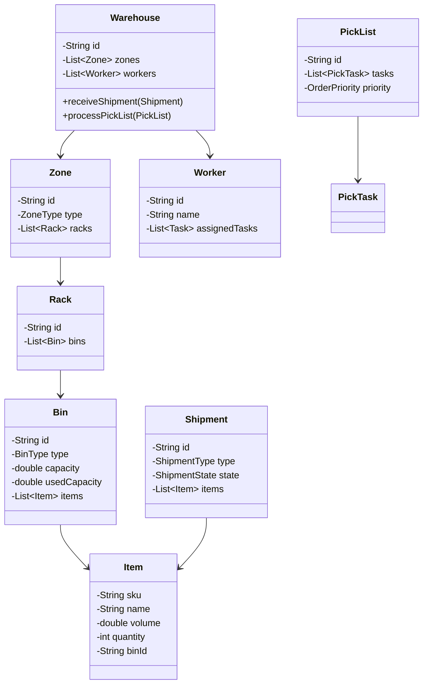

# Warehouse Management System - LLD

## 1. Problem Statement
Design a Warehouse Management System that handles inbound/outbound shipments, storage allocation, order picking, inventory tracking, and worker task assignment with extensible strategies.

## 2. UML Class Diagram


## 3. Design Patterns
- **Strategy**: Bin assignment (volumetric, random, fixed), Pick strategies (zone, wave, batch)
- **Observer**: Low stock alerts, shipment status notifications
- **State**: Shipment lifecycle (CREATED → RECEIVING → PUTAWAY → COMPLETE)
- **Factory**: Task creation for workers

## 4. SOLID Principles
- **SRP**: Separate classes for receiving, storage, picking, shipping
- **OCP**: New bin/pick strategies without modifying existing code
- **LSP**: All strategies interchangeable via interface
- **ISP**: Focused interfaces (BinAssignmentStrategy, PickStrategy)
- **DIP**: Services depend on abstractions not concrete strategies

## 5. Complete Java Implementation

```java
// ==================== ENUMS ====================
enum ShipmentType { INBOUND, OUTBOUND }
enum ShipmentState { CREATED, RECEIVING, PUTAWAY, PICKED, PACKED, DISPATCHED }
enum OrderPriority { LOW, MEDIUM, HIGH, URGENT }
enum BinType { SMALL, MEDIUM, LARGE, BULK }
enum ZoneType { RECEIVING, STORAGE, PICKING, SHIPPING, COLD }
enum TaskType { PUTAWAY, PICK, PACK, COUNT }

// ==================== MODELS ====================
class Item {
    private String sku, name, binId;
    private double volume, weight;
    private int quantity;
    // constructors, getters, setters
}

class Bin {
    private String id;
    private BinType type;
    private double capacity, usedCapacity;
    private List<Item> items = new ArrayList<>();

    public boolean canFit(Item item) {
        return (capacity - usedCapacity) >= item.getVolume() * item.getQuantity();
    }
    public void addItem(Item item) {
        items.add(item);
        usedCapacity += item.getVolume() * item.getQuantity();
        item.setBinId(this.id);
    }
    public void removeItem(String sku, int qty) {
        items.stream().filter(i -> i.getSku().equals(sku)).findFirst().ifPresent(i -> {
            i.setQuantity(i.getQuantity() - qty);
            usedCapacity -= i.getVolume() * qty;
            if (i.getQuantity() <= 0) items.remove(i);
        });
    }
}

class Rack { private String id; private List<Bin> bins = new ArrayList<>(); }
class Zone { private String id; private ZoneType type; private List<Rack> racks = new ArrayList<>(); }

class Shipment {
    private String id;
    private ShipmentType type;
    private ShipmentState state;
    private List<Item> items;
    private List<ShipmentObserver> observers = new ArrayList<>();

    public void setState(ShipmentState newState) {
        this.state = newState;
        notifyObservers();
    }
    public void addObserver(ShipmentObserver obs) { observers.add(obs); }
    private void notifyObservers() {
        observers.forEach(o -> o.onStatusChange(this, state));
    }
}

class PickTask {
    private String sku;
    private int quantity;
    private String binId;
    private boolean completed;
}

class PickList {
    private String id;
    private List<PickTask> tasks;
    private OrderPriority priority;
    private String assignedWorkerId;
}

class Task {
    private String id;
    private TaskType type;
    private String description;
    private boolean completed;
}

class Worker {
    private String id, name;
    private List<Task> assignedTasks = new ArrayList<>();
    public void assignTask(Task task) { assignedTasks.add(task); }
    public void completeTask(String taskId) {
        assignedTasks.stream().filter(t -> t.getId().equals(taskId))
            .findFirst().ifPresent(t -> t.setCompleted(true));
    }
}

class Warehouse {
    private String id;
    private List<Zone> zones;
    private List<Worker> workers;
}

// ==================== OBSERVER ====================
interface ShipmentObserver {
    void onStatusChange(Shipment shipment, ShipmentState newState);
}

interface InventoryObserver {
    void onLowStock(String sku, int currentQty, int threshold);
}

class AlertService implements ShipmentObserver, InventoryObserver {
    public void onStatusChange(Shipment shipment, ShipmentState state) {
        System.out.println("Shipment " + shipment.getId() + " → " + state);
    }
    public void onLowStock(String sku, int qty, int threshold) {
        System.out.println("LOW STOCK: " + sku + " qty=" + qty + " threshold=" + threshold);
    }
}

// ==================== STRATEGY: BIN ASSIGNMENT ====================
interface BinAssignmentStrategy {
    Bin assignBin(Item item, List<Zone> zones);
}

class VolumetricBinStrategy implements BinAssignmentStrategy {
    public Bin assignBin(Item item, List<Zone> zones) {
        return zones.stream()
            .filter(z -> z.getType() == ZoneType.STORAGE)
            .flatMap(z -> z.getRacks().stream())
            .flatMap(r -> r.getBins().stream())
            .filter(b -> b.canFit(item))
            .min(Comparator.comparingDouble(b -> b.getCapacity() - b.getUsedCapacity()))
            .orElseThrow(() -> new RuntimeException("No suitable bin found"));
    }
}

class RandomBinStrategy implements BinAssignmentStrategy {
    public Bin assignBin(Item item, List<Zone> zones) {
        List<Bin> eligible = zones.stream()
            .filter(z -> z.getType() == ZoneType.STORAGE)
            .flatMap(z -> z.getRacks().stream())
            .flatMap(r -> r.getBins().stream())
            .filter(b -> b.canFit(item))
            .collect(Collectors.toList());
        return eligible.get(new Random().nextInt(eligible.size()));
    }
}

class FixedBinStrategy implements BinAssignmentStrategy {
    private Map<String, String> skuToBin; // sku -> binId
    public Bin assignBin(Item item, List<Zone> zones) {
        String binId = skuToBin.get(item.getSku());
        return zones.stream().flatMap(z -> z.getRacks().stream())
            .flatMap(r -> r.getBins().stream())
            .filter(b -> b.getId().equals(binId))
            .findFirst().orElseThrow();
    }
}

// ==================== STRATEGY: PICKING ====================
interface PickStrategy {
    List<PickList> generatePickLists(List<Order> orders, Warehouse warehouse);
}

class ZonePickStrategy implements PickStrategy {
    public List<PickList> generatePickLists(List<Order> orders, Warehouse warehouse) {
        // Group picks by zone to minimize travel
        Map<String, List<PickTask>> byZone = new HashMap<>();
        for (Order order : orders) {
            for (OrderItem oi : order.getItems()) {
                String zone = findZoneForSku(oi.getSku(), warehouse);
                byZone.computeIfAbsent(zone, k -> new ArrayList<>())
                    .add(new PickTask(oi.getSku(), oi.getQty(), findBin(oi.getSku(), warehouse)));
            }
        }
        return byZone.values().stream()
            .map(tasks -> new PickList(UUID.randomUUID().toString(), tasks, OrderPriority.MEDIUM))
            .collect(Collectors.toList());
    }
}

class WavePickStrategy implements PickStrategy {
    public List<PickList> generatePickLists(List<Order> orders, Warehouse warehouse) {
        // Release picks in timed waves, sorted by priority
        orders.sort(Comparator.comparing(Order::getPriority).reversed());
        List<PickList> lists = new ArrayList<>();
        int waveSize = 10;
        for (int i = 0; i < orders.size(); i += waveSize) {
            List<PickTask> tasks = orders.subList(i, Math.min(i + waveSize, orders.size()))
                .stream().flatMap(o -> o.getItems().stream())
                .map(oi -> new PickTask(oi.getSku(), oi.getQty(), findBin(oi.getSku(), warehouse)))
                .collect(Collectors.toList());
            lists.add(new PickList(UUID.randomUUID().toString(), tasks, OrderPriority.HIGH));
        }
        return lists;
    }
}

class BatchPickStrategy implements PickStrategy {
    public List<PickList> generatePickLists(List<Order> orders, Warehouse warehouse) {
        // Consolidate same SKU across orders into single picks
        Map<String, Integer> consolidated = new HashMap<>();
        for (Order o : orders)
            for (OrderItem oi : o.getItems())
                consolidated.merge(oi.getSku(), oi.getQty(), Integer::sum);
        List<PickTask> tasks = consolidated.entrySet().stream()
            .map(e -> new PickTask(e.getKey(), e.getValue(), findBin(e.getKey(), warehouse)))
            .collect(Collectors.toList());
        return List.of(new PickList(UUID.randomUUID().toString(), tasks, OrderPriority.MEDIUM));
    }
}

// ==================== SERVICES ====================
class ReceivingService {
    private BinAssignmentStrategy binStrategy;
    private List<ShipmentObserver> observers = new ArrayList<>();

    public ReceivingService(BinAssignmentStrategy strategy) { this.binStrategy = strategy; }

    public void receiveShipment(Shipment shipment, Warehouse warehouse) {
        shipment.setState(ShipmentState.RECEIVING);
        // Verify items against PO
        for (Item item : shipment.getItems()) {
            verifyItem(item);
        }
        shipment.setState(ShipmentState.PUTAWAY);
        putaway(shipment, warehouse);
        shipment.setState(ShipmentState.DISPATCHED); // stored
    }

    private void putaway(Shipment shipment, Warehouse warehouse) {
        for (Item item : shipment.getItems()) {
            Bin bin = binStrategy.assignBin(item, warehouse.getZones());
            bin.addItem(item);
        }
    }
    private void verifyItem(Item item) { /* QC checks */ }
}

class InventoryService {
    private Map<String, Integer> stockLevels = new ConcurrentHashMap<>();
    private Map<String, Integer> thresholds = new HashMap<>();
    private List<InventoryObserver> observers = new ArrayList<>();

    public void trackItem(String sku, int qty) {
        stockLevels.merge(sku, qty, Integer::sum);
        checkThreshold(sku);
    }

    public void removeStock(String sku, int qty) {
        stockLevels.computeIfPresent(sku, (k, v) -> v - qty);
        checkThreshold(sku);
    }

    private void checkThreshold(String sku) {
        int current = stockLevels.getOrDefault(sku, 0);
        int threshold = thresholds.getOrDefault(sku, 10);
        if (current <= threshold) {
            observers.forEach(o -> o.onLowStock(sku, current, threshold));
        }
    }

    // Cycle counting
    public Map<String, Integer> cycleCount(Zone zone) {
        Map<String, Integer> actual = new HashMap<>();
        for (Rack rack : zone.getRacks())
            for (Bin bin : rack.getBins())
                for (Item item : bin.getItems())
                    actual.merge(item.getSku(), item.getQuantity(), Integer::sum);
        // Compare with stockLevels, report discrepancies
        return actual;
    }

    public void addObserver(InventoryObserver obs) { observers.add(obs); }
}

class PickingService {
    private PickStrategy strategy;
    public PickingService(PickStrategy strategy) { this.strategy = strategy; }

    public void setStrategy(PickStrategy strategy) { this.strategy = strategy; }

    public List<PickList> createPickLists(List<Order> orders, Warehouse warehouse) {
        return strategy.generatePickLists(orders, warehouse);
    }

    public void executePick(PickList pickList, Worker worker, InventoryService inventory) {
        worker.assignTask(new Task(UUID.randomUUID().toString(), TaskType.PICK,
            "Pick list: " + pickList.getId(), false));
        for (PickTask task : pickList.getTasks()) {
            inventory.removeStock(task.getSku(), task.getQuantity());
            task.setCompleted(true);
        }
    }
}

class ShippingService {
    public Shipment packAndShip(PickList completedPick, String destination) {
        Shipment outbound = new Shipment(UUID.randomUUID().toString(),
            ShipmentType.OUTBOUND, ShipmentState.PACKED, collectItems(completedPick));
        outbound.setState(ShipmentState.PACKED);
        generateLabel(outbound, destination);
        outbound.setState(ShipmentState.DISPATCHED);
        return outbound;
    }
    private void generateLabel(Shipment s, String dest) { /* label generation */ }
    private List<Item> collectItems(PickList pl) { return new ArrayList<>(); }
}

// ==================== FACTORY: TASK CREATION ====================
class TaskFactory {
    public static Task createTask(TaskType type, String detail) {
        return new Task(UUID.randomUUID().toString(), type, detail, false);
    }
}

// ==================== WORKER ASSIGNMENT ====================
class WorkerAssignmentService {
    public Worker assignPickList(PickList pickList, List<Worker> workers) {
        // Assign to worker with fewest active tasks
        Worker worker = workers.stream()
            .min(Comparator.comparingInt(w -> (int) w.getAssignedTasks().stream()
                .filter(t -> !t.isCompleted()).count()))
            .orElseThrow();
        worker.assignTask(TaskFactory.createTask(TaskType.PICK, "PickList: " + pickList.getId()));
        pickList.setAssignedWorkerId(worker.getId());
        return worker;
    }
}

// ==================== ORCHESTRATOR ====================
class WarehouseManagementSystem {
    private Warehouse warehouse;
    private ReceivingService receivingService;
    private InventoryService inventoryService;
    private PickingService pickingService;
    private ShippingService shippingService;
    private WorkerAssignmentService workerService;

    public WarehouseManagementSystem(Warehouse warehouse, BinAssignmentStrategy binStrategy,
                                      PickStrategy pickStrategy) {
        this.warehouse = warehouse;
        this.receivingService = new ReceivingService(binStrategy);
        this.inventoryService = new InventoryService();
        this.pickingService = new PickingService(pickStrategy);
        this.shippingService = new ShippingService();
        this.workerService = new WorkerAssignmentService();
    }

    public void processInbound(Shipment shipment) {
        receivingService.receiveShipment(shipment, warehouse);
        shipment.getItems().forEach(i -> inventoryService.trackItem(i.getSku(), i.getQuantity()));
    }

    public void processOutbound(List<Order> orders) {
        List<PickList> pickLists = pickingService.createPickLists(orders, warehouse);
        for (PickList pl : pickLists) {
            Worker worker = workerService.assignPickList(pl, warehouse.getWorkers());
            pickingService.executePick(pl, worker, inventoryService);
            shippingService.packAndShip(pl, "DOCK_A");
        }
    }

    public void runCycleCount(Zone zone) {
        Map<String, Integer> actual = inventoryService.cycleCount(zone);
        // Reconcile discrepancies
    }
}
```

## 6. Key Interview Points

| Topic | Discussion Point |
|-------|-----------------|
| **Strategy Pattern** | Bin assignment and pick strategies are runtime-swappable |
| **Observer** | Decouples stock alerts and shipment tracking from core logic |
| **State** | Shipment lifecycle managed via state transitions with notifications |
| **Scalability** | Zone-based partitioning enables parallel operations |
| **Concurrency** | ConcurrentHashMap for inventory; tasks assigned atomically |
| **Cycle Counting** | Reconciles physical vs system inventory without full shutdown |
| **Worker Load Balancing** | Least-loaded assignment prevents bottlenecks |
| **Trade-offs** | Volumetric → space-efficient; Random → fast; Fixed → predictable picks |
| **Extensions** | Returns processing, cross-docking, multi-warehouse, slot optimization |
