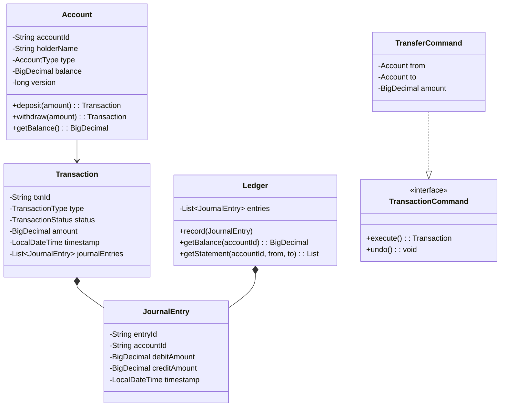

# Banking Ledger System - Low Level Design

## 1. Problem Statement
Design a banking ledger system supporting double-entry bookkeeping, account operations (deposit, withdraw, transfer), transaction atomicity, balance reconciliation, overdraft protection, interest calculation, and immutable audit trails with optimistic concurrency control.

## 2. UML Class Diagram



## 3. Design Patterns
- **Command**: Each operation (Deposit, Withdraw, Transfer) is a command with execute/undo
- **Observer**: Notify fraud detection, statement services on transactions
- **Strategy**: Interest calculation strategies per account type
- **Template Method**: Base transaction processing flow with hooks

## 4. SOLID Principles
- **SRP**: Account manages state, Ledger manages entries, Commands handle operations
- **OCP**: New transaction types via new Command classes
- **LSP**: All accounts substitutable via Account interface
- **ISP**: Separate interfaces for InterestBearing, Overdraftable
- **DIP**: Services depend on abstractions (TransactionCommand, InterestStrategy)

## 5. Complete Java Implementation

```java
import java.math.*;
import java.time.*;
import java.util.*;
import java.util.concurrent.*;
import java.util.concurrent.atomic.*;
import java.util.stream.*;

// ==================== ENUMS ====================
enum AccountType { SAVINGS, CURRENT, LOAN }
enum TransactionType { DEBIT, CREDIT }
enum TransactionStatus { PENDING, COMPLETED, FAILED, REVERSED }

// ==================== MODELS ====================
class Account {
    private final String accountId;
    private final String holderName;
    private final AccountType type;
    private volatile BigDecimal balance;
    private AtomicLong version = new AtomicLong(0); // Optimistic locking
    private final BigDecimal overdraftLimit;

    public Account(String accountId, String holderName, AccountType type, BigDecimal overdraftLimit) {
        this.accountId = accountId;
        this.holderName = holderName;
        this.type = type;
        this.balance = BigDecimal.ZERO;
        this.overdraftLimit = overdraftLimit;
    }

    public String getAccountId() { return accountId; }
    public AccountType getType() { return type; }
    public BigDecimal getBalance() { return balance; }
    public long getVersion() { return version.get(); }

    public synchronized boolean updateBalance(BigDecimal amount, long expectedVersion) {
        if (version.get() != expectedVersion) return false; // Optimistic lock failure
        BigDecimal newBalance = balance.add(amount);
        if (newBalance.negate().compareTo(overdraftLimit) > 0) {
            throw new InsufficientFundsException("Exceeds overdraft limit");
        }
        this.balance = newBalance;
        version.incrementAndGet();
        return true;
    }
}

class JournalEntry {
    private final String entryId;
    private final String transactionId;
    private final String accountId;
    private final BigDecimal debitAmount;
    private final BigDecimal creditAmount;
    private final LocalDateTime timestamp;
    private final String description;

    public JournalEntry(String transactionId, String accountId,
                        BigDecimal debitAmount, BigDecimal creditAmount, String description) {
        this.entryId = UUID.randomUUID().toString();
        this.transactionId = transactionId;
        this.accountId = accountId;
        this.debitAmount = debitAmount;
        this.creditAmount = creditAmount;
        this.timestamp = LocalDateTime.now();
        this.description = description;
    }

    // Immutable - no setters
    public String getAccountId() { return accountId; }
    public BigDecimal getDebitAmount() { return debitAmount; }
    public BigDecimal getCreditAmount() { return creditAmount; }
    public LocalDateTime getTimestamp() { return timestamp; }
    public String getTransactionId() { return transactionId; }
}

class Transaction {
    private final String txnId;
    private final TransactionType type;
    private volatile TransactionStatus status;
    private final BigDecimal amount;
    private final LocalDateTime timestamp;
    private final List<JournalEntry> journalEntries;

    public Transaction(TransactionType type, BigDecimal amount) {
        this.txnId = UUID.randomUUID().toString();
        this.type = type;
        this.amount = amount;
        this.status = TransactionStatus.PENDING;
        this.timestamp = LocalDateTime.now();
        this.journalEntries = new ArrayList<>();
    }

    public String getTxnId() { return txnId; }
    public TransactionStatus getStatus() { return status; }
    public void setStatus(TransactionStatus status) { this.status = status; }
    public void addJournalEntry(JournalEntry entry) { journalEntries.add(entry); }
    public List<JournalEntry> getJournalEntries() { return Collections.unmodifiableList(journalEntries); }
}

// ==================== EXCEPTIONS ====================
class InsufficientFundsException extends RuntimeException {
    public InsufficientFundsException(String msg) { super(msg); }
}

class OptimisticLockException extends RuntimeException {
    public OptimisticLockException(String msg) { super(msg); }
}

// ==================== LEDGER ====================
class Ledger {
    private final List<JournalEntry> entries = new CopyOnWriteArrayList<>();

    public void record(JournalEntry entry) { entries.add(entry); }

    public BigDecimal getBalance(String accountId) {
        return entries.stream()
            .filter(e -> e.getAccountId().equals(accountId))
            .map(e -> e.getCreditAmount().subtract(e.getDebitAmount()))
            .reduce(BigDecimal.ZERO, BigDecimal::add);
    }

    public List<JournalEntry> getStatement(String accountId, LocalDateTime from, LocalDateTime to) {
        return entries.stream()
            .filter(e -> e.getAccountId().equals(accountId))
            .filter(e -> !e.getTimestamp().isBefore(from) && !e.getTimestamp().isAfter(to))
            .collect(Collectors.toList());
    }

    public boolean reconcile(String accountId, BigDecimal expectedBalance) {
        return getBalance(accountId).compareTo(expectedBalance) == 0;
    }
}

// ==================== OBSERVER ====================
interface TransactionObserver {
    void onTransactionCompleted(Transaction txn);
}

class AuditTrailObserver implements TransactionObserver {
    private final List<Transaction> auditLog = new CopyOnWriteArrayList<>();

    public void onTransactionCompleted(Transaction txn) {
        auditLog.add(txn); // Immutable audit trail
        System.out.println("[AUDIT] Txn " + txn.getTxnId() + " status: " + txn.getStatus());
    }

    public List<Transaction> getAuditLog() { return Collections.unmodifiableList(auditLog); }
}

class FraudDetectionObserver implements TransactionObserver {
    private static final BigDecimal THRESHOLD = new BigDecimal("100000");

    public void onTransactionCompleted(Transaction txn) {
        if (txn.getJournalEntries().stream()
                .anyMatch(e -> e.getDebitAmount().compareTo(THRESHOLD) > 0)) {
            System.out.println("[FRAUD ALERT] Large transaction: " + txn.getTxnId());
        }
    }
}

// ==================== STRATEGY: INTEREST ====================
interface InterestStrategy {
    BigDecimal calculate(BigDecimal balance, int days);
}

class SavingsInterestStrategy implements InterestStrategy {
    private static final BigDecimal RATE = new BigDecimal("0.04"); // 4% annual
    public BigDecimal calculate(BigDecimal balance, int days) {
        return balance.multiply(RATE).multiply(BigDecimal.valueOf(days))
            .divide(BigDecimal.valueOf(365), 2, RoundingMode.HALF_UP);
    }
}

class LoanInterestStrategy implements InterestStrategy {
    private static final BigDecimal RATE = new BigDecimal("0.12"); // 12% annual
    public BigDecimal calculate(BigDecimal balance, int days) {
        return balance.multiply(RATE).multiply(BigDecimal.valueOf(days))
            .divide(BigDecimal.valueOf(365), 2, RoundingMode.HALF_UP);
    }
}

// ==================== TEMPLATE METHOD ====================
abstract class TransactionTemplate {
    private final List<TransactionObserver> observers = new ArrayList<>();

    public void addObserver(TransactionObserver obs) { observers.add(obs); }

    // Template method
    public final Transaction process() {
        Transaction txn = createTransaction();
        try {
            validate();
            List<JournalEntry> entries = createJournalEntries(txn);
            applyToAccounts(txn, entries);
            entries.forEach(txn::addJournalEntry);
            txn.setStatus(TransactionStatus.COMPLETED);
        } catch (Exception e) {
            txn.setStatus(TransactionStatus.FAILED);
            rollback(txn);
        }
        notifyObservers(txn);
        return txn;
    }

    protected abstract Transaction createTransaction();
    protected abstract void validate();
    protected abstract List<JournalEntry> createJournalEntries(Transaction txn);
    protected abstract void applyToAccounts(Transaction txn, List<JournalEntry> entries);
    protected void rollback(Transaction txn) {} // Hook

    private void notifyObservers(Transaction txn) {
        observers.forEach(o -> o.onTransactionCompleted(txn));
    }
}

// ==================== COMMAND IMPLEMENTATIONS ====================
class DepositCommand extends TransactionTemplate {
    private final Account account;
    private final BigDecimal amount;
    private final Ledger ledger;

    public DepositCommand(Account account, BigDecimal amount, Ledger ledger) {
        this.account = account; this.amount = amount; this.ledger = ledger;
    }

    protected Transaction createTransaction() { return new Transaction(TransactionType.CREDIT, amount); }
    protected void validate() { if (amount.compareTo(BigDecimal.ZERO) <= 0) throw new IllegalArgumentException("Invalid amount"); }

    protected List<JournalEntry> createJournalEntries(Transaction txn) {
        // Double-entry: Debit cash/bank, Credit customer account
        JournalEntry debit = new JournalEntry(txn.getTxnId(), "BANK_CASH", amount, BigDecimal.ZERO, "Cash deposit");
        JournalEntry credit = new JournalEntry(txn.getTxnId(), account.getAccountId(), BigDecimal.ZERO, amount, "Deposit");
        return List.of(debit, credit);
    }

    protected void applyToAccounts(Transaction txn, List<JournalEntry> entries) {
        long ver = account.getVersion();
        if (!account.updateBalance(amount, ver)) throw new OptimisticLockException("Concurrent modification");
        entries.forEach(ledger::record);
    }
}

class WithdrawCommand extends TransactionTemplate {
    private final Account account;
    private final BigDecimal amount;
    private final Ledger ledger;

    public WithdrawCommand(Account account, BigDecimal amount, Ledger ledger) {
        this.account = account; this.amount = amount; this.ledger = ledger;
    }

    protected Transaction createTransaction() { return new Transaction(TransactionType.DEBIT, amount); }
    protected void validate() {
        if (amount.compareTo(BigDecimal.ZERO) <= 0) throw new IllegalArgumentException("Invalid amount");
    }

    protected List<JournalEntry> createJournalEntries(Transaction txn) {
        JournalEntry debit = new JournalEntry(txn.getTxnId(), account.getAccountId(), amount, BigDecimal.ZERO, "Withdrawal");
        JournalEntry credit = new JournalEntry(txn.getTxnId(), "BANK_CASH", BigDecimal.ZERO, amount, "Cash out");
        return List.of(debit, credit);
    }

    protected void applyToAccounts(Transaction txn, List<JournalEntry> entries) {
        long ver = account.getVersion();
        if (!account.updateBalance(amount.negate(), ver)) throw new OptimisticLockException("Concurrent modification");
        entries.forEach(ledger::record);
    }
}

class TransferCommand extends TransactionTemplate {
    private final Account from, to;
    private final BigDecimal amount;
    private final Ledger ledger;

    public TransferCommand(Account from, Account to, BigDecimal amount, Ledger ledger) {
        this.from = from; this.to = to; this.amount = amount; this.ledger = ledger;
    }

    protected Transaction createTransaction() { return new Transaction(TransactionType.DEBIT, amount); }
    protected void validate() {
        if (amount.compareTo(BigDecimal.ZERO) <= 0) throw new IllegalArgumentException("Invalid amount");
        if (from.getAccountId().equals(to.getAccountId())) throw new IllegalArgumentException("Same account");
    }

    protected List<JournalEntry> createJournalEntries(Transaction txn) {
        // Double-entry: Debit sender, Credit receiver
        JournalEntry debit = new JournalEntry(txn.getTxnId(), from.getAccountId(), amount, BigDecimal.ZERO, "Transfer out");
        JournalEntry credit = new JournalEntry(txn.getTxnId(), to.getAccountId(), BigDecimal.ZERO, amount, "Transfer in");
        return List.of(debit, credit);
    }

    protected void applyToAccounts(Transaction txn, List<JournalEntry> entries) {
        // Atomicity: both must succeed or both fail
        long fromVer = from.getVersion();
        long toVer = to.getVersion();
        if (!from.updateBalance(amount.negate(), fromVer)) throw new OptimisticLockException("Source account conflict");
        if (!to.updateBalance(amount, toVer)) {
            // Rollback source
            from.updateBalance(amount, from.getVersion());
            throw new OptimisticLockException("Destination account conflict");
        }
        entries.forEach(ledger::record);
    }
}

// ==================== BANKING SERVICE ====================
class BankingService {
    private final Map<String, Account> accounts = new ConcurrentHashMap<>();
    private final Ledger ledger = new Ledger();
    private final List<TransactionObserver> observers = new ArrayList<>();
    private final Map<AccountType, InterestStrategy> interestStrategies = new EnumMap<>(AccountType.class);

    public BankingService() {
        interestStrategies.put(AccountType.SAVINGS, new SavingsInterestStrategy());
        interestStrategies.put(AccountType.LOAN, new LoanInterestStrategy());
    }

    public void addObserver(TransactionObserver obs) { observers.add(obs); }

    public Account createAccount(String id, String name, AccountType type, BigDecimal overdraftLimit) {
        Account acc = new Account(id, name, type, overdraftLimit);
        accounts.put(id, acc);
        return acc;
    }

    public Transaction deposit(String accountId, BigDecimal amount) {
        Account acc = accounts.get(accountId);
        DepositCommand cmd = new DepositCommand(acc, amount, ledger);
        observers.forEach(cmd::addObserver);
        return cmd.process();
    }

    public Transaction withdraw(String accountId, BigDecimal amount) {
        Account acc = accounts.get(accountId);
        WithdrawCommand cmd = new WithdrawCommand(acc, amount, ledger);
        observers.forEach(cmd::addObserver);
        return cmd.process();
    }

    public Transaction transfer(String fromId, String toId, BigDecimal amount) {
        TransferCommand cmd = new TransferCommand(accounts.get(fromId), accounts.get(toId), amount, ledger);
        observers.forEach(cmd::addObserver);
        return cmd.process();
    }

    public BigDecimal calculateInterest(String accountId, int days) {
        Account acc = accounts.get(accountId);
        InterestStrategy strategy = interestStrategies.get(acc.getType());
        return strategy != null ? strategy.calculate(acc.getBalance(), days) : BigDecimal.ZERO;
    }

    public List<JournalEntry> getStatement(String accountId, LocalDateTime from, LocalDateTime to) {
        return ledger.getStatement(accountId, from, to);
    }

    public boolean reconcile(String accountId) {
        return ledger.reconcile(accountId, accounts.get(accountId).getBalance());
    }
}

// ==================== DEMO ====================
class BankingLedgerDemo {
    public static void main(String[] args) {
        BankingService bank = new BankingService();
        bank.addObserver(new AuditTrailObserver());
        bank.addObserver(new FraudDetectionObserver());

        bank.createAccount("ACC001", "Alice", AccountType.SAVINGS, BigDecimal.ZERO);
        bank.createAccount("ACC002", "Bob", AccountType.CURRENT, new BigDecimal("5000"));

        bank.deposit("ACC001", new BigDecimal("10000"));
        bank.deposit("ACC002", new BigDecimal("5000"));
        bank.transfer("ACC001", "ACC002", new BigDecimal("3000"));
        bank.withdraw("ACC002", new BigDecimal("2000"));

        System.out.println("Alice balance: " + bank.reconcile("ACC001"));
        System.out.println("Interest (30d): " + bank.calculateInterest("ACC001", 30));
    }
}
```

## 6. Key Interview Points

| Topic | Detail |
|-------|--------|
| **Double-Entry Bookkeeping** | Every transaction produces equal debits and credits; sum of all entries = 0 |
| **ACID Compliance** | Atomicity via command rollback, Consistency via invariant checks, Isolation via optimistic locking, Durability via immutable journal |
| **Optimistic Locking** | Version field on Account prevents lost updates without heavyweight locks |
| **Immutability** | JournalEntries are never modified — corrections are new reversing entries |
| **Reconciliation** | Balance derived from journal entries must match account's cached balance |
| **Overdraft Protection** | Checked atomically within synchronized balance update |
| **Idempotency** | Transaction IDs prevent duplicate processing |
| **Scalability** | ConcurrentHashMap, CopyOnWriteArrayList for read-heavy workloads |
| **Audit Trail** | Observer pattern captures every transaction immutably |
| **Financial Invariant** | `∑ debits = ∑ credits` across entire ledger at all times |
