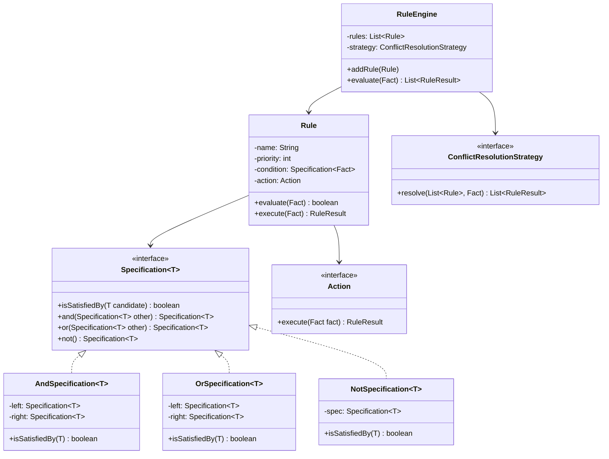

# Rule Engine - Low Level Design

## 1. Problem Statement
Design a flexible Rule Engine that evaluates a set of rules against facts (input data) and executes corresponding actions. Support composite conditions, priority ordering, conflict resolution strategies, and dynamic rule loading.

## 2. UML Class Diagram



## 3. Design Patterns
- **Specification Pattern**: Composable boolean conditions with and/or/not
- **Strategy Pattern**: Actions and conflict resolution strategies are interchangeable
- **Composite Pattern**: AndSpec, OrSpec, NotSpec form a tree of conditions
- **Interpreter Pattern**: Expression evaluator for DSL-based rules
- **Chain of Responsibility**: Rules evaluated in priority order

## 4. SOLID Principles
- **SRP**: Rule holds condition+action; Engine orchestrates evaluation
- **OCP**: New specs/actions added without modifying engine
- **LSP**: All Specification implementations are substitutable
- **ISP**: Specification and Action are minimal interfaces
- **DIP**: Engine depends on abstractions (Specification, Action, Strategy)

## 5. Complete Java Implementation

```java
import java.util.*;
import java.util.stream.*;
import java.util.function.*;

// ==================== MODELS ====================

public class Fact {
    private final Map<String, Object> attributes = new HashMap<>();

    public Fact put(String key, Object value) {
        attributes.put(key, value);
        return this;
    }

    @SuppressWarnings("unchecked")
    public <T> T get(String key) {
        return (T) attributes.get(key);
    }

    public boolean has(String key) {
        return attributes.containsKey(key);
    }

    public Map<String, Object> getAttributes() {
        return Collections.unmodifiableMap(attributes);
    }
}

public class RuleResult {
    private final String ruleName;
    private final boolean triggered;
    private final String actionTaken;
    private final Map<String, Object> output;

    public RuleResult(String ruleName, boolean triggered, String actionTaken, Map<String, Object> output) {
        this.ruleName = ruleName;
        this.triggered = triggered;
        this.actionTaken = actionTaken;
        this.output = output;
    }

    // Getters
    public String getRuleName() { return ruleName; }
    public boolean isTriggered() { return triggered; }
    public String getActionTaken() { return actionTaken; }
    public Map<String, Object> getOutput() { return output; }
}

// ==================== SPECIFICATION PATTERN ====================

public interface Specification<T> {
    boolean isSatisfiedBy(T candidate);

    default Specification<T> and(Specification<T> other) {
        return new AndSpecification<>(this, other);
    }

    default Specification<T> or(Specification<T> other) {
        return new OrSpecification<>(this, other);
    }

    default Specification<T> not() {
        return new NotSpecification<>(this);
    }
}

public class AndSpecification<T> implements Specification<T> {
    private final Specification<T> left, right;

    public AndSpecification(Specification<T> left, Specification<T> right) {
        this.left = left;
        this.right = right;
    }

    @Override
    public boolean isSatisfiedBy(T candidate) {
        return left.isSatisfiedBy(candidate) && right.isSatisfiedBy(candidate);
    }
}

public class OrSpecification<T> implements Specification<T> {
    private final Specification<T> left, right;

    public OrSpecification(Specification<T> left, Specification<T> right) {
        this.left = left;
        this.right = right;
    }

    @Override
    public boolean isSatisfiedBy(T candidate) {
        return left.isSatisfiedBy(candidate) || right.isSatisfiedBy(candidate);
    }
}

public class NotSpecification<T> implements Specification<T> {
    private final Specification<T> spec;

    public NotSpecification(Specification<T> spec) {
        this.spec = spec;
    }

    @Override
    public boolean isSatisfiedBy(T candidate) {
        return !spec.isSatisfiedBy(candidate);
    }
}

// ==================== CONCRETE SPECIFICATIONS ====================

public class AgeSpec implements Specification<Fact> {
    private final int minAge;
    private final int maxAge;

    public AgeSpec(int minAge, int maxAge) {
        this.minAge = minAge;
        this.maxAge = maxAge;
    }

    @Override
    public boolean isSatisfiedBy(Fact fact) {
        int age = fact.<Integer>get("age");
        return age >= minAge && age <= maxAge;
    }
}

public class AmountSpec implements Specification<Fact> {
    private final double threshold;
    private final Comparator comp;

    public enum Comparator { GT, GTE, LT, LTE, EQ }

    public AmountSpec(double threshold, Comparator comp) {
        this.threshold = threshold;
        this.comp = comp;
    }

    @Override
    public boolean isSatisfiedBy(Fact fact) {
        double amount = fact.<Double>get("amount");
        return switch (comp) {
            case GT -> amount > threshold;
            case GTE -> amount >= threshold;
            case LT -> amount < threshold;
            case LTE -> amount <= threshold;
            case EQ -> amount == threshold;
        };
    }
}

public class RegionSpec implements Specification<Fact> {
    private final Set<String> allowedRegions;

    public RegionSpec(String... regions) {
        this.allowedRegions = Set.of(regions);
    }

    @Override
    public boolean isSatisfiedBy(Fact fact) {
        String region = fact.get("region");
        return allowedRegions.contains(region);
    }
}

public class AttributeSpec implements Specification<Fact> {
    private final String key;
    private final Predicate<Object> predicate;

    public AttributeSpec(String key, Predicate<Object> predicate) {
        this.key = key;
        this.predicate = predicate;
    }

    @Override
    public boolean isSatisfiedBy(Fact fact) {
        return fact.has(key) && predicate.test(fact.get(key));
    }
}

// ==================== ACTION (STRATEGY PATTERN) ====================

@FunctionalInterface
public interface Action {
    RuleResult execute(Fact fact);
}

public class FlagFraudAction implements Action {
    @Override
    public RuleResult execute(Fact fact) {
        Map<String, Object> output = Map.of(
            "fraudFlag", true,
            "reason", "Transaction flagged by fraud rule"
        );
        return new RuleResult("FraudDetection", true, "FLAG_FRAUD", output);
    }
}

public class ApplyDiscountAction implements Action {
    private final double discountPercent;

    public ApplyDiscountAction(double discountPercent) {
        this.discountPercent = discountPercent;
    }

    @Override
    public RuleResult execute(Fact fact) {
        double amount = fact.<Double>get("amount");
        double discounted = amount * (1 - discountPercent / 100);
        Map<String, Object> output = Map.of(
            "originalAmount", amount,
            "discountedAmount", discounted,
            "discountPercent", discountPercent
        );
        return new RuleResult("Discount", true, "APPLY_DISCOUNT", output);
    }
}

public class RejectAction implements Action {
    private final String reason;

    public RejectAction(String reason) { this.reason = reason; }

    @Override
    public RuleResult execute(Fact fact) {
        return new RuleResult("Rejection", true, "REJECT", Map.of("reason", reason));
    }
}

// ==================== RULE ====================

public class Rule implements Comparable<Rule> {
    private final String name;
    private final int priority; // lower = higher priority
    private final Specification<Fact> condition;
    private final Action action;
    private boolean enabled = true;

    public Rule(String name, int priority, Specification<Fact> condition, Action action) {
        this.name = name;
        this.priority = priority;
        this.condition = condition;
        this.action = action;
    }

    public boolean evaluate(Fact fact) {
        return enabled && condition.isSatisfiedBy(fact);
    }

    public RuleResult execute(Fact fact) {
        return action.execute(fact);
    }

    public void setEnabled(boolean enabled) { this.enabled = enabled; }
    public String getName() { return name; }
    public int getPriority() { return priority; }

    @Override
    public int compareTo(Rule other) {
        return Integer.compare(this.priority, other.priority);
    }
}

// ==================== RULE SET ====================

public class RuleSet {
    private final String name;
    private final List<Rule> rules = new ArrayList<>();

    public RuleSet(String name) { this.name = name; }

    public void addRule(Rule rule) {
        rules.add(rule);
        rules.sort(Comparator.naturalOrder());
    }

    public void removeRule(String ruleName) {
        rules.removeIf(r -> r.getName().equals(ruleName));
    }

    public List<Rule> getRules() {
        return Collections.unmodifiableList(rules);
    }
}

// ==================== CONFLICT RESOLUTION STRATEGIES ====================

public interface ConflictResolutionStrategy {
    List<RuleResult> resolve(List<Rule> matchedRules, Fact fact);
}

public class FirstMatchStrategy implements ConflictResolutionStrategy {
    @Override
    public List<RuleResult> resolve(List<Rule> matchedRules, Fact fact) {
        if (matchedRules.isEmpty()) return Collections.emptyList();
        return List.of(matchedRules.get(0).execute(fact));
    }
}

public class AllMatchStrategy implements ConflictResolutionStrategy {
    @Override
    public List<RuleResult> resolve(List<Rule> matchedRules, Fact fact) {
        return matchedRules.stream()
            .map(rule -> rule.execute(fact))
            .collect(Collectors.toList());
    }
}

public class PriorityBasedStrategy implements ConflictResolutionStrategy {
    private final int maxResults;

    public PriorityBasedStrategy(int maxResults) { this.maxResults = maxResults; }

    @Override
    public List<RuleResult> resolve(List<Rule> matchedRules, Fact fact) {
        return matchedRules.stream()
            .sorted()
            .limit(maxResults)
            .map(rule -> rule.execute(fact))
            .collect(Collectors.toList());
    }
}

// ==================== RULE ENGINE ====================

public class RuleEngine {
    private final List<Rule> rules = new ArrayList<>();
    private ConflictResolutionStrategy strategy;

    public RuleEngine(ConflictResolutionStrategy strategy) {
        this.strategy = strategy;
    }

    public void addRule(Rule rule) {
        rules.add(rule);
        rules.sort(Comparator.naturalOrder());
    }

    public void setStrategy(ConflictResolutionStrategy strategy) {
        this.strategy = strategy;
    }

    public List<RuleResult> evaluate(Fact fact) {
        List<Rule> matched = rules.stream()
            .filter(rule -> rule.evaluate(fact))
            .collect(Collectors.toList());
        return strategy.resolve(matched, fact);
    }

    // Dynamic rule loading
    public void loadRules(RuleSet ruleSet) {
        rules.addAll(ruleSet.getRules());
        rules.sort(Comparator.naturalOrder());
    }

    public void clearRules() { rules.clear(); }
}

// ==================== SIMPLE EXPRESSION EVALUATOR (DSL) ====================

public class ExpressionEvaluator {
    // Parses simple expressions like "age > 18 AND amount > 1000"
    public Specification<Fact> parse(String expression) {
        expression = expression.trim();

        if (expression.contains(" AND ")) {
            String[] parts = expression.split(" AND ", 2);
            return parse(parts[0]).and(parse(parts[1]));
        }
        if (expression.contains(" OR ")) {
            String[] parts = expression.split(" OR ", 2);
            return parse(parts[0]).or(parse(parts[1]));
        }
        if (expression.startsWith("NOT ")) {
            return parse(expression.substring(4)).not();
        }

        // Parse atomic: "field operator value"
        String[] tokens = expression.split("\\s+", 3);
        String field = tokens[0];
        String operator = tokens[1];
        String value = tokens[2].replace("'", "").replace("\"", "");

        return new AttributeSpec(field, actual -> {
            if (actual instanceof Number) {
                double numVal = Double.parseDouble(value);
                double actualVal = ((Number) actual).doubleValue();
                return switch (operator) {
                    case ">" -> actualVal > numVal;
                    case ">=" -> actualVal >= numVal;
                    case "<" -> actualVal < numVal;
                    case "<=" -> actualVal <= numVal;
                    case "==" -> actualVal == numVal;
                    default -> false;
                };
            } else {
                return switch (operator) {
                    case "==" -> actual.toString().equals(value);
                    case "!=" -> !actual.toString().equals(value);
                    default -> false;
                };
            }
        });
    }
}

// ==================== USE CASE: FRAUD DETECTION ====================

public class FraudDetectionDemo {
    public static void main(String[] args) {
        RuleEngine engine = new RuleEngine(new AllMatchStrategy());

        // High amount from risky region
        Specification<Fact> highAmountRiskyRegion =
            new AmountSpec(10000, AmountSpec.Comparator.GT)
                .and(new RegionSpec("NG", "RU", "CN"));

        // Multiple transactions (velocity check)
        Specification<Fact> velocityCheck = new AttributeSpec(
            "txnCountLastHour", val -> ((Integer) val) > 5
        );

        // New account with high amount
        Specification<Fact> newAccountHighAmount =
            new AttributeSpec("accountAgeDays", val -> ((Integer) val) < 30)
                .and(new AmountSpec(5000, AmountSpec.Comparator.GT));

        engine.addRule(new Rule("HighAmountRiskyRegion", 1, highAmountRiskyRegion, new FlagFraudAction()));
        engine.addRule(new Rule("VelocityCheck", 2, velocityCheck, new FlagFraudAction()));
        engine.addRule(new Rule("NewAccountHighAmount", 3, newAccountHighAmount, new FlagFraudAction()));

        // Test
        Fact txn = new Fact()
            .put("amount", 15000.0)
            .put("region", "NG")
            .put("txnCountLastHour", 3)
            .put("accountAgeDays", 10);

        List<RuleResult> results = engine.evaluate(txn);
        results.forEach(r -> System.out.println(r.getRuleName() + ": " + r.getActionTaken()));
        // Output: FraudDetection: FLAG_FRAUD (rules 1 and 3 match)
    }
}

// ==================== USE CASE: PRICING RULES ====================

public class PricingDemo {
    public static void main(String[] args) {
        RuleEngine engine = new RuleEngine(new FirstMatchStrategy());

        // VIP discount
        Specification<Fact> vipSpec = new AttributeSpec("customerType", "VIP"::equals);
        // Bulk discount
        Specification<Fact> bulkSpec = new AttributeSpec("quantity", q -> ((Integer) q) > 100);
        // Seasonal
        Specification<Fact> seasonalSpec = new RegionSpec("US", "EU")
            .and(new AttributeSpec("season", "HOLIDAY"::equals));

        engine.addRule(new Rule("VIPDiscount", 1, vipSpec, new ApplyDiscountAction(20)));
        engine.addRule(new Rule("BulkDiscount", 2, bulkSpec, new ApplyDiscountAction(15)));
        engine.addRule(new Rule("SeasonalDiscount", 3, seasonalSpec, new ApplyDiscountAction(10)));

        Fact order = new Fact()
            .put("amount", 1000.0)
            .put("customerType", "VIP")
            .put("quantity", 150)
            .put("region", "US")
            .put("season", "HOLIDAY");

        // FirstMatch: only highest priority VIP rule fires
        List<RuleResult> results = engine.evaluate(order);
        System.out.println(results.get(0).getOutput()); // 20% discount
    }
}

// ==================== USE CASE: ELIGIBILITY WITH DSL ====================

public class EligibilityDemo {
    public static void main(String[] args) {
        ExpressionEvaluator evaluator = new ExpressionEvaluator();
        RuleEngine engine = new RuleEngine(new AllMatchStrategy());

        Specification<Fact> loanEligibility = evaluator.parse(
            "age >= 21 AND income > 50000 AND creditScore > 700"
        );

        engine.addRule(new Rule("LoanEligibility", 1, loanEligibility,
            fact -> new RuleResult("Loan", true, "APPROVE",
                Map.of("maxLoan", fact.<Double>get("income") * 5))));

        Fact applicant = new Fact()
            .put("age", 30)
            .put("income", 75000.0)
            .put("creditScore", 750);

        List<RuleResult> results = engine.evaluate(applicant);
        System.out.println(results.get(0).getOutput()); // maxLoan: 375000
    }
}
```

## 6. Key Interview Points

| Topic | Insight |
|-------|---------|
| **Specification + Strategy** | Specs define WHAT to match; Strategy defines WHAT to do — clean separation |
| **Composability** | `and()`, `or()`, `not()` on Specification create arbitrarily complex conditions without new classes |
| **Conflict Resolution** | Strategy pattern makes it trivial to switch between first-match, all-match, priority-based |
| **Dynamic Rules** | Rules loaded at runtime via RuleSet or DSL — no recompilation needed |
| **Expression DSL** | Lightweight interpreter for non-developer rule authoring |
| **Priority Ordering** | Rules sorted by priority; combined with strategy determines execution order |
| **Extensibility** | New Specification or Action = one class, zero changes to engine |
| **Real-world engines** | Drools (Rete algorithm), Easy Rules, AWS Step Functions |
| **Performance** | For large rule sets, consider Rete/PHREAK networks or indexed fact matching |
| **Thread safety** | Engine can be made concurrent with CopyOnWriteArrayList or read-write locks |
