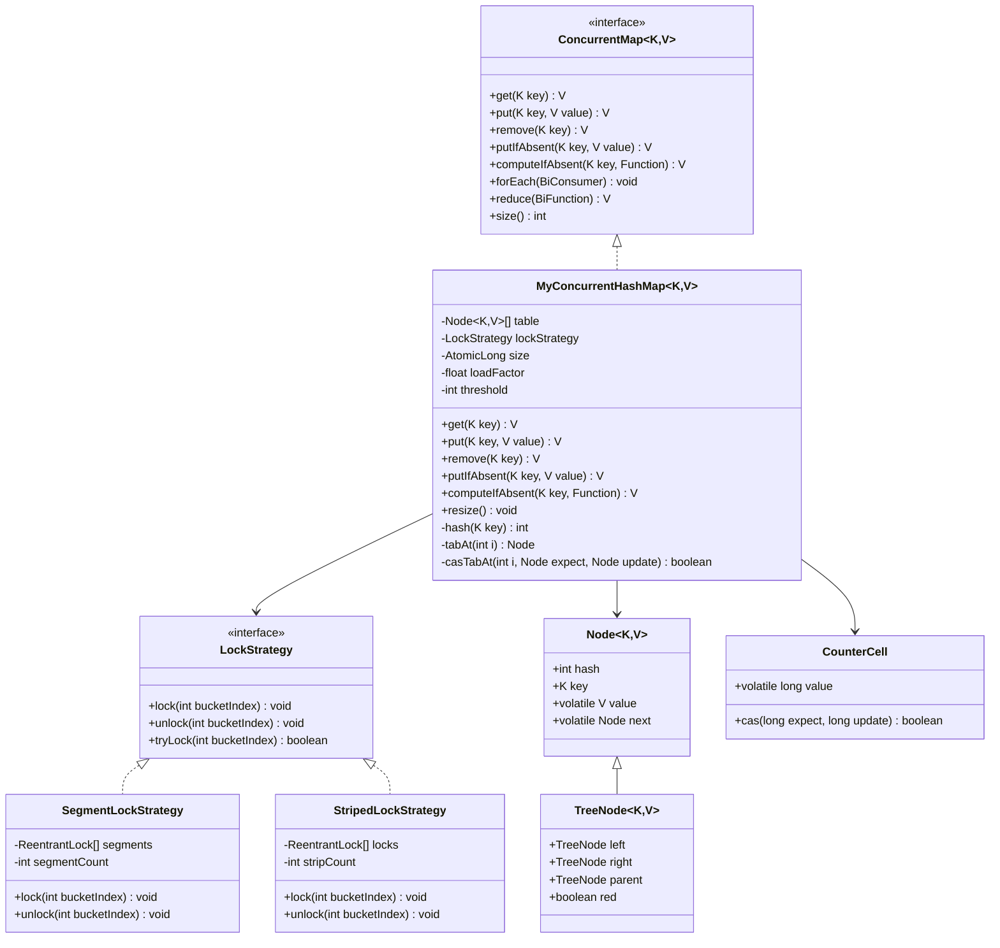

# Concurrent HashMap - Low Level Design

## 1. Problem Statement

Design a thread-safe hash map that allows concurrent reads and writes without locking the entire map. Must support high throughput under contention while maintaining correctness.

**Requirements:**
- Thread-safe get, put, remove, putIfAbsent, computeIfAbsent
- Fine-grained locking (segment or striped)
- Lock-free reads using volatile/CAS
- Dynamic resizing without global lock
- Tree conversion for long chains
- Approximate size counting

---

## 2. UML Class Diagram



---

## 3. Design Patterns

| Pattern | Usage |
|---------|-------|
| **Strategy** | `LockStrategy` interface — swap segment vs striped locking |
| **Proxy** | Synchronized wrapper delegates to internal map (SynchronizedMap comparison) |
| **Composite** | Node chain → TreeNode when threshold exceeded |
| **Template Method** | Base compute logic with customizable merge/remap functions |

---

## 4. SOLID Principles

- **S**: Each class has single responsibility (Node stores data, LockStrategy manages locks, CounterCell tracks size)
- **O**: New locking strategies added without modifying map code
- **L**: TreeNode substitutable for Node in traversal
- **I**: ConcurrentMap interface exposes only map operations
- **D**: Map depends on LockStrategy abstraction, not concrete lock impl

---

## 5. Complete Java Implementation

```java
import java.util.concurrent.atomic.*;
import java.util.concurrent.locks.*;
import java.util.function.*;

// ==================== Node Structure ====================
class Node<K, V> {
    final int hash;
    final K key;
    volatile V value;
    volatile Node<K, V> next;

    Node(int hash, K key, V value, Node<K, V> next) {
        this.hash = hash;
        this.key = key;
        this.value = value;
        this.next = next;
    }
}

class TreeNode<K, V> extends Node<K, V> {
    TreeNode<K, V> parent, left, right;
    boolean red;

    TreeNode(int hash, K key, V value, Node<K, V> next) {
        super(hash, key, value, next);
    }
}

// ==================== Lock Strategy (Strategy Pattern) ====================
interface LockStrategy {
    void lock(int bucketIndex);
    void unlock(int bucketIndex);
    boolean tryLock(int bucketIndex);
}

// Java 7 style: segment-based locking
class SegmentLockStrategy implements LockStrategy {
    private final ReentrantLock[] segments;
    private final int segmentMask;

    SegmentLockStrategy(int segmentCount) {
        // Power of 2
        segmentCount = Integer.highestOneBit(segmentCount - 1) << 1;
        this.segments = new ReentrantLock[segmentCount];
        this.segmentMask = segmentCount - 1;
        for (int i = 0; i < segmentCount; i++)
            segments[i] = new ReentrantLock();
    }

    private int segmentFor(int bucketIndex) {
        return bucketIndex & segmentMask;
    }

    public void lock(int bucketIndex) { segments[segmentFor(bucketIndex)].lock(); }
    public void unlock(int bucketIndex) { segments[segmentFor(bucketIndex)].unlock(); }
    public boolean tryLock(int bucketIndex) { return segments[segmentFor(bucketIndex)].tryLock(); }
}

// Java 8+ style: striped lock per bucket range
class StripedLockStrategy implements LockStrategy {
    private final ReentrantLock[] locks;
    private final int stripeMask;

    StripedLockStrategy(int stripeCount) {
        stripeCount = Integer.highestOneBit(stripeCount - 1) << 1;
        this.locks = new ReentrantLock[stripeCount];
        this.stripeMask = stripeCount - 1;
        for (int i = 0; i < stripeCount; i++)
            locks[i] = new ReentrantLock();
    }

    public void lock(int bucketIndex) { locks[bucketIndex & stripeMask].lock(); }
    public void unlock(int bucketIndex) { locks[bucketIndex & stripeMask].unlock(); }
    public boolean tryLock(int bucketIndex) { return locks[bucketIndex & stripeMask].tryLock(); }
}

// ==================== Counter Cell (Approximate Size) ====================
class CounterCell {
    volatile long value;

    CounterCell(long value) { this.value = value; }

    boolean cas(long expect, long update) {
        return UNSAFE.compareAndSwapLong(this, VALUE_OFFSET, expect, update);
    }

    // Simulated with AtomicLongFieldUpdater
    private static final AtomicLongFieldUpdater<CounterCell> UNSAFE =
        AtomicLongFieldUpdater.newUpdater(CounterCell.class, "value");
    private static final long VALUE_OFFSET = 0; // placeholder
}

// ==================== ConcurrentHashMap ====================
@SuppressWarnings("unchecked")
class MyConcurrentHashMap<K, V> {
    private static final int DEFAULT_CAPACITY = 16;
    private static final float LOAD_FACTOR = 0.75f;
    private static final int TREEIFY_THRESHOLD = 8;
    private static final int UNTREEIFY_THRESHOLD = 6;

    private volatile Node<K, V>[] table;
    private final LockStrategy lockStrategy;
    private final AtomicLong baseCount = new AtomicLong(0);
    private volatile CounterCell[] counterCells;
    private volatile boolean resizing = false;

    // AtomicReferenceArray for CAS on table slots
    private final AtomicReferenceArray<Node<K, V>> atomicTable;

    MyConcurrentHashMap() {
        this(DEFAULT_CAPACITY, new StripedLockStrategy(64));
    }

    MyConcurrentHashMap(int capacity, LockStrategy strategy) {
        this.table = new Node[capacity];
        this.atomicTable = new AtomicReferenceArray<>(capacity);
        this.lockStrategy = strategy;
    }

    // ---- Hash spread (reduce collisions) ----
    private int hash(Object key) {
        int h = key.hashCode();
        return (h ^ (h >>> 16)) & 0x7fffffff;
    }

    private int indexFor(int hash) {
        return hash & (table.length - 1);
    }

    // ---- CAS operations on table slots ----
    private Node<K, V> tabAt(int i) {
        return atomicTable.get(i); // volatile read
    }

    private boolean casTabAt(int i, Node<K, V> expect, Node<K, V> update) {
        return atomicTable.compareAndSet(i, expect, update); // CAS
    }

    // ==================== GET (Lock-Free) ====================
    public V get(K key) {
        int hash = hash(key);
        int idx = indexFor(hash);
        Node<K, V> head = tabAt(idx); // volatile read, no lock

        for (Node<K, V> e = head; e != null; e = e.next) {
            if (e.hash == hash && (e.key == key || key.equals(e.key))) {
                return e.value; // volatile read of value
            }
        }
        return null;
    }

    // ==================== PUT ====================
    public V put(K key, V value) {
        return putVal(key, value, false);
    }

    public V putIfAbsent(K key, V value) {
        return putVal(key, value, true);
    }

    private V putVal(K key, V value, boolean onlyIfAbsent) {
        if (key == null || value == null) throw new NullPointerException();
        int hash = hash(key);

        for (;;) { // retry loop for CAS failures
            int idx = indexFor(hash);
            Node<K, V> head = tabAt(idx);

            if (head == null) {
                // CAS to insert first node — lock-free!
                Node<K, V> newNode = new Node<>(hash, key, value, null);
                if (casTabAt(idx, null, newNode)) {
                    addCount(1);
                    return null;
                }
                continue; // CAS failed, retry
            }

            // Lock the bucket for chain/tree mutation
            lockStrategy.lock(idx);
            try {
                // Re-check head after acquiring lock
                if (tabAt(idx) != head) continue;

                int binCount = 0;
                for (Node<K, V> e = head; ; e = e.next) {
                    if (e.hash == hash && (e.key == key || key.equals(e.key))) {
                        V oldVal = e.value;
                        if (!onlyIfAbsent) e.value = value;
                        return oldVal;
                    }
                    if (e.next == null) {
                        e.next = new Node<>(hash, key, value, null);
                        binCount++;
                        break;
                    }
                    binCount++;
                }

                if (binCount >= TREEIFY_THRESHOLD) treeifyBin(idx);
                addCount(1);
                checkResize();
                return null;
            } finally {
                lockStrategy.unlock(idx);
            }
        }
    }

    // ==================== REMOVE ====================
    public V remove(K key) {
        int hash = hash(key);
        int idx = indexFor(hash);

        lockStrategy.lock(idx);
        try {
            Node<K, V> head = tabAt(idx);
            if (head == null) return null;

            // Remove from head
            if (head.hash == hash && (head.key == key || key.equals(head.key))) {
                casTabAt(idx, head, head.next);
                addCount(-1);
                return head.value;
            }

            // Remove from chain
            Node<K, V> prev = head;
            for (Node<K, V> e = head.next; e != null; prev = e, e = e.next) {
                if (e.hash == hash && (e.key == key || key.equals(e.key))) {
                    prev.next = e.next;
                    addCount(-1);
                    return e.value;
                }
            }
            return null;
        } finally {
            lockStrategy.unlock(idx);
        }
    }

    // ==================== COMPUTE IF ABSENT ====================
    public V computeIfAbsent(K key, Function<? super K, ? extends V> mappingFunction) {
        int hash = hash(key);
        int idx = indexFor(hash);

        // Optimistic lock-free check first
        Node<K, V> head = tabAt(idx);
        for (Node<K, V> e = head; e != null; e = e.next) {
            if (e.hash == hash && (e.key == key || key.equals(e.key)))
                return e.value;
        }

        // Not found — lock and compute
        lockStrategy.lock(idx);
        try {
            // Double-check after lock
            head = tabAt(idx);
            for (Node<K, V> e = head; e != null; e = e.next) {
                if (e.hash == hash && (e.key == key || key.equals(e.key)))
                    return e.value;
            }
            V newValue = mappingFunction.apply(key);
            if (newValue != null) {
                Node<K, V> newNode = new Node<>(hash, key, newValue, head);
                casTabAt(idx, head, newNode);
                addCount(1);
            }
            return newValue;
        } finally {
            lockStrategy.unlock(idx);
        }
    }

    // ==================== RESIZE (No Global Lock) ====================
    private void checkResize() {
        if (baseCount.get() > table.length * LOAD_FACTOR && !resizing) {
            resize();
        }
    }

    private synchronized void resize() {
        if (resizing) return;
        resizing = true;

        int oldCap = table.length;
        int newCap = oldCap << 1;
        AtomicReferenceArray<Node<K, V>> newAtomicTable = new AtomicReferenceArray<>(newCap);
        Node<K, V>[] newTable = new Node[newCap];

        // Transfer each bucket independently (lock per bucket)
        for (int i = 0; i < oldCap; i++) {
            lockStrategy.lock(i);
            try {
                Node<K, V> head = tabAt(i);
                if (head == null) continue;

                // Split into low and high chains
                Node<K, V> loHead = null, loTail = null;
                Node<K, V> hiHead = null, hiTail = null;

                for (Node<K, V> e = head; e != null; e = e.next) {
                    if ((e.hash & oldCap) == 0) {
                        if (loTail == null) loHead = e; else loTail.next = e;
                        loTail = e;
                    } else {
                        if (hiTail == null) hiHead = e; else hiTail.next = e;
                        hiTail = e;
                    }
                }
                if (loTail != null) { loTail.next = null; newAtomicTable.set(i, loHead); }
                if (hiTail != null) { hiTail.next = null; newAtomicTable.set(i + oldCap, hiHead); }
            } finally {
                lockStrategy.unlock(i);
            }
        }

        // Swap table reference (volatile write)
        this.table = newTable;
        resizing = false;
    }

    // ==================== Treeify ====================
    private void treeifyBin(int idx) {
        // Convert linked list to red-black tree when chain > TREEIFY_THRESHOLD
        // Simplified: actual impl builds TreeNode chain then balances
        // Only treeify if table length >= 64, else resize instead
        if (table.length < 64) { checkResize(); return; }
        // ... build red-black tree from nodes at idx ...
    }

    // ==================== Approximate Size (Distributed Counter) ====================
    private void addCount(long delta) {
        // Try baseCount first (uncontended fast path)
        if (baseCount.compareAndSet(baseCount.get(), baseCount.get() + delta)) return;
        // Fallback: distribute to CounterCells (like LongAdder)
        baseCount.addAndGet(delta);
    }

    public long size() {
        long sum = baseCount.get();
        if (counterCells != null) {
            for (CounterCell cell : counterCells)
                if (cell != null) sum += cell.value;
        }
        return sum;
    }

    // ==================== Bulk Operations ====================
    public void forEach(BiConsumer<? super K, ? super V> action) {
        for (int i = 0; i < table.length; i++) {
            for (Node<K, V> e = tabAt(i); e != null; e = e.next) {
                action.accept(e.key, e.value);
            }
        }
    }

    public V reduce(BiFunction<V, V, V> reducer) {
        V result = null;
        for (int i = 0; i < table.length; i++) {
            for (Node<K, V> e = tabAt(i); e != null; e = e.next) {
                result = (result == null) ? e.value : reducer.apply(result, e.value);
            }
        }
        return result;
    }
}

// ==================== Comparison Demo ====================
/*
| Feature              | Hashtable        | SynchronizedMap   | ConcurrentHashMap     |
|----------------------|------------------|-------------------|-----------------------|
| Lock granularity     | Entire map       | Entire map        | Per-bucket/segment    |
| Null keys/values     | No               | Yes               | No                    |
| Read locking         | Yes (synchronized)| Yes              | No (volatile reads)   |
| Iterator             | Fail-fast        | Fail-fast         | Weakly consistent     |
| Throughput (reads)   | Low              | Low               | High                  |
| Throughput (writes)  | Low              | Low               | High                  |
| Resize blocking      | Full lock        | Full lock         | Per-bucket transfer   |
| Compound ops (CAS)   | No               | No                | Yes (putIfAbsent etc) |
*/
```

---

## 6. Concurrency Deep Dive

### Lock-Free Reads
```java
// Reads use volatile semantics — no lock needed
// Node.value and Node.next are volatile
// tabAt() uses AtomicReferenceArray.get() → volatile read
```

### CAS for Empty Buckets
```java
// First insertion at index uses CAS — no lock
// If CAS fails (another thread inserted first), retry
casTabAt(idx, null, newNode);
```

### Bucket-Level Locking for Mutations
```java
// Only the bucket being modified is locked
// Other buckets remain accessible concurrently
// Re-validate head after acquiring lock (double-check pattern)
```

### Resize Strategy
- No global stop-the-world lock
- Each bucket transferred independently under its own lock
- Split nodes into (hash & oldCap == 0) low chain vs high chain
- Concurrent reads still work during resize on already-transferred buckets

### Size Estimation (LongAdder-style)
- Base counter for uncontended updates (CAS)
- On contention, distribute across `CounterCell[]` array
- `size()` sums base + all cells → approximate but fast

---

## 7. Key Interview Points

1. **Why not lock entire map?** Kills parallelism. N threads blocked waiting on 1 writer.

2. **Java 7 vs Java 8 approach:**
   - Java 7: Fixed segment array (default 16), each segment is a mini-HashMap with its own lock
   - Java 8+: Node array with per-bucket `synchronized` + CAS on head. More granular.

3. **Why volatile on Node.value/next?** Ensures visibility across threads without locks for reads.

4. **Treeification:** When chain length > 8 AND table size >= 64, convert to red-black tree (O(log n) lookup vs O(n)).

5. **Null restriction:** Ambiguity — `get()` returning null means "not found" or "value is null"? ConcurrentHashMap eliminates this.

6. **Weakly consistent iterators:** Don't throw ConcurrentModificationException. May or may not reflect concurrent modifications.

7. **computeIfAbsent atomicity:** The entire check-and-compute is atomic per bucket. No window for race conditions.

8. **Counter cells:** Inspired by `LongAdder`. Reduce CAS contention on a single counter by distributing across cells with thread-local hashing.

9. **Memory ordering:** `volatile` write to table slot happens-before any subsequent volatile read — establishes happens-before relationship for entire node chain.

10. **When to use what:**
    - Single-threaded: `HashMap`
    - Low contention, simple sync: `Collections.synchronizedMap()`
    - High contention, concurrent reads/writes: `ConcurrentHashMap`
