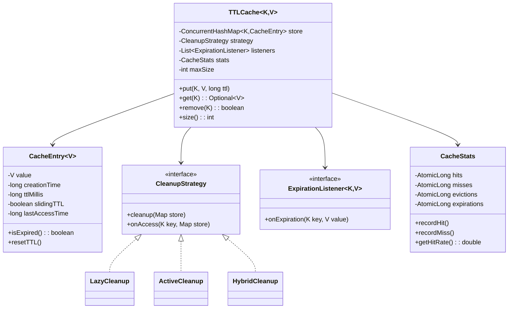

# TTL (Time-To-Live) Cache - Low Level Design

## 1. Problem Statement
Design a thread-safe, generic cache with configurable TTL per entry, multiple cleanup strategies, expiration callbacks, cache statistics, and max-size eviction.

## 2. UML Class Diagram


## 3. Design Patterns
- **Strategy**: Interchangeable cleanup strategies (Lazy, Active, Hybrid)
- **Observer**: ExpirationListener notified on entry expiry
- **Decorator**: Sliding TTL decorates base entry behavior

## 4. SOLID Principles
- **SRP**: CacheEntry manages expiry; CacheStats tracks metrics; CleanupStrategy handles eviction
- **OCP**: New cleanup strategies without modifying cache
- **LSP**: All CleanupStrategy implementations are substitutable
- **ISP**: ExpirationListener is a focused interface
- **DIP**: Cache depends on CleanupStrategy abstraction

## 5. Complete Java Implementation

```java
import java.util.*;
import java.util.concurrent.*;
import java.util.concurrent.atomic.AtomicLong;

// --- Expiration Listener (Observer) ---
interface ExpirationListener<K, V> {
    void onExpiration(K key, V value);
}

// --- Cache Entry ---
class CacheEntry<V> implements Delayed {
    private final V value;
    private final long creationTime;
    private long ttlMillis;
    private long lastAccessTime;
    private final boolean slidingTTL;
    private final String key; // for DelayQueue identification

    public CacheEntry(String key, V value, long ttlMillis, boolean slidingTTL) {
        this.key = key;
        this.value = value;
        this.ttlMillis = ttlMillis;
        this.slidingTTL = slidingTTL;
        this.creationTime = System.currentTimeMillis();
        this.lastAccessTime = this.creationTime;
    }

    public boolean isExpired() {
        long reference = slidingTTL ? lastAccessTime : creationTime;
        return System.currentTimeMillis() > reference + ttlMillis;
    }

    public void touch() {
        if (slidingTTL) this.lastAccessTime = System.currentTimeMillis();
    }

    public V getValue() { return value; }
    public String getKey() { return key; }

    @Override
    public long getDelay(TimeUnit unit) {
        long reference = slidingTTL ? lastAccessTime : creationTime;
        long remaining = (reference + ttlMillis) - System.currentTimeMillis();
        return unit.convert(remaining, TimeUnit.MILLISECONDS);
    }

    @Override
    public int compareTo(Delayed o) {
        return Long.compare(getDelay(TimeUnit.MILLISECONDS), o.getDelay(TimeUnit.MILLISECONDS));
    }
}

// --- Cache Statistics ---
class CacheStats {
    private final AtomicLong hits = new AtomicLong();
    private final AtomicLong misses = new AtomicLong();
    private final AtomicLong evictions = new AtomicLong();
    private final AtomicLong expirations = new AtomicLong();

    public void recordHit() { hits.incrementAndGet(); }
    public void recordMiss() { misses.incrementAndGet(); }
    public void recordEviction() { evictions.incrementAndGet(); }
    public void recordExpiration() { expirations.incrementAndGet(); }

    public double getHitRate() {
        long total = hits.get() + misses.get();
        return total == 0 ? 0.0 : (double) hits.get() / total;
    }

    @Override
    public String toString() {
        return String.format("hits=%d, misses=%d, evictions=%d, expirations=%d, hitRate=%.2f",
            hits.get(), misses.get(), evictions.get(), expirations.get(), getHitRate());
    }
}

// --- Cleanup Strategy (Strategy Pattern) ---
interface CleanupStrategy<K, V> {
    void cleanup(ConcurrentHashMap<K, CacheEntry<V>> store, List<ExpirationListener<K, V>> listeners, CacheStats stats);
    boolean onAccess(K key, ConcurrentHashMap<K, CacheEntry<V>> store, CacheStats stats);
    void shutdown();
}

// --- Lazy Cleanup: only on access ---
class LazyCleanup<K, V> implements CleanupStrategy<K, V> {
    @Override
    public void cleanup(ConcurrentHashMap<K, CacheEntry<V>> store,
                        List<ExpirationListener<K, V>> listeners, CacheStats stats) {
        // No-op: cleanup happens only on access
    }

    @Override
    public boolean onAccess(K key, ConcurrentHashMap<K, CacheEntry<V>> store, CacheStats stats) {
        CacheEntry<V> entry = store.get(key);
        if (entry != null && entry.isExpired()) {
            store.remove(key);
            stats.recordExpiration();
            return true; // expired
        }
        return false;
    }

    @Override
    public void shutdown() {}
}

// --- Active Cleanup: background thread with ScheduledExecutorService ---
class ActiveCleanup<K, V> implements CleanupStrategy<K, V> {
    private final ScheduledExecutorService scheduler = Executors.newSingleThreadScheduledExecutor(r -> {
        Thread t = new Thread(r, "cache-cleanup");
        t.setDaemon(true);
        return t;
    });

    public ActiveCleanup(ConcurrentHashMap<K, CacheEntry<V>> store,
                         List<ExpirationListener<K, V>> listeners, CacheStats stats, long intervalMs) {
        scheduler.scheduleAtFixedRate(() -> cleanup(store, listeners, stats),
            intervalMs, intervalMs, TimeUnit.MILLISECONDS);
    }

    @Override
    public void cleanup(ConcurrentHashMap<K, CacheEntry<V>> store,
                        List<ExpirationListener<K, V>> listeners, CacheStats stats) {
        Iterator<Map.Entry<K, CacheEntry<V>>> it = store.entrySet().iterator();
        while (it.hasNext()) {
            Map.Entry<K, CacheEntry<V>> e = it.next();
            if (e.getValue().isExpired()) {
                it.remove();
                stats.recordExpiration();
                for (ExpirationListener<K, V> l : listeners)
                    l.onExpiration(e.getKey(), e.getValue().getValue());
            }
        }
    }

    @Override
    public boolean onAccess(K key, ConcurrentHashMap<K, CacheEntry<V>> store, CacheStats stats) {
        return false; // handled by background thread
    }

    @Override
    public void shutdown() { scheduler.shutdownNow(); }
}

// --- Hybrid Cleanup: lazy on access + periodic active ---
class HybridCleanup<K, V> implements CleanupStrategy<K, V> {
    private final LazyCleanup<K, V> lazy = new LazyCleanup<>();
    private final ActiveCleanup<K, V> active;

    public HybridCleanup(ConcurrentHashMap<K, CacheEntry<V>> store,
                         List<ExpirationListener<K, V>> listeners, CacheStats stats, long intervalMs) {
        this.active = new ActiveCleanup<>(store, listeners, stats, intervalMs);
    }

    @Override
    public void cleanup(ConcurrentHashMap<K, CacheEntry<V>> store,
                        List<ExpirationListener<K, V>> listeners, CacheStats stats) {
        active.cleanup(store, listeners, stats);
    }

    @Override
    public boolean onAccess(K key, ConcurrentHashMap<K, CacheEntry<V>> store, CacheStats stats) {
        return lazy.onAccess(key, store, stats);
    }

    @Override
    public void shutdown() { active.shutdown(); }
}

// --- TTL Cache ---
class TTLCache<K, V> {
    private final ConcurrentHashMap<K, CacheEntry<V>> store = new ConcurrentHashMap<>();
    private final DelayQueue<CacheEntry<V>> delayQueue = new DelayQueue<>();
    private final List<ExpirationListener<K, V>> listeners = new CopyOnWriteArrayList<>();
    private final CacheStats stats = new CacheStats();
    private final CleanupStrategy<K, V> strategy;
    private final int maxSize;
    private final long defaultTTL;
    private final boolean slidingTTL;

    public TTLCache(int maxSize, long defaultTTLMs, boolean slidingTTL, CleanupStrategy<K, V> strategy) {
        this.maxSize = maxSize;
        this.defaultTTL = defaultTTLMs;
        this.slidingTTL = slidingTTL;
        this.strategy = strategy;
        startDelayQueueConsumer();
    }

    public void put(K key, V value, long ttlMs) {
        evictIfFull();
        CacheEntry<V> entry = new CacheEntry<>(key.toString(), value, ttlMs, slidingTTL);
        store.put(key, entry);
        delayQueue.offer(entry);
    }

    public void put(K key, V value) {
        put(key, value, defaultTTL);
    }

    public Optional<V> get(K key) {
        if (strategy.onAccess(key, store, stats)) {
            stats.recordMiss();
            return Optional.empty();
        }
        CacheEntry<V> entry = store.get(key);
        if (entry == null || entry.isExpired()) {
            if (entry != null) {
                store.remove(key);
                stats.recordExpiration();
            }
            stats.recordMiss();
            return Optional.empty();
        }
        entry.touch(); // sliding TTL reset
        stats.recordHit();
        return Optional.of(entry.getValue());
    }

    public boolean remove(K key) {
        return store.remove(key) != null;
    }

    public int size() { return store.size(); }
    public CacheStats getStats() { return stats; }

    public void addExpirationListener(ExpirationListener<K, V> listener) {
        listeners.add(listener);
    }

    private void evictIfFull() {
        while (store.size() >= maxSize) {
            // Evict oldest entry (simple FIFO for brevity)
            Optional<K> oldest = store.entrySet().stream()
                .min(Comparator.comparingLong(e -> e.getValue().getDelay(TimeUnit.MILLISECONDS)))
                .map(Map.Entry::getKey);
            oldest.ifPresent(k -> {
                store.remove(k);
                stats.recordEviction();
            });
        }
    }

    private void startDelayQueueConsumer() {
        Thread consumer = new Thread(() -> {
            while (!Thread.currentThread().isInterrupted()) {
                try {
                    CacheEntry<V> expired = delayQueue.take();
                    @SuppressWarnings("unchecked")
                    K key = (K) expired.getKey();
                    if (store.remove(key, expired)) {
                        stats.recordExpiration();
                        for (ExpirationListener<K, V> l : listeners)
                            l.onExpiration(key, expired.getValue());
                    }
                } catch (InterruptedException e) {
                    Thread.currentThread().interrupt();
                    break;
                }
            }
        }, "delay-queue-consumer");
        consumer.setDaemon(true);
        consumer.start();
    }

    public void shutdown() { strategy.shutdown(); }
}

// --- Demo ---
public class TTLCacheDemo {
    public static void main(String[] args) throws Exception {
        ConcurrentHashMap<String, CacheEntry<String>> storeRef = new ConcurrentHashMap<>();

        TTLCache<String, String> cache = new TTLCache<>(100, 5000, false,
            new LazyCleanup<>());

        cache.addExpirationListener((key, value) ->
            System.out.println("EXPIRED: " + key + " -> " + value));

        cache.put("session1", "user-abc", 2000);
        cache.put("session2", "user-def", 10000);

        System.out.println(cache.get("session1")); // Optional[user-abc]
        Thread.sleep(2500);
        System.out.println(cache.get("session1")); // Optional.empty (expired)
        System.out.println(cache.get("session2")); // Optional[user-def]
        System.out.println(cache.getStats());

        cache.shutdown();
    }
}
```

## 6. Key Interview Points

| Topic | Detail |
|-------|--------|
| **Thread Safety** | ConcurrentHashMap + CopyOnWriteArrayList; no global lock |
| **DelayQueue** | O(log n) expiration ordering; consumer thread processes expired entries |
| **Sliding vs Fixed TTL** | Sliding resets lastAccessTime on get(); Fixed uses creationTime |
| **Cleanup Tradeoffs** | Lazy=no overhead but stale memory; Active=memory clean but CPU cost; Hybrid=best of both |
| **Max Size Eviction** | Evicts closest-to-expire entry when full (can swap with LRU) |
| **Observer Pattern** | Decouples expiration events from cache logic |
| **Memory Leaks** | DelayQueue may hold refs to removed entries; use `remove(key, entry)` check |
| **Time Complexity** | put=O(log n) DelayQueue, get=O(1) HashMap, cleanup=O(n) scan |
| **Production Use** | Caffeine, Guava Cache use similar concepts with more optimized structures |
