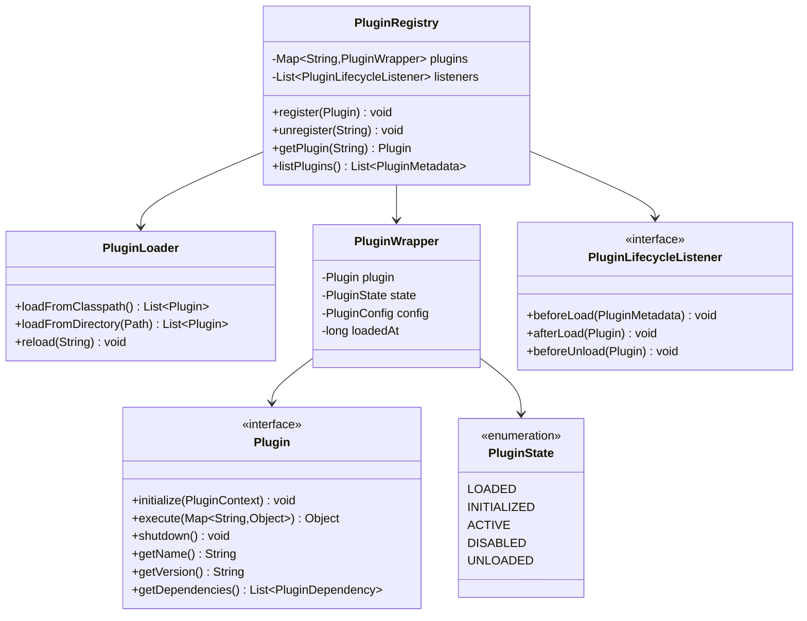

# Plugin Registry/System - Low Level Design

## 1. Problem Statement
Design a plugin registry system that allows dynamic loading, lifecycle management, and execution of plugins. Support hot-reload, dependency resolution, version compatibility, and extension points.

## 2. UML Class Diagram



## 3. Design Patterns
- **Registry Pattern**: Central plugin store with lookup
- **Factory Pattern**: PluginLoader creates plugin instances
- **Strategy Pattern**: Plugins as interchangeable algorithms
- **Observer Pattern**: Lifecycle listeners for hooks
- **Service Locator Pattern**: Registry acts as service locator

## 4. SOLID Principles
- **SRP**: Registry manages registration, Loader handles loading, Wrapper tracks state
- **OCP**: New plugins without modifying core system
- **LSP**: All plugins substitutable via Plugin interface
- **ISP**: Separate interfaces for Plugin, Configurable, ExtensionPoint
- **DIP**: Core depends on Plugin abstraction, not concrete implementations

## 5. Complete Java Implementation

```java
import java.util.*;
import java.util.concurrent.*;
import java.nio.file.*;
import java.util.ServiceLoader;

// ==================== Core Interfaces ====================

public interface Plugin {
    void initialize(PluginContext context);
    Object execute(Map<String, Object> params);
    void shutdown();
    String getName();
    String getVersion();
    default List<PluginDependency> getDependencies() { return Collections.emptyList(); }
}

public interface Configurable {
    void configure(PluginConfig config);
}

public interface ExtensionPoint<T> {
    String getExtensionId();
    void registerExtension(T extension);
    List<T> getExtensions();
}

// ==================== Models ====================

public enum PluginState {
    LOADED, INITIALIZED, ACTIVE, DISABLED, UNLOADED
}

public record PluginDependency(String pluginName, String minVersion, boolean optional) {}

public record PluginMetadata(String name, String version, PluginState state, long loadedAt) {}

public class PluginConfig {
    private final Map<String, Object> properties = new ConcurrentHashMap<>();

    public void set(String key, Object value) { properties.put(key, value); }
    public <T> T get(String key, Class<T> type) { return type.cast(properties.get(key)); }
    public <T> T getOrDefault(String key, T defaultValue) {
        return properties.containsKey(key) ? (T) properties.get(key) : defaultValue;
    }
}

public class PluginContext {
    private final PluginRegistry registry;
    private final PluginConfig config;

    public PluginContext(PluginRegistry registry, PluginConfig config) {
        this.registry = registry;
        this.config = config;
    }
    public PluginRegistry getRegistry() { return registry; }
    public PluginConfig getConfig() { return config; }
}

// ==================== Plugin Wrapper ====================

public class PluginWrapper {
    private final Plugin plugin;
    private volatile PluginState state;
    private final PluginConfig config;
    private final long loadedAt;

    public PluginWrapper(Plugin plugin) {
        this.plugin = plugin;
        this.state = PluginState.LOADED;
        this.config = new PluginConfig();
        this.loadedAt = System.currentTimeMillis();
    }

    public Plugin getPlugin() { return plugin; }
    public PluginState getState() { return state; }
    public void setState(PluginState state) { this.state = state; }
    public PluginConfig getConfig() { return config; }
    public PluginMetadata getMetadata() {
        return new PluginMetadata(plugin.getName(), plugin.getVersion(), state, loadedAt);
    }
}

// ==================== Lifecycle Listener ====================

public interface PluginLifecycleListener {
    default void beforeLoad(PluginMetadata metadata) {}
    default void afterLoad(Plugin plugin) {}
    default void beforeUnload(Plugin plugin) {}
    default void onStateChange(String pluginName, PluginState oldState, PluginState newState) {}
}

// ==================== Version Compatibility ====================

public class VersionChecker {
    public static boolean isCompatible(String actual, String minRequired) {
        int[] actualParts = parse(actual);
        int[] requiredParts = parse(minRequired);
        for (int i = 0; i < Math.min(actualParts.length, requiredParts.length); i++) {
            if (actualParts[i] > requiredParts[i]) return true;
            if (actualParts[i] < requiredParts[i]) return false;
        }
        return true;
    }

    private static int[] parse(String version) {
        return Arrays.stream(version.split("\\.")).mapToInt(Integer::parseInt).toArray();
    }
}

// ==================== Plugin Loader ====================

public class PluginLoader {
    public List<Plugin> loadFromClasspath() {
        List<Plugin> plugins = new ArrayList<>();
        ServiceLoader<Plugin> loader = ServiceLoader.load(Plugin.class);
        loader.forEach(plugins::add);
        return plugins;
    }

    public List<Plugin> loadFromDirectory(Path dir) throws Exception {
        List<Plugin> plugins = new ArrayList<>();
        if (!Files.exists(dir)) return plugins;

        try (var stream = Files.list(dir).filter(p -> p.toString().endsWith(".jar"))) {
            for (Path jar : stream.toList()) {
                var url = jar.toUri().toURL();
                var classLoader = new java.net.URLClassLoader(
                    new java.net.URL[]{url}, getClass().getClassLoader());
                ServiceLoader<Plugin> loader = ServiceLoader.load(Plugin.class, classLoader);
                loader.forEach(plugins::add);
            }
        }
        return plugins;
    }
}

// ==================== Plugin Registry ====================

public class PluginRegistry {
    private final ConcurrentMap<String, PluginWrapper> plugins = new ConcurrentHashMap<>();
    private final List<PluginLifecycleListener> listeners = new CopyOnWriteArrayList<>();
    private final PluginLoader loader = new PluginLoader();

    public void register(Plugin plugin) {
        validateDependencies(plugin);
        PluginWrapper wrapper = new PluginWrapper(plugin);

        listeners.forEach(l -> l.beforeLoad(wrapper.getMetadata()));
        plugins.put(plugin.getName(), wrapper);
        listeners.forEach(l -> l.afterLoad(plugin));

        // Auto-initialize
        PluginContext ctx = new PluginContext(this, wrapper.getConfig());
        plugin.initialize(ctx);
        transition(wrapper, PluginState.INITIALIZED);

        if (plugin instanceof Configurable c) {
            c.configure(wrapper.getConfig());
        }
        transition(wrapper, PluginState.ACTIVE);
    }

    public void unregister(String name) {
        PluginWrapper wrapper = plugins.get(name);
        if (wrapper == null) throw new IllegalArgumentException("Plugin not found: " + name);

        checkDependents(name);
        listeners.forEach(l -> l.beforeUnload(wrapper.getPlugin()));
        wrapper.getPlugin().shutdown();
        transition(wrapper, PluginState.UNLOADED);
        plugins.remove(name);
    }

    @SuppressWarnings("unchecked")
    public <T extends Plugin> T getPlugin(String name, Class<T> type) {
        PluginWrapper wrapper = plugins.get(name);
        if (wrapper == null || wrapper.getState() != PluginState.ACTIVE) return null;
        return (T) wrapper.getPlugin();
    }

    public Plugin getPlugin(String name) {
        PluginWrapper wrapper = plugins.get(name);
        return (wrapper != null && wrapper.getState() == PluginState.ACTIVE)
            ? wrapper.getPlugin() : null;
    }

    public List<PluginMetadata> listPlugins() {
        return plugins.values().stream().map(PluginWrapper::getMetadata).toList();
    }

    public void disable(String name) {
        PluginWrapper w = plugins.get(name);
        if (w != null) transition(w, PluginState.DISABLED);
    }

    public void enable(String name) {
        PluginWrapper w = plugins.get(name);
        if (w != null && w.getState() == PluginState.DISABLED) transition(w, PluginState.ACTIVE);
    }

    // Hot reload
    public void reload(String name) {
        PluginWrapper old = plugins.get(name);
        if (old == null) return;
        PluginConfig savedConfig = old.getConfig();
        old.getPlugin().shutdown();

        // Re-load (simplified: assume new instance available)
        Plugin newPlugin = loadFresh(name);
        if (newPlugin != null) {
            PluginWrapper wrapper = new PluginWrapper(newPlugin);
            PluginContext ctx = new PluginContext(this, savedConfig);
            newPlugin.initialize(ctx);
            if (newPlugin instanceof Configurable c) c.configure(savedConfig);
            wrapper.setState(PluginState.ACTIVE);
            plugins.put(name, wrapper);
        }
    }

    public void addListener(PluginLifecycleListener listener) { listeners.add(listener); }

    public void loadAllFromClasspath() {
        loader.loadFromClasspath().forEach(this::register);
    }

    // --- Private helpers ---

    private void transition(PluginWrapper w, PluginState newState) {
        PluginState old = w.getState();
        w.setState(newState);
        listeners.forEach(l -> l.onStateChange(w.getPlugin().getName(), old, newState));
    }

    private void validateDependencies(Plugin plugin) {
        for (PluginDependency dep : plugin.getDependencies()) {
            PluginWrapper depWrapper = plugins.get(dep.pluginName());
            if (depWrapper == null && !dep.optional()) {
                throw new IllegalStateException("Missing dependency: " + dep.pluginName());
            }
            if (depWrapper != null && !VersionChecker.isCompatible(
                    depWrapper.getPlugin().getVersion(), dep.minVersion())) {
                throw new IllegalStateException("Incompatible version for: " + dep.pluginName());
            }
        }
    }

    private void checkDependents(String name) {
        plugins.values().stream()
            .filter(w -> w.getPlugin().getDependencies().stream()
                .anyMatch(d -> d.pluginName().equals(name) && !d.optional()))
            .findAny()
            .ifPresent(w -> { throw new IllegalStateException(
                w.getPlugin().getName() + " depends on " + name); });
    }

    private Plugin loadFresh(String name) {
        return loader.loadFromClasspath().stream()
            .filter(p -> p.getName().equals(name)).findFirst().orElse(null);
    }
}

// ==================== Extension Point Implementation ====================

public class SimpleExtensionPoint<T> implements ExtensionPoint<T> {
    private final String id;
    private final List<T> extensions = new CopyOnWriteArrayList<>();

    public SimpleExtensionPoint(String id) { this.id = id; }
    public String getExtensionId() { return id; }
    public void registerExtension(T ext) { extensions.add(ext); }
    public List<T> getExtensions() { return Collections.unmodifiableList(extensions); }
}

// ==================== Example: Image Processing Plugins ====================

public interface ImageFilter {
    byte[] apply(byte[] imageData, Map<String, Object> params);
}

public abstract class AbstractImagePlugin implements Plugin, Configurable {
    protected PluginConfig config;

    @Override
    public void configure(PluginConfig config) { this.config = config; }

    @Override
    public void initialize(PluginContext context) {}

    @Override
    public void shutdown() {}
}

public class BlurFilterPlugin extends AbstractImagePlugin {
    public String getName() { return "blur-filter"; }
    public String getVersion() { return "1.2.0"; }

    @Override
    public Object execute(Map<String, Object> params) {
        byte[] image = (byte[]) params.get("image");
        int radius = (int) params.getOrDefault("radius", 5);
        // Apply Gaussian blur (simplified)
        System.out.println("Applying blur with radius: " + radius);
        return image; // Return processed image
    }
}

public class SharpenFilterPlugin extends AbstractImagePlugin {
    public String getName() { return "sharpen-filter"; }
    public String getVersion() { return "1.0.0"; }

    @Override
    public List<PluginDependency> getDependencies() {
        return List.of(new PluginDependency("blur-filter", "1.0.0", true));
    }

    @Override
    public Object execute(Map<String, Object> params) {
        byte[] image = (byte[]) params.get("image");
        double strength = (double) params.getOrDefault("strength", 1.0);
        System.out.println("Applying sharpen with strength: " + strength);
        return image;
    }
}

public class ResizePlugin extends AbstractImagePlugin {
    public String getName() { return "resize"; }
    public String getVersion() { return "2.0.0"; }

    @Override
    public Object execute(Map<String, Object> params) {
        byte[] image = (byte[]) params.get("image");
        int width = (int) params.get("width");
        int height = (int) params.get("height");
        System.out.println("Resizing to " + width + "x" + height);
        return image;
    }
}

// ==================== Image Processing Pipeline ====================

public class ImageProcessingPipeline {
    private final PluginRegistry registry;

    public ImageProcessingPipeline(PluginRegistry registry) { this.registry = registry; }

    public byte[] process(byte[] image, List<String> filterNames, Map<String, Object> params) {
        byte[] result = image;
        for (String name : filterNames) {
            Plugin plugin = registry.getPlugin(name);
            if (plugin == null) throw new IllegalArgumentException("Filter not found: " + name);
            Map<String, Object> execParams = new HashMap<>(params);
            execParams.put("image", result);
            result = (byte[]) plugin.execute(execParams);
        }
        return result;
    }
}

// ==================== Usage Demo ====================

public class PluginRegistryDemo {
    public static void main(String[] args) {
        PluginRegistry registry = new PluginRegistry();

        // Add lifecycle listener
        registry.addListener(new PluginLifecycleListener() {
            public void afterLoad(Plugin p) {
                System.out.println("[EVENT] Loaded: " + p.getName() + " v" + p.getVersion());
            }
            public void beforeUnload(Plugin p) {
                System.out.println("[EVENT] Unloading: " + p.getName());
            }
            public void onStateChange(String name, PluginState o, PluginState n) {
                System.out.println("[STATE] " + name + ": " + o + " -> " + n);
            }
        });

        // Register plugins
        registry.register(new BlurFilterPlugin());
        registry.register(new SharpenFilterPlugin());
        registry.register(new ResizePlugin());

        // List plugins
        registry.listPlugins().forEach(m ->
            System.out.println(m.name() + " v" + m.version() + " [" + m.state() + "]"));

        // Process image through pipeline
        ImageProcessingPipeline pipeline = new ImageProcessingPipeline(registry);
        byte[] image = new byte[]{1, 2, 3}; // dummy
        byte[] result = pipeline.process(image,
            List.of("resize", "blur-filter", "sharpen-filter"),
            Map.of("width", 800, "height", 600, "radius", 3, "strength", 1.5));

        // Hot reload
        registry.reload("blur-filter");

        // Disable/enable
        registry.disable("sharpen-filter");
        System.out.println("Sharpen active? " + (registry.getPlugin("sharpen-filter") != null));
        registry.enable("sharpen-filter");

        // Unregister
        registry.unregister("resize");
    }
}
```

## 6. Key Interview Points

| Aspect | Detail |
|--------|--------|
| **ServiceLoader** | Java SPI mechanism for discovering plugins on classpath via META-INF/services |
| **Hot Reload** | Preserve config, shutdown old, load fresh instance, re-initialize |
| **Dependency Graph** | Validate deps before load, check dependents before unload |
| **Thread Safety** | ConcurrentHashMap + CopyOnWriteArrayList for registry |
| **Lifecycle States** | LOADED→INITIALIZED→ACTIVE→DISABLED/UNLOADED (state machine) |
| **Extension Points** | Plugins can expose their own extension points for sub-plugins |
| **Version Semver** | Compare major.minor.patch for compatibility |
| **ClassLoader Isolation** | Each plugin JAR gets own URLClassLoader to avoid conflicts |
| **Config Preservation** | Hot reload preserves configuration across reload cycles |
| **Observer Hooks** | beforeLoad/afterLoad/beforeUnload for cross-cutting concerns |
