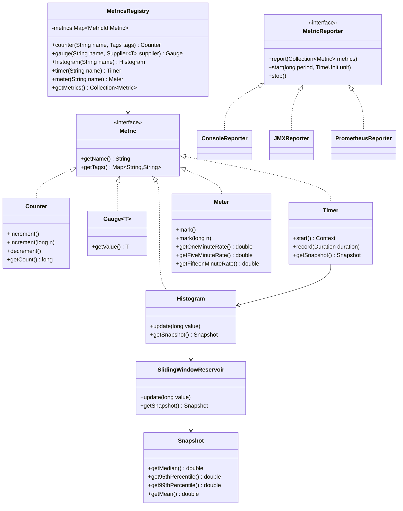

# Metrics/Monitoring Library - Low Level Design

## 1. Problem Statement
Design a metrics library (like Micrometer/Dropwizard Metrics) that allows applications to instrument code with counters, gauges, histograms, timers, and meters. Support dimensional metrics with tags, thread-safe operations, sliding window calculations, and pluggable reporters.

## 2. UML Class Diagram



## 3. Design Patterns
- **Singleton**: MetricsRegistry as global registry
- **Factory**: Registry creates metric instances
- **Strategy**: Reporter interface for different export formats
- **Observer**: Reporters observe registry for periodic reporting

## 4. SOLID Principles
- **SRP**: Each metric type has single responsibility
- **OCP**: New reporters/metrics without modifying existing code
- **LSP**: All metrics substitutable via Metric interface
- **ISP**: Separate interfaces for Counter, Gauge, etc.
- **DIP**: Registry depends on Metric abstraction, not concrete types

## 5. Complete Java Implementation

```java
import java.util.*;
import java.util.concurrent.*;
import java.util.concurrent.atomic.*;
import java.util.function.Supplier;

// ==================== Core Abstractions ====================

public interface Metric {
    String getName();
    Map<String, String> getTags();
}

public record MetricId(String name, Map<String, String> tags) {
    public MetricId(String name) { this(name, Map.of()); }
}

public abstract class AbstractMetric implements Metric {
    private final String name;
    private final Map<String, String> tags;

    protected AbstractMetric(String name, Map<String, String> tags) {
        this.name = name;
        this.tags = Collections.unmodifiableMap(new HashMap<>(tags));
    }

    @Override public String getName() { return name; }
    @Override public Map<String, String> getTags() { return tags; }
}

// ==================== Counter ====================

public class Counter extends AbstractMetric {
    private final AtomicLong count = new AtomicLong(0);

    public Counter(String name, Map<String, String> tags) { super(name, tags); }

    public void increment() { count.incrementAndGet(); }
    public void increment(long n) { count.addAndGet(n); }
    public void decrement() { count.decrementAndGet(); }
    public long getCount() { return count.get(); }
}

// ==================== Gauge ====================

public class Gauge<T> extends AbstractMetric {
    private final Supplier<T> valueSupplier;

    public Gauge(String name, Map<String, String> tags, Supplier<T> supplier) {
        super(name, tags);
        this.valueSupplier = supplier;
    }

    public T getValue() { return valueSupplier.get(); }
}

// ==================== Sliding Window & Snapshot ====================

public class Snapshot {
    private final long[] values;

    public Snapshot(long[] values) {
        this.values = Arrays.copyOf(values, values.length);
        Arrays.sort(this.values);
    }

    public double getMedian() { return getPercentile(0.5); }
    public double get95thPercentile() { return getPercentile(0.95); }
    public double get99thPercentile() { return getPercentile(0.99); }

    public double getPercentile(double quantile) {
        if (values.length == 0) return 0.0;
        int index = (int) Math.ceil(quantile * values.length) - 1;
        return values[Math.max(0, Math.min(index, values.length - 1))];
    }

    public double getMean() {
        if (values.length == 0) return 0.0;
        return Arrays.stream(values).average().orElse(0.0);
    }

    public long getMin() { return values.length == 0 ? 0 : values[0]; }
    public long getMax() { return values.length == 0 ? 0 : values[values.length - 1]; }
    public int size() { return values.length; }
}

public class SlidingWindowReservoir {
    private final long[] window;
    private final AtomicLong count = new AtomicLong(0);

    public SlidingWindowReservoir(int size) {
        this.window = new long[size];
    }

    public synchronized void update(long value) {
        long idx = count.getAndIncrement();
        window[(int)(idx % window.length)] = value;
    }

    public synchronized Snapshot getSnapshot() {
        int size = (int) Math.min(count.get(), window.length);
        long[] copy = Arrays.copyOf(window, size);
        return new Snapshot(copy);
    }
}

// ==================== Histogram ====================

public class Histogram extends AbstractMetric {
    private final SlidingWindowReservoir reservoir;
    private final AtomicLong count = new AtomicLong(0);

    public Histogram(String name, Map<String, String> tags, int windowSize) {
        super(name, tags);
        this.reservoir = new SlidingWindowReservoir(windowSize);
    }

    public void update(long value) {
        count.incrementAndGet();
        reservoir.update(value);
    }

    public long getCount() { return count.get(); }
    public Snapshot getSnapshot() { return reservoir.getSnapshot(); }
}

// ==================== Timer ====================

public class Timer extends AbstractMetric {
    private final Histogram histogram;
    private final Meter meter;

    public Timer(String name, Map<String, String> tags) {
        super(name, tags);
        this.histogram = new Histogram(name + ".duration", tags, 1024);
        this.meter = new Meter(name + ".rate", tags);
    }

    public Context start() { return new Context(this); }

    public void record(long durationNanos) {
        histogram.update(durationNanos);
        meter.mark();
    }

    public Snapshot getSnapshot() { return histogram.getSnapshot(); }
    public double getOneMinuteRate() { return meter.getOneMinuteRate(); }

    public static class Context {
        private final Timer timer;
        private final long startNanos;

        Context(Timer timer) {
            this.timer = timer;
            this.startNanos = System.nanoTime();
        }

        public long stop() {
            long duration = System.nanoTime() - startNanos;
            timer.record(duration);
            return duration;
        }
    }
}

// ==================== Meter (EWMA Rate) ====================

public class Meter extends AbstractMetric {
    private final AtomicLong count = new AtomicLong(0);
    private final EWMA oneMinuteRate = EWMA.oneMinuteEWMA();
    private final EWMA fiveMinuteRate = EWMA.fiveMinuteEWMA();
    private final EWMA fifteenMinuteRate = EWMA.fifteenMinuteEWMA();
    private final long startTime = System.nanoTime();

    public Meter(String name, Map<String, String> tags) { super(name, tags); }

    public void mark() { mark(1); }

    public void mark(long n) {
        count.addAndGet(n);
        oneMinuteRate.update(n);
        fiveMinuteRate.update(n);
        fifteenMinuteRate.update(n);
    }

    public void tick() {
        oneMinuteRate.tick();
        fiveMinuteRate.tick();
        fifteenMinuteRate.tick();
    }

    public double getOneMinuteRate() { return oneMinuteRate.getRate(); }
    public double getFiveMinuteRate() { return fiveMinuteRate.getRate(); }
    public double getFifteenMinuteRate() { return fifteenMinuteRate.getRate(); }
    public long getCount() { return count.get(); }

    public double getMeanRate() {
        long elapsed = System.nanoTime() - startTime;
        return count.get() / (elapsed / 1_000_000_000.0);
    }
}

// Exponentially Weighted Moving Average
public class EWMA {
    private final AtomicLong uncounted = new AtomicLong(0);
    private volatile double rate = 0.0;
    private volatile boolean initialized = false;
    private final double alpha;
    private static final long TICK_INTERVAL = 5_000_000_000L; // 5 sec

    private EWMA(double alpha) { this.alpha = alpha; }

    public static EWMA oneMinuteEWMA() { return new EWMA(1 - Math.exp(-5.0 / 60.0)); }
    public static EWMA fiveMinuteEWMA() { return new EWMA(1 - Math.exp(-5.0 / 300.0)); }
    public static EWMA fifteenMinuteEWMA() { return new EWMA(1 - Math.exp(-5.0 / 900.0)); }

    public void update(long n) { uncounted.addAndGet(n); }

    public void tick() {
        long count = uncounted.getAndSet(0);
        double instantRate = count / 5.0; // per second
        if (initialized) {
            rate += alpha * (instantRate - rate);
        } else {
            rate = instantRate;
            initialized = true;
        }
    }

    public double getRate() { return rate; }
}

// ==================== Registry (Singleton + Factory) ====================

public class MetricsRegistry {
    private static final MetricsRegistry INSTANCE = new MetricsRegistry();
    private final ConcurrentHashMap<MetricId, Metric> metrics = new ConcurrentHashMap<>();
    private final List<MetricReporter> reporters = new CopyOnWriteArrayList<>();
    private final ScheduledExecutorService tickExecutor = Executors.newSingleThreadScheduledExecutor();

    private MetricsRegistry() {
        // Tick meters every 5 seconds for EWMA
        tickExecutor.scheduleAtFixedRate(this::tickMeters, 5, 5, TimeUnit.SECONDS);
    }

    public static MetricsRegistry getInstance() { return INSTANCE; }

    public Counter counter(String name, Map<String, String> tags) {
        MetricId id = new MetricId(name, tags);
        return (Counter) metrics.computeIfAbsent(id, k -> new Counter(name, tags));
    }

    public Counter counter(String name) { return counter(name, Map.of()); }

    public <T> Gauge<T> gauge(String name, Map<String, String> tags, Supplier<T> supplier) {
        MetricId id = new MetricId(name, tags);
        return (Gauge<T>) metrics.computeIfAbsent(id, k -> new Gauge<>(name, tags, supplier));
    }

    public Histogram histogram(String name, Map<String, String> tags) {
        MetricId id = new MetricId(name, tags);
        return (Histogram) metrics.computeIfAbsent(id, k -> new Histogram(name, tags, 1024));
    }

    public Timer timer(String name, Map<String, String> tags) {
        MetricId id = new MetricId(name, tags);
        return (Timer) metrics.computeIfAbsent(id, k -> new Timer(name, tags));
    }

    public Meter meter(String name, Map<String, String> tags) {
        MetricId id = new MetricId(name, tags);
        return (Meter) metrics.computeIfAbsent(id, k -> new Meter(name, tags));
    }

    public Collection<Metric> getMetrics() { return Collections.unmodifiableCollection(metrics.values()); }
    public Metric get(MetricId id) { return metrics.get(id); }

    public void addReporter(MetricReporter reporter) { reporters.add(reporter); }

    private void tickMeters() {
        metrics.values().stream()
            .filter(m -> m instanceof Meter)
            .map(m -> (Meter) m)
            .forEach(Meter::tick);
    }
}

// ==================== Reporters (Strategy Pattern) ====================

public interface MetricReporter {
    void report(Collection<Metric> metrics);
    void start(long period, TimeUnit unit);
    void stop();
}

public abstract class ScheduledReporter implements MetricReporter {
    protected final MetricsRegistry registry;
    private ScheduledExecutorService executor;

    protected ScheduledReporter(MetricsRegistry registry) { this.registry = registry; }

    @Override
    public void start(long period, TimeUnit unit) {
        executor = Executors.newSingleThreadScheduledExecutor();
        executor.scheduleAtFixedRate(() -> report(registry.getMetrics()), period, period, unit);
    }

    @Override
    public void stop() { if (executor != null) executor.shutdown(); }
}

public class ConsoleReporter extends ScheduledReporter {
    public ConsoleReporter(MetricsRegistry registry) { super(registry); }

    @Override
    public void report(Collection<Metric> metrics) {
        System.out.println("========== Metrics Report ==========");
        for (Metric m : metrics) {
            if (m instanceof Counter c) {
                System.out.printf("COUNTER  %s %s: %d%n", c.getName(), c.getTags(), c.getCount());
            } else if (m instanceof Gauge<?> g) {
                System.out.printf("GAUGE    %s %s: %s%n", g.getName(), g.getTags(), g.getValue());
            } else if (m instanceof Histogram h) {
                Snapshot s = h.getSnapshot();
                System.out.printf("HIST     %s: count=%d p50=%.1f p95=%.1f p99=%.1f%n",
                    h.getName(), h.getCount(), s.getMedian(), s.get95thPercentile(), s.get99thPercentile());
            } else if (m instanceof Timer t) {
                Snapshot s = t.getSnapshot();
                System.out.printf("TIMER    %s: p50=%.1fns p95=%.1fns rate=%.2f/s%n",
                    t.getName(), s.getMedian(), s.get95thPercentile(), t.getOneMinuteRate());
            } else if (m instanceof Meter meter) {
                System.out.printf("METER    %s: count=%d 1m=%.2f 5m=%.2f 15m=%.2f%n",
                    meter.getName(), meter.getCount(), meter.getOneMinuteRate(),
                    meter.getFiveMinuteRate(), meter.getFifteenMinuteRate());
            }
        }
    }
}

public class PrometheusReporter extends ScheduledReporter {
    private final StringBuilder buffer = new StringBuilder();

    public PrometheusReporter(MetricsRegistry registry) { super(registry); }

    @Override
    public void report(Collection<Metric> metrics) {
        buffer.setLength(0);
        for (Metric m : metrics) {
            String labels = formatLabels(m.getTags());
            if (m instanceof Counter c) {
                buffer.append(String.format("%s_total%s %d%n", sanitize(c.getName()), labels, c.getCount()));
            } else if (m instanceof Histogram h) {
                Snapshot s = h.getSnapshot();
                String name = sanitize(h.getName());
                buffer.append(String.format("%s{quantile=\"0.5\"} %.1f%n", name, s.getMedian()));
                buffer.append(String.format("%s{quantile=\"0.95\"} %.1f%n", name, s.get95thPercentile()));
                buffer.append(String.format("%s{quantile=\"0.99\"} %.1f%n", name, s.get99thPercentile()));
                buffer.append(String.format("%s_count %d%n", name, h.getCount()));
            }
        }
    }

    public String getOutput() { return buffer.toString(); }
    private String sanitize(String name) { return name.replaceAll("[^a-zA-Z0-9_]", "_"); }
    private String formatLabels(Map<String, String> tags) {
        if (tags.isEmpty()) return "";
        StringJoiner sj = new StringJoiner(",", "{", "}");
        tags.forEach((k, v) -> sj.add(k + "=\"" + v + "\""));
        return sj.toString();
    }
}

public class JMXReporter extends ScheduledReporter {
    public JMXReporter(MetricsRegistry registry) { super(registry); }

    @Override
    public void report(Collection<Metric> metrics) {
        // Register/update MBeans for each metric
        // Simplified: in production, register MBeans with MBeanServer
    }
}

// ==================== Usage Example ====================

public class Application {
    public static void main(String[] args) throws InterruptedException {
        MetricsRegistry registry = MetricsRegistry.getInstance();

        // Counter with tags (dimensional metrics)
        Counter requests = registry.counter("http.requests",
            Map.of("method", "GET", "path", "/api/users"));
        requests.increment();
        requests.increment();

        // Gauge
        Runtime runtime = Runtime.getRuntime();
        registry.gauge("jvm.memory.used", Map.of(), () -> runtime.totalMemory() - runtime.freeMemory());

        // Histogram
        Histogram responseSize = registry.histogram("http.response.size", Map.of());
        responseSize.update(1024);
        responseSize.update(2048);
        responseSize.update(512);

        // Timer
        Timer dbTimer = registry.timer("db.query.time", Map.of("query", "findUser"));
        Timer.Context ctx = dbTimer.start();
        Thread.sleep(50); // simulate work
        ctx.stop();

        // Meter
        Meter eventMeter = registry.meter("events.processed", Map.of());
        eventMeter.mark();
        eventMeter.mark(10);

        // Start console reporter
        ConsoleReporter reporter = new ConsoleReporter(registry);
        reporter.start(10, TimeUnit.SECONDS);
        reporter.report(registry.getMetrics()); // immediate report
    }
}
```

## 6. Key Interview Points

| Topic | Key Insight |
|-------|-------------|
| **Thread Safety** | AtomicLong for counters; synchronized for reservoir; ConcurrentHashMap for registry |
| **EWMA** | Exponentially weighted moving average gives recent events more weight; standard for load averages |
| **Sliding Window** | Fixed-size circular buffer avoids unbounded memory; trade-off between accuracy and memory |
| **Dimensional Metrics** | Tags/labels allow filtering/grouping (e.g., by endpoint, status code) vs. hierarchical naming |
| **computeIfAbsent** | Atomic metric creation prevents duplicates in concurrent registration |
| **Percentile Accuracy** | Sorted snapshot approach is O(n log n); alternatives: t-digest, HDR histogram |
| **Reporter Decoupling** | Strategy pattern allows push (Prometheus pushgateway) or pull (scrape endpoint) models |
| **Timer = Histogram + Meter** | Composition over inheritance; timer tracks both duration distribution and throughput |
| **Tick Mechanism** | Background thread ticks EWMA every 5s; decouples rate calculation from event recording |
| **Memory Bound** | Reservoir size caps memory; 1024 samples typical default for percentile accuracy |
