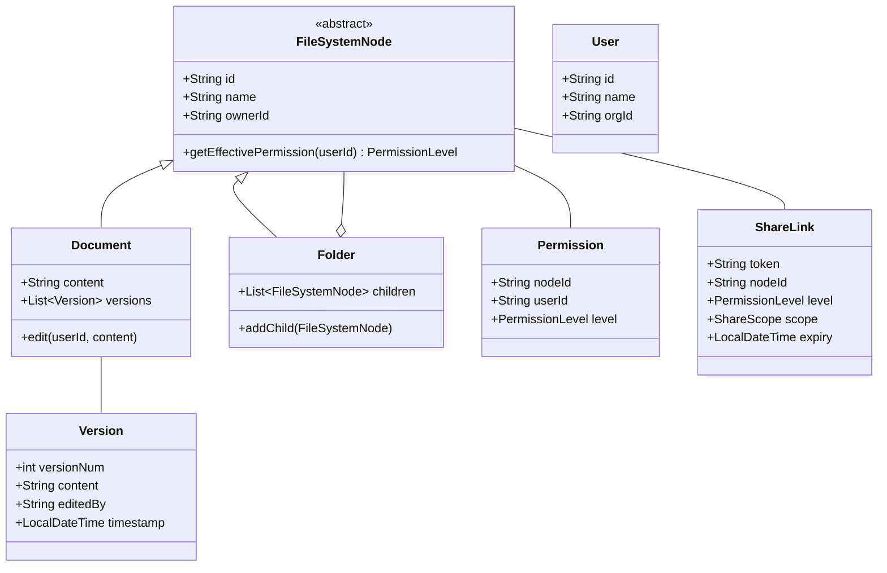

# Document Sharing & Permissions (Google Docs-like) - LLD

## 1. Problem Statement
Design a document sharing and permissions system supporting user-level/link-level sharing, permission inheritance from folders, concurrent editing conflict resolution, and real-time notifications.

## 2. UML Class Diagram


## 3. Design Patterns
- **Composite**: Folder/Document hierarchy with permission inheritance
- **Strategy**: Different conflict resolution strategies (LWW, OT)
- **Proxy**: Access-controlled proxy for document operations
- **Observer**: Notifications on share/edit events

## 4. SOLID Principles
- **SRP**: Separate classes for access control, sharing, versioning
- **OCP**: New permission levels/strategies without modifying existing code
- **LSP**: Document and Folder interchangeable as FileSystemNode
- **ISP**: Separate interfaces for readable, writable, shareable
- **DIP**: Services depend on abstractions (ConflictStrategy, NotificationObserver)

## 5. Complete Java Implementation

```java
import java.util.*;
import java.time.*;
import java.util.concurrent.*;

// === ENUMS ===
enum PermissionLevel {
    NONE(0), VIEWER(1), COMMENTER(2), EDITOR(3), OWNER(4);
    final int rank;
    PermissionLevel(int rank) { this.rank = rank; }
    boolean isAtLeast(PermissionLevel required) { return rank >= required.rank; }
}

enum ShareScope { ANYONE, SPECIFIC_USERS, ORGANIZATION }

// === MODELS ===
class User {
    String id, name, email, orgId;
    User(String id, String name, String orgId) {
        this.id = id; this.name = name; this.orgId = orgId;
    }
}

class Version {
    int versionNum;
    String content, editedBy;
    LocalDateTime timestamp;
    Version(int num, String content, String editedBy) {
        this.versionNum = num; this.content = content;
        this.editedBy = editedBy; this.timestamp = LocalDateTime.now();
    }
}

class Permission {
    String nodeId, userId;
    PermissionLevel level;
    Permission(String nodeId, String userId, PermissionLevel level) {
        this.nodeId = nodeId; this.userId = userId; this.level = level;
    }
}

class ShareLink {
    String token, nodeId;
    PermissionLevel level;
    ShareScope scope;
    String orgRestriction;
    LocalDateTime expiry;
    ShareLink(String nodeId, PermissionLevel level, ShareScope scope) {
        this.token = UUID.randomUUID().toString();
        this.nodeId = nodeId; this.level = level; this.scope = scope;
    }
}

// === COMPOSITE PATTERN: FileSystemNode ===
abstract class FileSystemNode {
    String id, name, ownerId;
    Folder parent;
    FileSystemNode(String id, String name, String ownerId) {
        this.id = id; this.name = name; this.ownerId = ownerId;
    }
}

class Document extends FileSystemNode {
    String content = "";
    List<Version> versions = new ArrayList<>();
    long lastModified = System.currentTimeMillis();
    Document(String id, String name, String ownerId) {
        super(id, name, ownerId);
        versions.add(new Version(1, "", ownerId));
    }
}

class Folder extends FileSystemNode {
    List<FileSystemNode> children = new ArrayList<>();
    Folder(String id, String name, String ownerId) { super(id, name, ownerId); }
    void addChild(FileSystemNode node) { children.add(node); node.parent = this; }
}

// === OBSERVER PATTERN ===
interface SharingObserver {
    void onShared(String nodeId, String fromUser, String toUser, PermissionLevel level);
    void onEdited(String docId, String userId);
    void onOwnershipTransferred(String nodeId, String from, String to);
}

class NotificationService implements SharingObserver {
    public void onShared(String nodeId, String from, String to, PermissionLevel level) {
        System.out.println("NOTIFY: " + to + " got " + level + " access to " + nodeId);
    }
    public void onEdited(String docId, String userId) {
        System.out.println("NOTIFY: " + docId + " edited by " + userId);
    }
    public void onOwnershipTransferred(String nodeId, String from, String to) {
        System.out.println("NOTIFY: Ownership of " + nodeId + " transferred from " + from + " to " + to);
    }
}

// === STRATEGY PATTERN: Conflict Resolution ===
interface ConflictResolutionStrategy {
    String resolve(String baseContent, String incomingContent, long baseTimestamp, long incomingTimestamp);
}

class LastWriteWinsStrategy implements ConflictResolutionStrategy {
    public String resolve(String base, String incoming, long baseTs, long incomingTs) {
        return incomingTs >= baseTs ? incoming : base;
    }
}

class OperationalTransformStrategy implements ConflictResolutionStrategy {
    // Simplified OT: in real systems, operations are transformed against each other
    public String resolve(String base, String incoming, long baseTs, long incomingTs) {
        // Placeholder: real OT would transform character-level operations
        return incoming; // Simplified
    }
}

// === ACCESS CONTROL SERVICE ===
class AccessControlService {
    private Map<String, List<Permission>> permissionsByNode = new ConcurrentHashMap<>();
    private Map<String, ShareLink> shareLinks = new ConcurrentHashMap<>();

    void addPermission(Permission perm) {
        permissionsByNode.computeIfAbsent(perm.nodeId, k -> new CopyOnWriteArrayList<>()).add(perm);
    }

    void removePermission(String nodeId, String userId) {
        List<Permission> perms = permissionsByNode.get(nodeId);
        if (perms != null) perms.removeIf(p -> p.userId.equals(userId));
    }

    void addShareLink(ShareLink link) { shareLinks.put(link.token, link); }

    // Permission inheritance: walk up folder tree (Composite)
    PermissionLevel getEffectivePermission(FileSystemNode node, String userId) {
        if (node.ownerId.equals(userId)) return PermissionLevel.OWNER;
        PermissionLevel direct = getDirectPermission(node.id, userId);
        if (direct != PermissionLevel.NONE) return direct;
        // Inherit from parent folder
        if (node.parent != null) return getEffectivePermission(node.parent, userId);
        return PermissionLevel.NONE;
    }

    PermissionLevel getDirectPermission(String nodeId, String userId) {
        List<Permission> perms = permissionsByNode.getOrDefault(nodeId, List.of());
        return perms.stream().filter(p -> p.userId.equals(userId))
            .map(p -> p.level).findFirst().orElse(PermissionLevel.NONE);
    }

    PermissionLevel getLinkPermission(String token, User user) {
        ShareLink link = shareLinks.get(token);
        if (link == null || (link.expiry != null && link.expiry.isBefore(LocalDateTime.now())))
            return PermissionLevel.NONE;
        if (link.scope == ShareScope.ANYONE) return link.level;
        if (link.scope == ShareScope.ORGANIZATION && link.orgRestriction.equals(user.orgId))
            return link.level;
        return PermissionLevel.NONE;
    }

    boolean canRead(FileSystemNode node, String userId) {
        return getEffectivePermission(node, userId).isAtLeast(PermissionLevel.VIEWER);
    }
    boolean canWrite(FileSystemNode node, String userId) {
        return getEffectivePermission(node, userId).isAtLeast(PermissionLevel.EDITOR);
    }
    boolean canDelete(FileSystemNode node, String userId) {
        return getEffectivePermission(node, userId).isAtLeast(PermissionLevel.OWNER);
    }
    boolean canShare(FileSystemNode node, String userId) {
        return getEffectivePermission(node, userId).isAtLeast(PermissionLevel.EDITOR);
    }
}

// === PROXY PATTERN: Secured Document ===
class SecuredDocumentProxy {
    private Document doc;
    private AccessControlService acl;
    SecuredDocumentProxy(Document doc, AccessControlService acl) {
        this.doc = doc; this.acl = acl;
    }
    String read(String userId) {
        if (!acl.canRead(doc, userId)) throw new SecurityException("No read access");
        return doc.content;
    }
    void write(String userId, String content, ConflictResolutionStrategy strategy) {
        if (!acl.canWrite(doc, userId)) throw new SecurityException("No write access");
        String resolved = strategy.resolve(doc.content, content, doc.lastModified, System.currentTimeMillis());
        doc.content = resolved;
        doc.lastModified = System.currentTimeMillis();
        doc.versions.add(new Version(doc.versions.size() + 1, resolved, userId));
    }
}

// === MAIN SHARING SERVICE ===
class DocumentSharingService {
    private AccessControlService acl = new AccessControlService();
    private List<SharingObserver> observers = new ArrayList<>();
    private ConflictResolutionStrategy conflictStrategy = new LastWriteWinsStrategy();

    void addObserver(SharingObserver obs) { observers.add(obs); }

    // Share with specific user
    void shareWithUser(FileSystemNode node, String fromUserId, String toUserId, PermissionLevel level) {
        if (!acl.canShare(node, fromUserId)) throw new SecurityException("Cannot share");
        if (level == PermissionLevel.OWNER) throw new IllegalArgumentException("Use transferOwnership");
        acl.addPermission(new Permission(node.id, toUserId, level));
        observers.forEach(o -> o.onShared(node.id, fromUserId, toUserId, level));
    }

    // Share via link
    ShareLink shareViaLink(FileSystemNode node, String userId, PermissionLevel level, ShareScope scope) {
        if (!acl.canShare(node, userId)) throw new SecurityException("Cannot share");
        ShareLink link = new ShareLink(node.id, level, scope);
        acl.addShareLink(link);
        return link;
    }

    // Revoke access
    void revokeAccess(FileSystemNode node, String ownerId, String targetUserId) {
        if (!acl.canShare(node, ownerId)) throw new SecurityException("Cannot revoke");
        acl.removePermission(node.id, targetUserId);
    }

    // Transfer ownership
    void transferOwnership(FileSystemNode node, String currentOwnerId, String newOwnerId) {
        if (!node.ownerId.equals(currentOwnerId)) throw new SecurityException("Not owner");
        node.ownerId = newOwnerId;
        acl.addPermission(new Permission(node.id, currentOwnerId, PermissionLevel.EDITOR));
        observers.forEach(o -> o.onOwnershipTransferred(node.id, currentOwnerId, newOwnerId));
    }

    // Edit document
    void editDocument(Document doc, String userId, String newContent) {
        SecuredDocumentProxy proxy = new SecuredDocumentProxy(doc, acl);
        proxy.write(userId, newContent, conflictStrategy);
        observers.forEach(o -> o.onEdited(doc.id, userId));
    }

    // Get version history
    List<Version> getVersionHistory(Document doc, String userId) {
        if (!acl.canRead(doc, userId)) throw new SecurityException("No access");
        return Collections.unmodifiableList(doc.versions);
    }

    AccessControlService getAcl() { return acl; }
}

// === DEMO ===
class Demo {
    public static void main(String[] args) {
        DocumentSharingService service = new DocumentSharingService();
        service.addObserver(new NotificationService());

        User alice = new User("u1", "Alice", "org1");
        User bob = new User("u2", "Bob", "org1");

        Folder folder = new Folder("f1", "Projects", alice.id);
        Document doc = new Document("d1", "Design.md", alice.id);
        folder.addChild(doc);

        // Share folder with Bob as editor -> doc inherits
        service.shareWithUser(folder, alice.id, bob.id, PermissionLevel.EDITOR);

        // Bob edits (inherited permission)
        service.editDocument(doc, bob.id, "Hello from Bob");

        // Alice shares doc via link
        ShareLink link = service.shareViaLink(doc, alice.id, PermissionLevel.VIEWER, ShareScope.ORGANIZATION);

        // Transfer ownership
        service.transferOwnership(doc, alice.id, bob.id);

        System.out.println("Versions: " + service.getVersionHistory(doc, bob.id).size());
    }
}
```

## 6. Key Interview Points

| Topic | Key Insight |
|-------|-------------|
| **Composite** | Folder tree with permission inheritance walking up to root |
| **Proxy** | SecuredDocumentProxy enforces ACL before any operation |
| **Strategy** | Pluggable conflict resolution (LWW vs OT) |
| **Observer** | Decoupled notifications on share/edit events |
| **Concurrency** | ConcurrentHashMap + CopyOnWriteArrayList for thread safety |
| **Permission Model** | Dual: user-level (explicit) + link-level (token-based) |
| **Inheritance** | Child inherits parent folder permission if no direct grant |
| **OT vs CRDT** | OT transforms ops server-side; CRDT merges conflict-free client-side |
| **Scalability** | Cache effective permissions; invalidate on permission change up the tree |
| **Security** | Never expose OWNER grant via share; separate transferOwnership |
