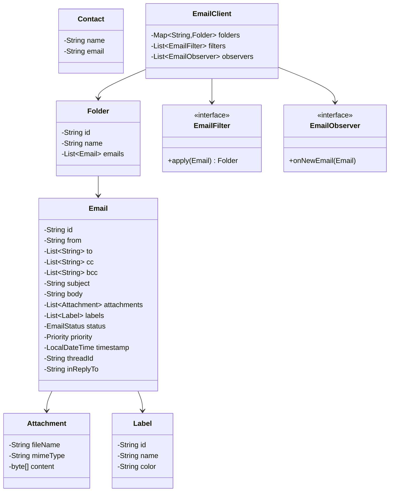

# Email Client - Low Level Design

## 1. Problem Statement
Design an email client system that supports composing, sending, receiving, organizing, and searching emails with folder management, labels, filters, and conversation threading.

## 2. UML Class Diagram


## 3. Design Patterns
- **Builder**: Compose emails fluently with optional fields
- **Observer**: Notify on new email arrival
- **Strategy**: Pluggable email filter rules
- **Factory**: Create default folders

## 4. SOLID Principles
- **SRP**: Email, Folder, Filter each have single responsibility
- **OCP**: New filters/rules without modifying existing code
- **LSP**: All FilterStrategy implementations are interchangeable
- **ISP**: Small focused interfaces (EmailObserver, EmailFilter)
- **DIP**: EmailClient depends on abstractions (interfaces) not concrete filters

## 5. Complete Java Implementation

```java
import java.util.*;
import java.time.LocalDateTime;
import java.util.stream.*;

// === Enums ===
enum EmailStatus { DRAFT, SENT, READ, UNREAD, ARCHIVED, DELETED }
enum Priority { LOW, NORMAL, HIGH, URGENT }

// === Models ===
class Attachment {
    private String fileName;
    private String mimeType;
    private byte[] content;
    public Attachment(String fileName, String mimeType, byte[] content) {
        this.fileName = fileName; this.mimeType = mimeType; this.content = content;
    }
    public String getFileName() { return fileName; }
    public String getMimeType() { return mimeType; }
}

class Label {
    private String id, name, color;
    public Label(String id, String name, String color) {
        this.id = id; this.name = name; this.color = color;
    }
    public String getId() { return id; }
    public String getName() { return name; }
}

class Contact {
    private String name, email;
    public Contact(String name, String email) { this.name = name; this.email = email; }
    public String getEmail() { return email; }
    public String getName() { return name; }
}

// === Email with Builder ===
class Email {
    private String id, from, subject, body, threadId, inReplyTo;
    private List<String> to, cc, bcc;
    private List<Attachment> attachments;
    private List<Label> labels;
    private EmailStatus status;
    private Priority priority;
    private LocalDateTime timestamp;

    private Email(Builder builder) {
        this.id = UUID.randomUUID().toString();
        this.from = builder.from;
        this.to = builder.to;
        this.cc = builder.cc;
        this.bcc = builder.bcc;
        this.subject = builder.subject;
        this.body = builder.body;
        this.attachments = builder.attachments;
        this.labels = new ArrayList<>();
        this.status = EmailStatus.DRAFT;
        this.priority = builder.priority;
        this.timestamp = LocalDateTime.now();
        this.threadId = builder.threadId != null ? builder.threadId : id;
        this.inReplyTo = builder.inReplyTo;
    }

    // Getters
    public String getId() { return id; }
    public String getFrom() { return from; }
    public List<String> getTo() { return to; }
    public List<String> getCc() { return cc; }
    public List<String> getBcc() { return bcc; }
    public String getSubject() { return subject; }
    public String getBody() { return body; }
    public List<Attachment> getAttachments() { return attachments; }
    public List<Label> getLabels() { return labels; }
    public EmailStatus getStatus() { return status; }
    public Priority getPriority() { return priority; }
    public LocalDateTime getTimestamp() { return timestamp; }
    public String getThreadId() { return threadId; }
    public String getInReplyTo() { return inReplyTo; }
    public void setStatus(EmailStatus s) { this.status = s; }
    public void addLabel(Label l) { labels.add(l); }
    public void removeLabel(Label l) { labels.remove(l); }

    // Builder Pattern
    static class Builder {
        private String from, subject, body, threadId, inReplyTo;
        private List<String> to = new ArrayList<>(), cc = new ArrayList<>(), bcc = new ArrayList<>();
        private List<Attachment> attachments = new ArrayList<>();
        private Priority priority = Priority.NORMAL;

        public Builder from(String f) { this.from = f; return this; }
        public Builder to(String... t) { this.to.addAll(Arrays.asList(t)); return this; }
        public Builder cc(String... c) { this.cc.addAll(Arrays.asList(c)); return this; }
        public Builder bcc(String... b) { this.bcc.addAll(Arrays.asList(b)); return this; }
        public Builder subject(String s) { this.subject = s; return this; }
        public Builder body(String b) { this.body = b; return this; }
        public Builder attachment(Attachment a) { this.attachments.add(a); return this; }
        public Builder priority(Priority p) { this.priority = p; return this; }
        public Builder threadId(String t) { this.threadId = t; return this; }
        public Builder inReplyTo(String r) { this.inReplyTo = r; return this; }
        public Email build() { return new Email(this); }
    }
}

// === Folder ===
class Folder {
    private String id, name;
    private List<Email> emails = new ArrayList<>();

    public Folder(String name) { this.id = UUID.randomUUID().toString(); this.name = name; }
    public String getName() { return name; }
    public List<Email> getEmails() { return emails; }
    public void addEmail(Email e) { emails.add(e); }
    public void removeEmail(Email e) { emails.remove(e); }
}

// === Observer Pattern ===
interface EmailObserver {
    void onNewEmail(Email email);
}

class NotificationObserver implements EmailObserver {
    public void onNewEmail(Email email) {
        System.out.println("New email from: " + email.getFrom() + " - " + email.getSubject());
    }
}

class BadgeCountObserver implements EmailObserver {
    private int unreadCount = 0;
    public void onNewEmail(Email email) { unreadCount++; }
    public int getUnreadCount() { return unreadCount; }
}

// === Strategy Pattern - Email Filters ===
interface EmailFilter {
    boolean matches(Email email);
    String getTargetFolder();
}

class SenderFilter implements EmailFilter {
    private String sender, targetFolder;
    public SenderFilter(String sender, String targetFolder) {
        this.sender = sender; this.targetFolder = targetFolder;
    }
    public boolean matches(Email email) { return email.getFrom().contains(sender); }
    public String getTargetFolder() { return targetFolder; }
}

class SubjectFilter implements EmailFilter {
    private String keyword, targetFolder;
    public SubjectFilter(String keyword, String targetFolder) {
        this.keyword = keyword; this.targetFolder = targetFolder;
    }
    public boolean matches(Email email) { return email.getSubject().toLowerCase().contains(keyword.toLowerCase()); }
    public String getTargetFolder() { return targetFolder; }
}

class PriorityFilter implements EmailFilter {
    private Priority priority;
    private String targetFolder;
    public PriorityFilter(Priority p, String folder) { this.priority = p; this.targetFolder = folder; }
    public boolean matches(Email email) { return email.getPriority() == priority; }
    public String getTargetFolder() { return targetFolder; }
}

// === Factory - Default Folders ===
class FolderFactory {
    public static Map<String, Folder> createDefaultFolders() {
        Map<String, Folder> folders = new LinkedHashMap<>();
        for (String name : Arrays.asList("Inbox", "Sent", "Drafts", "Trash", "Spam"))
            folders.put(name, new Folder(name));
        return folders;
    }
}

// === Search Service ===
class SearchService {
    public List<Email> searchBySender(List<Email> emails, String sender) {
        return emails.stream().filter(e -> e.getFrom().contains(sender)).collect(Collectors.toList());
    }
    public List<Email> searchBySubject(List<Email> emails, String keyword) {
        return emails.stream().filter(e -> e.getSubject().toLowerCase().contains(keyword.toLowerCase())).collect(Collectors.toList());
    }
    public List<Email> searchByDateRange(List<Email> emails, LocalDateTime from, LocalDateTime to) {
        return emails.stream().filter(e -> !e.getTimestamp().isBefore(from) && !e.getTimestamp().isAfter(to)).collect(Collectors.toList());
    }
    public List<Email> searchByLabel(List<Email> emails, Label label) {
        return emails.stream().filter(e -> e.getLabels().contains(label)).collect(Collectors.toList());
    }
}

// === Email Client (Main Controller) ===
class EmailClient {
    private String userEmail;
    private Map<String, Folder> folders;
    private List<EmailFilter> filters = new ArrayList<>();
    private List<EmailObserver> observers = new ArrayList<>();
    private Map<String, List<Email>> threads = new HashMap<>();
    private SearchService searchService = new SearchService();

    public EmailClient(String userEmail) {
        this.userEmail = userEmail;
        this.folders = FolderFactory.createDefaultFolders();
    }

    // Observer management
    public void addObserver(EmailObserver o) { observers.add(o); }
    public void removeObserver(EmailObserver o) { observers.remove(o); }
    private void notifyObservers(Email email) { observers.forEach(o -> o.onNewEmail(email)); }

    // Filter management
    public void addFilter(EmailFilter f) { filters.add(f); }

    // Folder management
    public void createFolder(String name) { folders.put(name, new Folder(name)); }
    public void deleteFolder(String name) {
        if (Arrays.asList("Inbox","Sent","Drafts","Trash").contains(name)) throw new IllegalArgumentException("Cannot delete system folder");
        folders.remove(name);
    }
    public void moveEmail(Email email, String fromFolder, String toFolder) {
        folders.get(fromFolder).removeEmail(email);
        folders.get(toFolder).addEmail(email);
    }

    // Compose & Send
    public Email compose(Email.Builder builder) {
        Email email = builder.from(userEmail).build();
        folders.get("Drafts").addEmail(email);
        return email;
    }

    public void send(Email email) {
        email.setStatus(EmailStatus.SENT);
        folders.get("Drafts").removeEmail(email);
        folders.get("Sent").addEmail(email);
    }

    // Receive with filter application
    public void receive(Email email) {
        email.setStatus(EmailStatus.UNREAD);
        String targetFolder = "Inbox";
        for (EmailFilter filter : filters) {
            if (filter.matches(email)) { targetFolder = filter.getTargetFolder(); break; }
        }
        if (!folders.containsKey(targetFolder)) targetFolder = "Inbox";
        folders.get(targetFolder).addEmail(email);
        threads.computeIfAbsent(email.getThreadId(), k -> new ArrayList<>()).add(email);
        notifyObservers(email);
    }

    // Reply, Forward, Reply-All
    public Email reply(Email original, String body) {
        return new Email.Builder().from(userEmail).to(original.getFrom())
            .subject("Re: " + original.getSubject()).body(body)
            .threadId(original.getThreadId()).inReplyTo(original.getId()).build();
    }

    public Email replyAll(Email original, String body) {
        List<String> allRecipients = new ArrayList<>(original.getTo());
        allRecipients.addAll(original.getCc());
        allRecipients.remove(userEmail);
        allRecipients.add(original.getFrom());
        return new Email.Builder().from(userEmail).to(allRecipients.toArray(new String[0]))
            .subject("Re: " + original.getSubject()).body(body)
            .threadId(original.getThreadId()).inReplyTo(original.getId()).build();
    }

    public Email forward(Email original, String... recipients) {
        return new Email.Builder().from(userEmail).to(recipients)
            .subject("Fwd: " + original.getSubject())
            .body("------Forwarded------\n" + original.getBody())
            .threadId(original.getThreadId()).build();
    }

    // Threading
    public List<Email> getThread(String threadId) {
        return threads.getOrDefault(threadId, Collections.emptyList());
    }

    // Delete & Archive
    public void delete(Email email, String fromFolder) { moveEmail(email, fromFolder, "Trash"); email.setStatus(EmailStatus.DELETED); }
    public void archive(Email email, String fromFolder) { email.setStatus(EmailStatus.ARCHIVED); folders.get(fromFolder).removeEmail(email); }

    // Search
    public List<Email> search(String sender, String subject, Label label) {
        List<Email> all = folders.values().stream().flatMap(f -> f.getEmails().stream()).collect(Collectors.toList());
        if (sender != null) all = searchService.searchBySender(all, sender);
        if (subject != null) all = searchService.searchBySubject(all, subject);
        if (label != null) all = searchService.searchByLabel(all, label);
        return all;
    }

    public Folder getFolder(String name) { return folders.get(name); }
}

// === Demo ===
class EmailClientDemo {
    public static void main(String[] args) {
        EmailClient client = new EmailClient("user@example.com");
        client.addObserver(new NotificationObserver());
        client.addFilter(new SenderFilter("spam@", "Spam"));
        client.addFilter(new SubjectFilter("urgent", "Inbox"));
        client.createFolder("Work");

        // Compose and send
        Email email = client.compose(new Email.Builder()
            .to("friend@example.com").cc("boss@example.com")
            .subject("Meeting").body("Let's meet tomorrow").priority(Priority.HIGH));
        client.send(email);

        // Receive
        Email incoming = new Email.Builder().from("colleague@example.com")
            .to("user@example.com").subject("Project Update").body("Here's the update").build();
        incoming.setStatus(EmailStatus.SENT);
        client.receive(incoming);

        // Reply
        Email reply = client.reply(incoming, "Thanks for the update!");
        client.send(reply);

        // Label
        Label work = new Label("1", "Work", "blue");
        incoming.addLabel(work);
        List<Email> results = client.search(null, null, work);
    }
}
```

## 6. Key Interview Points

| Topic | Point |
|-------|-------|
| Builder | Handles complex email construction with optional fields cleanly |
| Observer | Decouples notification logic from email receipt; supports multiple notification channels |
| Strategy | Filters are pluggable; easy to add new categorization rules |
| Factory | Encapsulates default folder creation logic |
| Threading | Uses threadId to group conversations; inReplyTo for ordering |
| Search | Stream-based filtering; composable criteria |
| Concurrency | Production: ConcurrentHashMap for folders, synchronized send/receive |
| Scalability | Add indexing for search, pagination for large folders |
| Extensions | Encryption, scheduled send, read receipts, spam ML classifier |
