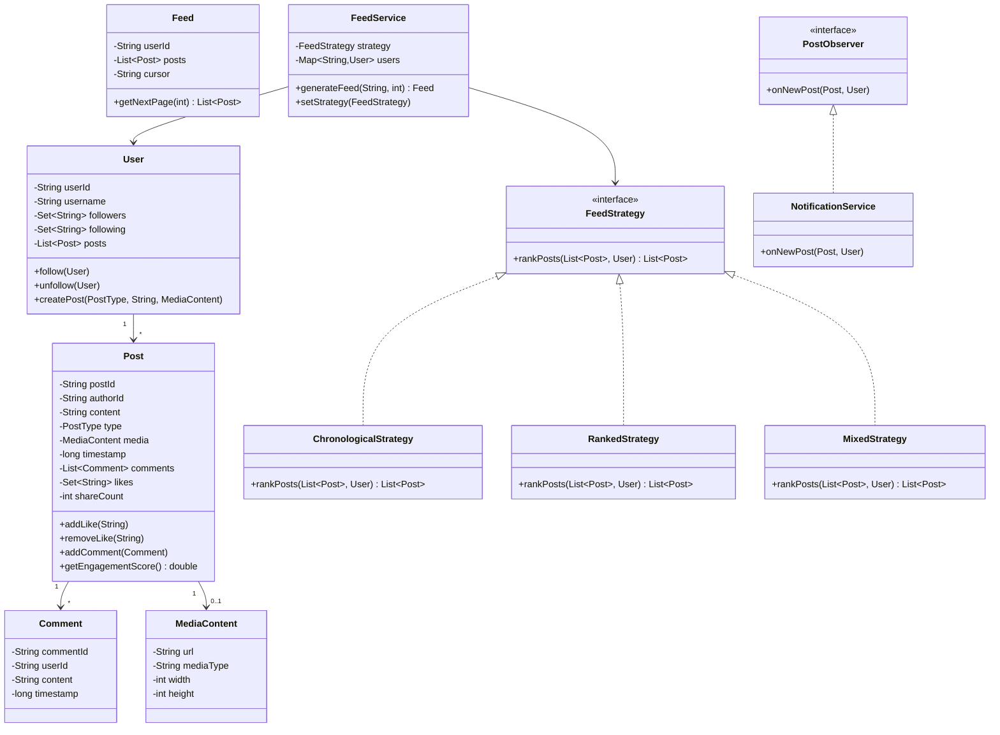

# News Feed System - Low Level Design

## 1. Problem Statement
Design a News Feed system (Instagram/Twitter-like) that generates personalized feeds for users based on posts from people they follow, supporting multiple ranking strategies, interactions (like/comment/share), and real-time notifications.

## 2. UML Class Diagram



## 3. Design Patterns
- **Strategy**: Feed ranking algorithms (Chronological, Ranked, Mixed)
- **Observer**: Notify followers on new post creation
- **Iterator**: Cursor-based feed pagination
- **Factory**: Post creation with different media types

## 4. SOLID Principles
- **SRP**: Separate classes for Feed generation, Scoring, Notifications
- **OCP**: New ranking strategies without modifying FeedService
- **LSP**: All FeedStrategy implementations are interchangeable
- **ISP**: Separate observer interfaces for different event types
- **DIP**: FeedService depends on FeedStrategy abstraction

## 5. Complete Java Implementation

```java
import java.util.*;
import java.util.concurrent.*;
import java.util.stream.*;

// ==================== ENUMS ====================
enum PostType { TEXT, IMAGE, VIDEO, STORY }
enum FeedAlgorithm { CHRONOLOGICAL, RANKED, MIXED }

// ==================== MODELS ====================
class MediaContent {
    private String url;
    private String mediaType;
    private int width, height;

    public MediaContent(String url, String mediaType, int width, int height) {
        this.url = url; this.mediaType = mediaType;
        this.width = width; this.height = height;
    }
    public String getUrl() { return url; }
}

class Comment {
    private String commentId, userId, content;
    private long timestamp;

    public Comment(String userId, String content) {
        this.commentId = UUID.randomUUID().toString();
        this.userId = userId; this.content = content;
        this.timestamp = System.currentTimeMillis();
    }
    public String getUserId() { return userId; }
    public long getTimestamp() { return timestamp; }
}

class Post {
    private String postId, authorId, content;
    private PostType type;
    private MediaContent media;
    private long timestamp;
    private List<Comment> comments = new CopyOnWriteArrayList<>();
    private Set<String> likes = ConcurrentHashMap.newKeySet();
    private int shareCount;

    public Post(String authorId, String content, PostType type, MediaContent media) {
        this.postId = UUID.randomUUID().toString();
        this.authorId = authorId; this.content = content;
        this.type = type; this.media = media;
        this.timestamp = System.currentTimeMillis();
    }

    public void addLike(String userId) { likes.add(userId); }
    public void removeLike(String userId) { likes.remove(userId); }
    public void addComment(Comment c) { comments.add(c); }
    public void incrementShares() { shareCount++; }

    public double getEngagementScore() {
        return likes.size() * 1.0 + comments.size() * 2.0 + shareCount * 3.0;
    }

    public String getPostId() { return postId; }
    public String getAuthorId() { return authorId; }
    public long getTimestamp() { return timestamp; }
    public Set<String> getLikes() { return likes; }
    public List<Comment> getComments() { return comments; }
    public PostType getType() { return type; }
    public int getShareCount() { return shareCount; }
}

class User {
    private String userId, username;
    private Set<String> followers = ConcurrentHashMap.newKeySet();
    private Set<String> following = ConcurrentHashMap.newKeySet();
    private List<Post> posts = new CopyOnWriteArrayList<>();

    public User(String userId, String username) {
        this.userId = userId; this.username = username;
    }

    public void follow(User other) {
        this.following.add(other.getUserId());
        other.followers.add(this.userId);
    }

    public void unfollow(User other) {
        this.following.remove(other.getUserId());
        other.followers.remove(this.userId);
    }

    public Post createPost(PostType type, String content, MediaContent media) {
        Post post = new Post(userId, content, type, media);
        posts.add(post);
        return post;
    }

    public String getUserId() { return userId; }
    public Set<String> getFollowers() { return followers; }
    public Set<String> getFollowing() { return following; }
    public List<Post> getPosts() { return posts; }
}

// ==================== OBSERVER ====================
interface PostObserver {
    void onNewPost(Post post, User author);
}

class NotificationService implements PostObserver {
    @Override
    public void onNewPost(Post post, User author) {
        for (String followerId : author.getFollowers()) {
            System.out.println("Notification to " + followerId + ": "
                + author.getUserId() + " posted something new!");
        }
    }
}

class FeedCacheInvalidator implements PostObserver {
    @Override
    public void onNewPost(Post post, User author) {
        // Invalidate cached feeds for all followers
        author.getFollowers().forEach(f ->
            System.out.println("Invalidating feed cache for: " + f));
    }
}

// ==================== CONTENT MODERATION HOOK ====================
interface ContentModerator {
    boolean isAllowed(Post post);
}

class BasicContentModerator implements ContentModerator {
    private Set<String> bannedWords = Set.of("spam", "banned");

    @Override
    public boolean isAllowed(Post post) {
        // Simple keyword filtering; extensible for ML-based moderation
        return bannedWords.stream().noneMatch(w ->
            post.getAuthorId() != null && post.toString().toLowerCase().contains(w));
    }
}

// ==================== FEED STRATEGY (STRATEGY PATTERN) ====================
interface FeedStrategy {
    List<Post> rankPosts(List<Post> posts, User viewer);
}

class ChronologicalStrategy implements FeedStrategy {
    @Override
    public List<Post> rankPosts(List<Post> posts, User viewer) {
        return posts.stream()
            .sorted(Comparator.comparingLong(Post::getTimestamp).reversed())
            .collect(Collectors.toList());
    }
}

class RankedStrategy implements FeedStrategy {
    @Override
    public List<Post> rankPosts(List<Post> posts, User viewer) {
        return posts.stream()
            .sorted(Comparator.comparingDouble(p -> -computeScore((Post) p, viewer)))
            .collect(Collectors.toList());
    }

    private double computeScore(Post post, User viewer) {
        double recencyScore = computeRecency(post);
        double engagementScore = post.getEngagementScore();
        double relationshipScore = computeRelationship(post, viewer);
        return 0.3 * recencyScore + 0.5 * engagementScore + 0.2 * relationshipScore;
    }

    private double computeRecency(Post post) {
        long ageHours = (System.currentTimeMillis() - post.getTimestamp()) / 3_600_000;
        return Math.max(0, 100 - ageHours); // Decays over time
    }

    private double computeRelationship(Post post, User viewer) {
        // Higher score if viewer frequently interacts with author
        boolean hasLiked = viewer.getFollowing().contains(post.getAuthorId());
        return hasLiked ? 50.0 : 10.0;
    }
}

class MixedStrategy implements FeedStrategy {
    private final ChronologicalStrategy chrono = new ChronologicalStrategy();
    private final RankedStrategy ranked = new RankedStrategy();

    @Override
    public List<Post> rankPosts(List<Post> posts, User viewer) {
        List<Post> chronoPosts = chrono.rankPosts(posts, viewer);
        List<Post> rankedPosts = ranked.rankPosts(posts, viewer);
        // Interleave: 70% ranked, 30% chronological
        List<Post> result = new ArrayList<>();
        int r = 0, c = 0;
        Set<String> seen = new HashSet<>();
        while (result.size() < posts.size()) {
            if (result.size() % 10 < 7 && r < rankedPosts.size()) {
                if (seen.add(rankedPosts.get(r).getPostId())) result.add(rankedPosts.get(r));
                r++;
            } else if (c < chronoPosts.size()) {
                if (seen.add(chronoPosts.get(c).getPostId())) result.add(chronoPosts.get(c));
                c++;
            } else break;
        }
        return result;
    }
}

// ==================== FACTORY ====================
class FeedStrategyFactory {
    public static FeedStrategy create(FeedAlgorithm algo) {
        return switch (algo) {
            case CHRONOLOGICAL -> new ChronologicalStrategy();
            case RANKED -> new RankedStrategy();
            case MIXED -> new MixedStrategy();
        };
    }
}

// ==================== CURSOR-BASED PAGINATION (ITERATOR) ====================
class FeedIterator implements Iterator<List<Post>> {
    private List<Post> allPosts;
    private int cursor = 0;
    private int pageSize;

    public FeedIterator(List<Post> posts, int pageSize) {
        this.allPosts = posts; this.pageSize = pageSize;
    }

    @Override
    public boolean hasNext() { return cursor < allPosts.size(); }

    @Override
    public List<Post> next() {
        int end = Math.min(cursor + pageSize, allPosts.size());
        List<Post> page = allPosts.subList(cursor, end);
        cursor = end;
        return page;
    }

    public String getCursor() { return String.valueOf(cursor); }
}

// ==================== FEED SERVICE ====================
class FeedService {
    private Map<String, User> users = new ConcurrentHashMap<>();
    private FeedStrategy strategy;
    private List<PostObserver> observers = new ArrayList<>();
    private ContentModerator moderator = new BasicContentModerator();

    public FeedService(FeedAlgorithm algo) {
        this.strategy = FeedStrategyFactory.create(algo);
    }

    public void registerUser(User user) { users.put(user.getUserId(), user); }
    public void addObserver(PostObserver obs) { observers.add(obs); }
    public void setStrategy(FeedAlgorithm algo) {
        this.strategy = FeedStrategyFactory.create(algo);
    }

    public Post publishPost(String userId, PostType type, String content, MediaContent media) {
        User user = users.get(userId);
        Post post = user.createPost(type, content, media);
        if (!moderator.isAllowed(post)) {
            user.getPosts().remove(post);
            throw new IllegalArgumentException("Post rejected by moderation");
        }
        // Fan-out on write: notify observers
        observers.forEach(obs -> obs.onNewPost(post, user));
        return post;
    }

    public FeedIterator getFeed(String userId, int pageSize) {
        User viewer = users.get(userId);
        List<Post> candidatePosts = viewer.getFollowing().stream()
            .map(users::get)
            .filter(Objects::nonNull)
            .flatMap(u -> u.getPosts().stream())
            .collect(Collectors.toList());

        List<Post> ranked = strategy.rankPosts(candidatePosts, viewer);
        return new FeedIterator(ranked, pageSize);
    }

    public void likePost(String userId, String postId) {
        findPost(postId).ifPresent(p -> p.addLike(userId));
    }

    public void commentOnPost(String userId, String postId, String content) {
        findPost(postId).ifPresent(p -> p.addComment(new Comment(userId, content)));
    }

    public void sharePost(String userId, String postId) {
        findPost(postId).ifPresent(Post::incrementShares);
    }

    private Optional<Post> findPost(String postId) {
        return users.values().stream()
            .flatMap(u -> u.getPosts().stream())
            .filter(p -> p.getPostId().equals(postId))
            .findFirst();
    }
}

// ==================== DEMO ====================
class NewsFeedDemo {
    public static void main(String[] args) {
        FeedService service = new FeedService(FeedAlgorithm.RANKED);
        service.addObserver(new NotificationService());
        service.addObserver(new FeedCacheInvalidator());

        User alice = new User("u1", "alice");
        User bob = new User("u2", "bob");
        User charlie = new User("u3", "charlie");

        service.registerUser(alice);
        service.registerUser(bob);
        service.registerUser(charlie);

        // Follow relationships
        alice.follow(bob);
        alice.follow(charlie);

        // Create posts
        Post p1 = service.publishPost("u2", PostType.IMAGE, "Beautiful sunset!",
            new MediaContent("img.jpg", "image/jpeg", 1080, 720));
        Post p2 = service.publishPost("u3", PostType.TEXT, "Hello world!", null);

        // Interactions
        service.likePost("u1", p1.getPostId());
        service.commentOnPost("u1", p1.getPostId(), "Gorgeous!");

        // Generate feed for Alice
        FeedIterator feedIter = service.getFeed("u1", 10);
        while (feedIter.hasNext()) {
            List<Post> page = feedIter.next();
            page.forEach(p -> System.out.println("Feed item: " + p.getPostId()));
        }

        // Switch strategy at runtime
        service.setStrategy(FeedAlgorithm.CHRONOLOGICAL);
        System.out.println("Switched to chronological feed");
    }
}
```

## 6. Key Interview Points

### Fan-out on Write vs Fan-out on Read

| Aspect | Fan-out on Write | Fan-out on Read |
|--------|-----------------|-----------------|
| **Approach** | Pre-compute feed on post creation | Compute feed at read time |
| **Latency** | Fast reads, slow writes | Slow reads, fast writes |
| **Storage** | High (copy to each follower's feed) | Low |
| **Best for** | Users with few followers | Celebrity accounts (millions of followers) |
| **Used by** | Twitter (hybrid) | Instagram (mostly) |

### Hybrid Approach (Industry Standard)
- **Normal users**: Fan-out on write (pre-compute feeds)
- **Celebrities (>10K followers)**: Fan-out on read (merge at query time)
- Reduces write amplification for high-follower accounts

### Scoring Formula
```
FinalScore = 0.3 * RecencyScore + 0.5 * EngagementScore + 0.2 * RelationshipScore
```
- **Recency**: Decays linearly; newer posts score higher
- **Engagement**: likes×1 + comments×2 + shares×3
- **Relationship**: Frequency of viewer's interaction with author

### Push vs Pull Model
- **Push (Fan-out on Write)**: Post is pushed to all follower inboxes immediately
- **Pull (Fan-out on Read)**: Feed is assembled from followed users' posts on request
- **Hybrid**: Push for normal users, pull for celebrity posts; merge at read time

### Scalability Considerations
- Feed cache per user with TTL-based invalidation
- Cursor-based pagination avoids offset skipping problems
- Async fan-out via message queues (Kafka/SQS)
- Separate read/write paths (CQRS pattern)
