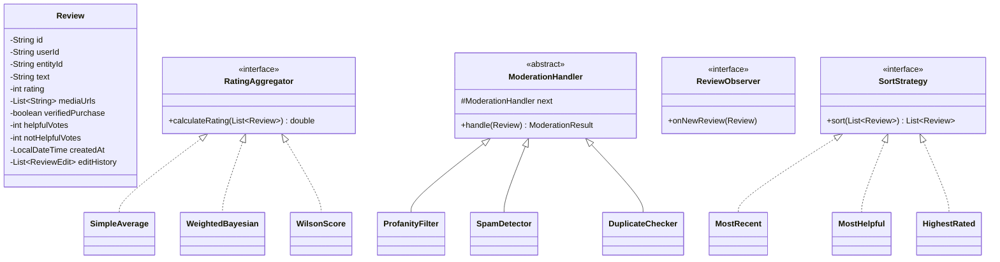

# Review & Rating System - Low Level Design

## 1. Problem Statement
Design a review and rating system supporting multi-entity reviews with rating aggregation strategies, moderation pipeline, helpful votes, and sorting — similar to Amazon/Yelp.

## 2. UML Class Diagram


## 3. Design Patterns
- **Strategy**: Rating aggregation (Simple, Bayesian, Wilson) and sorting
- **Observer**: Notify product owners on new reviews
- **Chain of Responsibility**: Moderation pipeline (profanity → spam → duplicate)

## 4. SOLID Principles
- **SRP**: Each class has single responsibility (Review stores data, Aggregator calculates)
- **OCP**: New aggregation/sort strategies without modifying existing code
- **LSP**: All strategies interchangeable via interface
- **ISP**: Separate interfaces for aggregation, sorting, observation
- **DIP**: ReviewService depends on abstractions not concrete strategies

## 5. Complete Java Implementation

```java
import java.util.*;
import java.time.LocalDateTime;
import java.util.stream.*;

// ==================== MODELS ====================
class Review {
    private String id, userId, entityId, text;
    private int rating; // 1-5
    private List<String> mediaUrls;
    private boolean verifiedPurchase;
    private int helpfulVotes, notHelpfulVotes;
    private LocalDateTime createdAt;
    private List<ReviewEdit> editHistory = new ArrayList<>();
    private boolean deleted;

    public Review(String id, String userId, String entityId, String text, int rating, boolean verifiedPurchase) {
        this.id = id; this.userId = userId; this.entityId = entityId;
        this.text = text; this.rating = Math.max(1, Math.min(5, rating));
        this.verifiedPurchase = verifiedPurchase;
        this.mediaUrls = new ArrayList<>();
        this.createdAt = LocalDateTime.now();
    }

    public void edit(String newText, int newRating) {
        editHistory.add(new ReviewEdit(text, rating, LocalDateTime.now()));
        this.text = newText;
        this.rating = Math.max(1, Math.min(5, newRating));
    }

    public void markDeleted() { this.deleted = true; }
    public void voteHelpful() { helpfulVotes++; }
    public void voteNotHelpful() { notHelpfulVotes++; }

    // Getters
    public String getId() { return id; }
    public String getUserId() { return userId; }
    public String getEntityId() { return entityId; }
    public String getText() { return text; }
    public int getRating() { return rating; }
    public boolean isVerifiedPurchase() { return verifiedPurchase; }
    public int getHelpfulVotes() { return helpfulVotes; }
    public int getNotHelpfulVotes() { return notHelpfulVotes; }
    public LocalDateTime getCreatedAt() { return createdAt; }
    public boolean isDeleted() { return deleted; }
    public List<ReviewEdit> getEditHistory() { return editHistory; }
}

class ReviewEdit {
    private String previousText;
    private int previousRating;
    private LocalDateTime editedAt;

    public ReviewEdit(String text, int rating, LocalDateTime editedAt) {
        this.previousText = text; this.previousRating = rating; this.editedAt = editedAt;
    }
}

class ReviewStatistics {
    private double averageRating;
    private int totalReviews;
    private Map<Integer, Integer> distribution; // star -> count

    public ReviewStatistics(List<Review> reviews) {
        this.totalReviews = reviews.size();
        this.distribution = new HashMap<>();
        for (int i = 1; i <= 5; i++) distribution.put(i, 0);
        for (Review r : reviews) distribution.merge(r.getRating(), 1, Integer::sum);
        this.averageRating = reviews.stream().mapToInt(Review::getRating).average().orElse(0);
    }

    public void display() {
        System.out.printf("%.1f / 5.0 (%d reviews)%n", averageRating, totalReviews);
        for (int i = 5; i >= 1; i--) {
            int count = distribution.get(i);
            int bar = totalReviews > 0 ? (count * 20 / totalReviews) : 0;
            System.out.printf("%d★ |%s| %d%n", i, "█".repeat(bar), count);
        }
    }
}

// ==================== STRATEGY: Rating Aggregation ====================
interface RatingAggregator {
    double calculate(List<Review> reviews);
}

class SimpleAverageAggregator implements RatingAggregator {
    public double calculate(List<Review> reviews) {
        return reviews.stream().mapToInt(Review::getRating).average().orElse(0);
    }
}

class BayesianWeightedAggregator implements RatingAggregator {
    private double globalMean; // C: mean across all products
    private int minVotes;      // m: minimum votes for confidence

    public BayesianWeightedAggregator(double globalMean, int minVotes) {
        this.globalMean = globalMean; this.minVotes = minVotes;
    }

    // Bayesian: (v/(v+m)) * R + (m/(v+m)) * C
    public double calculate(List<Review> reviews) {
        if (reviews.isEmpty()) return globalMean;
        double R = reviews.stream().mapToInt(Review::getRating).average().orElse(0);
        int v = reviews.size();
        return (v / (double)(v + minVotes)) * R + (minVotes / (double)(v + minVotes)) * globalMean;
    }
}

class WilsonScoreAggregator implements RatingAggregator {
    // Wilson score lower bound for binary (positive = 4-5 stars)
    public double calculate(List<Review> reviews) {
        if (reviews.isEmpty()) return 0;
        long positive = reviews.stream().filter(r -> r.getRating() >= 4).count();
        int n = reviews.size();
        double phat = (double) positive / n;
        double z = 1.96; // 95% confidence
        double denominator = 1 + z * z / n;
        double center = phat + z * z / (2 * n);
        double spread = z * Math.sqrt((phat * (1 - phat) + z * z / (4 * n)) / n);
        return (center - spread) / denominator; // lower bound [0,1] scale to 5
    }
}

// ==================== STRATEGY: Sorting ====================
interface SortStrategy {
    List<Review> sort(List<Review> reviews);
}

class MostRecentSort implements SortStrategy {
    public List<Review> sort(List<Review> reviews) {
        return reviews.stream().sorted(Comparator.comparing(Review::getCreatedAt).reversed())
                .collect(Collectors.toList());
    }
}

class MostHelpfulSort implements SortStrategy {
    public List<Review> sort(List<Review> reviews) {
        return reviews.stream().sorted(Comparator.comparingInt(Review::getHelpfulVotes).reversed())
                .collect(Collectors.toList());
    }
}

class HighestRatedSort implements SortStrategy {
    public List<Review> sort(List<Review> reviews) {
        return reviews.stream().sorted(Comparator.comparingInt(Review::getRating).reversed())
                .collect(Collectors.toList());
    }
}

class LowestRatedSort implements SortStrategy {
    public List<Review> sort(List<Review> reviews) {
        return reviews.stream().sorted(Comparator.comparingInt(Review::getRating))
                .collect(Collectors.toList());
    }
}

// ==================== CHAIN OF RESPONSIBILITY: Moderation ====================
enum ModerationStatus { APPROVED, REJECTED, NEEDS_REVIEW }

class ModerationResult {
    private ModerationStatus status;
    private String reason;

    public ModerationResult(ModerationStatus status, String reason) {
        this.status = status; this.reason = reason;
    }
    public ModerationStatus getStatus() { return status; }
    public String getReason() { return reason; }
}

abstract class ModerationHandler {
    protected ModerationHandler next;

    public ModerationHandler setNext(ModerationHandler next) {
        this.next = next; return next;
    }

    public ModerationResult handle(Review review) {
        ModerationResult result = doHandle(review);
        if (result.getStatus() == ModerationStatus.REJECTED) return result;
        if (next != null) return next.handle(review);
        return new ModerationResult(ModerationStatus.APPROVED, "Passed all checks");
    }

    protected abstract ModerationResult doHandle(Review review);
}

class ProfanityFilter extends ModerationHandler {
    private Set<String> bannedWords = Set.of("spam", "scam", "fake"); // simplified

    protected ModerationResult doHandle(Review review) {
        for (String word : bannedWords) {
            if (review.getText().toLowerCase().contains(word))
                return new ModerationResult(ModerationStatus.REJECTED, "Profanity detected: " + word);
        }
        return new ModerationResult(ModerationStatus.APPROVED, "No profanity");
    }
}

class SpamDetector extends ModerationHandler {
    protected ModerationResult doHandle(Review review) {
        if (review.getText().length() < 10)
            return new ModerationResult(ModerationStatus.REJECTED, "Review too short - likely spam");
        if (review.getText().chars().filter(c -> c == '!').count() > 10)
            return new ModerationResult(ModerationStatus.REJECTED, "Excessive punctuation - spam");
        return new ModerationResult(ModerationStatus.APPROVED, "Not spam");
    }
}

class DuplicateChecker extends ModerationHandler {
    private Set<String> existingTexts = new HashSet<>();

    public void addExisting(String text) { existingTexts.add(text.toLowerCase().trim()); }

    protected ModerationResult doHandle(Review review) {
        if (existingTexts.contains(review.getText().toLowerCase().trim()))
            return new ModerationResult(ModerationStatus.REJECTED, "Duplicate review");
        return new ModerationResult(ModerationStatus.APPROVED, "Not duplicate");
    }
}

// ==================== OBSERVER ====================
interface ReviewObserver {
    void onNewReview(Review review);
}

class ProductOwnerNotifier implements ReviewObserver {
    public void onNewReview(Review review) {
        System.out.println("[Notification] New " + review.getRating() + "★ review for entity: " + review.getEntityId());
    }
}

class AnalyticsTracker implements ReviewObserver {
    public void onNewReview(Review review) {
        System.out.println("[Analytics] Tracking review " + review.getId() + " verified=" + review.isVerifiedPurchase());
    }
}

// ==================== SERVICE ====================
class ReviewService {
    private Map<String, List<Review>> entityReviews = new HashMap<>();
    private List<ReviewObserver> observers = new ArrayList<>();
    private ModerationHandler moderationChain;
    private RatingAggregator aggregator;
    private SortStrategy sortStrategy;

    public ReviewService(RatingAggregator aggregator) {
        this.aggregator = aggregator;
        this.sortStrategy = new MostRecentSort();
        // Build moderation chain
        ProfanityFilter pf = new ProfanityFilter();
        SpamDetector sd = new SpamDetector();
        DuplicateChecker dc = new DuplicateChecker();
        pf.setNext(sd).setNext(dc);
        this.moderationChain = pf;
    }

    public void addObserver(ReviewObserver o) { observers.add(o); }
    public void setSortStrategy(SortStrategy s) { this.sortStrategy = s; }
    public void setAggregator(RatingAggregator a) { this.aggregator = a; }

    public ModerationResult submitReview(Review review) {
        ModerationResult result = moderationChain.handle(review);
        if (result.getStatus() == ModerationStatus.APPROVED) {
            entityReviews.computeIfAbsent(review.getEntityId(), k -> new ArrayList<>()).add(review);
            observers.forEach(o -> o.onNewReview(review));
        }
        return result;
    }

    public double getAggregatedRating(String entityId) {
        List<Review> reviews = getActiveReviews(entityId);
        return aggregator.calculate(reviews);
    }

    public List<Review> getReviews(String entityId) {
        return sortStrategy.sort(getActiveReviews(entityId));
    }

    public ReviewStatistics getStatistics(String entityId) {
        return new ReviewStatistics(getActiveReviews(entityId));
    }

    private List<Review> getActiveReviews(String entityId) {
        return entityReviews.getOrDefault(entityId, Collections.emptyList())
                .stream().filter(r -> !r.isDeleted()).collect(Collectors.toList());
    }
}

// ==================== DEMO ====================
class ReviewSystemDemo {
    public static void main(String[] args) {
        ReviewService service = new ReviewService(new BayesianWeightedAggregator(3.5, 10));
        service.addObserver(new ProductOwnerNotifier());
        service.addObserver(new AnalyticsTracker());

        // Submit reviews
        service.submitReview(new Review("r1", "u1", "product-1", "Excellent product, highly recommend!", 5, true));
        service.submitReview(new Review("r2", "u2", "product-1", "Good quality, fast delivery", 4, true));
        service.submitReview(new Review("r3", "u3", "product-1", "Average, nothing special about it", 3, false));
        service.submitReview(new Review("r4", "u4", "product-1", "Decent value for money overall", 4, true));

        // Rejected by moderation
        ModerationResult rejected = service.submitReview(new Review("r5", "u5", "product-1", "short", 1, false));
        System.out.println("Moderation: " + rejected.getStatus() + " - " + rejected.getReason());

        // Rating with different strategies
        System.out.println("\nBayesian Rating: " + String.format("%.2f", service.getAggregatedRating("product-1")));
        service.setAggregator(new SimpleAverageAggregator());
        System.out.println("Simple Average: " + String.format("%.2f", service.getAggregatedRating("product-1")));
        service.setAggregator(new WilsonScoreAggregator());
        System.out.println("Wilson Score: " + String.format("%.2f", service.getAggregatedRating("product-1")));

        // Statistics
        System.out.println("\n--- Rating Distribution ---");
        service.getStatistics("product-1").display();

        // Edit review
        Review r1 = service.getReviews("product-1").get(0);
        r1.edit("Updated: Still excellent after 3 months!", 5);
        System.out.println("\nEdit history size: " + r1.getEditHistory().size());

        // Vote helpful
        r1.voteHelpful(); r1.voteHelpful();
        service.setSortStrategy(new MostHelpfulSort());
        System.out.println("Most helpful first: " + service.getReviews("product-1").get(0).getId());
    }
}
```

## 6. Key Interview Points

| Topic | Key Insight |
|-------|-------------|
| **Simple Average** | Naive; easily manipulated by few extreme ratings |
| **Bayesian Average** | `(v/(v+m))*R + (m/(v+m))*C` — pulls toward global mean when few votes |
| **Wilson Score** | Lower bound of confidence interval; Reddit uses this for ranking |
| **Verified vs Unverified** | Weight verified purchases higher in aggregation |
| **Cold Start** | Bayesian handles new products by defaulting toward global mean |
| **Moderation** | Chain of Responsibility allows pluggable, ordered filters |
| **Edit History** | Audit trail preserves original review for dispute resolution |
| **Helpful Votes** | Wilson score on helpfulness votes ranks review quality |
| **Scale** | Denormalize aggregated ratings; recompute async on new review |
| **Fraud Detection** | Detect review bombing via velocity checks, IP clustering |
