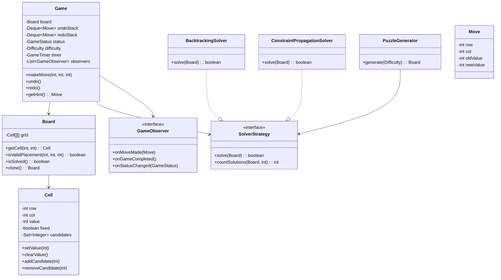

# Sudoku Solver & Game - LLD

## 1. Problem Statement
Design a Sudoku game system supporting puzzle generation, validation, multiple solving algorithms, hints, undo/redo, and timer functionality.

## 2. UML Class Diagram


## 3. Design Patterns
- **Strategy**: Interchangeable solving algorithms (Backtracking, Constraint Propagation, Dancing Links)
- **Template Method**: Abstract solver with common flow (find empty cell → try values → validate)
- **Observer**: Notify UI/listeners on moves, completion, status changes
- **Command**: Move objects for undo/redo
- **Memento**: Board state snapshots

## 4. SOLID Principles
- **SRP**: Cell manages its state, Board manages grid logic, Solver only solves
- **OCP**: New solvers added without modifying Game
- **LSP**: All SolverStrategy implementations are interchangeable
- **ISP**: Separate observer methods for different events
- **DIP**: Game depends on SolverStrategy interface, not concrete solvers

## 5. Complete Java Implementation

```java
// ===== Enums =====
public enum Difficulty {
    EASY(45), MEDIUM(35), HARD(28), EXPERT(22);
    private final int clues;
    Difficulty(int clues) { this.clues = clues; }
    public int getClues() { return clues; }
}

public enum GameStatus { NOT_STARTED, IN_PROGRESS, PAUSED, COMPLETED, FAILED }

// ===== Cell =====
public class Cell {
    private final int row, col;
    private int value;
    private boolean fixed;
    private Set<Integer> candidates;

    public Cell(int row, int col) {
        this.row = row;
        this.col = col;
        this.value = 0;
        this.fixed = false;
        this.candidates = new HashSet<>(Arrays.asList(1,2,3,4,5,6,7,8,9));
    }

    public Cell(Cell other) {
        this.row = other.row; this.col = other.col;
        this.value = other.value; this.fixed = other.fixed;
        this.candidates = new HashSet<>(other.candidates);
    }

    public void setValue(int val) {
        if (fixed) throw new IllegalStateException("Cannot modify fixed cell");
        this.value = val;
        if (val != 0) candidates.clear();
    }

    public void clearValue() { setValue(0); resetCandidates(); }
    public void removeCandidate(int val) { candidates.remove(val); }
    public boolean isEmpty() { return value == 0; }
    public int getRow() { return row; }
    public int getCol() { return col; }
    public int getValue() { return value; }
    public boolean isFixed() { return fixed; }
    public void setFixed(boolean f) { this.fixed = f; }
    public Set<Integer> getCandidates() { return candidates; }
    public void resetCandidates() { candidates = new HashSet<>(Arrays.asList(1,2,3,4,5,6,7,8,9)); }
}

// ===== Board =====
public class Board {
    private final Cell[][] grid = new Cell[9][9];

    public Board() {
        for (int r = 0; r < 9; r++)
            for (int c = 0; c < 9; c++)
                grid[r][c] = new Cell(r, c);
    }

    public Board(Board other) {
        for (int r = 0; r < 9; r++)
            for (int c = 0; c < 9; c++)
                grid[r][c] = new Cell(other.grid[r][c]);
    }

    public Cell getCell(int r, int c) { return grid[r][c]; }

    public boolean isValidPlacement(int row, int col, int val) {
        // Check row
        for (int c = 0; c < 9; c++)
            if (c != col && grid[row][c].getValue() == val) return false;
        // Check column
        for (int r = 0; r < 9; r++)
            if (r != row && grid[r][col].getValue() == val) return false;
        // Check 3x3 box
        int boxR = (row / 3) * 3, boxC = (col / 3) * 3;
        for (int r = boxR; r < boxR + 3; r++)
            for (int c = boxC; c < boxC + 3; c++)
                if ((r != row || c != col) && grid[r][c].getValue() == val) return false;
        return true;
    }

    public boolean isValid() {
        for (int r = 0; r < 9; r++)
            for (int c = 0; c < 9; c++)
                if (grid[r][c].getValue() != 0 &&
                    !isValidPlacement(r, c, grid[r][c].getValue())) return false;
        return true;
    }

    public boolean isSolved() {
        for (int r = 0; r < 9; r++)
            for (int c = 0; c < 9; c++)
                if (grid[r][c].isEmpty()) return false;
        return isValid();
    }

    public int[] findEmptyCell() {
        for (int r = 0; r < 9; r++)
            for (int c = 0; c < 9; c++)
                if (grid[r][c].isEmpty()) return new int[]{r, c};
        return null;
    }
}

// ===== Move (Command) =====
public class Move {
    private final int row, col, oldValue, newValue;
    public Move(int row, int col, int oldValue, int newValue) {
        this.row = row; this.col = col;
        this.oldValue = oldValue; this.newValue = newValue;
    }
    public int getRow() { return row; }
    public int getCol() { return col; }
    public int getOldValue() { return oldValue; }
    public int getNewValue() { return newValue; }
}

// ===== Solver Strategy Interface =====
public interface SolverStrategy {
    boolean solve(Board board);
    int countSolutions(Board board, int limit);
}

// ===== Backtracking Solver =====
public class BacktrackingSolver implements SolverStrategy {
    @Override
    public boolean solve(Board board) {
        int[] empty = board.findEmptyCell();
        if (empty == null) return true; // solved
        int row = empty[0], col = empty[1];
        for (int val = 1; val <= 9; val++) {
            if (board.isValidPlacement(row, col, val)) {
                board.getCell(row, col).setValue(val);
                if (solve(board)) return true;
                board.getCell(row, col).setValue(0);
            }
        }
        return false;
    }

    @Override
    public int countSolutions(Board board, int limit) {
        int[] empty = board.findEmptyCell();
        if (empty == null) return 1;
        int row = empty[0], col = empty[1], count = 0;
        for (int val = 1; val <= 9; val++) {
            if (board.isValidPlacement(row, col, val)) {
                board.getCell(row, col).setValue(val);
                count += countSolutions(board, limit - count);
                board.getCell(row, col).setValue(0);
                if (count >= limit) return count;
            }
        }
        return count;
    }
}

// ===== Constraint Propagation Solver =====
public class ConstraintPropagationSolver implements SolverStrategy {
    @Override
    public boolean solve(Board board) {
        if (!propagate(board)) return false;
        int[] empty = board.findEmptyCell();
        if (empty == null) return true;
        // Find cell with fewest candidates (MRV heuristic)
        int minCand = 10, bestR = -1, bestC = -1;
        for (int r = 0; r < 9; r++)
            for (int c = 0; c < 9; c++)
                if (board.getCell(r, c).isEmpty() &&
                    board.getCell(r, c).getCandidates().size() < minCand) {
                    minCand = board.getCell(r, c).getCandidates().size();
                    bestR = r; bestC = c;
                }
        if (minCand == 0) return false;
        for (int val : new ArrayList<>(board.getCell(bestR, bestC).getCandidates())) {
            Board copy = new Board(board);
            copy.getCell(bestR, bestC).setValue(val);
            if (solve(copy)) {
                copyState(copy, board); return true;
            }
        }
        return false;
    }

    private boolean propagate(Board board) {
        boolean changed = true;
        while (changed) {
            changed = false;
            for (int r = 0; r < 9; r++)
                for (int c = 0; c < 9; c++) {
                    Cell cell = board.getCell(r, c);
                    if (!cell.isEmpty()) continue;
                    eliminateCandidates(board, cell);
                    // Naked single
                    if (cell.getCandidates().size() == 1) {
                        int val = cell.getCandidates().iterator().next();
                        if (!board.isValidPlacement(r, c, val)) return false;
                        cell.setValue(val); changed = true;
                    } else if (cell.getCandidates().isEmpty()) return false;
                }
        }
        return true;
    }

    private void eliminateCandidates(Board board, Cell cell) {
        int r = cell.getRow(), c = cell.getCol();
        for (int i = 0; i < 9; i++) {
            if (board.getCell(r, i).getValue() != 0) cell.removeCandidate(board.getCell(r, i).getValue());
            if (board.getCell(i, c).getValue() != 0) cell.removeCandidate(board.getCell(i, c).getValue());
        }
        int boxR = (r/3)*3, boxC = (c/3)*3;
        for (int br = boxR; br < boxR+3; br++)
            for (int bc = boxC; bc < boxC+3; bc++)
                if (board.getCell(br, bc).getValue() != 0)
                    cell.removeCandidate(board.getCell(br, bc).getValue());
    }

    private void copyState(Board src, Board dst) {
        for (int r = 0; r < 9; r++)
            for (int c = 0; c < 9; c++)
                dst.getCell(r, c).setValue(src.getCell(r, c).getValue());
    }

    @Override
    public int countSolutions(Board board, int limit) {
        return new BacktrackingSolver().countSolutions(board, limit);
    }
}

// ===== Dancing Links (Concept) =====
// Algorithm X with DLX represents Sudoku as exact cover problem:
// - 729 rows (9 values × 81 cells)
// - 324 columns: 81 cell constraints + 81 row constraints + 81 col constraints + 81 box constraints
// Each row covers exactly 4 columns. DLX efficiently backtracks via doubly-linked circular lists.

// ===== Puzzle Generator =====
public class PuzzleGenerator {
    private final SolverStrategy solver = new BacktrackingSolver();
    private final Random random = new Random();

    public Board generate(Difficulty difficulty) {
        Board board = generateFullBoard();
        removeClues(board, 81 - difficulty.getClues());
        return board;
    }

    private Board generateFullBoard() {
        Board board = new Board();
        // Fill diagonal boxes first (independent)
        for (int box = 0; box < 9; box += 3) fillBox(board, box, box);
        solver.solve(board);
        return board;
    }

    private void fillBox(Board board, int rowStart, int colStart) {
        List<Integer> nums = new ArrayList<>(Arrays.asList(1,2,3,4,5,6,7,8,9));
        Collections.shuffle(nums, random);
        int idx = 0;
        for (int r = rowStart; r < rowStart+3; r++)
            for (int c = colStart; c < colStart+3; c++)
                board.getCell(r, c).setValue(nums.get(idx++));
    }

    private void removeClues(Board board, int toRemove) {
        List<int[]> cells = new ArrayList<>();
        for (int r = 0; r < 9; r++)
            for (int c = 0; c < 9; c++) cells.add(new int[]{r, c});
        Collections.shuffle(cells, random);

        int removed = 0;
        for (int[] pos : cells) {
            if (removed >= toRemove) break;
            int val = board.getCell(pos[0], pos[1]).getValue();
            board.getCell(pos[0], pos[1]).setValue(0);
            Board copy = new Board(board);
            if (solver.countSolutions(copy, 2) != 1) {
                board.getCell(pos[0], pos[1]).setValue(val); // restore
            } else {
                removed++;
            }
        }
        // Mark remaining cells as fixed
        for (int r = 0; r < 9; r++)
            for (int c = 0; c < 9; c++)
                if (board.getCell(r, c).getValue() != 0)
                    board.getCell(r, c).setFixed(true);
    }
}

// ===== Observer =====
public interface GameObserver {
    void onMoveMade(Move move);
    void onGameCompleted();
    void onStatusChanged(GameStatus status);
}

// ===== Timer =====
public class GameTimer {
    private long startTime, elapsed, pausedAt;
    private boolean running;

    public void start() { startTime = System.currentTimeMillis(); running = true; }
    public void pause() { pausedAt = getElapsed(); running = false; }
    public void resume() { startTime = System.currentTimeMillis() - pausedAt; running = true; }
    public long getElapsed() {
        return running ? (System.currentTimeMillis() - startTime) : pausedAt;
    }
}

// ===== Game =====
public class Game {
    private Board board;
    private Board solution;
    private final Deque<Move> undoStack = new ArrayDeque<>();
    private final Deque<Move> redoStack = new ArrayDeque<>();
    private GameStatus status = GameStatus.NOT_STARTED;
    private final Difficulty difficulty;
    private final GameTimer timer = new GameTimer();
    private final List<GameObserver> observers = new ArrayList<>();
    private final SolverStrategy solver;

    public Game(Difficulty difficulty) {
        this.difficulty = difficulty;
        this.solver = new ConstraintPropagationSolver();
        PuzzleGenerator gen = new PuzzleGenerator();
        this.board = gen.generate(difficulty);
        this.solution = new Board(board);
        new BacktrackingSolver().solve(solution);
    }

    public void start() {
        status = GameStatus.IN_PROGRESS;
        timer.start();
        notifyStatusChanged();
    }

    public void makeMove(int row, int col, int value) {
        if (status != GameStatus.IN_PROGRESS) throw new IllegalStateException("Game not active");
        Cell cell = board.getCell(row, col);
        if (cell.isFixed()) throw new IllegalArgumentException("Cannot modify fixed cell");
        Move move = new Move(row, col, cell.getValue(), value);
        cell.setValue(value);
        undoStack.push(move);
        redoStack.clear();
        notifyMoveMade(move);
        if (board.isSolved()) { status = GameStatus.COMPLETED; timer.pause(); notifyCompleted(); }
    }

    public void undo() {
        if (undoStack.isEmpty()) return;
        Move move = undoStack.pop();
        board.getCell(move.getRow(), move.getCol()).setValue(move.getOldValue());
        redoStack.push(move);
    }

    public void redo() {
        if (redoStack.isEmpty()) return;
        Move move = redoStack.pop();
        board.getCell(move.getRow(), move.getCol()).setValue(move.getNewValue());
        undoStack.push(move);
    }

    public Move getHint() {
        for (int r = 0; r < 9; r++)
            for (int c = 0; c < 9; c++)
                if (board.getCell(r, c).isEmpty())
                    return new Move(r, c, 0, solution.getCell(r, c).getValue());
        return null;
    }

    public boolean isCurrentStateValid() { return board.isValid(); }

    public boolean isSolvable() {
        Board copy = new Board(board);
        return solver.solve(copy);
    }

    public void addObserver(GameObserver o) { observers.add(o); }

    private void notifyMoveMade(Move m) { observers.forEach(o -> o.onMoveMade(m)); }
    private void notifyCompleted() { observers.forEach(GameObserver::onGameCompleted); }
    private void notifyStatusChanged() { observers.forEach(o -> o.onStatusChanged(status)); }
}
```

## 6. Backtracking Algorithm with Pruning

```
solve(board):
    cell = findEmptyWithFewestCandidates()  // MRV heuristic
    if cell == null: return true             // all filled
    for val in cell.candidates:             // only valid candidates, not 1-9
        if isValidPlacement(cell, val):
            cell.value = val
            propagateConstraints()          // reduce neighbors' candidates
            if solve(board): return true
            undoConstraints()
            cell.value = 0
    return false                            // backtrack
```

**Pruning techniques**: MRV (Minimum Remaining Values), constraint propagation, forward checking, arc consistency.

## 7. Key Interview Points

| Topic | Point |
|-------|-------|
| Time Complexity | O(9^m) worst case where m = empty cells; with pruning much better |
| Space Complexity | O(81) for board + O(m) recursion stack |
| Unique Solution | Generator ensures exactly 1 solution via countSolutions check |
| DLX Advantage | O(1) cover/uncover operations vs O(n) for naive backtracking |
| Thread Safety | Timer runs separately; board operations should be synchronized for multiplayer |
| Immutability | Fixed cells enforced at Cell level |
| Extensibility | New solver = implement SolverStrategy, plug in via DI |
