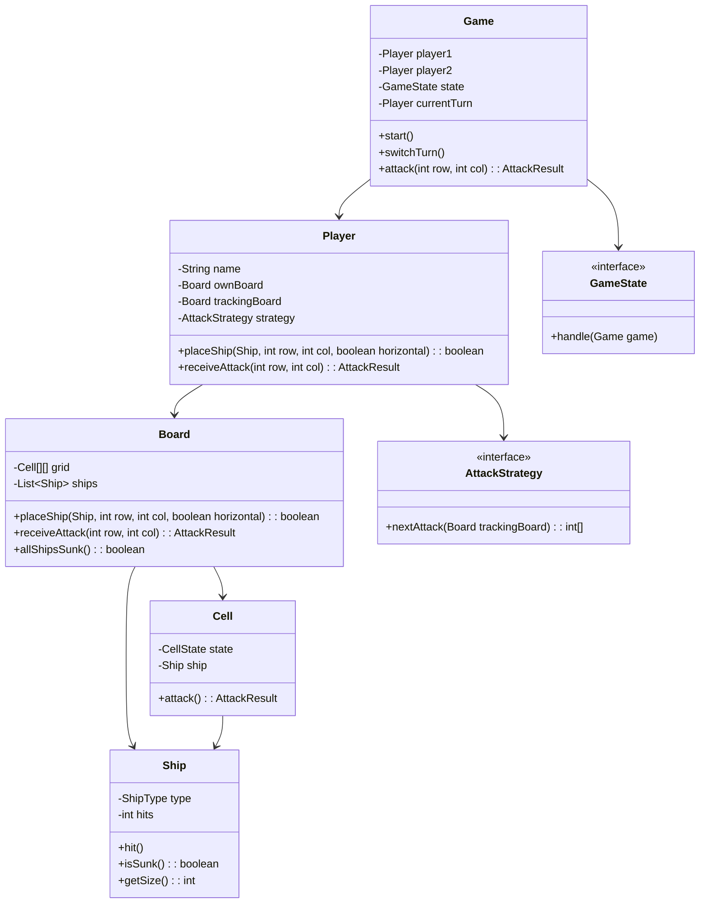

# Battleship Game - Low Level Design

## 1. Problem Statement
Design a Battleship game where two players place ships on a 10x10 grid and take turns attacking each other's boards. Support human vs AI with multiple AI strategies, ship placement validation, hit/miss tracking, ship sinking detection, and win conditions.

## 2. UML Class Diagram


## 3. Design Patterns
- **Strategy**: AI attack algorithms (Random, HuntAndTarget, ProbabilityBased)
- **State**: Game phases (Placement, Battle, GameOver)
- **Observer**: Notify UI/listeners on attacks, sinks, game over
- **Factory**: Create ships by type

## 4. SOLID Principles
- **SRP**: Board handles grid logic, Ship tracks damage, Game manages flow
- **OCP**: New AI strategies without modifying existing code
- **LSP**: All AttackStrategy implementations are interchangeable
- **ISP**: Separate interfaces for attack strategy vs game state
- **DIP**: Game depends on abstractions (GameState, AttackStrategy)

## 5. Complete Java Implementation

```java
// === Enums ===
enum CellState { EMPTY, SHIP, HIT, MISS }

enum ShipType {
    CARRIER(5), BATTLESHIP(4), CRUISER(3), SUBMARINE(3), DESTROYER(2);
    private final int size;
    ShipType(int size) { this.size = size; }
    public int getSize() { return size; }
}

enum GamePhase { PLACEMENT, BATTLE, GAME_OVER }

// === Models ===
class Ship {
    private final ShipType type;
    private int hits;

    public Ship(ShipType type) { this.type = type; this.hits = 0; }
    public void hit() { hits++; }
    public boolean isSunk() { return hits >= type.getSize(); }
    public int getSize() { return type.getSize(); }
    public ShipType getType() { return type; }
}

class Cell {
    private CellState state = CellState.EMPTY;
    private Ship ship;

    public CellState getState() { return state; }
    public void setShip(Ship ship) { this.ship = ship; this.state = CellState.SHIP; }

    public AttackResult attack() {
        if (state == CellState.HIT || state == CellState.MISS) return AttackResult.INVALID;
        if (ship != null) {
            state = CellState.HIT;
            ship.hit();
            return ship.isSunk() ? AttackResult.SUNK : AttackResult.HIT;
        }
        state = CellState.MISS;
        return AttackResult.MISS;
    }
}

enum AttackResult { HIT, MISS, SUNK, INVALID }

class Board {
    private static final int SIZE = 10;
    private final Cell[][] grid = new Cell[SIZE][SIZE];
    private final List<Ship> ships = new ArrayList<>();

    public Board() {
        for (int i = 0; i < SIZE; i++)
            for (int j = 0; j < SIZE; j++)
                grid[i][j] = new Cell();
    }

    public boolean placeShip(Ship ship, int row, int col, boolean horizontal) {
        if (!canPlace(ship, row, col, horizontal)) return false;
        for (int i = 0; i < ship.getSize(); i++) {
            int r = horizontal ? row : row + i;
            int c = horizontal ? col + i : col;
            grid[r][c].setShip(ship);
        }
        ships.add(ship);
        return true;
    }

    private boolean canPlace(Ship ship, int row, int col, boolean horizontal) {
        for (int i = 0; i < ship.getSize(); i++) {
            int r = horizontal ? row : row + i;
            int c = horizontal ? col + i : col;
            if (r >= SIZE || c >= SIZE) return false;
            if (grid[r][c].getState() != CellState.EMPTY) return false;
        }
        return true;
    }

    public AttackResult receiveAttack(int row, int col) {
        if (row < 0 || row >= SIZE || col < 0 || col >= SIZE) return AttackResult.INVALID;
        return grid[row][col].attack();
    }

    public boolean allShipsSunk() {
        return !ships.isEmpty() && ships.stream().allMatch(Ship::isSunk);
    }

    public Cell getCell(int row, int col) { return grid[row][col]; }
    public int getSize() { return SIZE; }
}

// === Strategy Pattern: AI Attack Strategies ===
interface AttackStrategy {
    int[] nextAttack(Board trackingBoard);
}

class RandomShotStrategy implements AttackStrategy {
    private final Random random = new Random();

    @Override
    public int[] nextAttack(Board trackingBoard) {
        int row, col;
        do {
            row = random.nextInt(trackingBoard.getSize());
            col = random.nextInt(trackingBoard.getSize());
        } while (trackingBoard.getCell(row, col).getState() == CellState.HIT
                || trackingBoard.getCell(row, col).getState() == CellState.MISS);
        return new int[]{row, col};
    }
}

class HuntAndTargetStrategy implements AttackStrategy {
    private final Queue<int[]> targets = new LinkedList<>();
    private final Random random = new Random();

    @Override
    public int[] nextAttack(Board trackingBoard) {
        while (!targets.isEmpty()) {
            int[] target = targets.poll();
            CellState s = trackingBoard.getCell(target[0], target[1]).getState();
            if (s != CellState.HIT && s != CellState.MISS) return target;
        }
        // Hunt mode: random shot
        int row, col;
        do {
            row = random.nextInt(10);
            col = random.nextInt(10);
        } while (trackingBoard.getCell(row, col).getState() == CellState.HIT
                || trackingBoard.getCell(row, col).getState() == CellState.MISS);
        return new int[]{row, col};
    }

    public void addAdjacentTargets(int row, int col) {
        int[][] dirs = {{-1,0},{1,0},{0,-1},{0,1}};
        for (int[] d : dirs) {
            int r = row + d[0], c = col + d[1];
            if (r >= 0 && r < 10 && c >= 0 && c < 10) targets.add(new int[]{r, c});
        }
    }
}

class ProbabilityBasedStrategy implements AttackStrategy {
    @Override
    public int[] nextAttack(Board trackingBoard) {
        int[][] probability = new int[10][10];
        // Calculate probability for each remaining ship fitting at each cell
        for (ShipType type : ShipType.values()) {
            for (int r = 0; r < 10; r++) {
                for (int c = 0; c < 10; c++) {
                    if (canFit(trackingBoard, r, c, type.getSize(), true)) increment(probability, r, c, type.getSize(), true);
                    if (canFit(trackingBoard, r, c, type.getSize(), false)) increment(probability, r, c, type.getSize(), false);
                }
            }
        }
        int maxProb = -1, bestR = 0, bestC = 0;
        for (int r = 0; r < 10; r++)
            for (int c = 0; c < 10; c++)
                if (probability[r][c] > maxProb && trackingBoard.getCell(r, c).getState() == CellState.EMPTY) {
                    maxProb = probability[r][c]; bestR = r; bestC = c;
                }
        return new int[]{bestR, bestC};
    }

    private boolean canFit(Board board, int r, int c, int size, boolean horiz) {
        for (int i = 0; i < size; i++) {
            int row = horiz ? r : r + i, col = horiz ? c + i : c;
            if (row >= 10 || col >= 10) return false;
            CellState s = board.getCell(row, col).getState();
            if (s == CellState.HIT || s == CellState.MISS) return false;
        }
        return true;
    }

    private void increment(int[][] prob, int r, int c, int size, boolean horiz) {
        for (int i = 0; i < size; i++) prob[horiz ? r : r+i][horiz ? c+i : c]++;
    }
}

// === State Pattern ===
interface GameState {
    void handle(Game game);
}

class PlacementState implements GameState {
    @Override
    public void handle(Game game) {
        // Validate both players have placed all ships
        if (game.bothPlayersReady()) game.setState(new BattleState());
    }
}

class BattleState implements GameState {
    @Override
    public void handle(Game game) {
        if (game.getCurrentOpponent().getBoard().allShipsSunk()) {
            game.setState(new GameOverState());
        }
    }
}

class GameOverState implements GameState {
    @Override
    public void handle(Game game) {
        game.notifyGameOver(game.getCurrentPlayer());
    }
}

// === Observer Pattern ===
interface GameObserver {
    void onAttack(int row, int col, AttackResult result);
    void onShipSunk(ShipType type);
    void onGameOver(Player winner);
}

// === Player ===
class Player {
    private final String name;
    private final Board ownBoard = new Board();
    private final Board trackingBoard = new Board();
    private AttackStrategy strategy;

    public Player(String name, AttackStrategy strategy) {
        this.name = name;
        this.strategy = strategy;
    }

    public boolean placeShip(ShipType type, int row, int col, boolean horizontal) {
        return ownBoard.placeShip(new Ship(type), row, col, horizontal);
    }

    public AttackResult receiveAttack(int row, int col) { return ownBoard.receiveAttack(row, col); }
    public int[] getNextAttack() { return strategy.nextAttack(trackingBoard); }
    public Board getBoard() { return ownBoard; }
    public Board getTrackingBoard() { return trackingBoard; }
    public String getName() { return name; }
}

// === Factory ===
class ShipFactory {
    public static Ship create(ShipType type) { return new Ship(type); }
    public static List<Ship> createFleet() {
        return Arrays.stream(ShipType.values()).map(Ship::new).collect(Collectors.toList());
    }
}

// === Game ===
class Game {
    private Player player1, player2;
    private Player currentTurn;
    private GameState state;
    private final List<GameObserver> observers = new ArrayList<>();

    public Game(Player p1, Player p2) {
        this.player1 = p1; this.player2 = p2;
        this.currentTurn = p1;
        this.state = new PlacementState();
    }

    public AttackResult attack(int row, int col) {
        Player opponent = getCurrentOpponent();
        AttackResult result = opponent.receiveAttack(row, col);
        if (result != AttackResult.INVALID) {
            // Update tracking board
            CellState trackState = (result == AttackResult.MISS) ? CellState.MISS : CellState.HIT;
            currentTurn.getTrackingBoard().getCell(row, col);  // track
            observers.forEach(o -> o.onAttack(row, col, result));
            if (result == AttackResult.SUNK) observers.forEach(o -> o.onShipSunk(null));
            state.handle(this);
            if (!(state instanceof GameOverState)) switchTurn();
        }
        return result;
    }

    public void switchTurn() { currentTurn = (currentTurn == player1) ? player2 : player1; }
    public Player getCurrentPlayer() { return currentTurn; }
    public Player getCurrentOpponent() { return currentTurn == player1 ? player2 : player1; }
    public void setState(GameState state) { this.state = state; }
    public boolean bothPlayersReady() { return true; /* validate ship count */ }
    public void addObserver(GameObserver o) { observers.add(o); }
    public void notifyGameOver(Player winner) { observers.forEach(o -> o.onGameOver(winner)); }
}
```

## 6. Key Interview Points

| Topic | Key Insight |
|-------|------------|
| **Strategy Pattern** | AI difficulty scales by swapping strategy—no game logic changes |
| **State Pattern** | Clean phase transitions; each state validates its own preconditions |
| **Ship Sinking** | Ship tracks its own hits vs size—O(1) sunk check |
| **Validation** | Bounds + overlap check before placement; immutable after battle starts |
| **Probability AI** | Counts how many unsunk ships could fit through each cell |
| **Hunt & Target** | Switches from random to adjacent-cell targeting after a hit |
| **Observer** | Decouples UI updates from game logic |
| **Scalability** | Board size, ship types, and rules are configurable without core changes |
| **Thread Safety** | For multiplayer: synchronize attack() or use turn-based lock |
