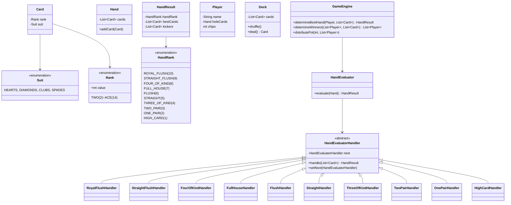

# Poker Hand Evaluator - Low Level Design

## 1. Problem Statement
Design a Poker Hand Evaluator that can evaluate hand rankings, compare hands with kicker resolution, find the best 5-card hand from 7 cards (Texas Hold'em), and distribute pots among winners.

## 2. UML Class Diagram


## 3. Design Patterns
- **Chain of Responsibility**: Each handler checks one hand type, passes to next if not matched
- **Strategy**: Different evaluation strategies (5-card, 7-card Texas Hold'em)
- **Factory**: Build the chain of handlers in correct priority order

## 4. SOLID Principles
- **SRP**: Each handler evaluates exactly one hand type
- **OCP**: New hand types added by inserting new handler in chain
- **LSP**: All handlers substitutable via abstract base
- **ISP**: HandEvaluator exposes only `evaluate()`
- **DIP**: GameEngine depends on HandEvaluator abstraction

## 5. Complete Java Implementation

```java
// === Enums ===
public enum Suit { HEARTS, DIAMONDS, CLUBS, SPADES }

public enum Rank {
    TWO(2), THREE(3), FOUR(4), FIVE(5), SIX(6), SEVEN(7), EIGHT(8),
    NINE(9), TEN(10), JACK(11), QUEEN(12), KING(13), ACE(14);
    private final int value;
    Rank(int value) { this.value = value; }
    public int getValue() { return value; }
}

public enum HandRank {
    HIGH_CARD(1), ONE_PAIR(2), TWO_PAIR(3), THREE_OF_KIND(4),
    STRAIGHT(5), FLUSH(6), FULL_HOUSE(7), FOUR_OF_KIND(8),
    STRAIGHT_FLUSH(9), ROYAL_FLUSH(10);
    private final int rank;
    HandRank(int rank) { this.rank = rank; }
    public int getRank() { return rank; }
}

// === Models ===
public class Card implements Comparable<Card> {
    private final Rank rank;
    private final Suit suit;
    public Card(Rank rank, Suit suit) { this.rank = rank; this.suit = suit; }
    public Rank getRank() { return rank; }
    public Suit getSuit() { return suit; }
    @Override
    public int compareTo(Card o) { return Integer.compare(o.rank.getValue(), this.rank.getValue()); }
}

public class Hand {
    private final List<Card> cards = new ArrayList<>();
    public void addCard(Card card) { cards.add(card); }
    public List<Card> getCards() { return Collections.unmodifiableList(cards); }
}

public class Deck {
    private final List<Card> cards = new ArrayList<>();
    public Deck() {
        for (Suit s : Suit.values())
            for (Rank r : Rank.values())
                cards.add(new Card(r, s));
    }
    public void shuffle() { Collections.shuffle(cards); }
    public Card deal() { return cards.remove(cards.size() - 1); }
}

public class Player {
    private final String name;
    private final Hand holeCards = new Hand();
    private int chips;
    public Player(String name, int chips) { this.name = name; this.chips = chips; }
    public String getName() { return name; }
    public Hand getHoleCards() { return holeCards; }
    public int getChips() { return chips; }
    public void addChips(int amount) { this.chips += amount; }
}

// === Hand Result ===
public class HandResult implements Comparable<HandResult> {
    private final HandRank handRank;
    private final List<Card> bestCards;  // cards forming the hand
    private final List<Card> kickers;    // remaining for tiebreak

    public HandResult(HandRank handRank, List<Card> bestCards, List<Card> kickers) {
        this.handRank = handRank;
        this.bestCards = bestCards;
        this.kickers = kickers;
    }
    public HandRank getHandRank() { return handRank; }
    public List<Card> getKickers() { return kickers; }

    @Override
    public int compareTo(HandResult other) {
        int cmp = Integer.compare(this.handRank.getRank(), other.handRank.getRank());
        if (cmp != 0) return cmp;
        // Compare best cards by rank
        for (int i = 0; i < bestCards.size() && i < other.bestCards.size(); i++) {
            cmp = Integer.compare(bestCards.get(i).getRank().getValue(),
                                  other.bestCards.get(i).getRank().getValue());
            if (cmp != 0) return cmp;
        }
        // Compare kickers
        for (int i = 0; i < kickers.size() && i < other.kickers.size(); i++) {
            cmp = Integer.compare(kickers.get(i).getRank().getValue(),
                                  other.kickers.get(i).getRank().getValue());
            if (cmp != 0) return cmp;
        }
        return 0; // tie
    }
}

// === Chain of Responsibility ===
public abstract class HandEvaluatorHandler {
    protected HandEvaluatorHandler next;
    public void setNext(HandEvaluatorHandler next) { this.next = next; }
    public HandResult handle(List<Card> cards) {
        HandResult result = evaluate(cards);
        if (result != null) return result;
        if (next != null) return next.handle(cards);
        return null;
    }
    protected abstract HandResult evaluate(List<Card> cards);

    // Utility methods
    protected Map<Rank, List<Card>> groupByRank(List<Card> cards) {
        return cards.stream().collect(Collectors.groupingBy(Card::getRank));
    }
    protected Map<Suit, List<Card>> groupBySuit(List<Card> cards) {
        return cards.stream().collect(Collectors.groupingBy(Card::getSuit));
    }
    protected List<Card> findStraight(List<Card> sorted) {
        List<Card> deduped = new ArrayList<>();
        for (Card c : sorted)
            if (deduped.isEmpty() || deduped.get(deduped.size()-1).getRank() != c.getRank())
                deduped.add(c);
        // Ace-low straight
        if (deduped.get(0).getRank() == Rank.ACE && deduped.get(deduped.size()-1).getRank() == Rank.TWO) {
            deduped.add(deduped.get(0)); // ace at end for low
        }
        for (int i = 0; i <= deduped.size() - 5; i++) {
            boolean isStraight = true;
            for (int j = 0; j < 4; j++) {
                int curr = deduped.get(i+j).getRank().getValue();
                int next = deduped.get(i+j+1).getRank().getValue();
                if (curr - next != 1 && !(curr == 14 && next == 2 && j == 3)) { // ace-low
                    isStraight = false; break;
                }
            }
            if (isStraight) return deduped.subList(i, i + 5);
        }
        return null;
    }
}

public class RoyalFlushHandler extends HandEvaluatorHandler {
    protected HandResult evaluate(List<Card> cards) {
        for (Map.Entry<Suit, List<Card>> e : groupBySuit(cards).entrySet()) {
            if (e.getValue().size() >= 5) {
                List<Card> suited = e.getValue().stream().sorted().collect(Collectors.toList());
                List<Card> straight = findStraight(suited);
                if (straight != null && straight.get(0).getRank() == Rank.ACE
                        && straight.get(4).getRank() == Rank.TEN) {
                    return new HandResult(HandRank.ROYAL_FLUSH, straight, List.of());
                }
            }
        }
        return null;
    }
}

public class StraightFlushHandler extends HandEvaluatorHandler {
    protected HandResult evaluate(List<Card> cards) {
        for (Map.Entry<Suit, List<Card>> e : groupBySuit(cards).entrySet()) {
            if (e.getValue().size() >= 5) {
                List<Card> suited = e.getValue().stream().sorted().collect(Collectors.toList());
                List<Card> straight = findStraight(suited);
                if (straight != null) return new HandResult(HandRank.STRAIGHT_FLUSH, straight, List.of());
            }
        }
        return null;
    }
}

public class FourOfKindHandler extends HandEvaluatorHandler {
    protected HandResult evaluate(List<Card> cards) {
        for (Map.Entry<Rank, List<Card>> e : groupByRank(cards).entrySet()) {
            if (e.getValue().size() == 4) {
                List<Card> kickers = cards.stream().filter(c -> c.getRank() != e.getKey())
                    .sorted().limit(1).collect(Collectors.toList());
                return new HandResult(HandRank.FOUR_OF_KIND, e.getValue(), kickers);
            }
        }
        return null;
    }
}

public class FullHouseHandler extends HandEvaluatorHandler {
    protected HandResult evaluate(List<Card> cards) {
        Map<Rank, List<Card>> groups = groupByRank(cards);
        List<Map.Entry<Rank, List<Card>>> trips = groups.entrySet().stream()
            .filter(e -> e.getValue().size() >= 3)
            .sorted((a,b) -> Integer.compare(b.getKey().getValue(), a.getKey().getValue()))
            .collect(Collectors.toList());
        if (trips.isEmpty()) return null;
        Rank tripRank = trips.get(0).getKey();
        Optional<Rank> pairRank = groups.entrySet().stream()
            .filter(e -> e.getKey() != tripRank && e.getValue().size() >= 2)
            .map(e -> e.getKey()).max(Comparator.comparingInt(Rank::getValue));
        if (pairRank.isPresent()) {
            List<Card> best = new ArrayList<>(groups.get(tripRank).subList(0, 3));
            best.addAll(groups.get(pairRank.get()).subList(0, 2));
            return new HandResult(HandRank.FULL_HOUSE, best, List.of());
        }
        return null;
    }
}

public class FlushHandler extends HandEvaluatorHandler {
    protected HandResult evaluate(List<Card> cards) {
        for (Map.Entry<Suit, List<Card>> e : groupBySuit(cards).entrySet()) {
            if (e.getValue().size() >= 5) {
                List<Card> best = e.getValue().stream().sorted().limit(5).collect(Collectors.toList());
                return new HandResult(HandRank.FLUSH, best, List.of());
            }
        }
        return null;
    }
}

public class StraightHandler extends HandEvaluatorHandler {
    protected HandResult evaluate(List<Card> cards) {
        List<Card> sorted = cards.stream().sorted().collect(Collectors.toList());
        List<Card> straight = findStraight(sorted);
        if (straight != null) return new HandResult(HandRank.STRAIGHT, straight, List.of());
        return null;
    }
}

public class ThreeOfKindHandler extends HandEvaluatorHandler {
    protected HandResult evaluate(List<Card> cards) {
        for (Map.Entry<Rank, List<Card>> e : groupByRank(cards).entrySet()) {
            if (e.getValue().size() == 3) {
                List<Card> kickers = cards.stream().filter(c -> c.getRank() != e.getKey())
                    .sorted().limit(2).collect(Collectors.toList());
                return new HandResult(HandRank.THREE_OF_KIND, e.getValue(), kickers);
            }
        }
        return null;
    }
}

public class TwoPairHandler extends HandEvaluatorHandler {
    protected HandResult evaluate(List<Card> cards) {
        List<Map.Entry<Rank, List<Card>>> pairs = groupByRank(cards).entrySet().stream()
            .filter(e -> e.getValue().size() == 2)
            .sorted((a,b) -> Integer.compare(b.getKey().getValue(), a.getKey().getValue()))
            .collect(Collectors.toList());
        if (pairs.size() >= 2) {
            List<Card> best = new ArrayList<>(pairs.get(0).getValue());
            best.addAll(pairs.get(1).getValue());
            Rank r1 = pairs.get(0).getKey(), r2 = pairs.get(1).getKey();
            List<Card> kickers = cards.stream()
                .filter(c -> c.getRank() != r1 && c.getRank() != r2)
                .sorted().limit(1).collect(Collectors.toList());
            return new HandResult(HandRank.TWO_PAIR, best, kickers);
        }
        return null;
    }
}

public class OnePairHandler extends HandEvaluatorHandler {
    protected HandResult evaluate(List<Card> cards) {
        for (Map.Entry<Rank, List<Card>> e : groupByRank(cards).entrySet()) {
            if (e.getValue().size() == 2) {
                List<Card> kickers = cards.stream().filter(c -> c.getRank() != e.getKey())
                    .sorted().limit(3).collect(Collectors.toList());
                return new HandResult(HandRank.ONE_PAIR, e.getValue(), kickers);
            }
        }
        return null;
    }
}

public class HighCardHandler extends HandEvaluatorHandler {
    protected HandResult evaluate(List<Card> cards) {
        List<Card> sorted = cards.stream().sorted().limit(5).collect(Collectors.toList());
        return new HandResult(HandRank.HIGH_CARD, List.of(sorted.get(0)), sorted.subList(1, 5));
    }
}

// === Factory: Build Chain ===
public class HandEvaluatorChainFactory {
    public static HandEvaluatorHandler createChain() {
        HandEvaluatorHandler[] handlers = {
            new RoyalFlushHandler(), new StraightFlushHandler(),
            new FourOfKindHandler(), new FullHouseHandler(),
            new FlushHandler(), new StraightHandler(),
            new ThreeOfKindHandler(), new TwoPairHandler(),
            new OnePairHandler(), new HighCardHandler()
        };
        for (int i = 0; i < handlers.length - 1; i++)
            handlers[i].setNext(handlers[i + 1]);
        return handlers[0];
    }
}

// === Hand Evaluator ===
public class HandEvaluator {
    private final HandEvaluatorHandler chain = HandEvaluatorChainFactory.createChain();

    public HandResult evaluate(Hand hand) {
        List<Card> cards = hand.getCards().stream().sorted().collect(Collectors.toList());
        return chain.handle(cards);
    }
}

// === Texas Hold'em: Best 5 from 7 ===
public class TexasHoldemEvaluator {
    private final HandEvaluator evaluator = new HandEvaluator();

    public HandResult bestHand(List<Card> holeCards, List<Card> community) {
        List<Card> all = new ArrayList<>(holeCards);
        all.addAll(community);
        // C(7,5) = 21 combinations
        HandResult best = null;
        List<List<Card>> combos = combinations(all, 5);
        for (List<Card> combo : combos) {
            Hand h = new Hand();
            combo.forEach(h::addCard);
            HandResult result = evaluator.evaluate(h);
            if (best == null || result.compareTo(best) > 0) best = result;
        }
        return best;
    }

    private List<List<Card>> combinations(List<Card> cards, int k) {
        List<List<Card>> result = new ArrayList<>();
        combine(cards, k, 0, new ArrayList<>(), result);
        return result;
    }
    private void combine(List<Card> cards, int k, int start, List<Card> current, List<List<Card>> result) {
        if (current.size() == k) { result.add(new ArrayList<>(current)); return; }
        for (int i = start; i < cards.size(); i++) {
            current.add(cards.get(i));
            combine(cards, k, i + 1, current, result);
            current.remove(current.size() - 1);
        }
    }
}

// === Game Engine: Winners & Pot Distribution ===
public class GameEngine {
    private final TexasHoldemEvaluator evaluator = new TexasHoldemEvaluator();

    public Map<Player, HandResult> evaluateAll(List<Player> players, List<Card> community) {
        Map<Player, HandResult> results = new HashMap<>();
        for (Player p : players)
            results.put(p, evaluator.bestHand(p.getHoleCards().getCards(), community));
        return results;
    }

    public List<Player> determineWinners(List<Player> players, List<Card> community) {
        Map<Player, HandResult> results = evaluateAll(players, community);
        HandResult maxResult = results.values().stream().max(HandResult::compareTo).orElse(null);
        return results.entrySet().stream()
            .filter(e -> e.getValue().compareTo(maxResult) == 0)
            .map(Map.Entry::getKey).collect(Collectors.toList());
    }

    public void distributePot(int pot, List<Player> winners) {
        int share = pot / winners.size();
        int remainder = pot % winners.size();
        for (int i = 0; i < winners.size(); i++)
            winners.get(i).addChips(share + (i < remainder ? 1 : 0));
    }
}
```

## 6. Algorithm: Hand Evaluation Logic
1. Sort cards descending by rank
2. Chain processes top-down (Royal Flush → High Card)
3. Each handler uses grouping (by rank/suit) and straight detection
4. Kickers filled from remaining cards sorted descending
5. Texas Hold'em: generate all C(7,5)=21 combos, evaluate each, keep best
6. Comparison: HandRank first, then best cards, then kickers

## 7. Key Interview Points
| Topic | Detail |
|-------|--------|
| Time Complexity | O(1) for 5-card eval; O(21) for 7-card (constant) |
| Chain of Responsibility | Natural fit—hand ranks are mutually exclusive and ordered |
| Kicker Resolution | Critical for tiebreaks; compare card-by-card descending |
| Split Pot | Equal division with remainder to earliest position |
| Ace Handling | Dual value (14 for high, 1 for A-2-3-4-5 straight) |
| Extensibility | Add wild cards, Omaha (C(4,2)*C(5,3)=60 combos) via new evaluator |
| Edge Cases | Wheel straight (A-5), multiple flush-capable suits in 7 cards, chopped pots |
