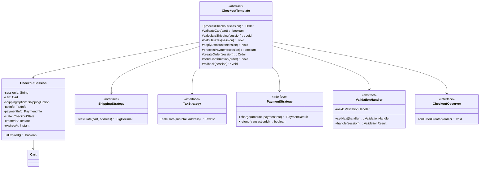
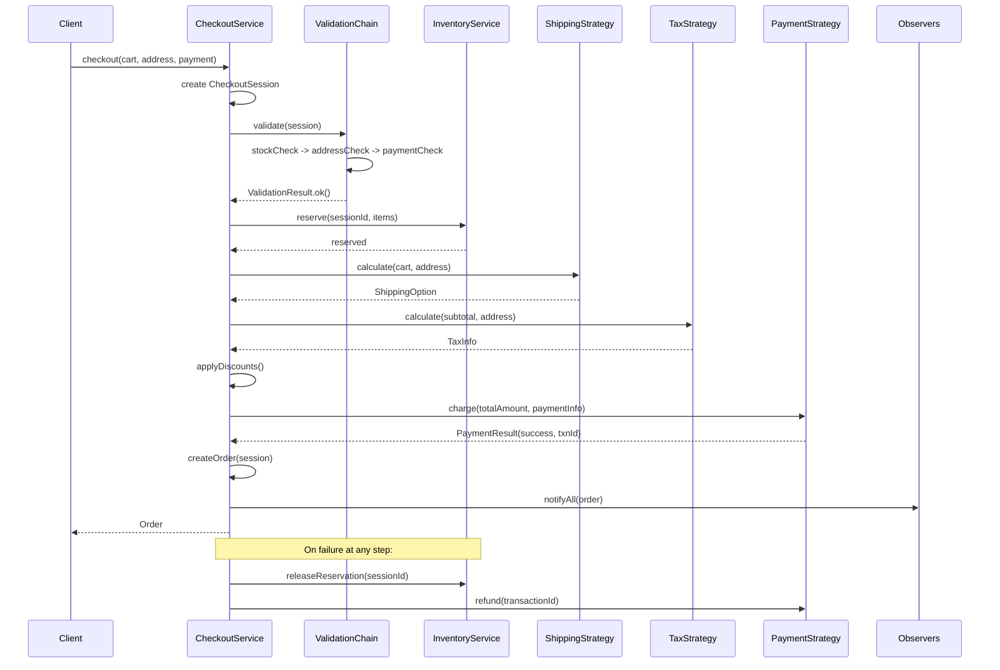

# E-Commerce Checkout Flow - Low Level Design

## 1. Problem Statement
Design a robust e-commerce checkout flow that handles cart validation, shipping/tax calculation, discount application, payment processing, and order creation with proper rollback on failure.

## 2. UML Class Diagram



## 3. Design Patterns
- **Template Method**: Defines checkout step sequence with hooks for customization
- **Strategy**: Shipping, tax, and payment calculations are interchangeable
- **Chain of Responsibility**: Validation pipeline (stock, address, payment)
- **Observer**: Notifications on order creation (email, inventory, analytics)
- **State**: Checkout session lifecycle management

## 4. SOLID Principles
- **SRP**: Each strategy/handler has one responsibility
- **OCP**: New shipping/tax/payment methods without modifying core flow
- **LSP**: All strategies are substitutable
- **ISP**: Focused interfaces for each concern
- **DIP**: Template depends on abstractions (Strategy interfaces)

## 5. Complete Java Implementation

```java
import java.math.BigDecimal;
import java.time.Instant;
import java.util.*;
import java.util.concurrent.ConcurrentHashMap;

// ==================== MODELS ====================
class CartItem {
    private String productId;
    private String name;
    private BigDecimal price;
    private int quantity;
    private double weightKg;

    public CartItem(String productId, String name, BigDecimal price, int quantity, double weightKg) {
        this.productId = productId; this.name = name; this.price = price;
        this.quantity = quantity; this.weightKg = weightKg;
    }
    public String getProductId() { return productId; }
    public BigDecimal getPrice() { return price; }
    public int getQuantity() { return quantity; }
    public double getWeightKg() { return weightKg; }
    public BigDecimal getSubtotal() { return price.multiply(BigDecimal.valueOf(quantity)); }
}

class Cart {
    private List<CartItem> items = new ArrayList<>();
    private String customerId;

    public void addItem(CartItem item) { items.add(item); }
    public List<CartItem> getItems() { return items; }
    public String getCustomerId() { return customerId; }
    public void setCustomerId(String id) { this.customerId = id; }

    public BigDecimal getSubtotal() {
        return items.stream().map(CartItem::getSubtotal).reduce(BigDecimal.ZERO, BigDecimal::add);
    }
    public double getTotalWeight() {
        return items.stream().mapToDouble(i -> i.getWeightKg() * i.getQuantity()).sum();
    }
    public boolean isEmpty() { return items.isEmpty(); }
}

class Address {
    private String street, city, state, zipCode, country;
    public Address(String street, String city, String state, String zip, String country) {
        this.street = street; this.city = city; this.state = state;
        this.zipCode = zip; this.country = country;
    }
    public String getState() { return state; }
    public String getCountry() { return country; }
    public String getZipCode() { return zipCode; }
}

class ShippingOption {
    private String method;
    private BigDecimal cost;
    private int estimatedDays;

    public ShippingOption(String method, BigDecimal cost, int days) {
        this.method = method; this.cost = cost; this.estimatedDays = days;
    }
    public BigDecimal getCost() { return cost; }
    public String getMethod() { return method; }
}

class TaxInfo {
    private BigDecimal taxAmount;
    private BigDecimal taxRate;
    private String taxType;

    public TaxInfo(BigDecimal amount, BigDecimal rate, String type) {
        this.taxAmount = amount; this.taxRate = rate; this.taxType = type;
    }
    public BigDecimal getTaxAmount() { return taxAmount; }
}

class PaymentInfo {
    private String method; // CREDIT_CARD, PAYPAL, UPI
    private String token;
    public PaymentInfo(String method, String token) { this.method = method; this.token = token; }
    public String getMethod() { return method; }
    public String getToken() { return token; }
}

class PaymentResult {
    private boolean success;
    private String transactionId;
    private String errorMessage;

    public PaymentResult(boolean success, String txnId, String error) {
        this.success = success; this.transactionId = txnId; this.errorMessage = error;
    }
    public boolean isSuccess() { return success; }
    public String getTransactionId() { return transactionId; }
}

enum CheckoutState { INITIATED, VALIDATING, CALCULATING, PAYMENT_PENDING, COMPLETED, FAILED, EXPIRED }

class CheckoutSession {
    private String sessionId;
    private Cart cart;
    private Address shippingAddress;
    private ShippingOption shippingOption;
    private TaxInfo taxInfo;
    private PaymentInfo paymentInfo;
    private BigDecimal discountAmount = BigDecimal.ZERO;
    private CheckoutState state;
    private Instant createdAt;
    private Instant expiresAt;
    private String paymentTransactionId;
    private List<String> reservedInventoryIds = new ArrayList<>();

    public CheckoutSession(Cart cart, Address address, PaymentInfo payment) {
        this.sessionId = UUID.randomUUID().toString();
        this.cart = cart; this.shippingAddress = address; this.paymentInfo = payment;
        this.state = CheckoutState.INITIATED;
        this.createdAt = Instant.now();
        this.expiresAt = createdAt.plusSeconds(900); // 15 min timeout
    }

    public boolean isExpired() { return Instant.now().isAfter(expiresAt); }
    public BigDecimal getTotalAmount() {
        return cart.getSubtotal()
            .add(shippingOption != null ? shippingOption.getCost() : BigDecimal.ZERO)
            .add(taxInfo != null ? taxInfo.getTaxAmount() : BigDecimal.ZERO)
            .subtract(discountAmount);
    }

    // Getters and setters
    public String getSessionId() { return sessionId; }
    public Cart getCart() { return cart; }
    public Address getShippingAddress() { return shippingAddress; }
    public CheckoutState getState() { return state; }
    public void setState(CheckoutState s) { this.state = s; }
    public void setShippingOption(ShippingOption o) { this.shippingOption = o; }
    public void setTaxInfo(TaxInfo t) { this.taxInfo = t; }
    public void setDiscountAmount(BigDecimal d) { this.discountAmount = d; }
    public PaymentInfo getPaymentInfo() { return paymentInfo; }
    public void setPaymentTransactionId(String id) { this.paymentTransactionId = id; }
    public String getPaymentTransactionId() { return paymentTransactionId; }
    public List<String> getReservedInventoryIds() { return reservedInventoryIds; }
    public ShippingOption getShippingOption() { return shippingOption; }
    public TaxInfo getTaxInfo() { return taxInfo; }
    public BigDecimal getDiscountAmount() { return discountAmount; }
}

class Order {
    private String orderId;
    private String customerId;
    private List<CartItem> items;
    private BigDecimal totalAmount;
    private String paymentTransactionId;
    private Instant createdAt;

    public Order(CheckoutSession session) {
        this.orderId = "ORD-" + UUID.randomUUID().toString().substring(0, 8);
        this.customerId = session.getCart().getCustomerId();
        this.items = session.getCart().getItems();
        this.totalAmount = session.getTotalAmount();
        this.paymentTransactionId = session.getPaymentTransactionId();
        this.createdAt = Instant.now();
    }
    public String getOrderId() { return orderId; }
    public String getCustomerId() { return customerId; }
    public BigDecimal getTotalAmount() { return totalAmount; }
}

// ==================== STRATEGIES ====================

// --- Shipping Strategy ---
interface ShippingStrategy {
    ShippingOption calculate(Cart cart, Address address);
}

class FlatRateShipping implements ShippingStrategy {
    public ShippingOption calculate(Cart cart, Address address) {
        return new ShippingOption("FLAT_RATE", new BigDecimal("5.99"), 5);
    }
}

class WeightBasedShipping implements ShippingStrategy {
    public ShippingOption calculate(Cart cart, Address address) {
        BigDecimal cost = BigDecimal.valueOf(cart.getTotalWeight() * 2.5);
        return new ShippingOption("WEIGHT_BASED", cost, 4);
    }
}

class DistanceBasedShipping implements ShippingStrategy {
    public ShippingOption calculate(Cart cart, Address address) {
        // Simplified: use zip code prefix as proxy for distance
        int zone = Integer.parseInt(address.getZipCode().substring(0, 1));
        BigDecimal cost = BigDecimal.valueOf(zone * 1.5 + 3.0);
        return new ShippingOption("DISTANCE_BASED", cost, zone + 2);
    }
}

class FreeShipping implements ShippingStrategy {
    private BigDecimal minimumOrder = new BigDecimal("50.00");
    public ShippingOption calculate(Cart cart, Address address) {
        if (cart.getSubtotal().compareTo(minimumOrder) >= 0)
            return new ShippingOption("FREE", BigDecimal.ZERO, 7);
        return new FlatRateShipping().calculate(cart, address); // fallback
    }
}

// --- Tax Strategy ---
interface TaxStrategy {
    TaxInfo calculate(BigDecimal subtotal, Address address);
}

class StateTaxCalculator implements TaxStrategy {
    private static final Map<String, BigDecimal> STATE_RATES = Map.of(
        "CA", new BigDecimal("0.0725"), "NY", new BigDecimal("0.08"),
        "TX", new BigDecimal("0.0625"), "FL", new BigDecimal("0.06")
    );
    public TaxInfo calculate(BigDecimal subtotal, Address address) {
        BigDecimal rate = STATE_RATES.getOrDefault(address.getState(), new BigDecimal("0.05"));
        return new TaxInfo(subtotal.multiply(rate), rate, "STATE_TAX");
    }
}

class VATCalculator implements TaxStrategy {
    public TaxInfo calculate(BigDecimal subtotal, Address address) {
        BigDecimal rate = new BigDecimal("0.20"); // 20% VAT
        return new TaxInfo(subtotal.multiply(rate), rate, "VAT");
    }
}

class GSTCalculator implements TaxStrategy {
    public TaxInfo calculate(BigDecimal subtotal, Address address) {
        BigDecimal rate = new BigDecimal("0.18"); // 18% GST
        return new TaxInfo(subtotal.multiply(rate), rate, "GST");
    }
}

// --- Payment Strategy ---
interface PaymentStrategy {
    PaymentResult charge(BigDecimal amount, PaymentInfo info);
    boolean refund(String transactionId);
}

class CreditCardPayment implements PaymentStrategy {
    public PaymentResult charge(BigDecimal amount, PaymentInfo info) {
        // Simulate gateway call
        String txnId = "CC-" + UUID.randomUUID().toString().substring(0, 8);
        return new PaymentResult(true, txnId, null);
    }
    public boolean refund(String transactionId) { return true; }
}

class PayPalPayment implements PaymentStrategy {
    public PaymentResult charge(BigDecimal amount, PaymentInfo info) {
        String txnId = "PP-" + UUID.randomUUID().toString().substring(0, 8);
        return new PaymentResult(true, txnId, null);
    }
    public boolean refund(String transactionId) { return true; }
}

class UPIPayment implements PaymentStrategy {
    public PaymentResult charge(BigDecimal amount, PaymentInfo info) {
        String txnId = "UPI-" + UUID.randomUUID().toString().substring(0, 8);
        return new PaymentResult(true, txnId, null);
    }
    public boolean refund(String transactionId) { return true; }
}

// ==================== VALIDATION CHAIN ====================
class ValidationResult {
    private boolean valid;
    private String error;
    public ValidationResult(boolean valid, String error) { this.valid = valid; this.error = error; }
    public boolean isValid() { return valid; }
    public String getError() { return error; }
    public static ValidationResult ok() { return new ValidationResult(true, null); }
    public static ValidationResult fail(String msg) { return new ValidationResult(false, msg); }
}

abstract class ValidationHandler {
    protected ValidationHandler next;
    public ValidationHandler setNext(ValidationHandler handler) { this.next = handler; return handler; }
    public ValidationResult handle(CheckoutSession session) {
        ValidationResult result = validate(session);
        if (!result.isValid()) return result;
        if (next != null) return next.handle(session);
        return ValidationResult.ok();
    }
    protected abstract ValidationResult validate(CheckoutSession session);
}

class StockCheckHandler extends ValidationHandler {
    private InventoryService inventoryService;
    public StockCheckHandler(InventoryService svc) { this.inventoryService = svc; }
    protected ValidationResult validate(CheckoutSession session) {
        for (CartItem item : session.getCart().getItems()) {
            if (!inventoryService.isAvailable(item.getProductId(), item.getQuantity()))
                return ValidationResult.fail("Item out of stock: " + item.getProductId());
        }
        return ValidationResult.ok();
    }
}

class AddressValidationHandler extends ValidationHandler {
    protected ValidationResult validate(CheckoutSession session) {
        Address addr = session.getShippingAddress();
        if (addr == null || addr.getZipCode() == null || addr.getZipCode().isEmpty())
            return ValidationResult.fail("Invalid shipping address");
        return ValidationResult.ok();
    }
}

class PaymentValidationHandler extends ValidationHandler {
    protected ValidationResult validate(CheckoutSession session) {
        PaymentInfo info = session.getPaymentInfo();
        if (info == null || info.getToken() == null || info.getToken().isEmpty())
            return ValidationResult.fail("Invalid payment information");
        return ValidationResult.ok();
    }
}

// ==================== OBSERVER ====================
interface CheckoutObserver {
    void onOrderCreated(Order order);
}

class EmailNotificationObserver implements CheckoutObserver {
    public void onOrderCreated(Order order) {
        System.out.println("[EMAIL] Confirmation sent for order: " + order.getOrderId());
    }
}

class InventoryUpdateObserver implements CheckoutObserver {
    public void onOrderCreated(Order order) {
        System.out.println("[INVENTORY] Stock committed for order: " + order.getOrderId());
    }
}

class AnalyticsObserver implements CheckoutObserver {
    public void onOrderCreated(Order order) {
        System.out.println("[ANALYTICS] Order tracked: " + order.getOrderId() + " amount=" + order.getTotalAmount());
    }
}

// ==================== SERVICES ====================
class InventoryService {
    private Map<String, Integer> stock = new ConcurrentHashMap<>();
    private Map<String, Map<String, Integer>> reservations = new ConcurrentHashMap<>();

    public InventoryService() {
        stock.put("PROD-1", 100); stock.put("PROD-2", 50);
    }
    public boolean isAvailable(String productId, int qty) {
        return stock.getOrDefault(productId, 0) >= qty;
    }
    public boolean reserve(String sessionId, String productId, int qty) {
        synchronized (this) {
            if (!isAvailable(productId, qty)) return false;
            stock.merge(productId, -qty, Integer::sum);
            reservations.computeIfAbsent(sessionId, k -> new HashMap<>()).put(productId, qty);
            return true;
        }
    }
    public void releaseReservation(String sessionId) {
        Map<String, Integer> reserved = reservations.remove(sessionId);
        if (reserved != null) {
            reserved.forEach((pid, qty) -> stock.merge(pid, qty, Integer::sum));
        }
    }
}

// ==================== TEMPLATE METHOD ====================
abstract class CheckoutTemplate {
    protected ShippingStrategy shippingStrategy;
    protected TaxStrategy taxStrategy;
    protected PaymentStrategy paymentStrategy;
    protected ValidationHandler validationChain;
    protected InventoryService inventoryService;
    protected List<CheckoutObserver> observers = new ArrayList<>();

    public void addObserver(CheckoutObserver obs) { observers.add(obs); }

    // Template Method - defines the checkout algorithm
    public final Order processCheckout(CheckoutSession session) {
        try {
            if (session.isExpired()) {
                session.setState(CheckoutState.EXPIRED);
                throw new RuntimeException("Checkout session expired");
            }

            session.setState(CheckoutState.VALIDATING);
            validateCart(session);

            session.setState(CheckoutState.CALCULATING);
            reserveInventory(session);
            calculateShipping(session);
            calculateTax(session);
            applyDiscounts(session);

            session.setState(CheckoutState.PAYMENT_PENDING);
            processPayment(session);

            Order order = createOrder(session);
            session.setState(CheckoutState.COMPLETED);
            notifyObservers(order);
            return order;

        } catch (Exception e) {
            session.setState(CheckoutState.FAILED);
            rollback(session);
            throw e;
        }
    }

    protected void validateCart(CheckoutSession session) {
        if (session.getCart().isEmpty()) throw new RuntimeException("Cart is empty");
        ValidationResult result = validationChain.handle(session);
        if (!result.isValid()) throw new RuntimeException("Validation failed: " + result.getError());
    }

    protected void reserveInventory(CheckoutSession session) {
        for (CartItem item : session.getCart().getItems()) {
            boolean reserved = inventoryService.reserve(
                session.getSessionId(), item.getProductId(), item.getQuantity());
            if (!reserved) throw new RuntimeException("Cannot reserve: " + item.getProductId());
            session.getReservedInventoryIds().add(item.getProductId());
        }
    }

    protected void calculateShipping(CheckoutSession session) {
        ShippingOption option = shippingStrategy.calculate(session.getCart(), session.getShippingAddress());
        session.setShippingOption(option);
    }

    protected void calculateTax(CheckoutSession session) {
        TaxInfo tax = taxStrategy.calculate(session.getCart().getSubtotal(), session.getShippingAddress());
        session.setTaxInfo(tax);
    }

    protected abstract void applyDiscounts(CheckoutSession session);

    protected void processPayment(CheckoutSession session) {
        PaymentResult result = paymentStrategy.charge(session.getTotalAmount(), session.getPaymentInfo());
        if (!result.isSuccess()) throw new RuntimeException("Payment failed: " + result.getTransactionId());
        session.setPaymentTransactionId(result.getTransactionId());
    }

    protected Order createOrder(CheckoutSession session) { return new Order(session); }

    // Compensating transaction - rollback on failure
    protected void rollback(CheckoutSession session) {
        System.out.println("[ROLLBACK] Rolling back session: " + session.getSessionId());
        inventoryService.releaseReservation(session.getSessionId());
        if (session.getPaymentTransactionId() != null) {
            paymentStrategy.refund(session.getPaymentTransactionId());
            System.out.println("[ROLLBACK] Payment refunded: " + session.getPaymentTransactionId());
        }
    }

    private void notifyObservers(Order order) {
        observers.forEach(obs -> obs.onOrderCreated(order));
    }
}

// Concrete checkout implementation
class StandardCheckout extends CheckoutTemplate {
    protected void applyDiscounts(CheckoutSession session) {
        BigDecimal subtotal = session.getCart().getSubtotal();
        if (subtotal.compareTo(new BigDecimal("100")) > 0) {
            session.setDiscountAmount(subtotal.multiply(new BigDecimal("0.10"))); // 10% off
        }
    }
}

// ==================== CHECKOUT SERVICE (FACADE) ====================
class CheckoutService {
    private CheckoutTemplate checkout;

    public CheckoutService() {
        StandardCheckout std = new StandardCheckout();
        InventoryService invSvc = new InventoryService();

        // Wire strategies
        std.shippingStrategy = new FreeShipping();
        std.taxStrategy = new StateTaxCalculator();
        std.paymentStrategy = new CreditCardPayment();
        std.inventoryService = invSvc;

        // Build validation chain
        StockCheckHandler stockCheck = new StockCheckHandler(invSvc);
        AddressValidationHandler addrCheck = new AddressValidationHandler();
        PaymentValidationHandler payCheck = new PaymentValidationHandler();
        stockCheck.setNext(addrCheck).setNext(payCheck);
        std.validationChain = stockCheck;

        // Register observers
        std.addObserver(new EmailNotificationObserver());
        std.addObserver(new InventoryUpdateObserver());
        std.addObserver(new AnalyticsObserver());

        this.checkout = std;
    }

    public Order checkout(Cart cart, Address address, PaymentInfo payment) {
        CheckoutSession session = new CheckoutSession(cart, address, payment);
        return checkout.processCheckout(session);
    }
}

// ==================== DEMO ====================
class CheckoutDemo {
    public static void main(String[] args) {
        CheckoutService service = new CheckoutService();

        Cart cart = new Cart();
        cart.setCustomerId("CUST-001");
        cart.addItem(new CartItem("PROD-1", "Laptop", new BigDecimal("999.99"), 1, 2.5));
        cart.addItem(new CartItem("PROD-2", "Mouse", new BigDecimal("29.99"), 2, 0.2));

        Address address = new Address("123 Main St", "San Jose", "CA", "95101", "US");
        PaymentInfo payment = new PaymentInfo("CREDIT_CARD", "tok_visa_4242");

        Order order = service.checkout(cart, address, payment);
        System.out.println("Order created: " + order.getOrderId() + " Total: $" + order.getTotalAmount());
    }
}
```

## 6. Sequence Diagram



## 7. Key Interview Points

| Topic | Discussion Point |
|-------|-----------------|
| **Template Method** | Fixed checkout algorithm with customizable steps (e.g., `applyDiscounts`) |
| **Rollback/Saga** | Compensating transactions ensure consistency without distributed transactions |
| **Session Timeout** | 15-min expiry prevents stale inventory locks |
| **Inventory Reservation** | Pessimistic lock during checkout, released on failure/expiry |
| **Idempotency** | Transaction IDs prevent duplicate charges |
| **Scalability** | Strategies are stateless; sessions can be stored in Redis |
| **Chain of Responsibility** | Validators are composable; easy to add fraud check, rate limiting |
| **Observer decoupling** | Order creation doesn't know about email/analytics/inventory commit |
| **State Machine** | CheckoutState ensures valid transitions and audit trail |
| **Testing** | Each strategy/handler independently testable via interfaces |
