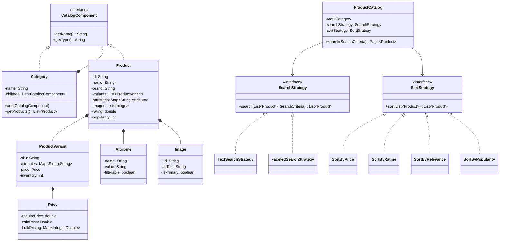

# Product Catalog System - LLD

## Problem Statement
Design a product catalog system supporting hierarchical categories, product variants, faceted search, multiple sorting strategies, and flexible pricing.

## UML Class Diagram


## Design Patterns
- **Composite**: Category tree hierarchy
- **Strategy**: Search and sort algorithms
- **Builder**: Complex product construction
- **Iterator**: Cursor-based pagination
- **Factory**: Product creation

## Java Implementation

```java
// ==================== Models ====================
class Price {
    private double regularPrice;
    private Double salePrice;
    private Map<Integer, Double> bulkPricing; // qty -> price

    public Price(double regularPrice) { this.regularPrice = regularPrice; this.bulkPricing = new HashMap<>(); }
    public void setSalePrice(double price) { this.salePrice = price; }
    public void addBulkPrice(int minQty, double price) { bulkPricing.put(minQty, price); }

    public double getEffectivePrice(int quantity) {
        double best = salePrice != null ? salePrice : regularPrice;
        for (var entry : bulkPricing.entrySet())
            if (quantity >= entry.getKey()) best = Math.min(best, entry.getValue());
        return best;
    }
    public double getDisplayPrice() { return salePrice != null ? salePrice : regularPrice; }
    public double getRegularPrice() { return regularPrice; }
}

class Attribute {
    private String name, value;
    private boolean filterable;
    public Attribute(String name, String value, boolean filterable) {
        this.name = name; this.value = value; this.filterable = filterable;
    }
    public String getName() { return name; }
    public String getValue() { return value; }
    public boolean isFilterable() { return filterable; }
}

class Image {
    private String url, altText;
    private boolean isPrimary;
    public Image(String url, String altText, boolean isPrimary) {
        this.url = url; this.altText = altText; this.isPrimary = isPrimary;
    }
}

class ProductVariant {
    private String sku;
    private Map<String, String> attributes; // e.g., "color"->"Red", "size"->"L"
    private Price price;
    private int inventory;

    public ProductVariant(String sku, Price price, int inventory) {
        this.sku = sku; this.price = price; this.inventory = inventory;
        this.attributes = new HashMap<>();
    }
    public void addAttribute(String key, String val) { attributes.put(key, val); }
    public boolean isAvailable() { return inventory > 0; }
    public Price getPrice() { return price; }
    public Map<String, String> getAttributes() { return attributes; }
    public String getSku() { return sku; }
}

// ==================== Composite Pattern ====================
interface CatalogComponent {
    String getName();
    String getType();
}

class Product implements CatalogComponent {
    private String id, name, brand, description;
    private List<ProductVariant> variants = new ArrayList<>();
    private Map<String, Attribute> attributes = new HashMap<>();
    private List<Image> images = new ArrayList<>();
    private Category category;
    private double rating;
    private int popularity;

    private Product() {}

    public String getName() { return name; }
    public String getType() { return "PRODUCT"; }
    public String getId() { return id; }
    public String getBrand() { return brand; }
    public double getRating() { return rating; }
    public int getPopularity() { return popularity; }
    public Category getCategory() { return category; }
    public List<ProductVariant> getVariants() { return variants; }
    public Map<String, Attribute> getAttributes() { return attributes; }

    public double getLowestPrice() {
        return variants.stream().mapToDouble(v -> v.getPrice().getDisplayPrice()).min().orElse(0);
    }
    public boolean isAvailable() { return variants.stream().anyMatch(ProductVariant::isAvailable); }

    // ==================== Builder Pattern ====================
    static class Builder {
        private Product p = new Product();
        public Builder(String id, String name) { p.id = id; p.name = name; }
        public Builder brand(String b) { p.brand = b; return this; }
        public Builder description(String d) { p.description = d; return this; }
        public Builder category(Category c) { p.category = c; return this; }
        public Builder rating(double r) { p.rating = r; return this; }
        public Builder popularity(int pop) { p.popularity = pop; return this; }
        public Builder addVariant(ProductVariant v) { p.variants.add(v); return this; }
        public Builder addAttribute(Attribute a) { p.attributes.put(a.getName(), a); return this; }
        public Builder addImage(Image img) { p.images.add(img); return this; }
        public Product build() {
            if (p.variants.isEmpty()) throw new IllegalStateException("Product must have at least one variant");
            return p;
        }
    }
}

class Category implements CatalogComponent {
    private String name;
    private List<CatalogComponent> children = new ArrayList<>();
    private Category parent;

    public Category(String name) { this.name = name; }
    public Category(String name, Category parent) { this.name = name; this.parent = parent; }

    public String getName() { return name; }
    public String getType() { return "CATEGORY"; }
    public void add(CatalogComponent component) { children.add(component); }

    public List<Product> getProducts() {
        List<Product> products = new ArrayList<>();
        for (CatalogComponent child : children) {
            if (child instanceof Product) products.add((Product) child);
            else if (child instanceof Category) products.addAll(((Category) child).getProducts());
        }
        return products;
    }
    public List<Category> getSubCategories() {
        return children.stream().filter(c -> c instanceof Category).map(c -> (Category) c).toList();
    }
    public String getFullPath() {
        return parent != null ? parent.getFullPath() + " > " + name : name;
    }
}

// ==================== Search & Filter ====================
class SearchCriteria {
    private String textQuery;
    private String categoryName;
    private String brand;
    private Double minPrice, maxPrice;
    private Map<String, String> attributeFilters = new HashMap<>();
    private boolean onlyAvailable;

    public SearchCriteria() {}
    public SearchCriteria text(String q) { this.textQuery = q; return this; }
    public SearchCriteria category(String c) { this.categoryName = c; return this; }
    public SearchCriteria brand(String b) { this.brand = b; return this; }
    public SearchCriteria priceRange(double min, double max) { this.minPrice = min; this.maxPrice = max; return this; }
    public SearchCriteria attribute(String k, String v) { attributeFilters.put(k, v); return this; }
    public SearchCriteria availableOnly() { this.onlyAvailable = true; return this; }

    public String getTextQuery() { return textQuery; }
    public String getCategoryName() { return categoryName; }
    public String getBrand() { return brand; }
    public Double getMinPrice() { return minPrice; }
    public Double getMaxPrice() { return maxPrice; }
    public Map<String, String> getAttributeFilters() { return attributeFilters; }
    public boolean isOnlyAvailable() { return onlyAvailable; }
}

// Strategy Pattern - Search
interface SearchStrategy {
    List<Product> search(List<Product> products, SearchCriteria criteria);
}

class TextSearchStrategy implements SearchStrategy {
    public List<Product> search(List<Product> products, SearchCriteria criteria) {
        if (criteria.getTextQuery() == null) return products;
        String q = criteria.getTextQuery().toLowerCase();
        return products.stream().filter(p ->
            p.getName().toLowerCase().contains(q) ||
            (p.getBrand() != null && p.getBrand().toLowerCase().contains(q))
        ).collect(Collectors.toList());
    }
}

class FacetedSearchStrategy implements SearchStrategy {
    public List<Product> search(List<Product> products, SearchCriteria criteria) {
        Stream<Product> stream = products.stream();
        if (criteria.getTextQuery() != null) {
            String q = criteria.getTextQuery().toLowerCase();
            stream = stream.filter(p -> p.getName().toLowerCase().contains(q));
        }
        if (criteria.getBrand() != null)
            stream = stream.filter(p -> criteria.getBrand().equalsIgnoreCase(p.getBrand()));
        if (criteria.getMinPrice() != null)
            stream = stream.filter(p -> p.getLowestPrice() >= criteria.getMinPrice());
        if (criteria.getMaxPrice() != null)
            stream = stream.filter(p -> p.getLowestPrice() <= criteria.getMaxPrice());
        if (criteria.isOnlyAvailable())
            stream = stream.filter(Product::isAvailable);
        for (var entry : criteria.getAttributeFilters().entrySet()) {
            stream = stream.filter(p -> {
                Attribute attr = p.getAttributes().get(entry.getKey());
                return attr != null && attr.getValue().equalsIgnoreCase(entry.getValue());
            });
        }
        return stream.collect(Collectors.toList());
    }
}

// Strategy Pattern - Sorting
interface SortStrategy {
    List<Product> sort(List<Product> products);
}

class SortByPrice implements SortStrategy {
    private boolean ascending;
    public SortByPrice(boolean ascending) { this.ascending = ascending; }
    public List<Product> sort(List<Product> products) {
        Comparator<Product> cmp = Comparator.comparingDouble(Product::getLowestPrice);
        if (!ascending) cmp = cmp.reversed();
        return products.stream().sorted(cmp).collect(Collectors.toList());
    }
}

class SortByRating implements SortStrategy {
    public List<Product> sort(List<Product> products) {
        return products.stream().sorted(Comparator.comparingDouble(Product::getRating).reversed()).collect(Collectors.toList());
    }
}

class SortByPopularity implements SortStrategy {
    public List<Product> sort(List<Product> products) {
        return products.stream().sorted(Comparator.comparingInt(Product::getPopularity).reversed()).collect(Collectors.toList());
    }
}

class SortByRelevance implements SortStrategy {
    private String query;
    public SortByRelevance(String query) { this.query = query.toLowerCase(); }
    public List<Product> sort(List<Product> products) {
        return products.stream().sorted((a, b) -> {
            int scoreA = a.getName().toLowerCase().startsWith(query) ? 2 : a.getName().toLowerCase().contains(query) ? 1 : 0;
            int scoreB = b.getName().toLowerCase().startsWith(query) ? 2 : b.getName().toLowerCase().contains(query) ? 1 : 0;
            return Integer.compare(scoreB, scoreA);
        }).collect(Collectors.toList());
    }
}

// ==================== Pagination (Iterator Pattern) ====================
class Page<T> {
    private List<T> items;
    private int totalItems, pageNumber, pageSize;
    private String nextCursor;

    public Page(List<T> items, int totalItems, int pageNumber, int pageSize, String nextCursor) {
        this.items = items; this.totalItems = totalItems;
        this.pageNumber = pageNumber; this.pageSize = pageSize; this.nextCursor = nextCursor;
    }
    public List<T> getItems() { return items; }
    public boolean hasNext() { return nextCursor != null; }
    public String getNextCursor() { return nextCursor; }
    public int getTotalPages() { return (int) Math.ceil((double) totalItems / pageSize); }
}

class CursorIterator<T> implements Iterator<Page<T>> {
    private List<T> allItems;
    private int pageSize, currentIndex = 0;

    public CursorIterator(List<T> items, int pageSize) { this.allItems = items; this.pageSize = pageSize; }
    public boolean hasNext() { return currentIndex < allItems.size(); }
    public Page<T> next() {
        int end = Math.min(currentIndex + pageSize, allItems.size());
        List<T> pageItems = allItems.subList(currentIndex, end);
        String cursor = end < allItems.size() ? String.valueOf(end) : null;
        Page<T> page = new Page<>(pageItems, allItems.size(), currentIndex / pageSize, pageSize, cursor);
        currentIndex = end;
        return page;
    }
}

// ==================== Main Catalog ====================
class ProductCatalog {
    private Category root = new Category("Root");
    private SearchStrategy searchStrategy;
    private SortStrategy sortStrategy;
    private Map<String, Product> productIndex = new HashMap<>();

    public ProductCatalog() {
        this.searchStrategy = new FacetedSearchStrategy();
        this.sortStrategy = new SortByPopularity();
    }

    public void setSearchStrategy(SearchStrategy s) { this.searchStrategy = s; }
    public void setSortStrategy(SortStrategy s) { this.sortStrategy = s; }
    public Category getRoot() { return root; }

    public void addProduct(Product product) {
        productIndex.put(product.getId(), product);
        if (product.getCategory() != null) product.getCategory().add(product);
    }

    public Page<Product> search(SearchCriteria criteria, int page, int size) {
        List<Product> source = criteria.getCategoryName() != null
            ? findCategory(root, criteria.getCategoryName()).map(Category::getProducts).orElse(List.of())
            : new ArrayList<>(productIndex.values());

        List<Product> filtered = searchStrategy.search(source, criteria);
        List<Product> sorted = sortStrategy.sort(filtered);

        int start = page * size, end = Math.min(start + size, sorted.size());
        String cursor = end < sorted.size() ? String.valueOf(end) : null;
        return new Page<>(sorted.subList(start, end), sorted.size(), page, size, cursor);
    }

    public Iterator<Page<Product>> cursorSearch(SearchCriteria criteria, int pageSize) {
        List<Product> filtered = searchStrategy.search(new ArrayList<>(productIndex.values()), criteria);
        List<Product> sorted = sortStrategy.sort(filtered);
        return new CursorIterator<>(sorted, pageSize);
    }

    private Optional<Category> findCategory(Category cat, String name) {
        if (cat.getName().equalsIgnoreCase(name)) return Optional.of(cat);
        for (Category sub : cat.getSubCategories()) {
            Optional<Category> found = findCategory(sub, name);
            if (found.isPresent()) return found;
        }
        return Optional.empty();
    }
}

// ==================== Demo ====================
class Demo {
    public static void main(String[] args) {
        ProductCatalog catalog = new ProductCatalog();

        // Build category tree: Electronics > Phones > Samsung
        Category electronics = new Category("Electronics");
        Category phones = new Category("Phones", electronics);
        Category samsung = new Category("Samsung", phones);
        catalog.getRoot().add(electronics);
        electronics.add(phones);
        phones.add(samsung);

        // Build product with variants
        ProductVariant v1 = new ProductVariant("SGS24-BLK-128", new Price(999.99), 50);
        v1.addAttribute("color", "Black"); v1.addAttribute("storage", "128GB");
        ProductVariant v2 = new ProductVariant("SGS24-WHT-256", new Price(1099.99), 30);
        v2.addAttribute("color", "White"); v2.addAttribute("storage", "256GB");
        v2.getPrice().setSalePrice(1049.99);
        v2.getPrice().addBulkPrice(5, 999.99);

        Product galaxy = new Product.Builder("P001", "Samsung Galaxy S24")
            .brand("Samsung").category(samsung).rating(4.5).popularity(9500)
            .addVariant(v1).addVariant(v2)
            .addAttribute(new Attribute("OS", "Android 14", true))
            .addAttribute(new Attribute("Screen", "6.2 inch", true))
            .addImage(new Image("/img/s24.jpg", "Galaxy S24", true))
            .build();

        catalog.addProduct(galaxy);

        // Search with faceted filters
        catalog.setSortStrategy(new SortByPrice(true));
        SearchCriteria criteria = new SearchCriteria().brand("Samsung").priceRange(500, 1200).availableOnly();
        Page<Product> results = catalog.search(criteria, 0, 10);
        System.out.println("Found: " + results.getItems().size()); // 1

        // Cursor-based iteration
        Iterator<Page<Product>> iter = catalog.cursorSearch(new SearchCriteria(), 5);
        while (iter.hasNext()) {
            Page<Product> pg = iter.next();
            pg.getItems().forEach(p -> System.out.println(p.getName()));
        }
    }
}
```

## Key Interview Points

| Topic | Discussion |
|-------|-----------|
| **Composite** | Category tree enables recursive traversal; `getProducts()` collects from entire subtree |
| **Strategy** | Swap search/sort at runtime; open for extension (new sort = new class) |
| **Builder** | Enforces invariants (must have variant); readable complex construction |
| **Iterator** | Cursor-based pagination avoids offset performance issues at scale |
| **Pricing** | Multi-tier: regular, sale, bulk — `getEffectivePrice(qty)` resolves best price |
| **Faceted Search** | Filter by any combination of attributes; mirrors e-commerce UX |
| **Inventory** | Variant-level stock; `isAvailable()` aggregates across variants |
| **Scalability** | In production: Elasticsearch for search, Redis for inventory, CDN for images |
| **SOLID** | SRP (each class one job), OCP (new strategies without modifying catalog), LSP (all strategies interchangeable), ISP (small interfaces), DIP (catalog depends on abstractions) |
