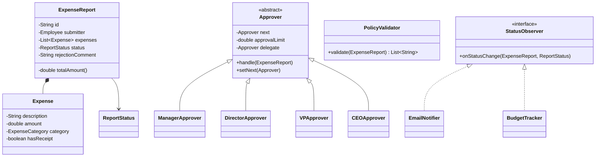

# Expense Approval System - LLD

## Problem Statement
Design an expense approval system where expense reports flow through a chain of approvers based on amount thresholds, with policy validation, status lifecycle management, and notifications.

## UML Class Diagram


## Design Patterns
| Pattern | Usage |
|---------|-------|
| **Chain of Responsibility** | Approval chain: Manager→Director→VP→CEO |
| **State** | Report lifecycle (Draft→Submitted→UnderReview→Approved/Rejected→Reimbursed) |
| **Observer** | Notifications on status changes |

## Java Implementation

```java
// === Enums ===
enum ReportStatus { DRAFT, SUBMITTED, UNDER_REVIEW, APPROVED, REJECTED, REIMBURSED }
enum ExpenseCategory { TRAVEL, MEALS, SUPPLIES, SOFTWARE, TRAINING, OTHER }
enum ApprovalLevel { MANAGER, DIRECTOR, VP, CEO }

// === Models ===
class Employee {
    private String id, name, email, department;
    public Employee(String id, String name, String email, String department) {
        this.id = id; this.name = name; this.email = email; this.department = department;
    }
    // getters
    public String getId() { return id; }
    public String getName() { return name; }
    public String getEmail() { return email; }
    public String getDepartment() { return department; }
}

class Expense {
    private String description;
    private double amount;
    private ExpenseCategory category;
    private boolean hasReceipt;

    public Expense(String description, double amount, ExpenseCategory category, boolean hasReceipt) {
        this.description = description; this.amount = amount;
        this.category = category; this.hasReceipt = hasReceipt;
    }
    public double getAmount() { return amount; }
    public ExpenseCategory getCategory() { return category; }
    public boolean hasReceipt() { return hasReceipt; }
    public String getDescription() { return description; }
}

class ExpenseReport {
    private String id;
    private Employee submitter;
    private List<Expense> expenses = new ArrayList<>();
    private ReportStatus status = ReportStatus.DRAFT;
    private String rejectionComment;
    private List<StatusObserver> observers = new ArrayList<>();

    public ExpenseReport(String id, Employee submitter) {
        this.id = id; this.submitter = submitter;
    }

    public void addExpense(Expense expense) { expenses.add(expense); }

    public double getTotalAmount() {
        return expenses.stream().mapToDouble(Expense::getAmount).sum();
    }

    public void setStatus(ReportStatus newStatus) {
        this.status = newStatus;
        notifyObservers();
    }

    public void reject(String comment) {
        this.rejectionComment = comment;
        setStatus(ReportStatus.REJECTED);
    }

    public void addObserver(StatusObserver observer) { observers.add(observer); }

    private void notifyObservers() {
        observers.forEach(o -> o.onStatusChange(this, status));
    }

    // getters
    public String getId() { return id; }
    public Employee getSubmitter() { return submitter; }
    public List<Expense> getExpenses() { return expenses; }
    public ReportStatus getStatus() { return status; }
    public String getRejectionComment() { return rejectionComment; }
}

// === Observer Pattern ===
interface StatusObserver {
    void onStatusChange(ExpenseReport report, ReportStatus newStatus);
}

class EmailNotifier implements StatusObserver {
    @Override
    public void onStatusChange(ExpenseReport report, ReportStatus newStatus) {
        System.out.printf("Email to %s: Report %s is now %s%n",
            report.getSubmitter().getEmail(), report.getId(), newStatus);
    }
}

class BudgetTracker implements StatusObserver {
    private Map<String, Double> departmentBudgets = new HashMap<>();
    private Map<String, Double> departmentSpent = new HashMap<>();

    public void setBudget(String department, double budget) {
        departmentBudgets.put(department, budget);
        departmentSpent.putIfAbsent(department, 0.0);
    }

    @Override
    public void onStatusChange(ExpenseReport report, ReportStatus newStatus) {
        if (newStatus == ReportStatus.APPROVED) {
            String dept = report.getSubmitter().getDepartment();
            departmentSpent.merge(dept, report.getTotalAmount(), Double::sum);
            System.out.printf("Budget update [%s]: spent $%.2f / $%.2f%n",
                dept, departmentSpent.get(dept), departmentBudgets.getOrDefault(dept, 0.0));
        }
    }

    public boolean isWithinBudget(String department, double amount) {
        double budget = departmentBudgets.getOrDefault(department, 0.0);
        double spent = departmentSpent.getOrDefault(department, 0.0);
        return (spent + amount) <= budget;
    }
}

// === Policy Validation ===
class PolicyValidator {
    private BudgetTracker budgetTracker;

    public PolicyValidator(BudgetTracker budgetTracker) {
        this.budgetTracker = budgetTracker;
    }

    public List<String> validate(ExpenseReport report) {
        List<String> violations = new ArrayList<>();
        for (Expense e : report.getExpenses()) {
            if (e.getAmount() > 50 && !e.hasReceipt()) {
                violations.add("Receipt required for: " + e.getDescription() + " ($" + e.getAmount() + ")");
            }
            if (e.getCategory() == ExpenseCategory.OTHER && e.getAmount() > 200) {
                violations.add("'Other' category expenses over $200 need justification: " + e.getDescription());
            }
        }
        String dept = report.getSubmitter().getDepartment();
        if (!budgetTracker.isWithinBudget(dept, report.getTotalAmount())) {
            violations.add("Exceeds department budget for: " + dept);
        }
        return violations;
    }
}

// === Chain of Responsibility ===
abstract class Approver {
    protected Approver next;
    protected double approvalLimit;
    protected ApprovalLevel level;
    protected String name;
    protected Approver delegate; // delegation support

    public Approver(String name, double approvalLimit, ApprovalLevel level) {
        this.name = name; this.approvalLimit = approvalLimit; this.level = level;
    }

    public void setNext(Approver next) { this.next = next; }
    public void setDelegate(Approver delegate) { this.delegate = delegate; }

    public void handle(ExpenseReport report) {
        if (report.getTotalAmount() <= approvalLimit) {
            Approver acting = (delegate != null) ? delegate : this;
            System.out.printf("%s (%s) approves report %s ($%.2f)%n",
                acting.name, level, report.getId(), report.getTotalAmount());
            report.setStatus(ReportStatus.APPROVED);
        } else if (next != null) {
            System.out.printf("%s (%s) escalating report %s to next level%n", name, level, report.getId());
            next.handle(report);
        } else {
            report.reject("Amount $" + report.getTotalAmount() + " exceeds all approval limits");
        }
    }
}

class ManagerApprover extends Approver {
    public ManagerApprover(String name) { super(name, 1000, ApprovalLevel.MANAGER); }
}

class DirectorApprover extends Approver {
    public DirectorApprover(String name) { super(name, 5000, ApprovalLevel.DIRECTOR); }
}

class VPApprover extends Approver {
    public VPApprover(String name) { super(name, 25000, ApprovalLevel.VP); }
}

class CEOApprover extends Approver {
    public CEOApprover(String name) { super(name, Double.MAX_VALUE, ApprovalLevel.CEO); }
}

// === Approval Chain Builder ===
class ApprovalChainBuilder {
    public static Approver buildDefaultChain() {
        Approver manager = new ManagerApprover("John (Manager)");
        Approver director = new DirectorApprover("Sarah (Director)");
        Approver vp = new VPApprover("Mike (VP)");
        Approver ceo = new CEOApprover("Lisa (CEO)");
        manager.setNext(director);
        director.setNext(vp);
        vp.setNext(ceo);
        return manager;
    }
}

// === Expense Approval Service (Facade) ===
class ExpenseApprovalService {
    private Approver chainHead;
    private PolicyValidator policyValidator;

    public ExpenseApprovalService(Approver chainHead, PolicyValidator policyValidator) {
        this.chainHead = chainHead; this.policyValidator = policyValidator;
    }

    public void submit(ExpenseReport report) {
        if (report.getStatus() != ReportStatus.DRAFT) {
            throw new IllegalStateException("Only DRAFT reports can be submitted");
        }
        report.setStatus(ReportStatus.SUBMITTED);

        // Policy validation
        List<String> violations = policyValidator.validate(report);
        if (!violations.isEmpty()) {
            report.reject("Policy violations: " + String.join("; ", violations));
            return;
        }

        // Enter approval chain
        report.setStatus(ReportStatus.UNDER_REVIEW);
        chainHead.handle(report);
    }

    public void markReimbursed(ExpenseReport report) {
        if (report.getStatus() != ReportStatus.APPROVED) {
            throw new IllegalStateException("Only APPROVED reports can be reimbursed");
        }
        report.setStatus(ReportStatus.REIMBURSED);
    }
}

// === Demo ===
class ExpenseApprovalDemo {
    public static void main(String[] args) {
        // Setup
        BudgetTracker budgetTracker = new BudgetTracker();
        budgetTracker.setBudget("Engineering", 50000);
        PolicyValidator validator = new PolicyValidator(budgetTracker);
        Approver chain = ApprovalChainBuilder.buildDefaultChain();
        ExpenseApprovalService service = new ExpenseApprovalService(chain, validator);

        Employee emp = new Employee("E1", "Alice", "alice@co.com", "Engineering");

        // Report 1: Small expense - Manager approves
        ExpenseReport r1 = new ExpenseReport("RPT-001", emp);
        r1.addExpense(new Expense("Lunch meeting", 75, ExpenseCategory.MEALS, true));
        r1.addObserver(new EmailNotifier());
        r1.addObserver(budgetTracker);
        service.submit(r1);
        // Output: Manager approves, email sent

        // Report 2: Large expense - escalates to VP
        ExpenseReport r2 = new ExpenseReport("RPT-002", emp);
        r2.addExpense(new Expense("Conference ticket", 3000, ExpenseCategory.TRAINING, true));
        r2.addExpense(new Expense("Flight", 1500, ExpenseCategory.TRAVEL, true));
        r2.addObserver(new EmailNotifier());
        r2.addObserver(budgetTracker);
        service.submit(r2);
        // Output: Escalates Manager→Director→VP approves

        // Report 3: Policy violation - no receipt
        ExpenseReport r3 = new ExpenseReport("RPT-003", emp);
        r3.addExpense(new Expense("Client dinner", 200, ExpenseCategory.MEALS, false));
        r3.addObserver(new EmailNotifier());
        service.submit(r3);
        // Output: Rejected due to missing receipt

        // Delegation example
        Approver altDirector = new DirectorApprover("Tom (Acting Director)");
        chain.setDelegate(altDirector); // manager delegates
    }
}
```

## Key Interview Points

1. **Chain of Responsibility is THE pattern**: Each approver handles if within limit, else passes up. Clean separation — adding a new level requires zero changes to existing approvers.

2. **Why CoR over if-else?**
   - Open/Closed: add approvers without modifying existing code
   - Each handler is independently testable
   - Chain is configurable at runtime (delegation, skip levels)

3. **State transitions are guarded**: `submit()` only works on DRAFT, `markReimbursed()` only on APPROVED — prevents invalid lifecycle transitions.

4. **Observer decouples notifications**: Email, budget tracking, audit logging can all subscribe independently without modifying core logic.

5. **Policy validation before chain**: Fail fast — don't waste approver time on invalid reports. Follows SRP by separating validation from approval.

6. **Delegation pattern**: Real-world requirement — approvers go on vacation. Delegate handles without breaking the chain structure.

7. **SOLID compliance**:
   - **S**: Each class has one job (Approver approves, PolicyValidator validates, BudgetTracker tracks)
   - **O**: New approver levels, new policies, new observers — all via extension
   - **L**: All Approver subclasses work interchangeably in the chain
   - **I**: StatusObserver is focused; no fat interfaces
   - **D**: Service depends on abstract Approver, not concrete classes
