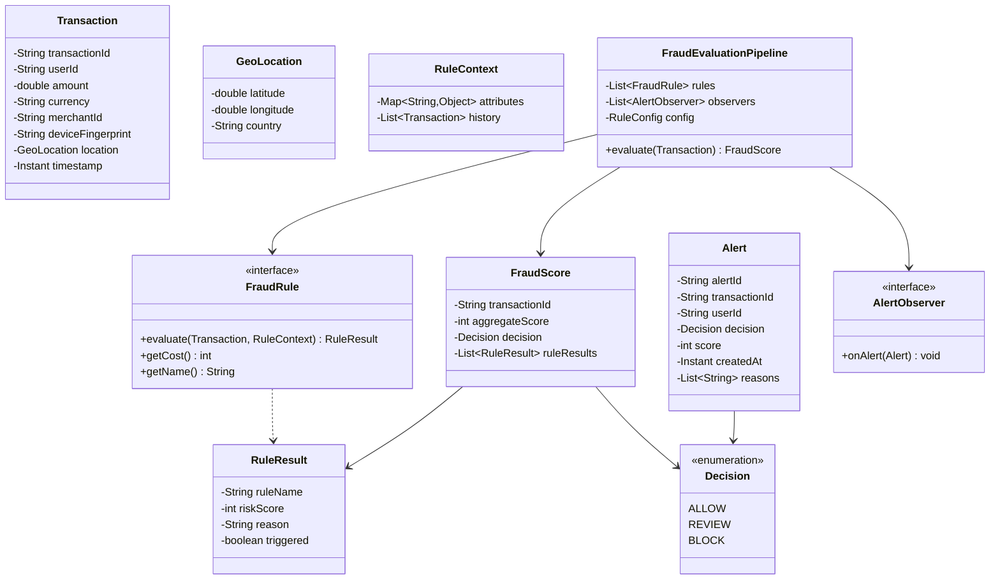

# Fraud Detection Rule Engine - LLD

## Problem Statement
Design a real-time fraud detection rule engine that evaluates transactions against configurable rules, computes aggregate risk scores, and takes automated decisions (ALLOW/REVIEW/BLOCK) with alert notifications.

## UML Class Diagram


## Design Patterns
| Pattern | Usage |
|---------|-------|
| **Strategy** | Each `FraudRule` is a strategy for evaluating a specific fraud signal |
| **Chain of Responsibility** | Rules ordered by cost; short-circuit on BLOCK |
| **Specification** | Rules as composable predicates with AND/OR logic |
| **Observer** | Alert listeners notified on REVIEW/BLOCK decisions |

## Java Implementation

```java
// === Models ===
record GeoLocation(double latitude, double longitude, String country) {}

record Transaction(
    String transactionId, String userId, double amount, String currency,
    String merchantId, String deviceFingerprint, GeoLocation location, Instant timestamp
) {}

record RuleResult(String ruleName, int riskScore, String reason, boolean triggered) {}

enum Decision { ALLOW, REVIEW, BLOCK }

record FraudScore(String transactionId, int aggregateScore, Decision decision, List<RuleResult> ruleResults) {}

record Alert(String alertId, String transactionId, String userId,
             Decision decision, int score, Instant createdAt, List<String> reasons) {}

// === Rule Context (carries history for pattern analysis) ===
class RuleContext {
    private final Map<String, Object> attributes = new ConcurrentHashMap<>();
    private final List<Transaction> history;

    public RuleContext(List<Transaction> history) { this.history = history; }
    public List<Transaction> getHistory() { return history; }
    public void put(String key, Object val) { attributes.put(key, val); }
    public <T> T get(String key, Class<T> type) { return type.cast(attributes.get(key)); }
}

// === Configuration ===
class RuleConfig {
    private int reviewThreshold = 40;
    private int blockThreshold = 75;
    private int velocityWindowSeconds = 300;
    private int velocityMaxCount = 5;
    private double amountThreshold = 10000.0;
    private double distanceThresholdKm = 500.0;

    // getters/setters omitted for brevity
    public int getReviewThreshold() { return reviewThreshold; }
    public int getBlockThreshold() { return blockThreshold; }
    public int getVelocityWindowSeconds() { return velocityWindowSeconds; }
    public int getVelocityMaxCount() { return velocityMaxCount; }
    public double getAmountThreshold() { return amountThreshold; }
    public double getDistanceThresholdKm() { return distanceThresholdKm; }
}

// === FraudRule Interface (Strategy) ===
interface FraudRule {
    RuleResult evaluate(Transaction txn, RuleContext context);
    int getCost();  // lower = cheaper, evaluated first
    String getName();
}

// === Rule Implementations ===
class VelocityCheckRule implements FraudRule {
    private final RuleConfig config;
    public VelocityCheckRule(RuleConfig config) { this.config = config; }

    @Override
    public RuleResult evaluate(Transaction txn, RuleContext context) {
        Instant windowStart = txn.timestamp().minusSeconds(config.getVelocityWindowSeconds());
        long count = context.getHistory().stream()
            .filter(t -> t.userId().equals(txn.userId()) && t.timestamp().isAfter(windowStart))
            .count();
        boolean triggered = count >= config.getVelocityMaxCount();
        int score = triggered ? Math.min(100, (int)(count * 15)) : 0;
        return new RuleResult(getName(), score,
            triggered ? count + " txns in " + config.getVelocityWindowSeconds() + "s window" : "", triggered);
    }

    @Override public int getCost() { return 1; }
    @Override public String getName() { return "VelocityCheck"; }
}

class AmountThresholdRule implements FraudRule {
    private final RuleConfig config;
    public AmountThresholdRule(RuleConfig config) { this.config = config; }

    @Override
    public RuleResult evaluate(Transaction txn, RuleContext context) {
        boolean triggered = txn.amount() > config.getAmountThreshold();
        int score = triggered ? Math.min(100, (int)((txn.amount() / config.getAmountThreshold()) * 30)) : 0;
        return new RuleResult(getName(), score,
            triggered ? "Amount $" + txn.amount() + " exceeds threshold" : "", triggered);
    }

    @Override public int getCost() { return 1; }
    @Override public String getName() { return "AmountThreshold"; }
}

class GeoLocationAnomalyRule implements FraudRule {
    private final RuleConfig config;
    public GeoLocationAnomalyRule(RuleConfig config) { this.config = config; }

    @Override
    public RuleResult evaluate(Transaction txn, RuleContext context) {
        Optional<Transaction> lastTxn = context.getHistory().stream()
            .filter(t -> t.userId().equals(txn.userId()))
            .max(Comparator.comparing(Transaction::timestamp));

        if (lastTxn.isEmpty()) return new RuleResult(getName(), 0, "", false);

        double distKm = haversine(txn.location(), lastTxn.get().location());
        long timeDiffSec = Duration.between(lastTxn.get().timestamp(), txn.timestamp()).getSeconds();
        double speedKmH = timeDiffSec > 0 ? (distKm / timeDiffSec) * 3600 : 0;

        boolean triggered = distKm > config.getDistanceThresholdKm() && speedKmH > 900; // faster than plane
        int score = triggered ? 80 : 0;
        return new RuleResult(getName(), score,
            triggered ? "Impossible travel: " + (int)distKm + "km in " + timeDiffSec + "s" : "", triggered);
    }

    private double haversine(GeoLocation a, GeoLocation b) {
        double R = 6371; double dLat = Math.toRadians(b.latitude() - a.latitude());
        double dLon = Math.toRadians(b.longitude() - a.longitude());
        double x = Math.sin(dLat/2)*Math.sin(dLat/2) + Math.cos(Math.toRadians(a.latitude()))
            * Math.cos(Math.toRadians(b.latitude())) * Math.sin(dLon/2)*Math.sin(dLon/2);
        return R * 2 * Math.atan2(Math.sqrt(x), Math.sqrt(1-x));
    }

    @Override public int getCost() { return 3; }
    @Override public String getName() { return "GeoLocationAnomaly"; }
}

class DeviceFingerprintRule implements FraudRule {
    private final Set<String> knownDevices = ConcurrentHashMap.newKeySet();

    @Override
    public RuleResult evaluate(Transaction txn, RuleContext context) {
        boolean isNew = !knownDevices.contains(txn.userId() + ":" + txn.deviceFingerprint());
        long deviceChanges = context.getHistory().stream()
            .filter(t -> t.userId().equals(txn.userId()))
            .map(Transaction::deviceFingerprint).distinct().count();
        boolean triggered = isNew && deviceChanges > 3;
        int score = triggered ? 45 : 0;
        knownDevices.add(txn.userId() + ":" + txn.deviceFingerprint());
        return new RuleResult(getName(), score,
            triggered ? "New device with " + deviceChanges + " prior devices" : "", triggered);
    }

    @Override public int getCost() { return 2; }
    @Override public String getName() { return "DeviceFingerprint"; }
}

class BlacklistCheckRule implements FraudRule {
    private final Set<String> blacklistedUsers = ConcurrentHashMap.newKeySet();
    private final Set<String> blacklistedMerchants = ConcurrentHashMap.newKeySet();

    public void blacklistUser(String userId) { blacklistedUsers.add(userId); }
    public void blacklistMerchant(String merchantId) { blacklistedMerchants.add(merchantId); }

    @Override
    public RuleResult evaluate(Transaction txn, RuleContext context) {
        boolean userBlocked = blacklistedUsers.contains(txn.userId());
        boolean merchantBlocked = blacklistedMerchants.contains(txn.merchantId());
        boolean triggered = userBlocked || merchantBlocked;
        return new RuleResult(getName(), triggered ? 100 : 0,
            triggered ? "Blacklisted: " + (userBlocked ? "user" : "merchant") : "", triggered);
    }

    @Override public int getCost() { return 0; } // cheapest - check first
    @Override public String getName() { return "BlacklistCheck"; }
}

class PatternDetectionRule implements FraudRule {
    @Override
    public RuleResult evaluate(Transaction txn, RuleContext context) {
        List<Transaction> userHistory = context.getHistory().stream()
            .filter(t -> t.userId().equals(txn.userId()))
            .sorted(Comparator.comparing(Transaction::timestamp))
            .toList();

        // Detect round-number amounts pattern (structuring)
        long roundAmounts = userHistory.stream()
            .filter(t -> t.amount() % 1000 == 0 && t.amount() > 2000).count();
        boolean structuring = roundAmounts >= 3;

        // Detect rapid micro-transactions (card testing)
        long microTxns = userHistory.stream()
            .filter(t -> t.amount() < 1.0 && t.timestamp().isAfter(Instant.now().minusSeconds(60))).count();
        boolean cardTesting = microTxns >= 3;

        boolean triggered = structuring || cardTesting;
        int score = structuring ? 60 : (cardTesting ? 70 : 0);
        String reason = structuring ? "Possible structuring: " + roundAmounts + " round amounts"
            : (cardTesting ? "Possible card testing: " + microTxns + " micro-txns" : "");
        return new RuleResult(getName(), score, reason, triggered);
    }

    @Override public int getCost() { return 5; } // expensive - needs history scan
    @Override public String getName() { return "PatternDetection"; }
}

// === Observer Pattern for Alerts ===
interface AlertObserver {
    void onAlert(Alert alert);
}

class LogAlertObserver implements AlertObserver {
    @Override
    public void onAlert(Alert alert) {
        System.out.println("[ALERT] " + alert.decision() + " | Score:" + alert.score()
            + " | User:" + alert.userId() + " | Reasons:" + alert.reasons());
    }
}

class NotificationAlertObserver implements AlertObserver {
    @Override
    public void onAlert(Alert alert) {
        // Push to notification service, SMS, email, etc.
        System.out.println("[NOTIFY] Fraud team alerted for txn: " + alert.transactionId());
    }
}

// === Evaluation Pipeline (Chain of Responsibility + Ordering) ===
class FraudEvaluationPipeline {
    private final List<FraudRule> rules;
    private final List<AlertObserver> observers = new CopyOnWriteArrayList<>();
    private final RuleConfig config;
    private final TransactionHistoryStore historyStore;

    public FraudEvaluationPipeline(List<FraudRule> rules, RuleConfig config,
                                    TransactionHistoryStore historyStore) {
        // Sort rules by cost (cheapest first for efficiency)
        this.rules = rules.stream()
            .sorted(Comparator.comparingInt(FraudRule::getCost))
            .collect(Collectors.toList());
        this.config = config;
        this.historyStore = historyStore;
    }

    public void addObserver(AlertObserver observer) { observers.add(observer); }

    public FraudScore evaluate(Transaction txn) {
        RuleContext context = new RuleContext(historyStore.getHistory(txn.userId()));
        List<RuleResult> results = new ArrayList<>();
        int totalScore = 0;

        for (FraudRule rule : rules) {
            RuleResult result = rule.evaluate(txn, context);
            results.add(result);
            totalScore += result.riskScore();

            // Short-circuit: if already at BLOCK threshold, stop evaluating costly rules
            if (totalScore >= config.getBlockThreshold()) break;
        }

        Decision decision = totalScore >= config.getBlockThreshold() ? Decision.BLOCK
            : totalScore >= config.getReviewThreshold() ? Decision.REVIEW : Decision.ALLOW;

        FraudScore score = new FraudScore(txn.transactionId(), totalScore, decision, results);

        if (decision != Decision.ALLOW) {
            Alert alert = new Alert(UUID.randomUUID().toString(), txn.transactionId(),
                txn.userId(), decision, totalScore, Instant.now(),
                results.stream().filter(RuleResult::triggered).map(RuleResult::reason).toList());
            observers.forEach(o -> o.onAlert(alert));
        }

        historyStore.record(txn);
        return score;
    }
}

// === History Store ===
class TransactionHistoryStore {
    private final Map<String, Deque<Transaction>> store = new ConcurrentHashMap<>();
    private static final int MAX_HISTORY = 100;

    public void record(Transaction txn) {
        store.computeIfAbsent(txn.userId(), k -> new ConcurrentLinkedDeque<>()).addLast(txn);
        Deque<Transaction> q = store.get(txn.userId());
        while (q.size() > MAX_HISTORY) q.pollFirst();
    }

    public List<Transaction> getHistory(String userId) {
        return List.copyOf(store.getOrDefault(userId, new ConcurrentLinkedDeque<>()));
    }
}

// === Usage ===
public class FraudEngineDemo {
    public static void main(String[] args) {
        RuleConfig config = new RuleConfig();
        TransactionHistoryStore store = new TransactionHistoryStore();

        List<FraudRule> rules = List.of(
            new BlacklistCheckRule(),
            new VelocityCheckRule(config),
            new AmountThresholdRule(config),
            new DeviceFingerprintRule(),
            new GeoLocationAnomalyRule(config),
            new PatternDetectionRule()
        );

        FraudEvaluationPipeline pipeline = new FraudEvaluationPipeline(rules, config, store);
        pipeline.addObserver(new LogAlertObserver());
        pipeline.addObserver(new NotificationAlertObserver());

        Transaction txn = new Transaction("txn-001", "user-42", 15000.0, "USD",
            "merchant-99", "fp-abc123",
            new GeoLocation(40.7, -74.0, "US"), Instant.now());

        FraudScore result = pipeline.evaluate(txn);
        System.out.println("Decision: " + result.decision() + " | Score: " + result.aggregateScore());
    }
}
```

## Key Interview Points

| Topic | Insight |
|-------|---------|
| **Rule Ordering** | Sort by `getCost()` — blacklist (O(1) lookup) runs before pattern detection (O(n) history scan) |
| **Short-Circuit** | Stop evaluating once BLOCK threshold hit — saves latency on expensive rules |
| **Thread Safety** | `ConcurrentHashMap`, `CopyOnWriteArrayList` for concurrent transaction processing |
| **Scoring vs Binary** | Aggregate scoring enables nuanced decisions vs simple pass/fail |
| **Extensibility** | New rules implement `FraudRule` — no pipeline changes needed (OCP) |
| **Testability** | Each rule is independently testable; `RuleContext` injectable with mock history |
| **Latency** | P99 must be <50ms for real-time; costly rules (ML models) can be async |
| **False Positives** | REVIEW bucket prevents blocking legitimate users; human-in-loop for edge cases |
| **Scaling** | Stateless pipeline + external history store → horizontal scaling with partitioned queues |
