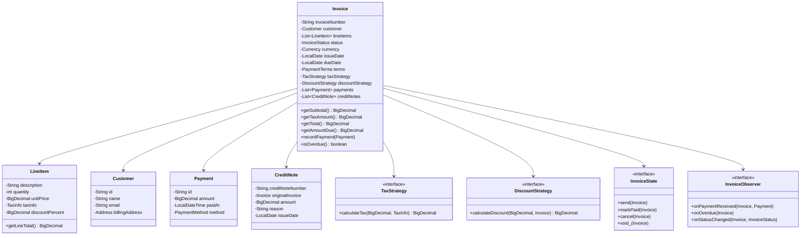

# Invoice and Billing System - LLD

## Problem Statement
Design an invoice and billing system supporting invoice creation with line items, tax/discount strategies, payment tracking (partial/full), overdue detection, credit notes, and PDF generation.

## UML Class Diagram


## Design Patterns
- **Builder**: Complex invoice construction with optional fields
- **Strategy**: Tax calculation (inclusive/exclusive) and discount logic
- **State**: Invoice lifecycle transitions
- **Observer**: Payment received, overdue alerts
- **Template Method**: PDF generation with customizable sections

## Java Implementation

```java
// === Enums ===
enum InvoiceStatus { DRAFT, SENT, VIEWED, PAID, OVERDUE, CANCELLED, VOIDED }
enum PaymentTerms { NET_15, NET_30, NET_45, NET_60, DUE_ON_RECEIPT }
enum PaymentMethod { CASH, BANK_TRANSFER, CREDIT_CARD, CHECK }

// === Models ===
class TaxInfo {
    private String taxName; // e.g., "GST", "VAT"
    private BigDecimal rate; // e.g., 0.18 for 18%
    public TaxInfo(String taxName, BigDecimal rate) { this.taxName = taxName; this.rate = rate; }
    public BigDecimal getRate() { return rate; }
}

class LineItem {
    private String description;
    private int quantity;
    private BigDecimal unitPrice;
    private TaxInfo taxInfo;
    private BigDecimal discountPercent; // 0-100

    public BigDecimal getSubtotal() { return unitPrice.multiply(BigDecimal.valueOf(quantity)); }
    public BigDecimal getDiscountAmount() {
        return getSubtotal().multiply(discountPercent).divide(BigDecimal.valueOf(100));
    }
    public BigDecimal getLineTotal() { return getSubtotal().subtract(getDiscountAmount()); }
}

class Customer {
    private String id, name, email;
    private String billingAddress;
}

class Payment {
    private String id;
    private BigDecimal amount;
    private LocalDateTime paidAt;
    private PaymentMethod method;
    private String reference;
}

class CreditNote {
    private String creditNoteNumber;
    private Invoice originalInvoice;
    private BigDecimal amount;
    private String reason;
    private LocalDate issueDate;
}

// === Strategy: Tax Calculation ===
interface TaxStrategy {
    BigDecimal calculateTax(BigDecimal amount, TaxInfo taxInfo);
}

class ExclusiveTaxStrategy implements TaxStrategy {
    public BigDecimal calculateTax(BigDecimal amount, TaxInfo taxInfo) {
        return amount.multiply(taxInfo.getRate()); // Tax added on top
    }
}

class InclusiveTaxStrategy implements TaxStrategy {
    public BigDecimal calculateTax(BigDecimal amount, TaxInfo taxInfo) {
        // Tax already included: tax = amount - amount/(1+rate)
        BigDecimal divisor = BigDecimal.ONE.add(taxInfo.getRate());
        return amount.subtract(amount.divide(divisor, 2, RoundingMode.HALF_UP));
    }
}

class CompositeTaxStrategy implements TaxStrategy {
    private List<TaxInfo> taxes; // Multiple tax rates stacked
    public BigDecimal calculateTax(BigDecimal amount, TaxInfo ignored) {
        BigDecimal total = BigDecimal.ZERO;
        for (TaxInfo t : taxes) total = total.add(amount.multiply(t.getRate()));
        return total;
    }
}

// === Strategy: Discount ===
interface DiscountStrategy {
    BigDecimal calculateDiscount(BigDecimal subtotal, Invoice invoice);
}

class NoDiscount implements DiscountStrategy {
    public BigDecimal calculateDiscount(BigDecimal s, Invoice i) { return BigDecimal.ZERO; }
}

class EarlyPaymentDiscount implements DiscountStrategy {
    private BigDecimal discountRate;
    private int withinDays;
    public BigDecimal calculateDiscount(BigDecimal subtotal, Invoice invoice) {
        if (LocalDate.now().isBefore(invoice.getIssueDate().plusDays(withinDays)))
            return subtotal.multiply(discountRate);
        return BigDecimal.ZERO;
    }
}

// === State Pattern ===
interface InvoiceState {
    default void send(Invoice inv) { throw new IllegalStateException(); }
    default void markViewed(Invoice inv) { throw new IllegalStateException(); }
    default void markPaid(Invoice inv) { throw new IllegalStateException(); }
    default void cancel(Invoice inv) { throw new IllegalStateException(); }
    default void voidInvoice(Invoice inv) { throw new IllegalStateException(); }
}

class DraftState implements InvoiceState {
    public void send(Invoice inv) { inv.setStatus(InvoiceStatus.SENT); }
    public void cancel(Invoice inv) { inv.setStatus(InvoiceStatus.CANCELLED); }
}

class SentState implements InvoiceState {
    public void markViewed(Invoice inv) { inv.setStatus(InvoiceStatus.VIEWED); }
    public void markPaid(Invoice inv) { inv.setStatus(InvoiceStatus.PAID); }
    public void cancel(Invoice inv) { inv.setStatus(InvoiceStatus.CANCELLED); }
    public void voidInvoice(Invoice inv) { inv.setStatus(InvoiceStatus.VOIDED); }
}

class PaidState implements InvoiceState {
    public void voidInvoice(Invoice inv) { inv.setStatus(InvoiceStatus.VOIDED); }
}

// === Observer ===
interface InvoiceObserver {
    void onPaymentReceived(Invoice invoice, Payment payment);
    void onOverdue(Invoice invoice);
    void onStatusChanged(Invoice invoice, InvoiceStatus newStatus);
}

class EmailNotificationObserver implements InvoiceObserver {
    public void onPaymentReceived(Invoice inv, Payment p) {
        System.out.println("Email: Payment of " + p.getAmount() + " received for " + inv.getInvoiceNumber());
    }
    public void onOverdue(Invoice inv) {
        System.out.println("Email: Invoice " + inv.getInvoiceNumber() + " is overdue!");
    }
    public void onStatusChanged(Invoice inv, InvoiceStatus s) {
        System.out.println("Email: Invoice " + inv.getInvoiceNumber() + " status -> " + s);
    }
}

class AccountingObserver implements InvoiceObserver {
    public void onPaymentReceived(Invoice inv, Payment p) { /* update ledger */ }
    public void onOverdue(Invoice inv) { /* flag in AR */ }
    public void onStatusChanged(Invoice inv, InvoiceStatus s) { /* journal entry */ }
}

// === Invoice Number Generator ===
class InvoiceNumberGenerator {
    private AtomicLong sequence = new AtomicLong(1000);
    private String prefix;
    public InvoiceNumberGenerator(String prefix) { this.prefix = prefix; }
    public String next() { return prefix + "-" + sequence.incrementAndGet(); }
}

// === Main Invoice Class ===
class Invoice {
    private String invoiceNumber;
    private Customer customer;
    private List<LineItem> lineItems = new ArrayList<>();
    private InvoiceStatus status = InvoiceStatus.DRAFT;
    private Currency currency;
    private LocalDate issueDate, dueDate;
    private PaymentTerms terms;
    private TaxStrategy taxStrategy;
    private DiscountStrategy discountStrategy;
    private List<Payment> payments = new ArrayList<>();
    private List<CreditNote> creditNotes = new ArrayList<>();
    private List<InvoiceObserver> observers = new ArrayList<>();
    private InvoiceState state = new DraftState();

    public BigDecimal getSubtotal() {
        return lineItems.stream().map(LineItem::getLineTotal).reduce(BigDecimal.ZERO, BigDecimal::add);
    }
    public BigDecimal getTaxAmount() {
        return lineItems.stream()
            .map(li -> taxStrategy.calculateTax(li.getLineTotal(), li.getTaxInfo()))
            .reduce(BigDecimal.ZERO, BigDecimal::add);
    }
    public BigDecimal getTotal() {
        BigDecimal sub = getSubtotal();
        BigDecimal discount = discountStrategy.calculateDiscount(sub, this);
        return sub.add(getTaxAmount()).subtract(discount);
    }
    public BigDecimal getTotalPaid() {
        return payments.stream().map(Payment::getAmount).reduce(BigDecimal.ZERO, BigDecimal::add);
    }
    public BigDecimal getCreditTotal() {
        return creditNotes.stream().map(CreditNote::getAmount).reduce(BigDecimal.ZERO, BigDecimal::add);
    }
    public BigDecimal getAmountDue() { return getTotal().subtract(getTotalPaid()).subtract(getCreditTotal()); }

    public void recordPayment(Payment payment) {
        if (payment.getAmount().compareTo(getAmountDue()) > 0)
            throw new IllegalArgumentException("Payment exceeds amount due");
        payments.add(payment);
        observers.forEach(o -> o.onPaymentReceived(this, payment));
        if (getAmountDue().compareTo(BigDecimal.ZERO) <= 0) {
            state.markPaid(this);
            state = new PaidState();
        }
    }
    public boolean isOverdue() {
        return status != InvoiceStatus.PAID && status != InvoiceStatus.CANCELLED
            && LocalDate.now().isAfter(dueDate);
    }
    public void setStatus(InvoiceStatus s) { this.status = s; observers.forEach(o -> o.onStatusChanged(this, s)); }
    public void addObserver(InvoiceObserver o) { observers.add(o); }

    // Getters
    public String getInvoiceNumber() { return invoiceNumber; }
    public LocalDate getIssueDate() { return issueDate; }
}

// === Builder Pattern ===
class InvoiceBuilder {
    private Invoice invoice = new Invoice();
    private InvoiceNumberGenerator generator;

    public InvoiceBuilder(InvoiceNumberGenerator gen) { this.generator = gen; }
    public InvoiceBuilder customer(Customer c) { invoice.customer = c; return this; }
    public InvoiceBuilder currency(Currency c) { invoice.currency = c; return this; }
    public InvoiceBuilder terms(PaymentTerms t) {
        invoice.terms = t;
        invoice.issueDate = LocalDate.now();
        invoice.dueDate = invoice.issueDate.plusDays(termsToDays(t));
        return this;
    }
    public InvoiceBuilder addLineItem(LineItem li) { invoice.lineItems.add(li); return this; }
    public InvoiceBuilder taxStrategy(TaxStrategy s) { invoice.taxStrategy = s; return this; }
    public InvoiceBuilder discountStrategy(DiscountStrategy s) { invoice.discountStrategy = s; return this; }
    public Invoice build() {
        invoice.invoiceNumber = generator.next();
        if (invoice.discountStrategy == null) invoice.discountStrategy = new NoDiscount();
        if (invoice.taxStrategy == null) invoice.taxStrategy = new ExclusiveTaxStrategy();
        return invoice;
    }
    private int termsToDays(PaymentTerms t) {
        return switch(t) { case NET_15->15; case NET_30->30; case NET_45->45; case NET_60->60; case DUE_ON_RECEIPT->0; };
    }
}

// === Template Method: PDF Generation ===
abstract class InvoicePdfGenerator {
    public final byte[] generate(Invoice invoice) { // template method
        byte[] pdf = initDocument();
        pdf = addHeader(pdf, invoice);
        pdf = addCustomerDetails(pdf, invoice);
        pdf = addLineItems(pdf, invoice);
        pdf = addTotals(pdf, invoice);
        pdf = addFooter(pdf, invoice);
        return finalize(pdf);
    }
    protected abstract byte[] initDocument();
    protected abstract byte[] addHeader(byte[] doc, Invoice inv);
    protected abstract byte[] addCustomerDetails(byte[] doc, Invoice inv);
    protected abstract byte[] addLineItems(byte[] doc, Invoice inv);
    protected abstract byte[] addTotals(byte[] doc, Invoice inv);
    protected abstract byte[] addFooter(byte[] doc, Invoice inv);
    protected abstract byte[] finalize(byte[] doc);
}

class StandardPdfGenerator extends InvoicePdfGenerator {
    protected byte[] initDocument() { /* create PDF doc */ return new byte[0]; }
    protected byte[] addHeader(byte[] d, Invoice i) { /* company logo, invoice# */ return d; }
    protected byte[] addCustomerDetails(byte[] d, Invoice i) { /* bill-to section */ return d; }
    protected byte[] addLineItems(byte[] d, Invoice i) { /* table of items */ return d; }
    protected byte[] addTotals(byte[] d, Invoice i) { /* subtotal, tax, total */ return d; }
    protected byte[] addFooter(byte[] d, Invoice i) { /* payment instructions */ return d; }
    protected byte[] finalize(byte[] d) { /* close PDF */ return d; }
}

// === Overdue Detection Service ===
class OverdueDetectionService {
    private List<InvoiceObserver> observers;
    // Scheduled job
    public void checkOverdueInvoices(List<Invoice> invoices) {
        for (Invoice inv : invoices) {
            if (inv.isOverdue()) {
                inv.setStatus(InvoiceStatus.OVERDUE);
                observers.forEach(o -> o.onOverdue(inv));
            }
        }
    }
}

// === Credit Note Service ===
class CreditNoteService {
    private AtomicLong seq = new AtomicLong(0);
    public CreditNote issueCreditNote(Invoice invoice, BigDecimal amount, String reason) {
        if (amount.compareTo(invoice.getAmountDue()) > 0)
            throw new IllegalArgumentException("Credit exceeds amount due");
        CreditNote cn = new CreditNote();
        cn.creditNoteNumber = "CN-" + seq.incrementAndGet();
        cn.originalInvoice = invoice;
        cn.amount = amount;
        cn.reason = reason;
        cn.issueDate = LocalDate.now();
        invoice.creditNotes.add(cn);
        return cn;
    }
}
```

## SOLID Principles
| Principle | Application |
|-----------|-------------|
| **SRP** | Invoice (data), Builder (construction), PdfGenerator (rendering), OverdueService (scheduling) |
| **OCP** | New tax/discount strategies without modifying Invoice |
| **LSP** | All TaxStrategy/DiscountStrategy implementations interchangeable |
| **ISP** | Focused interfaces (TaxStrategy, DiscountStrategy, InvoiceObserver) |
| **DIP** | Invoice depends on strategy interfaces, not concrete tax logic |

## Key Interview Points
1. **Builder vs Constructor**: Invoice has 10+ fields with optional ones — Builder provides readable, validated construction
2. **Strategy for Tax**: Tax-inclusive vs exclusive is a policy decision that varies by region — Strategy makes it pluggable
3. **Partial Payments**: Track multiple payments; amount due = total - paid - credits
4. **State Machine**: Prevents invalid transitions (can't pay a cancelled invoice)
5. **Credit Notes**: Never modify issued invoices — issue credit notes for adjustments
6. **Idempotent Numbering**: AtomicLong ensures thread-safe sequential generation
7. **Template Method for PDF**: Fixed structure (header→items→totals→footer) but customizable sections
8. **Currency**: Stored per invoice; use BigDecimal (never float) for money
9. **Overdue Detection**: Scheduled job pattern — separate from invoice logic (SRP)
10. **Observer Decoupling**: Accounting, email, analytics react to events independently
